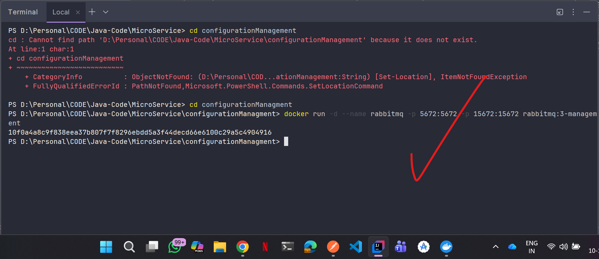
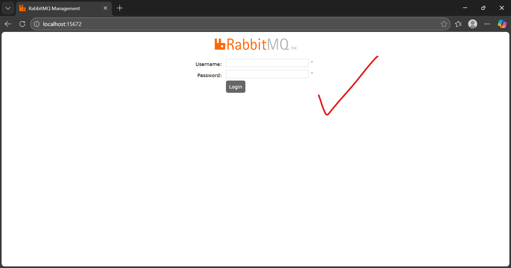
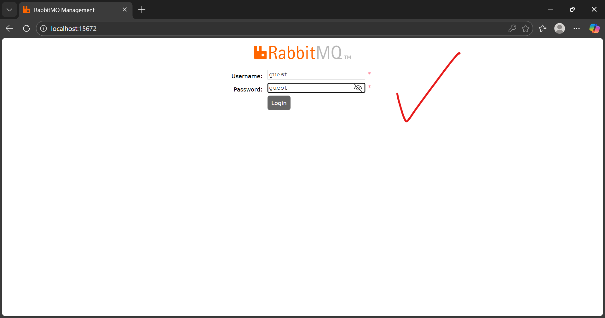
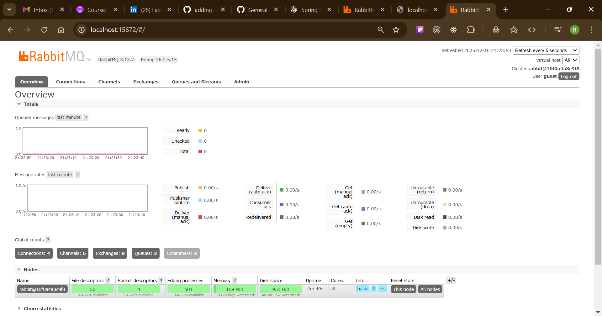
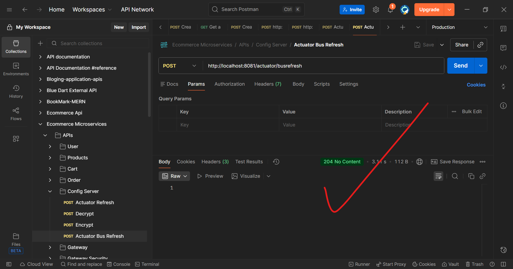
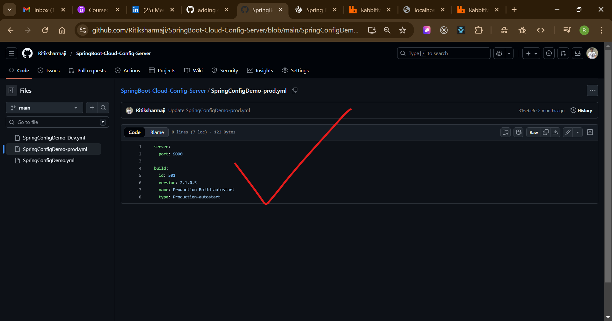
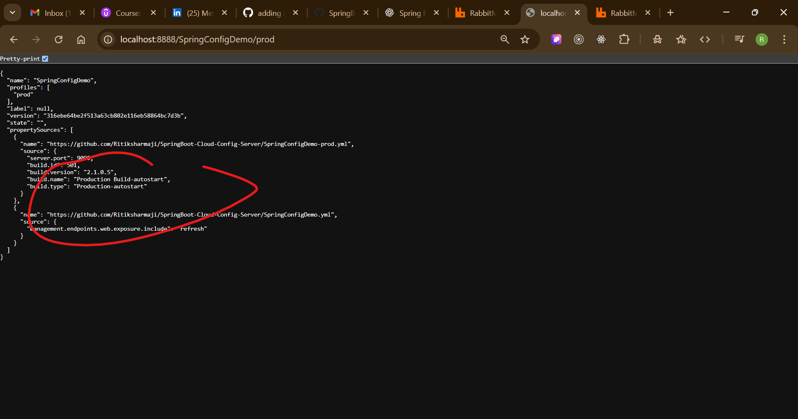
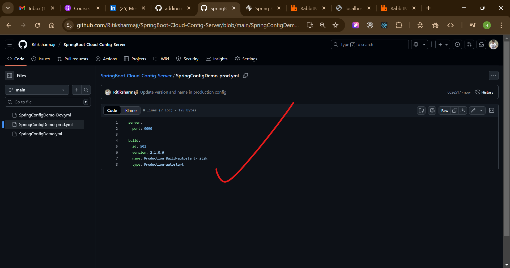
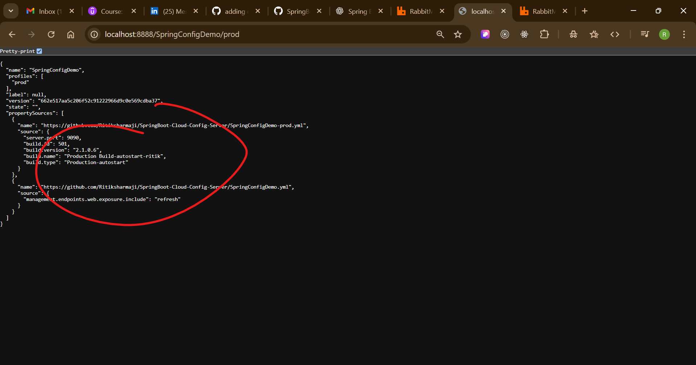
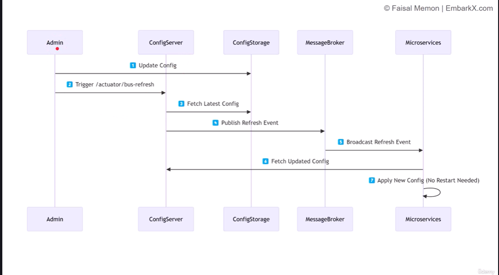

## ---------- add Spring Cloud Config repo setup (with Git) ----------
Perfect 👍 Let's walk through **how to set up a Spring Cloud Config Server** using **Git as the configuration repository** — step by step.

---

## 🌩️ **1️⃣ What is Spring Cloud Config?**

Spring Cloud Config provides **centralized configuration management** for your microservices.
It allows you to keep all configurations (for multiple environments) in **one Git repository**, so all microservices can fetch configuration dynamically.

---

## ⚙️ **2️⃣ Setup Git Configuration Repository**

1. **Create a Git repo** (local or remote, e.g. GitHub):
   Example folder name:

   ```
   config-repo/
   ```

2. Inside it, create property files for each service or environment, e.g.:

   ```
   config-repo/
   ├── application.yml
   ├── user-service.yml
   ├── order-service.yml
   ├── application-dev.yml
   └── application-prod.yml
   ```

3. Example `application.yml` file:

   ```yaml
   message: "Welcome to Spring Cloud Config!"
   database:
     url: jdbc:mysql://localhost:3306/mydb
     username: root
     password: root
   ```

4. Initialize Git:

   ```bash
   git init
   git add .
   git commit -m "Initial config files"
   ```

   (Or push to GitHub if you prefer a remote repo.)

---

## 🏗️ **3️⃣ Create Spring Cloud Config Server**

1. Create a new **Spring Boot project** (you can use [https://start.spring.io](https://start.spring.io)):

    * Dependencies:

        * `Spring Boot Actuator`
        * `Spring Cloud Config Server`

2. In your `pom.xml`, make sure to include:

   ```xml
   <dependency>
       <groupId>org.springframework.cloud</groupId>
       <artifactId>spring-cloud-config-server</artifactId>
   </dependency>

   <dependencyManagement>
       <dependencies>
           <dependency>
               <groupId>org.springframework.cloud</groupId>
               <artifactId>spring-cloud-dependencies</artifactId>
               <version>2023.0.3</version>
               <type>pom</type>
               <scope>import</scope>
           </dependency>
       </dependencies>
   </dependencyManagement>
   ```

3. In your main class:

   ```java
   @SpringBootApplication
   @EnableConfigServer
   public class ConfigServerApplication {
       public static void main(String[] args) {
           SpringApplication.run(ConfigServerApplication.class, args);
       }
   }
   ```

4. Configure `application.yml`:

   ```yaml
   server:
     port: 8888

   spring:
     cloud:
       config:
         server:
           git:
             uri: file://D:/Personal/config-repo   # path to your local repo
             clone-on-start: true
   ```

   (For remote GitHub repo:)

   ```yaml
   spring:
     cloud:
       config:
         server:
           git:
             uri: https://github.com/your-username/config-repo
             default-label: main
   ```

---

## 🚀 **4️⃣ Run the Config Server**

```bash
mvn spring-boot:run
```

Then open in browser:

```
http://localhost:8888/application/default
```

You should see JSON output from your config repo 👏

---

## 💡 **5️⃣ Connect a Client Service**

In your microservice (like `user-service`):

1. Add dependency:

   ```xml
   <dependency>
       <groupId>org.springframework.cloud</groupId>
       <artifactId>spring-cloud-starter-config</artifactId>
   </dependency>
   ```

2. Create a `bootstrap.yml` (used to connect before app context loads):

   ```yaml
   spring:
     application:
       name: user-service
     cloud:
       config:
         uri: http://localhost:8888
   ```

3. Now run your microservice.
   It will automatically fetch the config from the Git repo through the Config Server 🎉

---

## ✅ **6️⃣ Verify**

Try changing a value in the Git repo and restarting the client service.
The new configuration will load from Git automatically.
You can even use **Spring Cloud Bus + RabbitMQ/Kafka** for live reloads without restarting.

---

Would you like me to show you how to make it **auto-refresh the configuration** without restarting the microservice (using Spring Cloud Bus)?
------
yes:
Perfect ⚡ Let's now **enable auto-refresh** in your Spring Cloud Config setup — so that whenever you **update configuration in the Git repo**, all connected microservices automatically pick up the new configuration *without restarting them manually!* 🚀

---

## 🌐 Step 1️⃣ — Why Auto-Refresh?

Normally, when you change a value in your Git repo (e.g. `application.yml`), the Config Server sees it, but your client microservices **don’t refresh automatically**.

To fix that, we use:

> 🪄 **Spring Cloud Bus** (via RabbitMQ or Kafka)

It acts as a *message broker* that broadcasts a **refresh event** to all client services when configuration updates.

---

## ⚙️ Step 2️⃣ — Setup Spring Cloud Bus (RabbitMQ)

### 🐇 Option 1: Install RabbitMQ locally (recommended for dev)

If you don’t already have RabbitMQ, install and run it via Docker:

```bash
docker run -d --name rabbitmq -p 5672:5672 -p 15672:15672 rabbitmq:3-management
```
1) 
2) 
Then visit the management UI at:

```
http://localhost:15672
Username: guest
Password: guest
```

---

## 🧠 Step 3️⃣ — Update Config Server

In your **Config Server** project’s `pom.xml`:

```xml
<dependency>
    <groupId>org.springframework.cloud</groupId>
    <artifactId>spring-cloud-starter-bus-amqp</artifactId>
</dependency>
```

Now update your `application.yml`:

```yaml
spring:
  cloud:
    config:
      server:
        git:
          uri: file://D:/Personal/config-repo
    bus:
      enabled: true
  rabbitmq:
    host: localhost
    port: 5672
    username: guest
    password: guest
```

---

## 🧩 Step 4️⃣ — Update Each Client Microservice

In every microservice that fetches configuration from the Config Server, add the same dependency:

```xml
<dependency>
    <groupId>org.springframework.cloud</groupId>
    <artifactId>spring-cloud-starter-bus-amqp</artifactId>
</dependency>
```

Also, enable Actuator endpoints to trigger refresh:

```yaml
management:
  endpoints:
    web:
      exposure:
        include: refresh, busrefresh
```

---

## 🪄 Step 5️⃣ — Trigger a Refresh

After changing any config file in the Git repo and committing it:

### Option 1: Refresh all clients at once

Use the **Bus Refresh Endpoint** from Config Server:

```bash
curl -X POST http://localhost:8888/actuator/busrefresh
```

→ This triggers a message via RabbitMQ, and **all microservices** automatically re-fetch their latest configuration 🎉

### Option 2: Refresh one service only

You can target a specific service instance:

```bash
curl -X POST http://localhost:8888/actuator/busrefresh/user-service:8081
```

---

## 🧭 Step 6️⃣ — Verify

1. Change something in `config-repo/application.yml` (e.g., message text)
2. Commit the change:

   ```bash
   git add .
   git commit -m "Updated welcome message"
   ```
3. Run:

   ```bash
   curl -X POST http://localhost:8888/actuator/busrefresh
   ```
4. Check logs in your microservice → it should print a refresh event
5. When you hit your endpoint again, the new value appears 🔥

---
2) 
3) 
4) 
5) 
6) 
7) 
8) 
9) without restart tha appliation:
10) 
11) 
## 🧩 Bonus — Add `/actuator/refresh` (Manual Refresh)

If you don’t use RabbitMQ, you can still refresh manually using:

```bash
curl -X POST http://localhost:8081/actuator/refresh
```

(but this affects only that one service)

---

Would you like me to show you the **directory structure** and **complete YAML setup** (for both config server and client) so you can directly copy-paste and run it end-to-end?
---
yes:
Perfect 🔥 Let’s set up your **Spring Cloud Config Server + Client** (with Git-based repo and optional RabbitMQ auto-refresh) step-by-step, including the full **directory structure** and **all YAML + POM files**.

---

## ⚙️ Goal

We’ll build a configuration system like this:

```
spring-cloud-config/
├── config-repo/                   <-- your central Git-based config repo
│   ├── application.yml
│   └── user-service.yml
│
├── config-server/                 <-- Spring Cloud Config Server
│   ├── pom.xml
│   └── src/main/resources/
│       └── application.yml
│
└── user-service/                  <-- Spring Boot client microservice
    ├── pom.xml
    └── src/main/resources/
        └── bootstrap.yml          <-- fetches config from config-server
```

---

## 🧠 Step 1: Create the Config Repo (`config-repo`)

This folder will act as your **Git repository** that stores configuration files.

📁 `config-repo/application.yml`

```yaml
common:
  message: "This is a shared property for all services."

spring:
  application:
    name: global-config
```

📁 `config-repo/user-service.yml`

```yaml
server:
  port: 8081

app:
  name: "User Service"
  version: "1.0.0"
  message: "Welcome to User Service (from Config Server)"
```

👉 Initialize Git:

```bash
cd config-repo
git init
git add .
git commit -m "Initial config files"
```

---

## 🧩 Step 2: Create Config Server (`config-server`)

📄 `pom.xml`

```xml
<project xmlns="http://maven.apache.org/POM/4.0.0" 
         xmlns:xsi="http://www.w3.org/2001/XMLSchema-instance"
         xsi:schemaLocation="http://maven.apache.org/POM/4.0.0 
         http://maven.apache.org/xsd/maven-4.0.0.xsd">
    <modelVersion>4.0.0</modelVersion>
    <groupId>com.example</groupId>
    <artifactId>config-server</artifactId>
    <version>0.0.1-SNAPSHOT</version>

    <parent>
        <groupId>org.springframework.boot</groupId>
        <artifactId>spring-boot-starter-parent</artifactId>
        <version>3.3.2</version>
    </parent>

    <dependencies>
        <!-- Spring Cloud Config Server -->
        <dependency>
            <groupId>org.springframework.cloud</groupId>
            <artifactId>spring-cloud-config-server</artifactId>
        </dependency>

        <!-- Spring Cloud Bus for auto-refresh (optional) -->
        <dependency>
            <groupId>org.springframework.cloud</groupId>
            <artifactId>spring-cloud-starter-bus-amqp</artifactId>
        </dependency>

        <!-- RabbitMQ (for Bus events) -->
        <dependency>
            <groupId>org.springframework.boot</groupId>
            <artifactId>spring-boot-starter-amqp</artifactId>
        </dependency>
    </dependencies>

    <dependencyManagement>
        <dependencies>
            <dependency>
                <groupId>org.springframework.cloud</groupId>
                <artifactId>spring-cloud-dependencies</artifactId>
                <version>2023.0.3</version>
                <type>pom</type>
                <scope>import</scope>
            </dependency>
        </dependencies>
    </dependencyManagement>
</project>
```

📄 `src/main/java/com/example/ConfigServerApplication.java`

```java
package com.example;

import org.springframework.boot.SpringApplication;
import org.springframework.boot.autoconfigure.SpringBootApplication;
import org.springframework.cloud.config.server.EnableConfigServer;

@SpringBootApplication
@EnableConfigServer
public class ConfigServerApplication {
    public static void main(String[] args) {
        SpringApplication.run(ConfigServerApplication.class, args);
    }
}
```

📄 `src/main/resources/application.yml`

```yaml
server:
  port: 8888

spring:
  application:
    name: config-server

  cloud:
    config:
      server:
        git:
          uri: file://D:/Personal/config-repo   # local Git repo path
    bus:
      enabled: true

  rabbitmq:
    host: localhost
    port: 5672
    username: guest
    password: guest

management:
  endpoints:
    web:
      exposure:
        include: busrefresh, refresh, health, info
```

---

## 🧩 Step 3: Create Client App (`user-service`)

📄 `pom.xml`

```xml
<project xmlns="http://maven.apache.org/POM/4.0.0" 
         xmlns:xsi="http://www.w3.org/2001/XMLSchema-instance"
         xsi:schemaLocation="http://maven.apache.org/POM/4.0.0 
         http://maven.apache.org/xsd/maven-4.0.0.xsd">
    <modelVersion>4.0.0</modelVersion>
    <groupId>com.example</groupId>
    <artifactId>user-service</artifactId>
    <version>0.0.1-SNAPSHOT</version>

    <parent>
        <groupId>org.springframework.boot</groupId>
        <artifactId>spring-boot-starter-parent</artifactId>
        <version>3.3.2</version>
    </parent>

    <dependencies>
        <dependency>
            <groupId>org.springframework.boot</groupId>
            <artifactId>spring-boot-starter-web</artifactId>
        </dependency>

        <dependency>
            <groupId>org.springframework.cloud</groupId>
            <artifactId>spring-cloud-starter-config</artifactId>
        </dependency>

        <!-- For dynamic refresh -->
        <dependency>
            <groupId>org.springframework.boot</groupId>
            <artifactId>spring-boot-starter-actuator</artifactId>
        </dependency>

        <!-- Optional: for bus auto-refresh -->
        <dependency>
            <groupId>org.springframework.cloud</groupId>
            <artifactId>spring-cloud-starter-bus-amqp</artifactId>
        </dependency>
    </dependencies>

    <dependencyManagement>
        <dependencies>
            <dependency>
                <groupId>org.springframework.cloud</groupId>
                <artifactId>spring-cloud-dependencies</artifactId>
                <version>2023.0.3</version>
                <type>pom</type>
                <scope>import</scope>
            </dependency>
        </dependencies>
    </dependencyManagement>
</project>
```

📄 `src/main/resources/bootstrap.yml`

```yaml
spring:
  application:
    name: user-service
  cloud:
    config:
      uri: http://localhost:8888
```

📄 `src/main/java/com/example/UserServiceApplication.java`

```java
package com.example;

import org.springframework.boot.SpringApplication;
import org.springframework.boot.autoconfigure.SpringBootApplication;
import org.springframework.cloud.context.config.annotation.RefreshScope;
import org.springframework.web.bind.annotation.GetMapping;
import org.springframework.web.bind.annotation.RestController;

@SpringBootApplication
public class UserServiceApplication {
    public static void main(String[] args) {
        SpringApplication.run(UserServiceApplication.class, args);
    }
}

@RestController
@RefreshScope
class MessageController {
    private final org.springframework.core.env.Environment env;

    MessageController(org.springframework.core.env.Environment env) {
        this.env = env;
    }

    @GetMapping("/message")
    public String getMessage() {
        return env.getProperty("app.message");
    }
}
```

---

## 🧪 Step 4: Run the setup

### 1️⃣ Start RabbitMQ

```bash
docker run -d --name rabbitmq -p 5672:5672 -p 15672:15672 rabbitmq:3-management
```

### 2️⃣ Start the Config Server

```bash
cd config-server
mvn spring-boot:run
```

### 3️⃣ Start the Client (user-service)

```bash
cd ../user-service
mvn spring-boot:run
```

---

## ✅ Step 5: Test it!

Open in browser:

```
http://localhost:8081/message
```

You should see:

```
Welcome to User Service (from Config Server)
```

---

## 🪄 Step 6: Update Config in Git Repo

1. Open `config-repo/user-service.yml`
2. Change message:

   ```yaml
   app:
     message: "Updated Message via Config Server!"
   ```
3. Commit changes:

   ```bash
   git add .
   git commit -m "Updated message"
   ```
4. Trigger refresh:

   ```bash
   curl -X POST http://localhost:8888/actuator/busrefresh
   ```
5. Refresh browser → updated message appears instantly 🎉

---

Would you like me to include **Docker Compose setup** (to run RabbitMQ, Config Server, and User Service together in one command)?
-----
yes:
Perfect 💪 Let’s add **Docker Compose** to manage everything —
✅ RabbitMQ
✅ Spring Cloud Config Server
✅ User Service (Client)

You’ll be able to bring your **entire microservice setup online with one command:**

```bash
docker-compose up --build
```

---

## 🧩 Final Directory Structure

```
spring-cloud-config/
├── docker-compose.yml
├── config-repo/
│   ├── application.yml
│   └── user-service.yml
│
├── config-server/
│   ├── Dockerfile
│   ├── pom.xml
│   └── src/
│
└── user-service/
    ├── Dockerfile
    ├── pom.xml
    └── src/
```

---

## ⚙️ Step 1: `config-repo` (Git-based config storage)

📄 `config-repo/application.yml`

```yaml
common:
  message: "Shared property for all services"
```

📄 `config-repo/user-service.yml`

```yaml
server:
  port: 8081

app:
  name: "User Service"
  version: "1.0.0"
  message: "Welcome from Config Server via Docker!"
```

Initialize it as a Git repo:

```bash
cd config-repo
git init
git add .
git commit -m "Initial config files"
```

---

## ⚙️ Step 2: `config-server/Dockerfile`

```dockerfile
FROM openjdk:21-jdk-slim
WORKDIR /app
COPY target/config-server-0.0.1-SNAPSHOT.jar app.jar
ENTRYPOINT ["java","-jar","app.jar"]
```

📄 `config-server/src/main/resources/application.yml`

```yaml
server:
  port: 8888

spring:
  application:
    name: config-server
  cloud:
    config:
      server:
        git:
          uri: file:///app/config-repo   # path inside container
    bus:
      enabled: true
  rabbitmq:
    host: rabbitmq
    port: 5672
    username: guest
    password: guest

management:
  endpoints:
    web:
      exposure:
        include: busrefresh, refresh, health, info
```

---

## ⚙️ Step 3: `user-service/Dockerfile`

```dockerfile
FROM openjdk:21-jdk-slim
WORKDIR /app
COPY target/user-service-0.0.1-SNAPSHOT.jar app.jar
ENTRYPOINT ["java","-jar","app.jar"]
```

📄 `user-service/src/main/resources/bootstrap.yml`

```yaml
spring:
  application:
    name: user-service
  cloud:
    config:
      uri: http://config-server:8888
```

---

## ⚙️ Step 4: `docker-compose.yml`

```yaml
version: '3.9'
services:
  rabbitmq:
    image: rabbitmq:3-management
    container_name: rabbitmq
    ports:
      - "5672:5672"
      - "15672:15672"
    networks:
      - spring-net

  config-server:
    build: ./config-server
    container_name: config-server
    environment:
      - SPRING_PROFILES_ACTIVE=prod
    ports:
      - "8888:8888"
    depends_on:
      - rabbitmq
    volumes:
      - ./config-repo:/app/config-repo
    networks:
      - spring-net

  user-service:
    build: ./user-service
    container_name: user-service
    depends_on:
      - config-server
    ports:
      - "8081:8081"
    networks:
      - spring-net

networks:
  spring-net:
    driver: bridge
```

---

## 🧪 Step 5: Build & Run Everything

Run this from the project root (`spring-cloud-config/`):

```bash
mvn -f config-server/pom.xml clean package -DskipTests
mvn -f user-service/pom.xml clean package -DskipTests
docker-compose up --build
```

This will:

* Start **RabbitMQ** 🐇
* Start **Config Server** 🧩
* Start **User Service** 🧱 (pulling config from the server)

---

## ✅ Step 6: Test it

Open your browser and visit:

```
http://localhost:8081/message
```

Response:

```
Welcome from Config Server via Docker!
```

RabbitMQ Dashboard:
👉 [http://localhost:15672](http://localhost:15672) (username: guest / password: guest)

---

## 🪄 Step 7: Update Config Dynamically

1. Modify `config-repo/user-service.yml`:

   ```yaml
   app:
     message: "Updated message via Docker setup!"
   ```
2. Commit the change:

   ```bash
   cd config-repo
   git add .
   git commit -m "Update message"
   ```
3. Send refresh event:

   ```bash
   curl -X POST http://localhost:8081/actuator/busrefresh
   ```
4. Refresh browser → the new message appears instantly ⚡

---

Would you like me to add **a second service (e.g., `order-service`)** to this setup, so you can see **multi-service config sharing** via the same Config Server?
--
yes:
Perfect 🔥 Let’s extend your Spring Cloud setup with a **second microservice** — `order-service` — so both `user-service` and `order-service` share and dynamically update configuration via the **same Config Server + RabbitMQ**.

---

## 🧩 Updated Directory Structure

```
spring-cloud-config/
├── docker-compose.yml
├── config-repo/
│   ├── application.yml
│   ├── user-service.yml
│   └── order-service.yml
│
├── config-server/
│   ├── Dockerfile
│   ├── pom.xml
│   └── src/
│
├── user-service/
│   ├── Dockerfile
│   ├── pom.xml
│   └── src/
│
└── order-service/
    ├── Dockerfile
    ├── pom.xml
    └── src/
```

---

## ⚙️ Step 1: Add `order-service.yml` in `config-repo`

📄 `config-repo/order-service.yml`

```yaml
server:
  port: 8082

app:
  name: "Order Service"
  version: "1.0.0"
  message: "Welcome from Order Service (via Config Server)"

# Example of shared config override
common:
  message: "This is specific to order service"
```

---

## ⚙️ Step 2: Create the Order Service

📄 `order-service/src/main/java/com/example/orderservice/OrderServiceApplication.java`

```java
package com.example.orderservice;

import org.springframework.boot.SpringApplication;
import org.springframework.boot.autoconfigure.SpringBootApplication;

@SpringBootApplication
public class OrderServiceApplication {
    public static void main(String[] args) {
        SpringApplication.run(OrderServiceApplication.class, args);
    }
}
```

📄 `order-service/src/main/java/com/example/orderservice/controller/OrderController.java`

```java
package com.example.orderservice.controller;

import org.springframework.beans.factory.annotation.Value;
import org.springframework.web.bind.annotation.GetMapping;
import org.springframework.web.bind.annotation.RestController;

@RestController
public class OrderController {

    @Value("${app.message}")
    private String message;

    @Value("${app.name}")
    private String serviceName;

    @Value("${app.version}")
    private String version;

    @GetMapping("/order/info")
    public String getOrderInfo() {
        return serviceName + " (v" + version + ") says: " + message;
    }
}
```

📄 `order-service/src/main/resources/bootstrap.yml`

```yaml
spring:
  application:
    name: order-service
  cloud:
    config:
      uri: http://config-server:8888
```

---

## ⚙️ Step 3: Add `order-service` to `docker-compose.yml`

Update your `docker-compose.yml`:

```yaml
version: '3.9'
services:
  rabbitmq:
    image: rabbitmq:3-management
    container_name: rabbitmq
    ports:
      - "5672:5672"
      - "15672:15672"
    networks:
      - spring-net

  config-server:
    build: ./config-server
    container_name: config-server
    environment:
      - SPRING_PROFILES_ACTIVE=prod
    ports:
      - "8888:8888"
    depends_on:
      - rabbitmq
    volumes:
      - ./config-repo:/app/config-repo
    networks:
      - spring-net

  user-service:
    build: ./user-service
    container_name: user-service
    depends_on:
      - config-server
    ports:
      - "8081:8081"
    networks:
      - spring-net

  order-service:
    build: ./order-service
    container_name: order-service
    depends_on:
      - config-server
    ports:
      - "8082:8082"
    networks:
      - spring-net

networks:
  spring-net:
    driver: bridge
```

---

## ⚙️ Step 4: Create `order-service/Dockerfile`

📄 `order-service/Dockerfile`

```dockerfile
FROM openjdk:21-jdk-slim
WORKDIR /app
COPY target/order-service-0.0.1-SNAPSHOT.jar app.jar
ENTRYPOINT ["java","-jar","app.jar"]
```

---

## ⚙️ Step 5: Build and Run

Run these from your root directory:

```bash
mvn -f config-server/pom.xml clean package -DskipTests
mvn -f user-service/pom.xml clean package -DskipTests
mvn -f order-service/pom.xml clean package -DskipTests
docker-compose up --build
```

---

## 🧪 Step 6: Test Everything

After the containers start successfully:

🟢 **User Service:**
👉 [http://localhost:8081/build-info](http://localhost:8081/build-info)
👉 [http://localhost:8081/message](http://localhost:8081/message)

🟢 **Order Service:**
👉 [http://localhost:8082/order/info](http://localhost:8082/order/info)

🟣 **RabbitMQ Dashboard:**
👉 [http://localhost:15672](http://localhost:15672)
(username: `guest`, password: `guest`)

---

## 🧠 Step 7: Test Centralized Update

1. Change something in `config-repo/order-service.yml`, e.g.:

   ```yaml
   app:
     message: "🚀 Updated order-service message!"
   ```

2. Commit it:

   ```bash
   cd config-repo
   git add .
   git commit -m "Updated order-service message"
   ```

3. Send refresh event via RabbitMQ bus:

   ```bash
   curl -X POST http://localhost:8081/actuator/busrefresh
   ```

✅ Both `user-service` and `order-service` will refresh automatically (no restart needed).

---

Would you like me to add **API Gateway + Service Discovery (Eureka + Gateway)** next,
so both services can register and be accessed via a single entry point?

