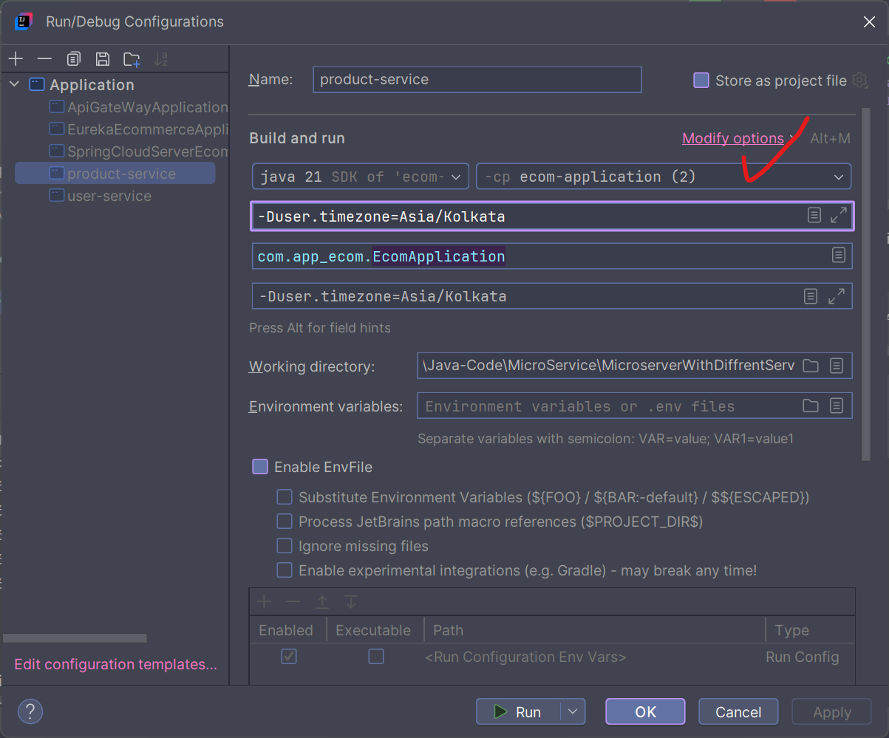
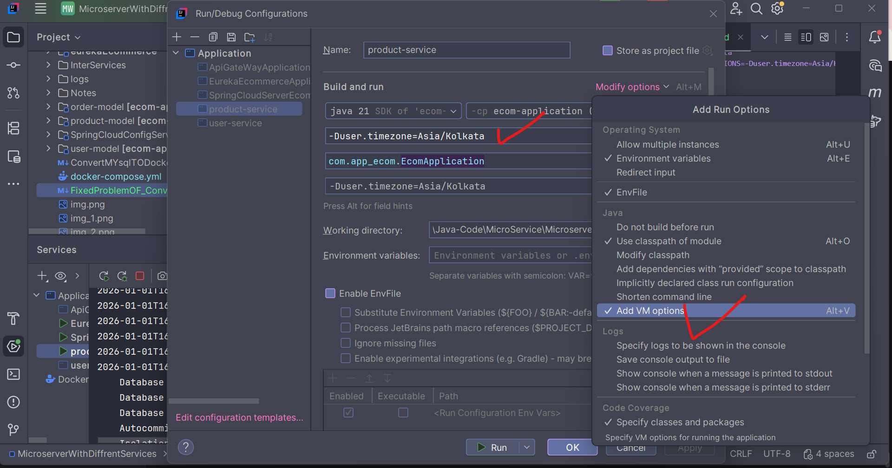
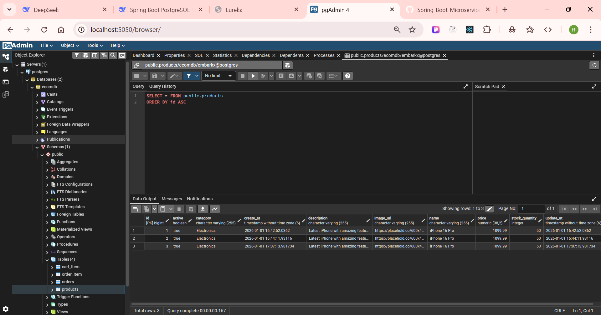
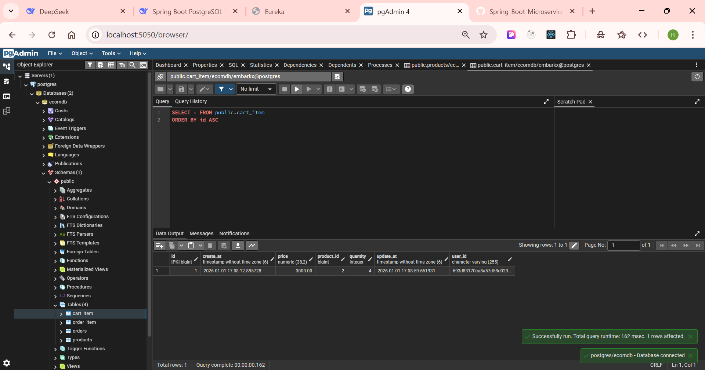
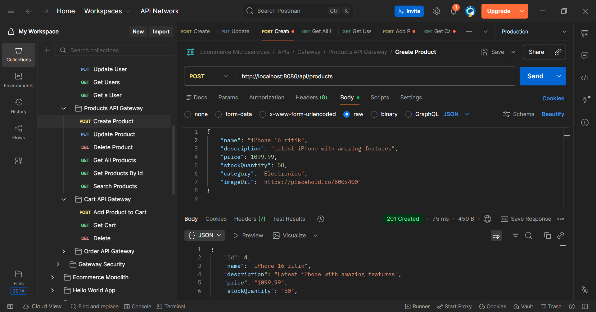
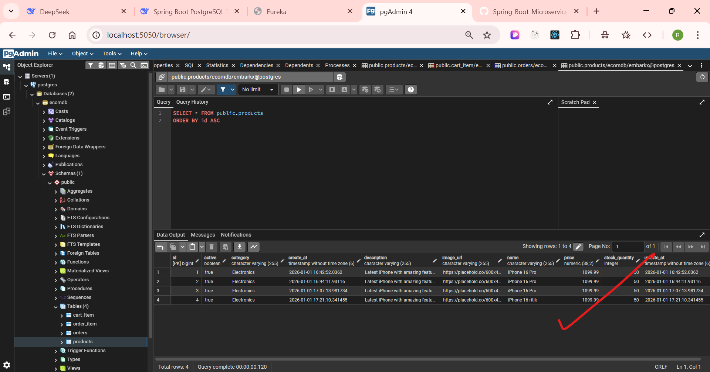
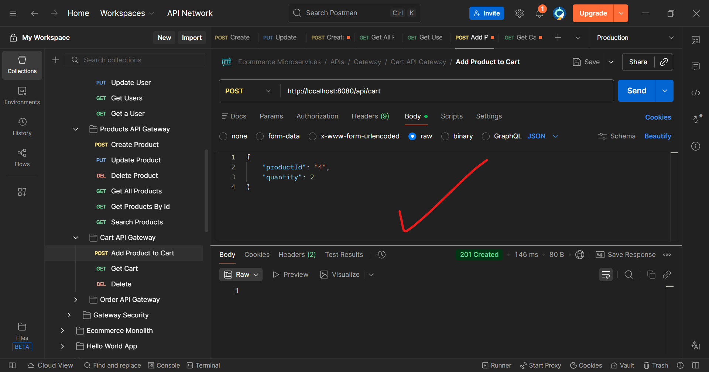
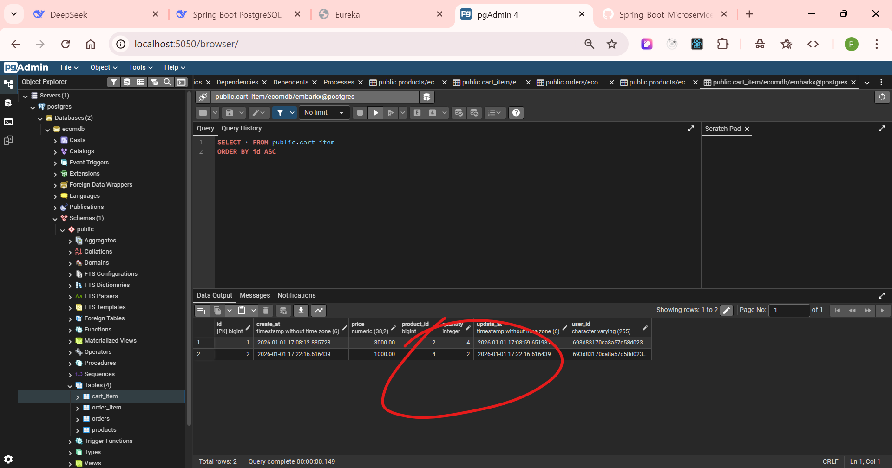

Here's how to set timezone via system environment variables and Java system properties:

## 1. **System Environment Variables**

### On Windows:
```cmd
# Command Prompt
set TZ=Asia/Kolkata

# PowerShell
$env:TZ = "Asia/Kolkata"
```

### On Linux/Mac:
```bash
export TZ=Asia/Kolkata
```

### Permanent setting (Linux/Mac):
Add to `~/.bashrc` or `~/.zshrc`:
```bash
export TZ=Asia/Kolkata
```

### For Docker/Container environment:
In your docker-compose.yml for the Spring Boot service:
```yaml
services:
  your-spring-boot-app:
    environment:
      TZ: Asia/Kolkata
      JAVA_TOOL_OPTIONS: -Duser.timezone=Asia/Kolkata
```

## 2. **Java System Properties (-D parameters)**

### During application startup:
```bash
# Using -D parameter
java -Duser.timezone=Asia/Kolkata -jar your-app.jar

# Multiple properties
java -Duser.timezone=Asia/Kolkata -Dspring.profiles.active=prod -jar your-app.jar
```

### For Spring Boot Maven/Gradle:
**Maven:**
```bash
mvn spring-boot:run -Dspring-boot.run.jvmArguments="-Duser.timezone=Asia/Kolkata"
```

**Gradle:**
```bash
./gradlew bootRun -Duser.timezone=Asia/Kolkata
```

## 3. **Setting in IntelliJ/Eclipse/VS Code**

### IntelliJ IDEA:
1. Go to `Run` → `Edit Configurations`
2. Select your Spring Boot configuration
3. In `VM options`, add:
   ```
   -Duser.timezone=Asia/Kolkata
   ```

### Eclipse:
1. Right-click project → `Run As` → `Run Configurations`
2. Select your configuration
3. Go to `Arguments` tab
4. In `VM arguments`, add:
   ```
   -Duser.timezone=Asia/Kolkata
   ```

### VS Code (launch.json):
```json
{
    "type": "java",
    "name": "Current File",
    "request": "launch",
    "mainClass": "${file}",
    "vmArgs": "-Duser.timezone=Asia/Kolkata"
}
```

## 4. **In application.yml/properties**

You can also set it in Spring configuration:

```yaml
spring:
  datasource:
    hikari:
      connection-init-sql: "SET TIME ZONE 'Asia/Kolkata'"
  jpa:
    properties:
      hibernate:
        jdbc:
          time_zone: Asia/Kolkata
        connection:
          timezone: Asia/Kolkata
```

## 5. **Programmatically in Java Code**

```java
import jakarta.annotation.PostConstruct;
import java.util.TimeZone;

@SpringBootApplication
public class Application {
    
    @PostConstruct
    void started() {
        // Set JVM default timezone
        TimeZone.setDefault(TimeZone.getTimeZone("Asia/Kolkata"));
    }
    
    // Or in main method
    public static void main(String[] args) {
        TimeZone.setDefault(TimeZone.getTimeZone("Asia/Kolkata"));
        SpringApplication.run(Application.class, args);
    }
}
```

## 6. **For Docker deployment**

**Dockerfile:**
```dockerfile
FROM openjdk:17-jdk-slim

# Set timezone
ENV TZ=Asia/Kolkata
RUN ln -snf /usr/share/zoneinfo/$TZ /etc/localtime && echo $TZ > /etc/timezone

# Alternative: Set Java system property
ENV JAVA_OPTS="-Duser.timezone=Asia/Kolkata"

COPY target/*.jar app.jar
ENTRYPOINT ["sh", "-c", "java $JAVA_OPTS -jar /app.jar"]
```

**docker-compose.yml:**
```yaml
version: '3.8'
services:
  app:
    build: .
    environment:
      - TZ=Asia/Kolkata
      - JAVA_TOOL_OPTIONS=-Duser.timezone=Asia/Kolkata
    # OR
    command: java -Duser.timezone=Asia/Kolkata -jar app.jar
```

## 7. **Check current timezone in your app**

To verify what timezone is being used, add this to a controller or startup:

```java
import org.springframework.web.bind.annotation.GetMapping;
import org.springframework.web.bind.annotation.RestController;
import java.time.ZoneId;
import java.util.TimeZone;

@RestController
public class TimezoneController {
    
    @GetMapping("/timezone-info")
    public String getTimezoneInfo() {
        return String.format(
            "System TimeZone: %s%nJVM TimeZone: %s%nZoneId: %s",
            System.getenv("TZ"),
            TimeZone.getDefault().getID(),
            ZoneId.systemDefault().getId()
        );
    }
}
```

## **Quick Fix for Your Current Issue:**

Since you're using Docker Compose, modify your Spring Boot service in docker-compose.yml:

```yaml
services:
  # ... your other services
  
  product-service:  # Add your Spring Boot app service
    image: your-product-service-image
    environment:
      - TZ=Asia/Kolkata
      - JAVA_TOOL_OPTIONS=-Duser.timezone=Asia/Kolkata
    depends_on:
      - postgres
    networks:
      - backend
```

The simplest immediate fix is to run your Spring Boot app with:
```bash
java -Duser.timezone=Asia/Kolkata -jar product-service.jar
```

1) 
2) 
3) 
4) 
5) 
6) 
7) 
8) 
9) 