# === 153. Challenge: Setup Config Server for an eCommerce Microservices Project =====
# ---- so we are going to create a config server for this project ---
1) we are going to make the file based configuration for this project so all the configuration related to this project will stored locally 
2) so for that we need to setup spring cloud config server which is itselph a application.
3) for that create new spring boot application
1) create a project for spring cloud config server 
2) 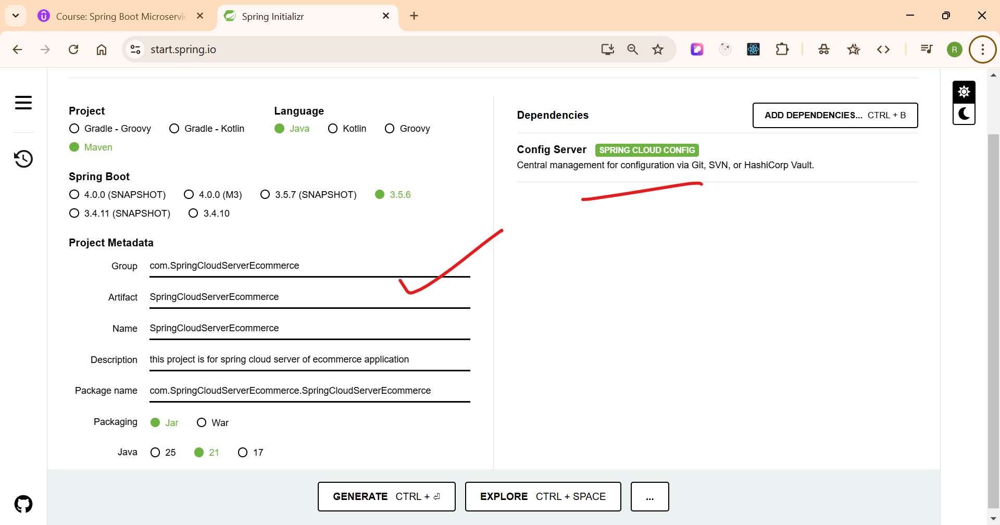
3) 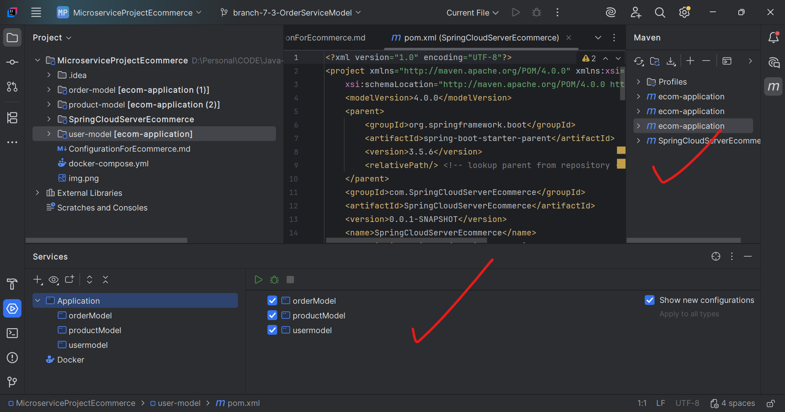
4) make the config server as : @EnableConfigServer
5) 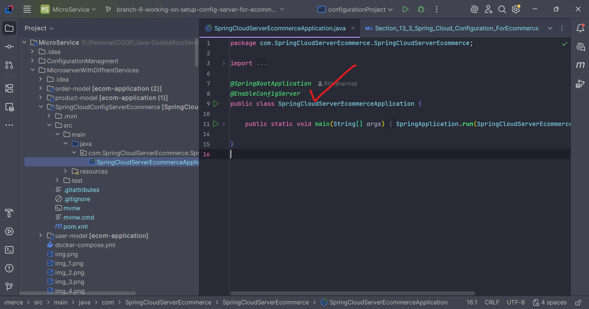
6) after that modify the application.propeties to application.yml and add the code for storing and getting configuration from local path
7) 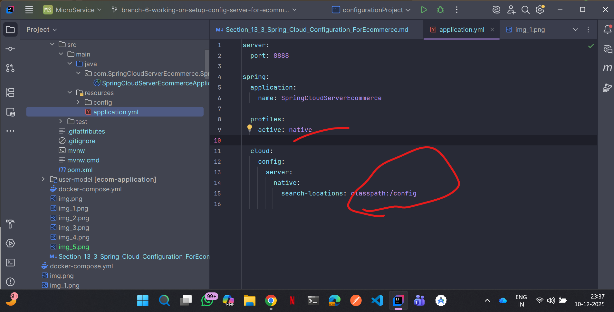
8) then start the application (Config-server)
5) 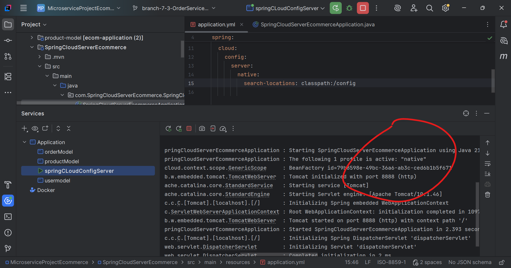

# === 154. Challenge: Updating Configuration Across All Microservices ===
1) now paste all the application.yml file with there all code of three application(usermodel, productmodel and ordermodel into confi/ folder of SpringCloudConfigServer).
2) and then create refresh new again application.yml file those three projects
3) 
6) now add the config client dependecies to all three project
7) 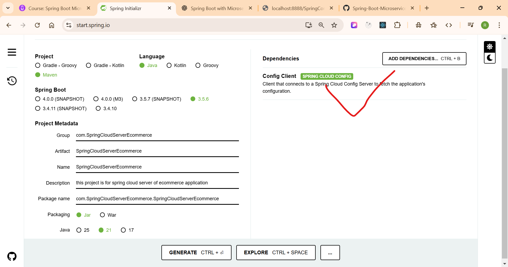
8) 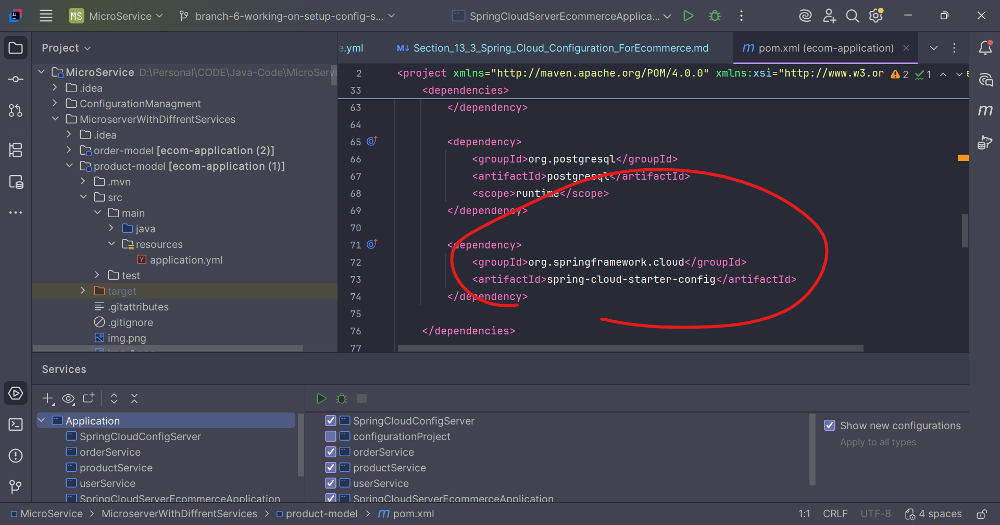
9) to all those three services
10) 
8) then start the docker:  docker compose up -d
9) 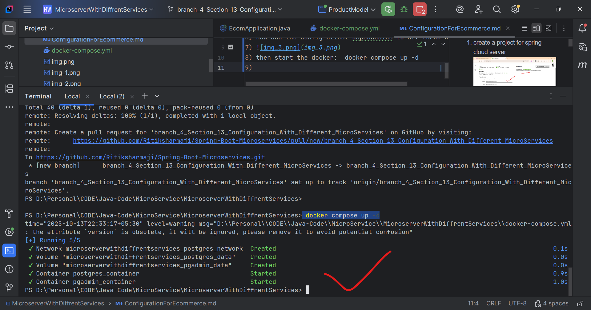
10) then run the product model
11) do the same to others as well
12) while staring the order and product on the postgresSQL then getting the error as product / order database not found so sifted to mongo
13) then working all ok 
14) 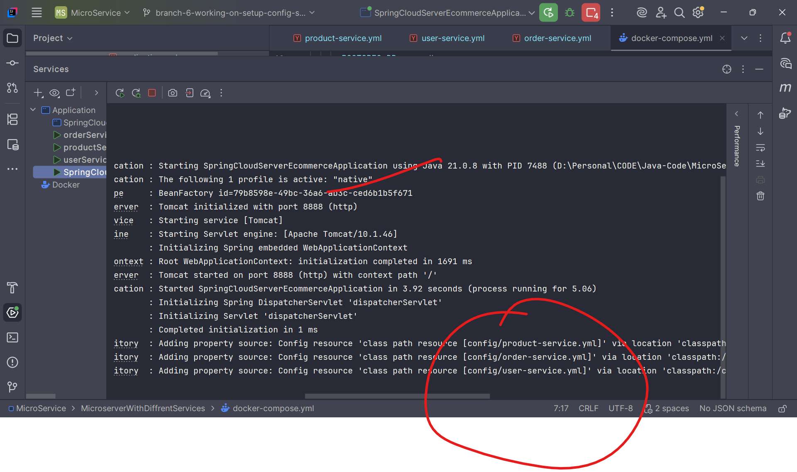
15) 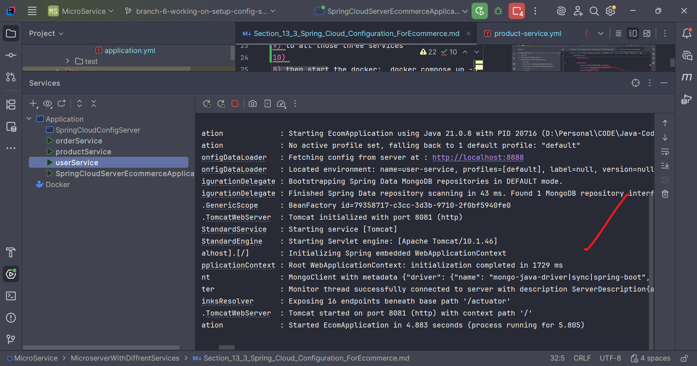
16) 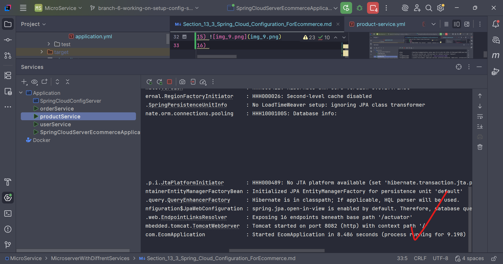
17) 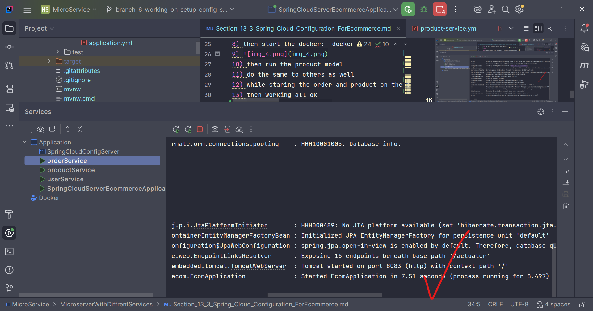
18) so now all the services working fine ...

## ----------- 155. Challenge: Externalizing Configuration Using .env Files or Environment Variables --
1) so now we are going to Externalizing all the configuration as .env file and we may can use the git as well
2) so now we have to create all .env files for all the projects

Here are the **.env files** for both **Order Service** and **Product Service**, based on your Spring Cloud Config YAML.

---

# ✅ **Order Service – `.env` file**

```
SERVER_PORT=8083

SPRING_DATA_MONGODB_URI=mongodb://localhost:27017/order
SPRING_DATA_MONGODB_DATABASE=order
```

✔ Matches your YAML
✔ Works with Spring Boot if you use `@ConfigurationProperties` OR load `.env` using `spring-dotenv` or Docker compose.

---

# ✅ **Product Service – `.env` file**

You asked to include **only MongoDB properties**:

```
SPRING_DATA_MONGODB_URI=mongodb://localhost:27017/product
SPRING_DATA_MONGODB_DATABASE=product
```

---

# ⚠️ **Important Notes**

* Spring Boot **does not read `.env` files by default**.
* Use one of the following:

    1. **`spring-boot-dotenv`** dependency

       ```
       <dependency>
           <groupId>me.paulschwarz</groupId>
           <artifactId>spring-dotenv</artifactId>
           <version>3.0.0</version>
       </dependency>
       ```
    2. OR use Docker Compose `env_file:`
    3. OR manually map environment variables using your OS or deployment platform.

---

If you want, I can generate:

✅ Docker Compose for both services
✅ Spring Cloud Config Server `.yml`
✅ Kubernetes secrets/config maps
✅ Complete microservice folder structure

Just tell me!
1) not working that depedencies so adding .env
2) 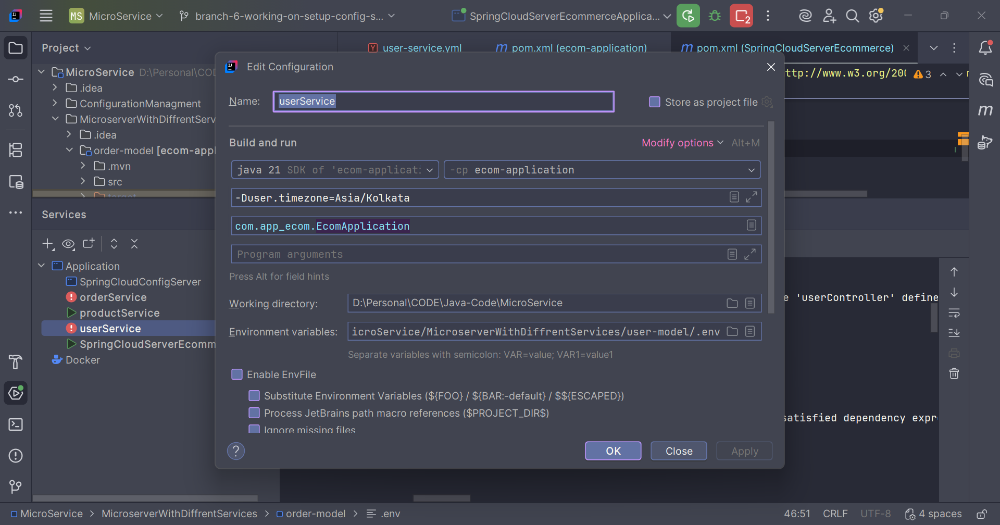
3) 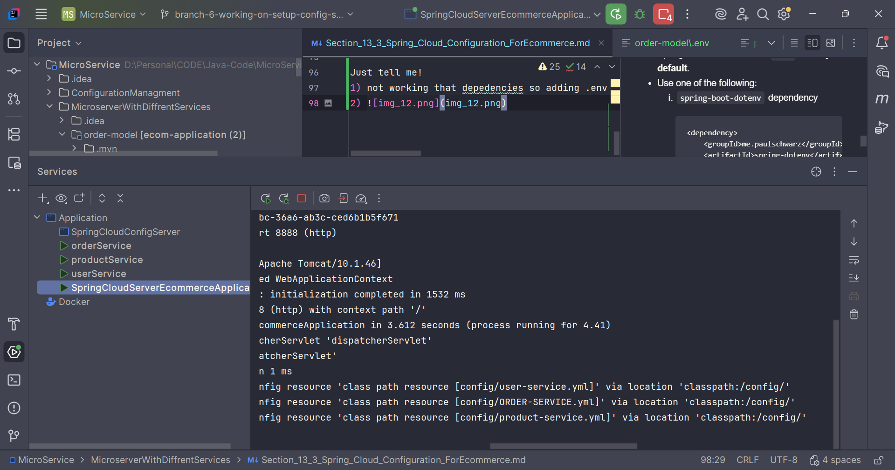

## ---------- 156. Challenge: Dynamically Refresh Configurations with Spring Cloud Bus (No Restart)---
