# ---- Section 14: Mastering Inter-Service Communication in Spring Boot Microservices ---
# ---159. What is Inter-Service Communication in Spring Boot Microservices?--
1) 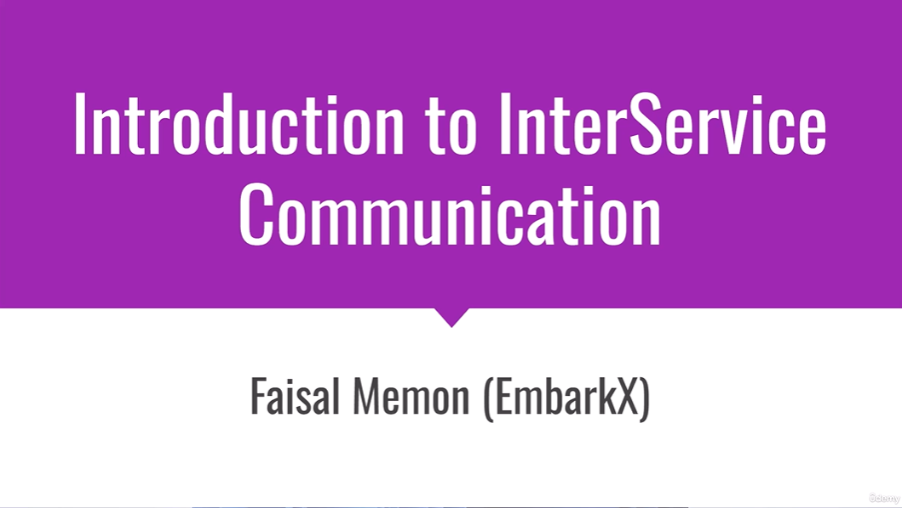
2) 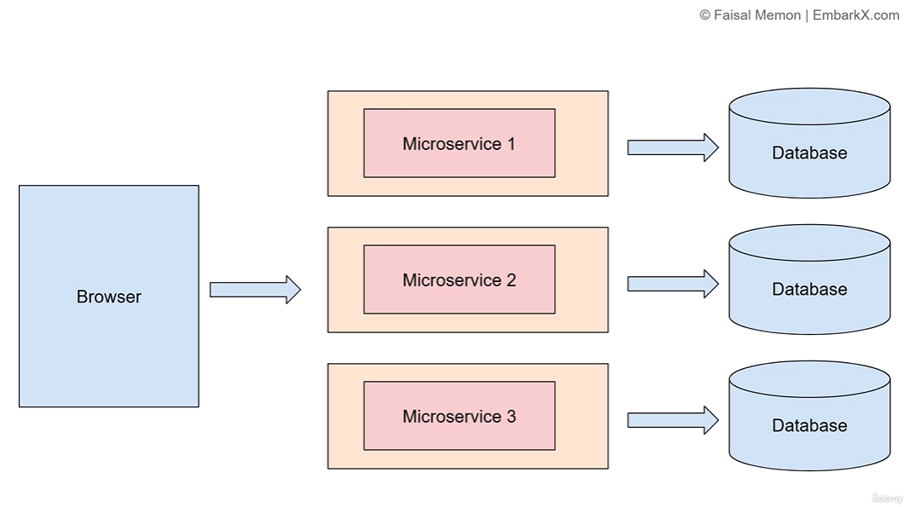
3) in monolatic artecheter all the servcies run inside a application and shared the same memory location so there is not need to interservice comminication where as in microservice all service run idepedecy and share different memory location 
4) 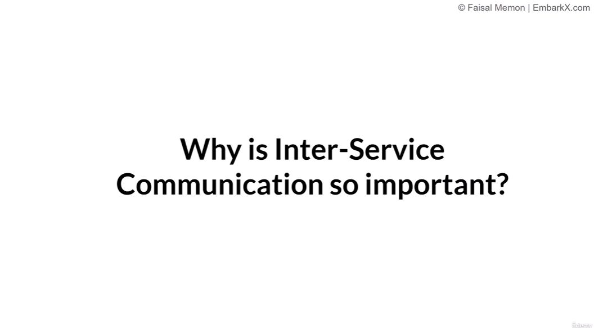
5) we can active the interservice communication in two way
    - 1) using synchronous communication( by https)
    - 2) asynchronous communication(using message broker or queus like: kafka, rabitMQ, etc)
## -----160. Different Ways of Implementing Synchronous Communication in Spring Boot ---
1) 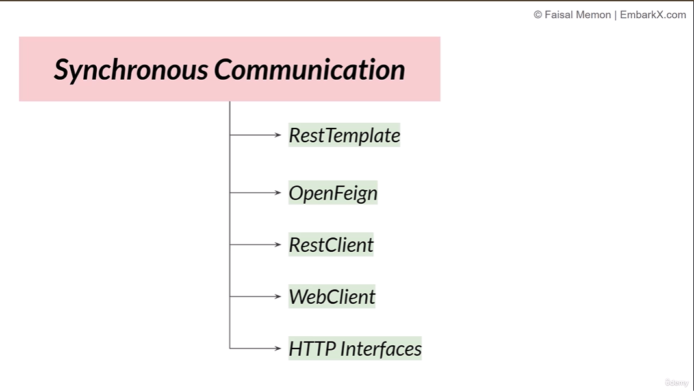
2) 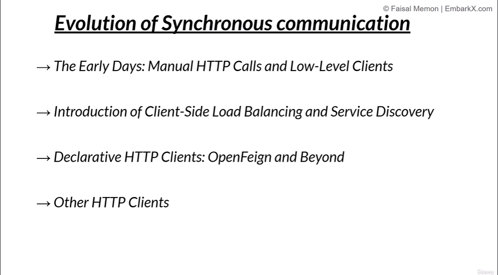
3) 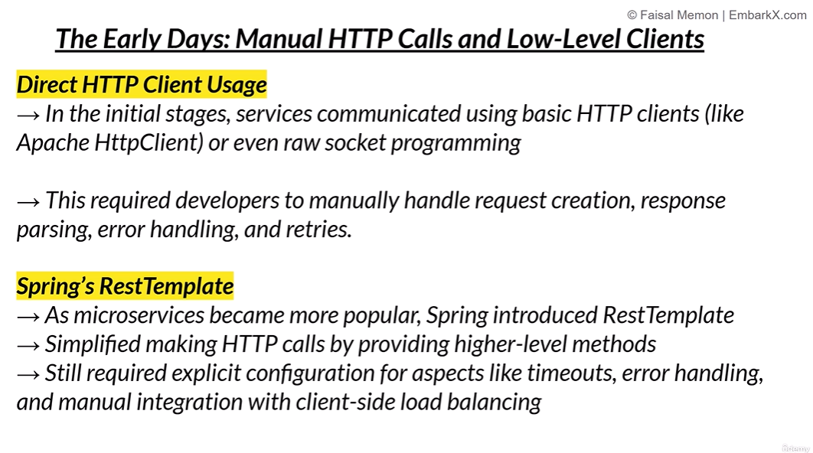
4) 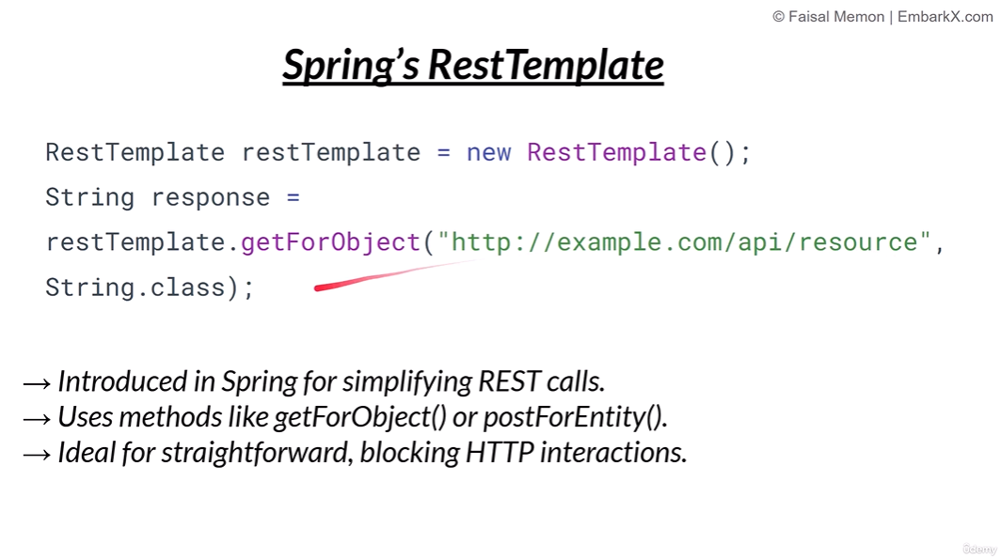
5) 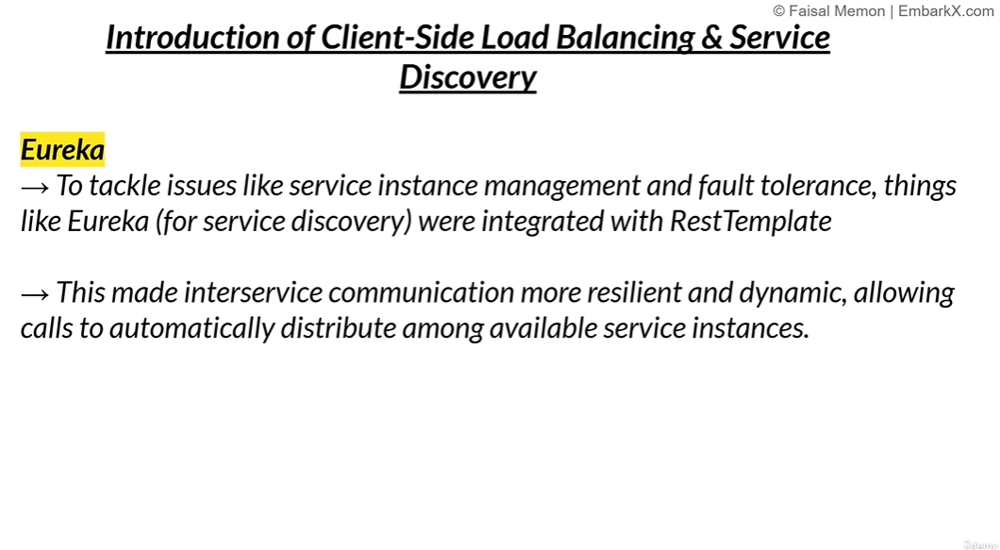
6) 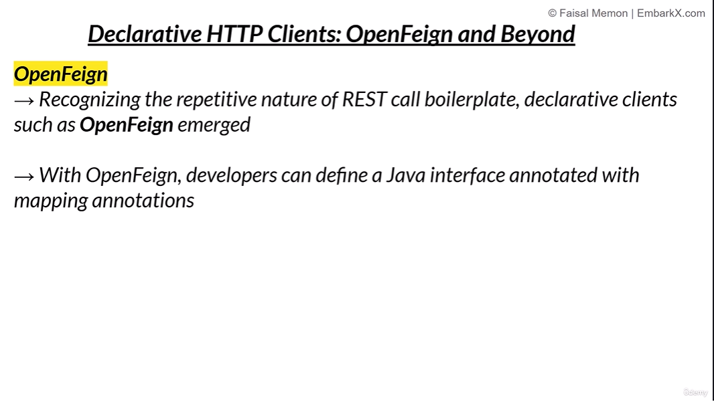
7) 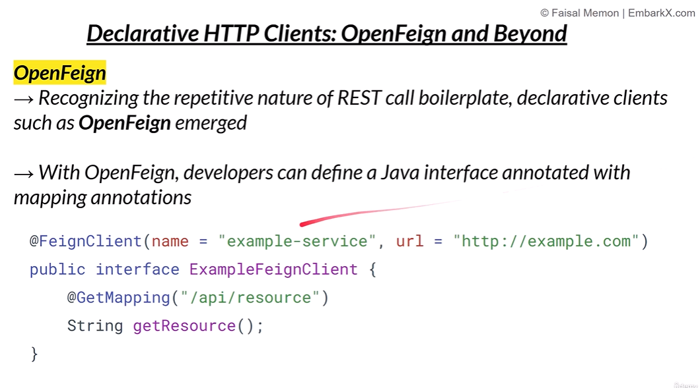
8) 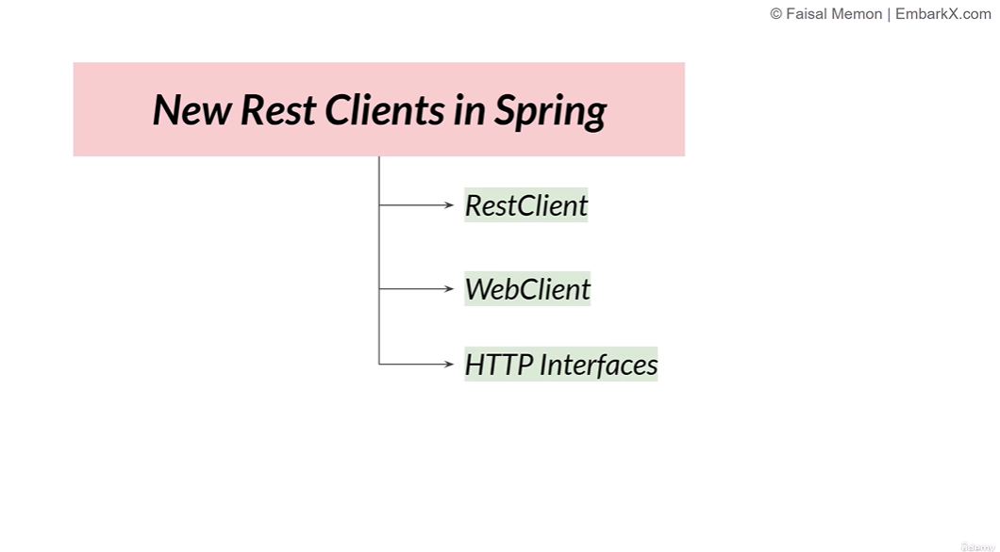
9) 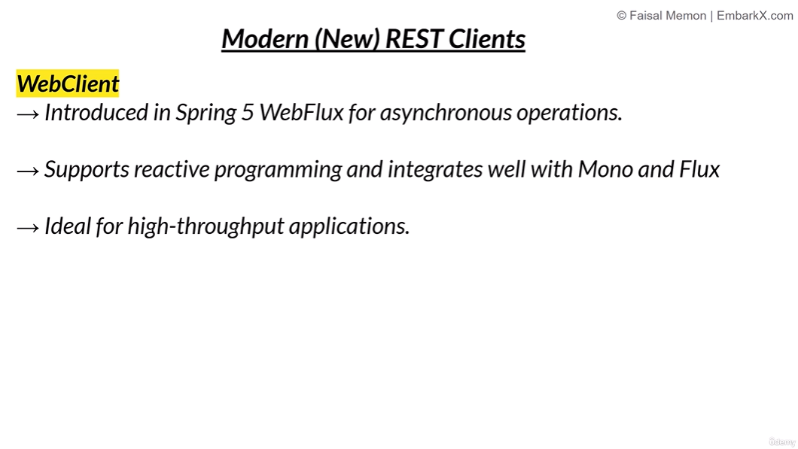
10) 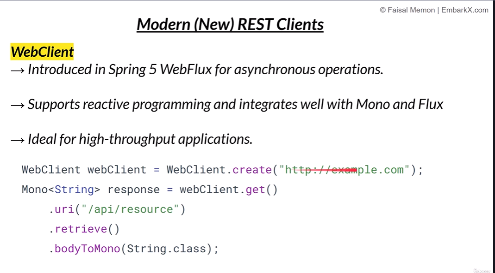
11) 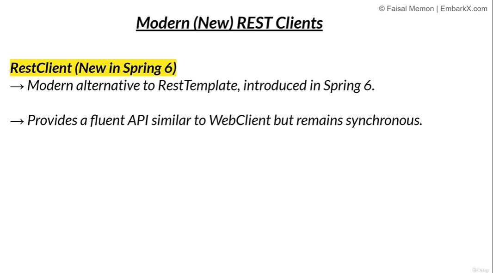
12) 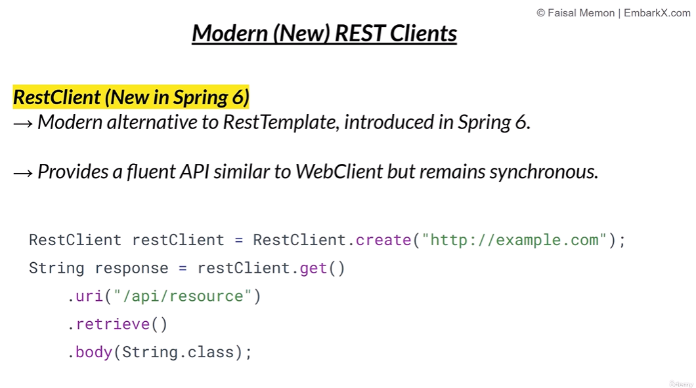
13) 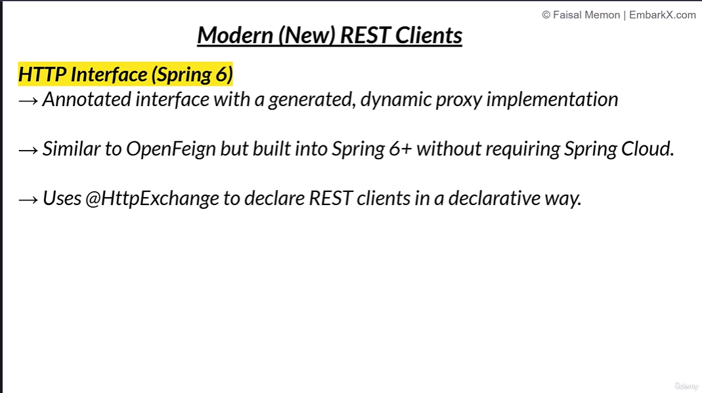
14) recommanded use for interservcie communication: 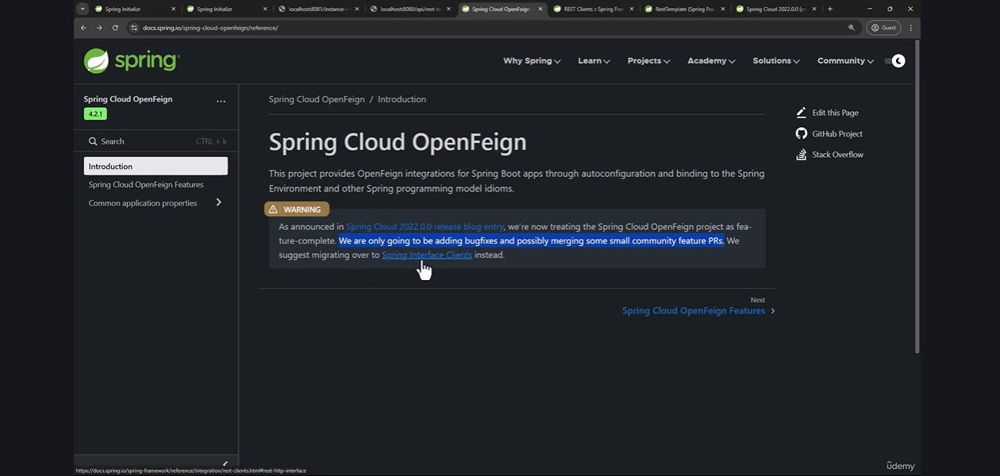
[interservice-communication-notes.pdf](Notes/interservice-communication-notes.pdf)
# -----161. Real-World Scenarios for Inter-Service Communication in Our Microservices Proj.--
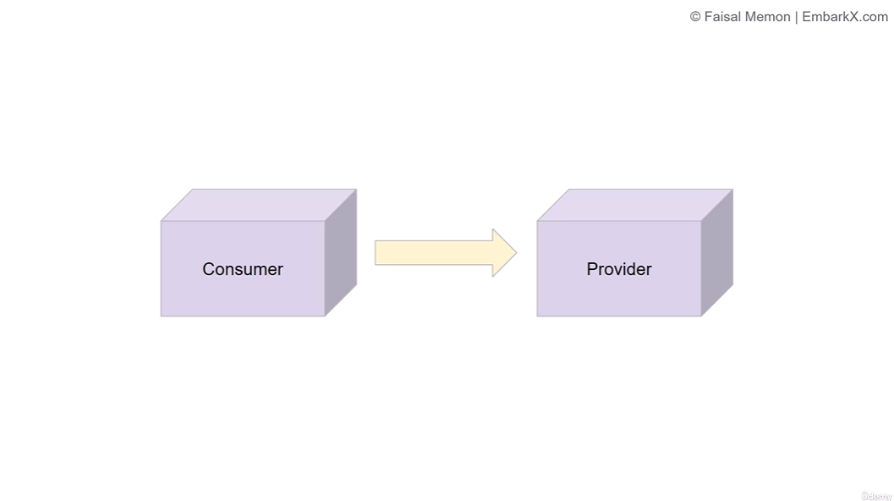

# -- what is interservice communicqation use of it benefites , advantage, disadvanteage types etc all notes ---
Here are **complete, well-structured notes on Inter-Service Communication (ISC)** in microservices — from basics to use cases, benefits, disadvantages, types, patterns, best practices, and real-world examples.

---

# ✅ **Inter-Service Communication (ISC) in Microservices — Full Notes**

Microservices architecture breaks a large application into small, independent services.
These services must communicate to fulfill business requirements.
This communication is called **inter-service communication**.

---

# 📌 **1. What is Inter-Service Communication?**

Inter-Service Communication refers to the way microservices talk to each other — either by **synchronously (request–response)** or **asynchronously (event-based)**.

### Example

* Order Service → calls → Product Service to check stock
* Payment Service → sends event → Order Service after transaction

---

# 📌 **2. Why Inter-Service Communication is Needed? (Use Cases)**

| Scenario                                | Example                                            |
| --------------------------------------- | -------------------------------------------------- |
| **Compose data from multiple services** | Order service retrieves product & user info        |
| **Business workflows**                  | Payment success triggers shipping workflow         |
| **Event-driven actions**                | Email service listens for "ORDER_PLACED"           |
| **Decentralized architecture**          | Services independently deploy but still coordinate |

---

# 📌 **3. Benefits / Advantages**

### ✔ 1. **Decoupling**

Services are independent — changes in one service don’t break others.

### ✔ 2. **Scalability**

Each service scales individually (e.g., Product service gets high traffic → scale only that).

### ✔ 3. **Fault Isolation**

If Review service fails, Product service still works.

### ✔ 4. **Tech Diversity**

Different services use different languages/DBs but still communicate.

### ✔ 5. **Flexibility in Communication Mode**

Choose Sync, Async, Events based on need.

---

# 📌 **4. Disadvantages / Challenges**

### ❌ 1. **Network Latency**

Every call across network adds delay.

### ❌ 2. **Complex Debugging**

Distributed logs → harder to trace issues.

### ❌ 3. **Network Failure Handling**

Time-outs, retries, circuit breaker needed.

### ❌ 4. **Data Consistency Issues**

Services maintain separate databases → eventual consistency.

### ❌ 5. **Security Complications**

External & internal APIs must be secured via:

* OAuth2
* JWT
* Mutual TLS
* API Gateway policies

---

# 📌 **5. Types of Inter-Service Communication**

There are **two major categories**:

---

# 🟩 **A. Synchronous Communication**

(Real-time request–response)

### 💡 Examples:

* **REST (HTTP)**
* **gRPC**
* **GraphQL Federation**

### ✔ Pros:

* Simple & widely used
* Immediate response
* Easy debugging

### ❌ Cons:

* Tight coupling in timing
* If service B is down → service A fails
* Requires retries, timeout handling

### When to Use?

* Querying product info
* User login authentication
* Real-time data

---

# 🟦 **B. Asynchronous Communication**

(Event-based, no direct response needed)

### 💡 Tools/Technologies:

* RabbitMQ
* Kafka
* AWS SQS
* Azure Service Bus
* Google Pub/Sub

### ✔ Pros:

* High performance (no waiting)
* Loose coupling
* Better resilience
* Supports event-driven architectures

### ❌ Cons:

* Harder to debug
* Requires message ordering & retries
* Eventual consistency

### When to Use?

* Order placed → Email service
* Payment success → Shipping starts
* Logs, notifications, inventory updates

---

# 📌 **6. Comparison Table**

| Feature      | Sync (REST/gRPC)      | Async (Kafka/RabbitMQ)     |
| ------------ | --------------------- | -------------------------- |
| Response     | Immediate             | No immediate response      |
| Coupling     | More coupled          | Loose coupling             |
| Reliability  | Lower without retries | High (guaranteed delivery) |
| Performance  | Medium                | Very high                  |
| Suitable for | Querying              | Events, background tasks   |

---

# 📌 **7. Patterns in Inter-Service Communication**

### ⭐ 1. **API Gateway Pattern**

* Central entry point
* Handles authentication, rate limiting, routing
* Examples: ZUUL, Spring Cloud Gateway, Kong

### ⭐ 2. **Service Registry & Discovery**

* Services register themselves
* Services find each other dynamically
* Tools: Eureka, Consul, Zookeeper

### ⭐ 3. **Circuit Breaker Pattern**

* Prevent cascading failures
* Tools: Resilience4j, Hystrix (old)

### ⭐ 4. **Event-Driven Architecture**

* Services communicate via events
* Enables loose coupling
* Tools: Kafka, RabbitMQ

### ⭐ 5. **Saga Pattern**

* Distributed transactions
* Used for order → payment → inventory sequence

---

# 📌 **8. Real-World Examples**

### 🔹 Amazon

* Event-driven updates (Kafka for inventory)
* Microservices communicate asynchronously

### 🔹 Netflix

* gRPC for fast inter-service calls
* Eureka for service discovery
* Gateway for routing

### 🔹 Uber

* Pub/Sub model for trip events
* gRPC for internal performance

---

# 📌 **9. Best Practices for Inter-Service Communication**

### ✔ Choose Sync Only When Necessary

* Don’t make everything REST
* Use async for heavy operations

### ✔ Use Circuit Breaker + Retry + Timeout

Prevents cascading failures.

### ✔ Use API Gateway

Centralized entry, routing, authentication.

### ✔ Implement Observability

* Distributed logging
* Tracing (Zipkin, Sleuth)
* Metrics (Prometheus)

### ✔ Version Your APIs

old clients use /v1, new clients use /v2

### ✔ Ensure Backward Compatibility

### ✔ Use Idempotency Keys

Avoid duplicates when retrying async messages.

### ✔ Embrace Event-Driven Architecture for scaling

---

# 📌 **10. When to Use Synchronous vs Asynchronous?**

### Use **Synchronous (REST/gRPC):**

* User requests data→ immediate response
* Authentication flow
* Simple CRUD queries

### Use **Asynchronous (Kafka/RabbitMQ):**

* Background processes
* Sending emails
* Payment events
* Inventory update
* Notifications

---

# 📌 **11. Interview Points (Important)**

1. Microservices communicate using sync (REST/gRPC) or async (Kafka/RabbitMQ).
2. Async is best for scalability & loose coupling.
3. Sync is easy but leads to tight coupling and latency.
4. Use Circuit Breaker, Retry, Timeout for sync calls.
5. Use API Gateway for routing & security.
6. Service Registry used to dynamically discover services.
7. Use event-driven architecture for high throughput systems.
8. Sagas handle distributed transactions.

---

# 🔥 If you want, I can give you:

✅ Architecture diagram of inter-service communication
✅ Notes for interview preparation
✅ Sample code for REST inter-service call
✅ Sample code with Kafka/RabbitMQ communication
✅ Microservices communication cheatsheet PDF
Just tell me — **which one you need?**

## --------- 162. Project Setup: Preparing Microservices for Inter-Service Communication ---
1) create two project for(consumer and provider)
2) 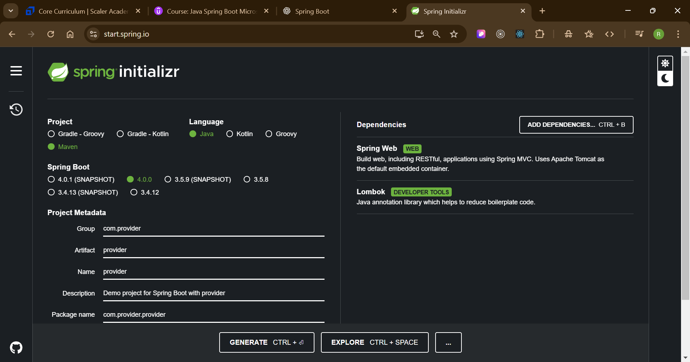
3) 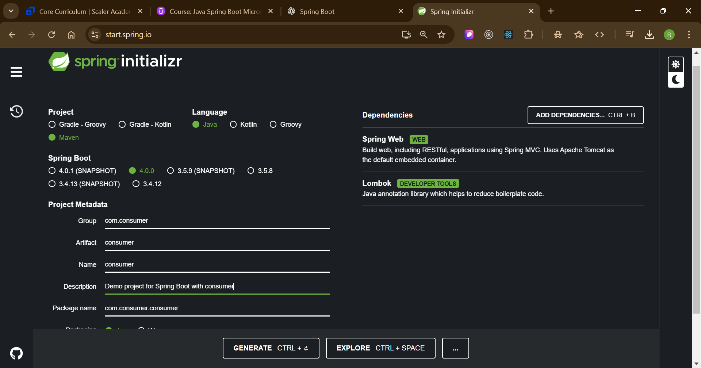
4) 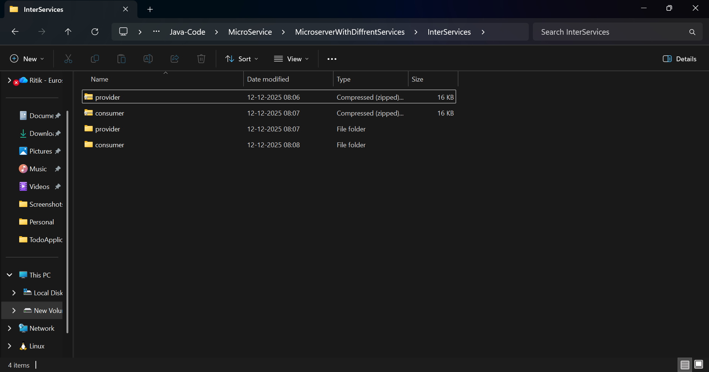
5) 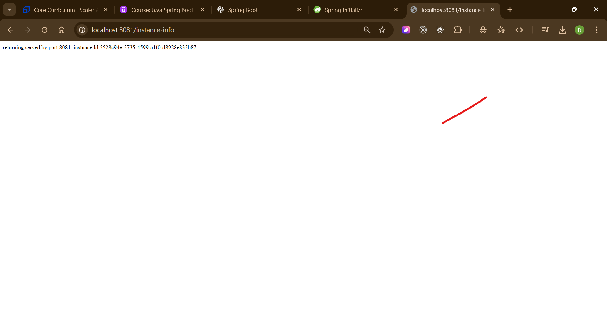
6) 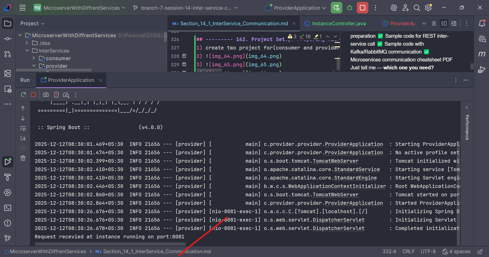

# --- 163. Using RestTemplate for Inter-Service Communication in Spring Boot (Legacy) -
1) now we are going to setup the consumer controller
2) then run it
3) 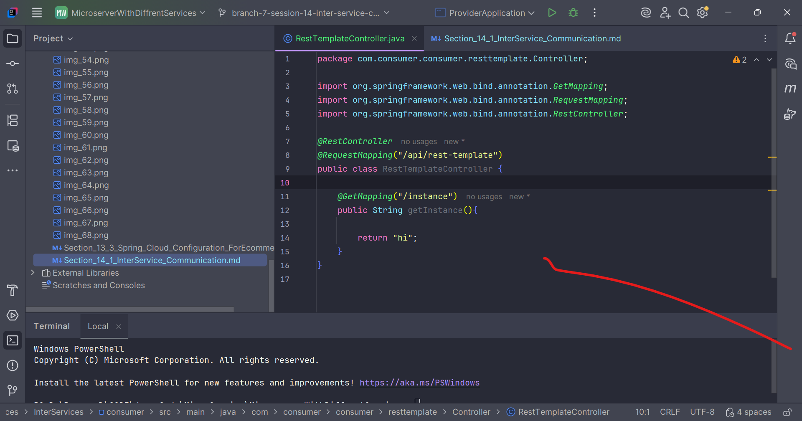
4) 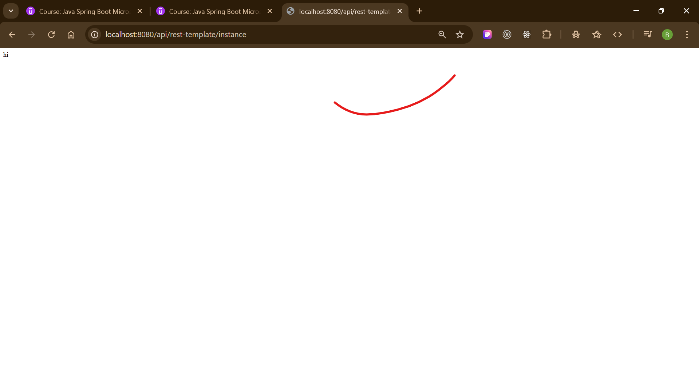
5) then create instance of RestTemplate and call the provider url there
6) 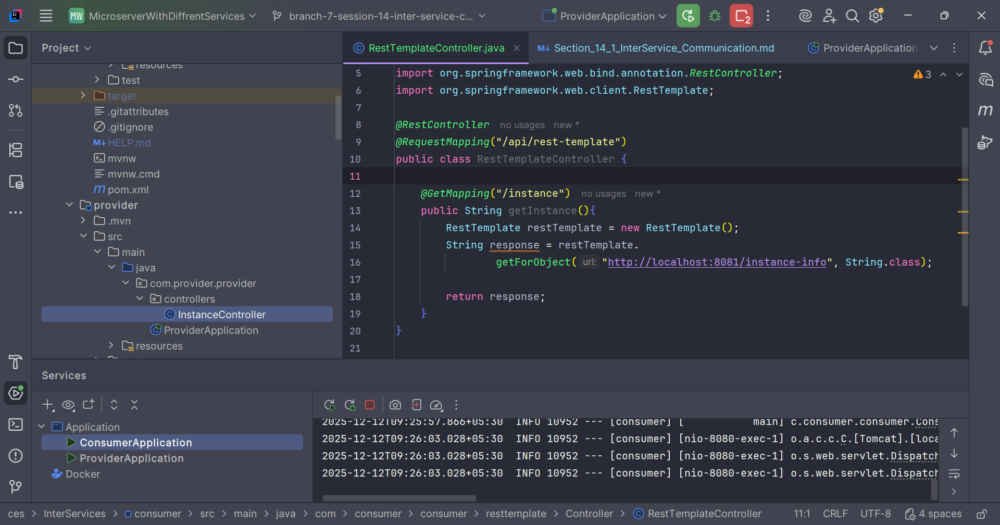
7) 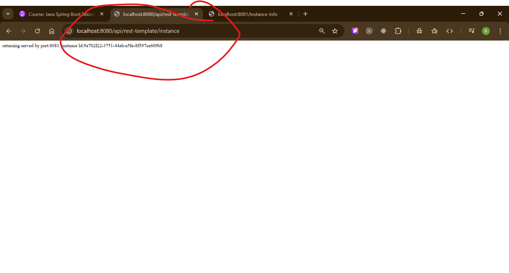
8) now we can modify little bit code like making separete class for RestTemplate and creating beans of it
9) created bean clas but getting eror beacuse that class not there withing used the dependeies in pom.xml 
10) 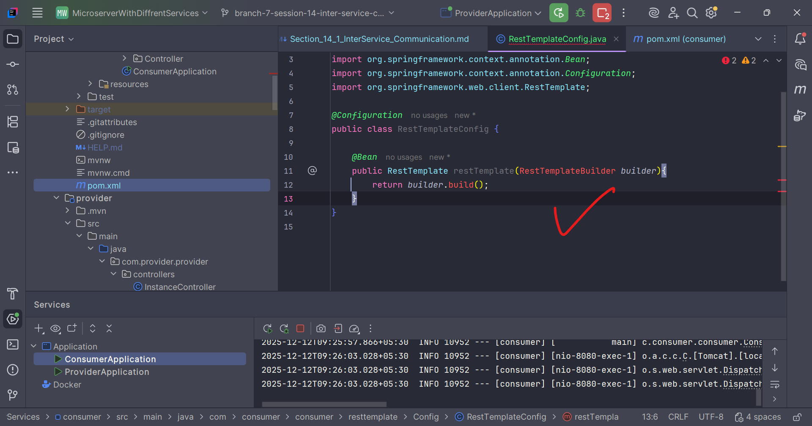

You are getting:

```
Cannot resolve symbol 'RestTemplateBuilder'
```

because **your POM does NOT include the correct dependency**.

### ✅ **Reason**

In **Spring Boot 4.x**,
`RestTemplateBuilder` comes from:

```
org.springframework.boot:spring-boot-starter-web
```

But your POM uses:

```
spring-boot-starter-webmvc
```

**`webmvc` does NOT include RestTemplateBuilder.**
It only contains DispatcherServlet + MVC components.

---

# ✅ **Fix — Add correct dependency**

### **Option 1 (Recommended): Use Spring Boot Starter Web**

Add this to dependencies:

```xml
<dependency>
    <groupId>org.springframework.boot</groupId>
    <artifactId>spring-boot-starter-web</artifactId>
</dependency>
```

And **remove** this:

```xml
<dependency>
    <groupId>org.springframework.boot</groupId>
    <artifactId>spring-boot-starter-webmvc</artifactId>
</dependency>
```

Now `RestTemplateBuilder` will be available.

---

# 🚀 **Update Your RestTemplateConfig**

```java
package com.consumer.consumer.resttemplate.Config;

import org.springframework.boot.web.client.RestTemplateBuilder;
import org.springframework.context.annotation.Bean;
import org.springframework.context.annotation.Configuration;
import org.springframework.web.client.RestTemplate;

@Configuration
public class RestTemplateConfig {

    @Bean
    public RestTemplate restTemplate(RestTemplateBuilder builder){
        return builder.build();
    }
}
```

---

# ⚠️ Important Note (Spring Boot 3 / 4 Recommendation)

Spring team recommends:

### ❗ **RestTemplate is deprecated for future versions**

Use **RestClient** instead:

```java
@Bean
public RestClient restClient(RestClient.Builder builder) {
    return builder.build();
}
```

Usage:

```java
restClient.get()
          .uri("http://localhost:8081/product/1")
          .retrieve()
          .body(Product.class);
```

---

# ✅ **Final Corrected POM (only relevant part)**

```xml
<dependencies>
    <dependency>
        <groupId>org.springframework.boot</groupId>
        <artifactId>spring-boot-starter-web</artifactId>
    </dependency>

    <dependency>
        <groupId>org.projectlombok</groupId>
        <artifactId>lombok</artifactId>
        <optional>true</optional>
    </dependency>

    <dependency>
        <groupId>org.springframework.boot</groupId>
        <artifactId>spring-boot-starter-test</artifactId>
        <scope>test</scope>
    </dependency>
</dependencies>
```

---

If you want, I can generate:

✅ Full consumer–producer microservice
✅ RestClient example
✅ OpenFeign version
✅ Docker version

Just tell me!
==========
Here is the issue:

You added **spring-boot-starter-webmvc** and **spring-boot-starter-web**, AND **spring-boot-starter-webmvc-test** which **does not exist**.
Because of this, Maven cannot resolve dependencies → so your project is NOT importing correct WebMVC features → your application won't run properly.

---

# ✅ **Corrected POM.xml for a Simple Spring Boot Consumer Project**

Use this clean, correct version:

```xml
<?xml version="1.0" encoding="UTF-8"?>
<project xmlns="http://maven.apache.org/POM/4.0.0"
         xmlns:xsi="http://www.w3.org/2001/XMLSchema-instance"
         xsi:schemaLocation="http://maven.apache.org/POM/4.0.0 https://maven.apache.org/xsd/maven-4.0.0.xsd">

    <modelVersion>4.0.0</modelVersion>

    <parent>
        <groupId>org.springframework.boot</groupId>
        <artifactId>spring-boot-starter-parent</artifactId>
        <version>3.2.0</version>
        <relativePath/>
    </parent>

    <groupId>com.consumer</groupId>
    <artifactId>consumer</artifactId>
    <version>0.0.1-SNAPSHOT</version>
    <name>consumer</name>
    <description>Consumer Service</description>

    <properties>
        <java.version>17</java.version>
    </properties>

    <dependencies>

        <!-- Correct Web dependency -->
        <dependency>
            <groupId>org.springframework.boot</groupId>
            <artifactId>spring-boot-starter-web</artifactId>
        </dependency>

        <!-- Lombok -->
        <dependency>
            <groupId>org.projectlombok</groupId>
            <artifactId>lombok</artifactId>
            <optional>true</optional>
        </dependency>

        <!-- Testing -->
        <dependency>
            <groupId>org.springframework.boot</groupId>
            <artifactId>spring-boot-starter-test</artifactId>
            <scope>test</scope>
        </dependency>

    </dependencies>

    <build>
        <plugins>
            <plugin>
                <groupId>org.apache.maven.plugins</groupId>
                <artifactId>maven-compiler-plugin</artifactId>
                <version>3.11.0</version>
                <configuration>
                    <source>17</source>
                    <target>17</target>
                    <annotationProcessorPaths>
                        <path>
                            <groupId>org.projectlombok</groupId>
                            <artifactId>lombok</artifactId>
                            <version>1.18.30</version>
                        </path>
                    </annotationProcessorPaths>
                </configuration>
            </plugin>

            <plugin>
                <groupId>org.springframework.boot</groupId>
                <artifactId>spring-boot-maven-plugin</artifactId>
            </plugin>
        </plugins>
    </build>

</project>
```

---

# ❗ Problems in Your POM

### **1. Wrong dependency**

❌ `spring-boot-starter-webmvc-test` → **does not exist**

### **2. Duplicate dependencies**

You added:

* `spring-boot-starter-webmvc`
* `spring-boot-starter-web`

Only **spring-boot-starter-web** is enough.

### **3. Wrong Spring Boot version**

You used **4.0.0**, which does NOT exist yet.

Use **3.2.0** or **3.3.0**.

---

# ✅ What To Do Now

1. Replace your POM with the corrected version above
2. Run:

```
mvn clean install
```

3. Restart IntelliJ/Eclipse and reload Maven.

---

If you want, send me the **error message** you are getting — I will fix it quickly.

3) creating servcie
4) 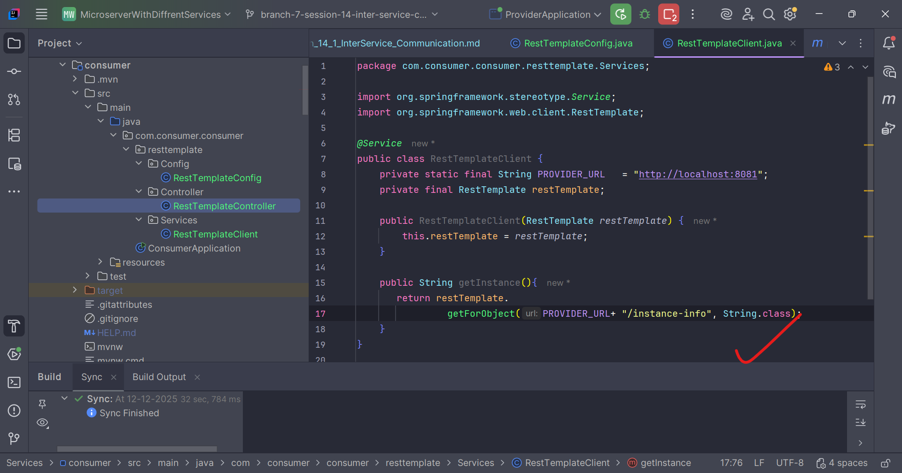

## ---------- 164. Spring Cloud OpenFeign: The Declarative Way to Call Microservices --------
1) https://spring.io/projects/spring-cloud
2) 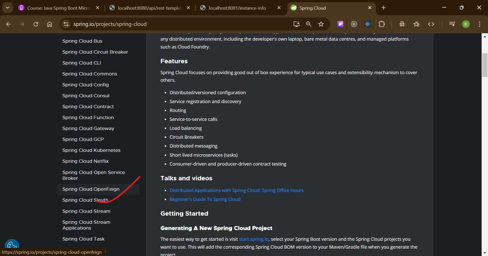
3) 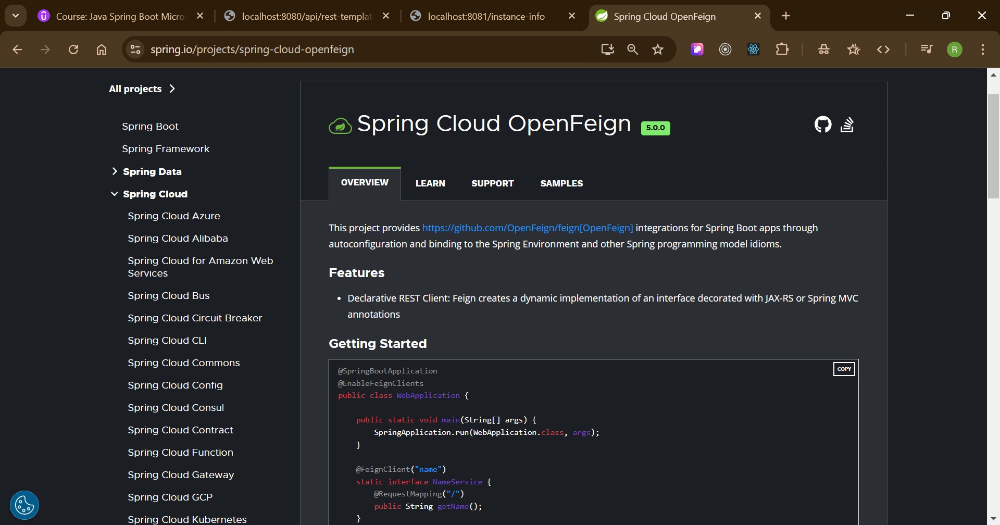
4) adding dependeies of openFeign 
5) 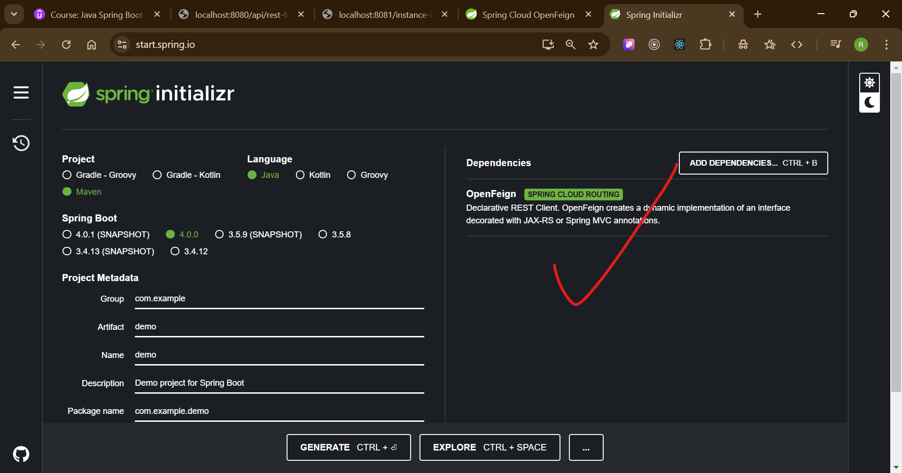
```declarative
    <dependency>
      <groupId>org.springframework.cloud</groupId>
      <artifactId>spring-cloud-starter-openfeign</artifactId>
    </dependency>
```
so add this into consumer project beacuse it is going to make api call
6) be remember it is dependeies from spring cloud so
7) add required dependeies
8) 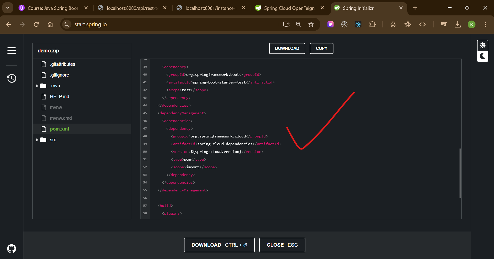
9) 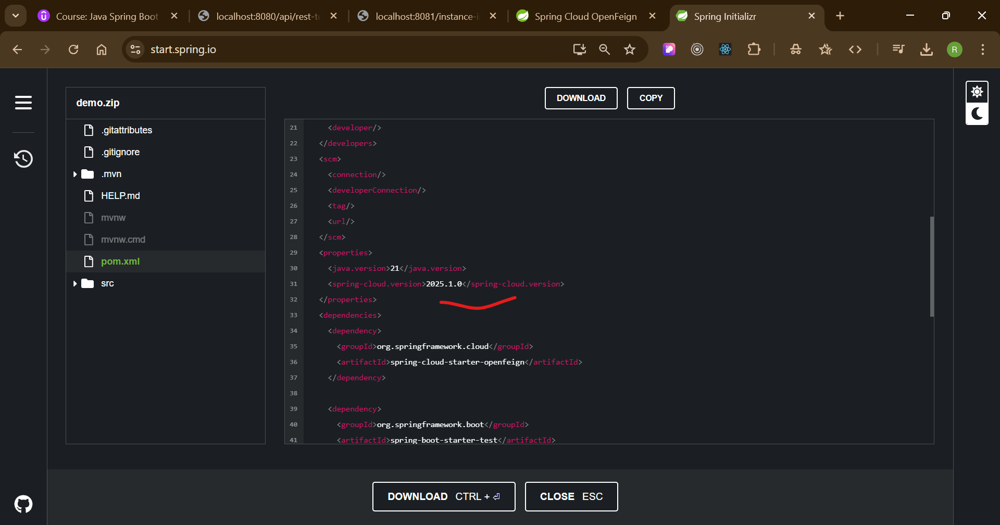
```declarative
<properties>
    <java.version>21</java.version>
    <spring-cloud.version>2025.1.0</spring-cloud.version>
  </properties>

  <dependencyManagement>
  <dependencies>
<dependency>
<groupId>org.springframework.cloud</groupId>
<artifactId>spring-cloud-dependencies</artifactId>
<version>${spring-cloud.version}</version>
<type>pom</type>
<scope>import</scope>
</dependency>
</dependencies>
</dependencyManagement>
```
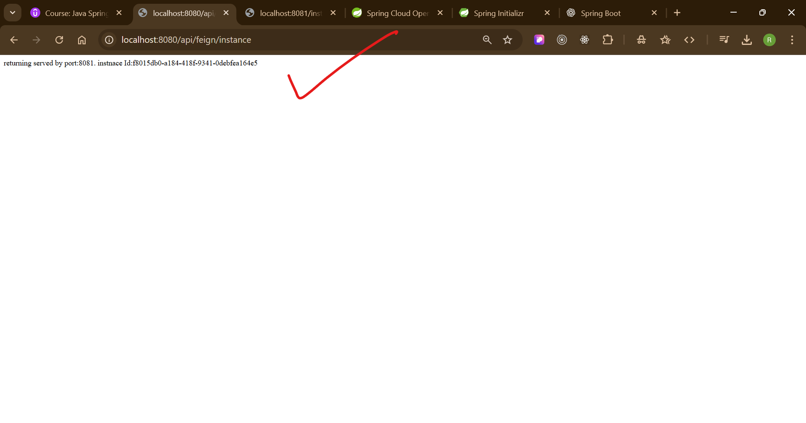

## ----- 165. RestClient – The Modern Alternative to RestTemplate---
1) https://docs.spring.io/spring-framework/reference/integration/rest-clients.html
2) 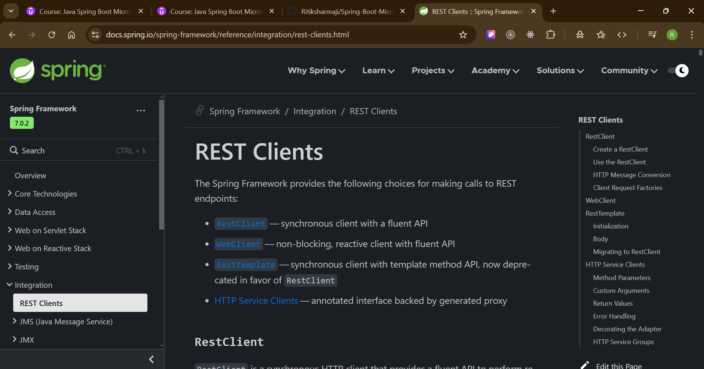
3) 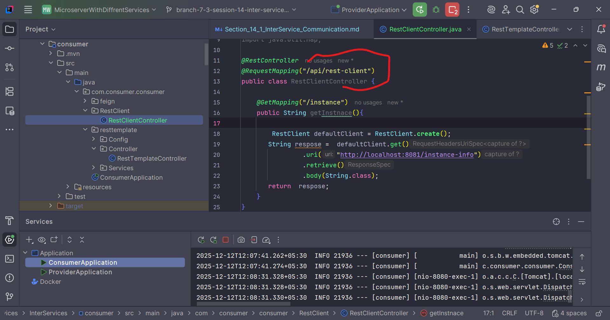
4) 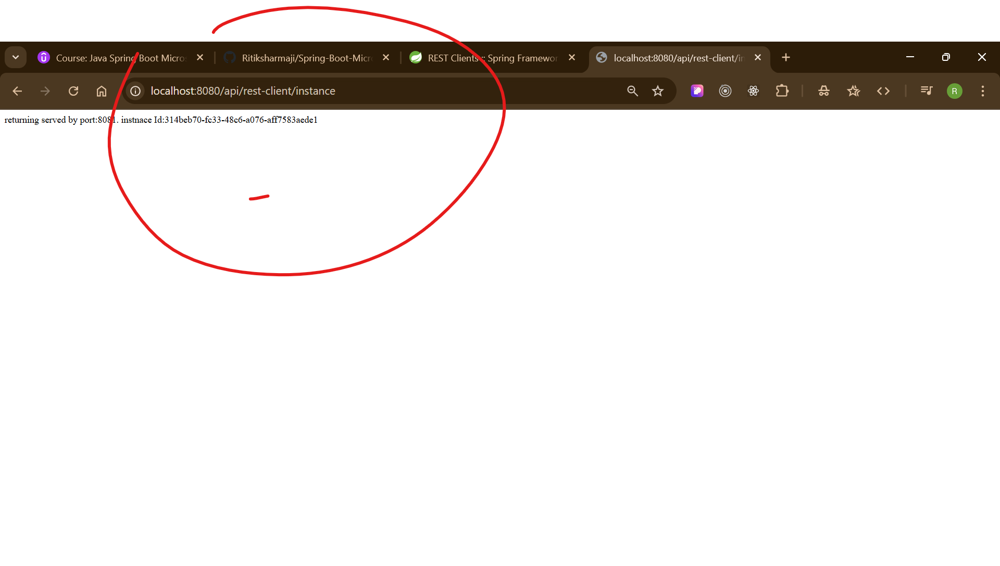

## --------- 166. Using WebClient for Non-Blocking, Reactive Communication in Microservices --
1) https://docs.spring.io/spring-framework/reference/integration/rest-clients.html
2) 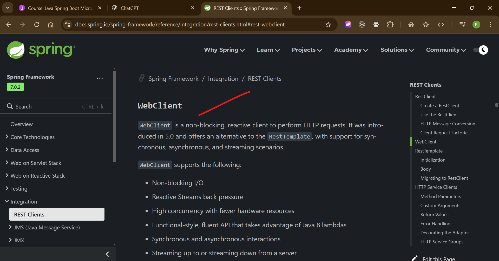
3) add the dependeies
4) 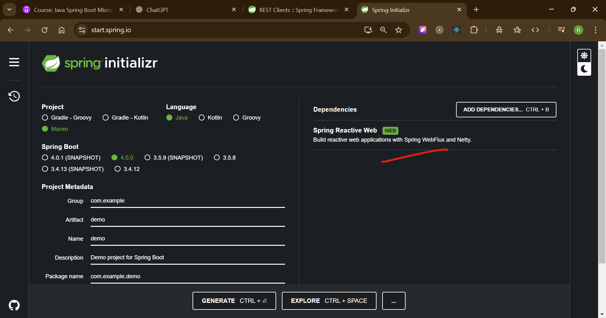
```declarative
 <dependency>
      <groupId>org.springframework.boot</groupId>
      <artifactId>spring-boot-starter-webflux</artifactId>
    </dependency>
```
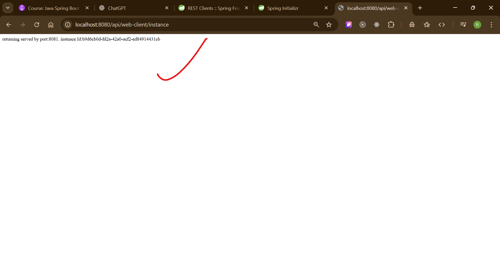

## ---------- 167. HTTP Interfaces in Spring Boot 3 – Type-Safe API Calls for Microservices---
1) 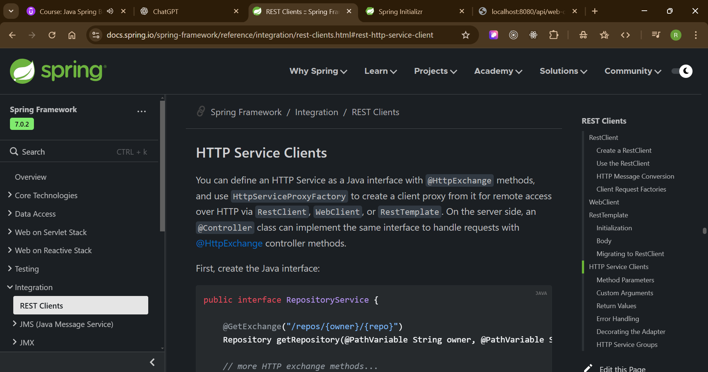
2) 
3) 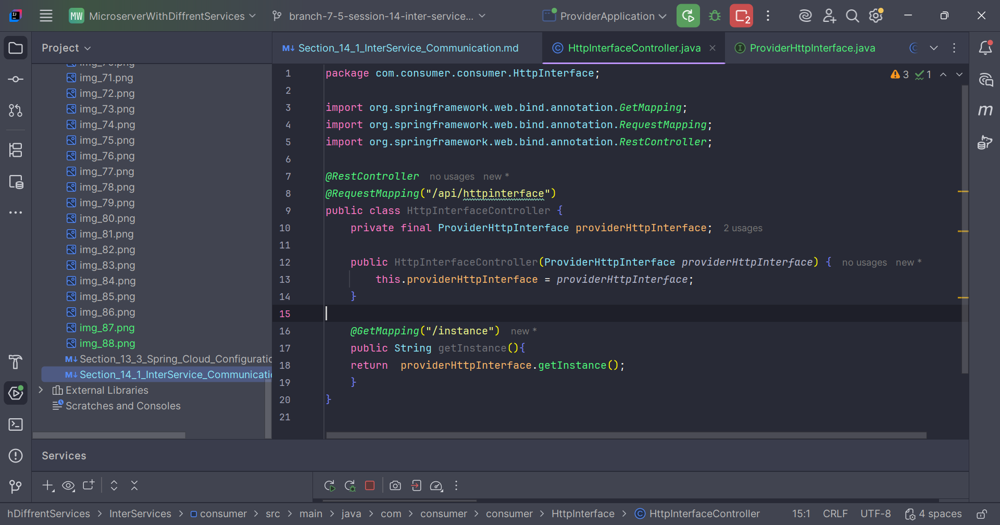

## --- 168. What Should You Use? Comparing all REST Clients ---
1) 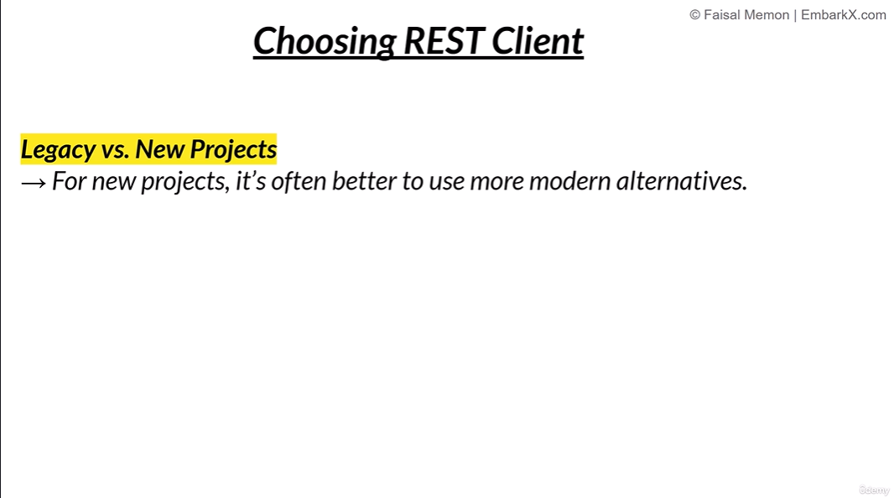
2) 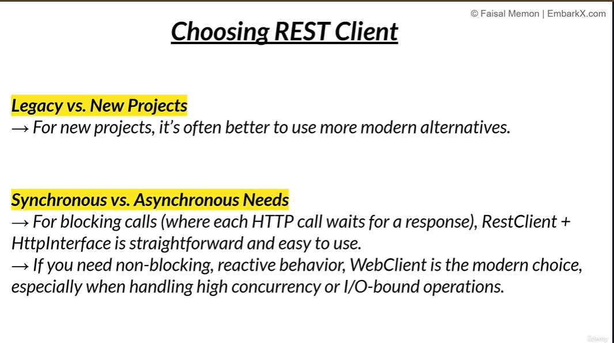
3) 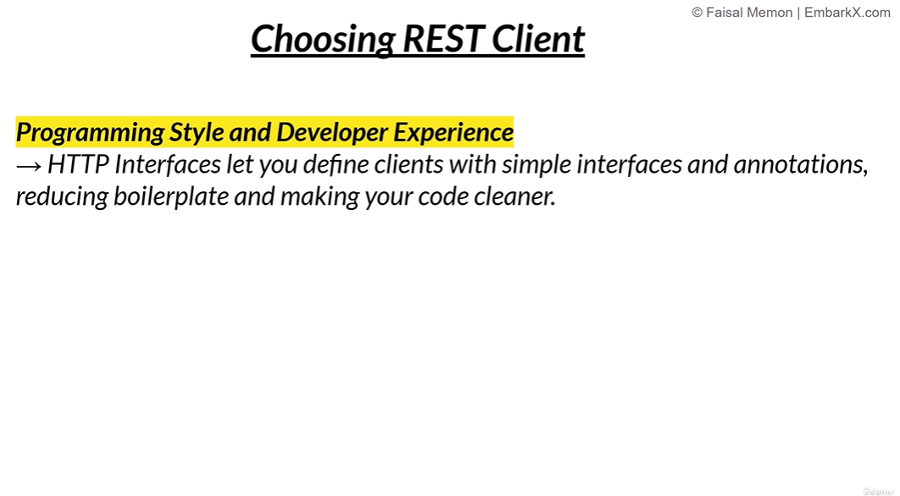
4) 
5) 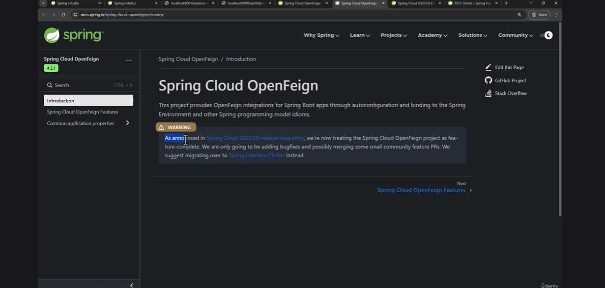
6) 