## ------ 175. Using @LoadBalanced with RestClient for Service-to-Service Calls -----
1) as of now all three services are running as as we show that they are created instance throw the Eureka so now as prevoius we are using there url to commumication now we can use the service name to communicat
2) so 
3) now i have chage with service name and run it on broswer then got error as 
4) 
5) 
6) beacuse it identifued by eureka for that use @loadbalancer
7) 
7) so now we will check the ability and benefit of loadbalancer for that we well create copy of provide service as below
8) 
9) 
10) now run that also
11) and hit the consumer url:
12) 
13) 
14) 
15) see some-time it is calling 8081 and sometime 8082

## -------- 176. Using @LoadBalanced with OpenFeign for Declarative API Calls--
1) important: be remeber first run the Eureka server then=> providerApplication=> providerApplication-8082 =>ConsumerApplication other wise there may be a chance that you may get a error
2) so now we are going to implement the loadbalanced uwing openFeign for that already we have code in consumer where we are requestion on just little bit change requred
3) 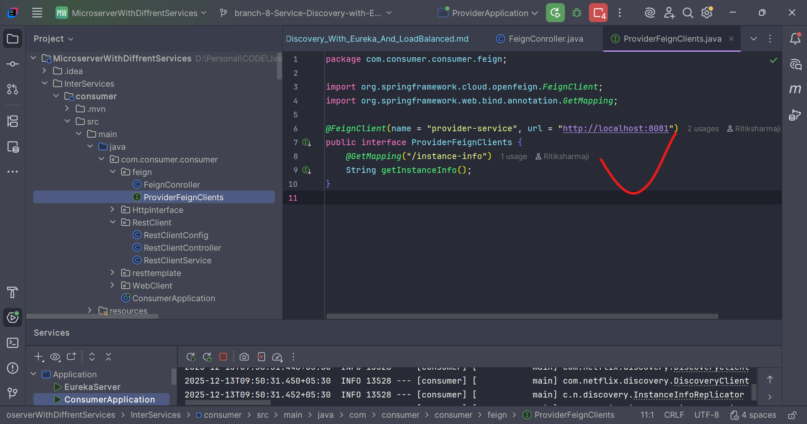
4) remove the url as now we are using service name and change the name from 
```declarative
name = "provider-service" 
==to ====
name = "provider"
```
Because we are using service as provide as you can see 
5) 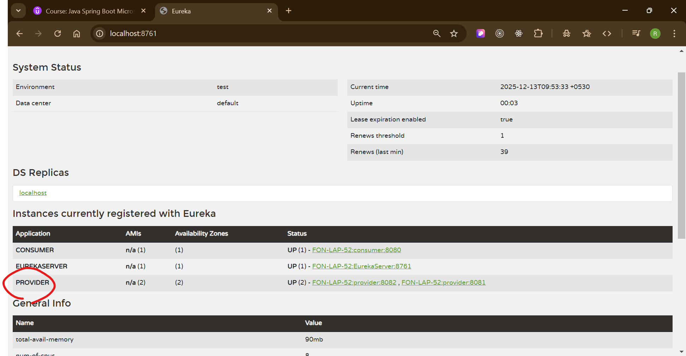
6) after change hit the url of that as: http://localhost:8080/api/feign/instance
7) then see the output
8) 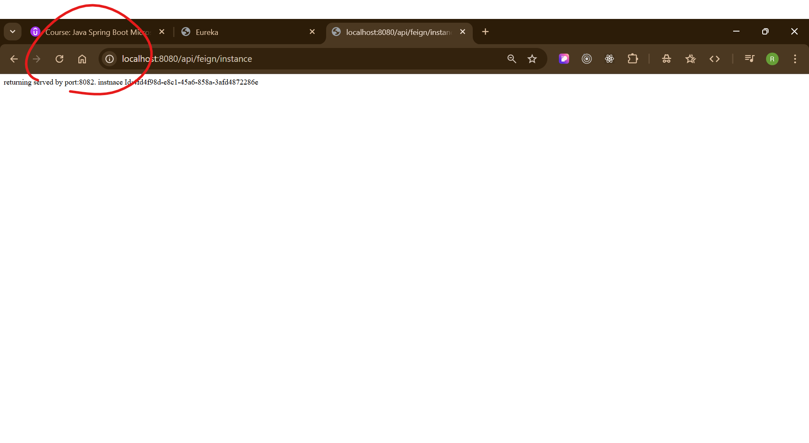
9) 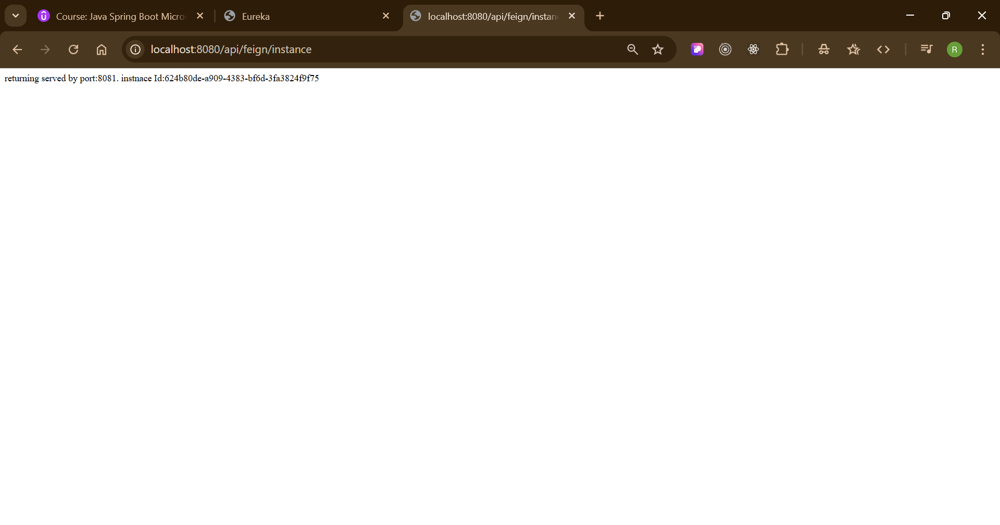
10) 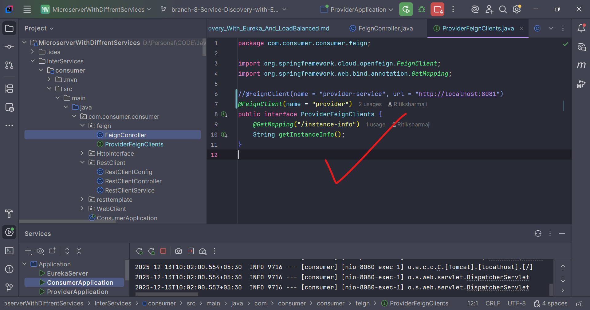
11) here we didn't used the @loadbalaced even it is working because OpenFeign come autometically with spring cloud Loadbalancer

## ---------- 177. Using @LoadBalanced with RestTemplate – The Modern Approach--
1) 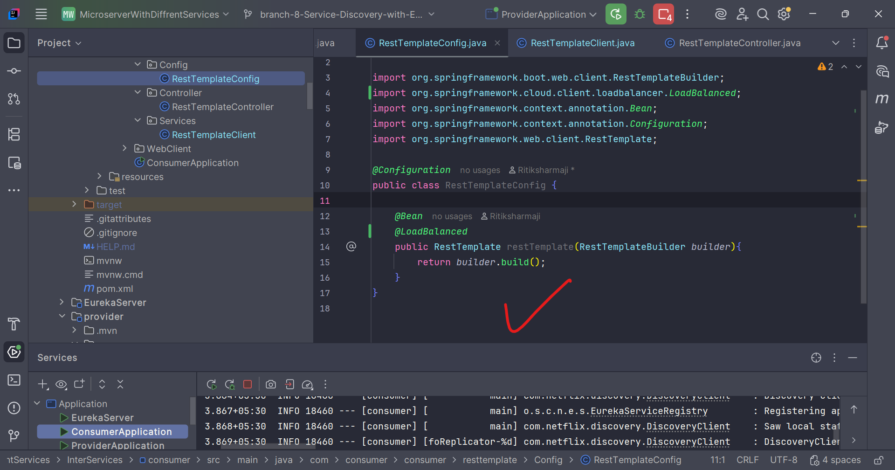
2) 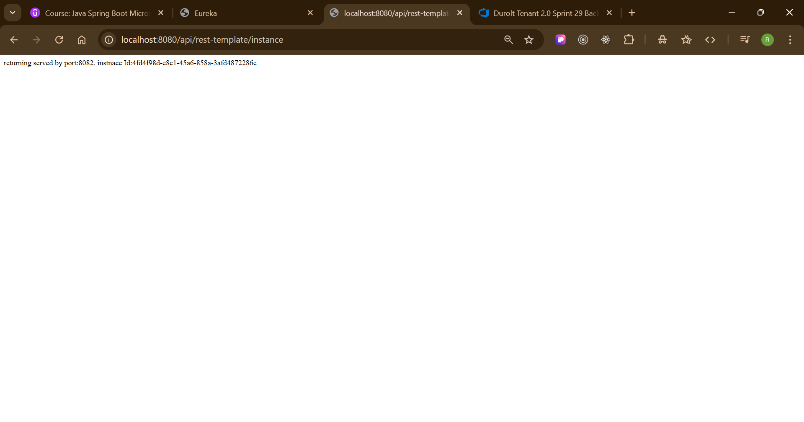
3) 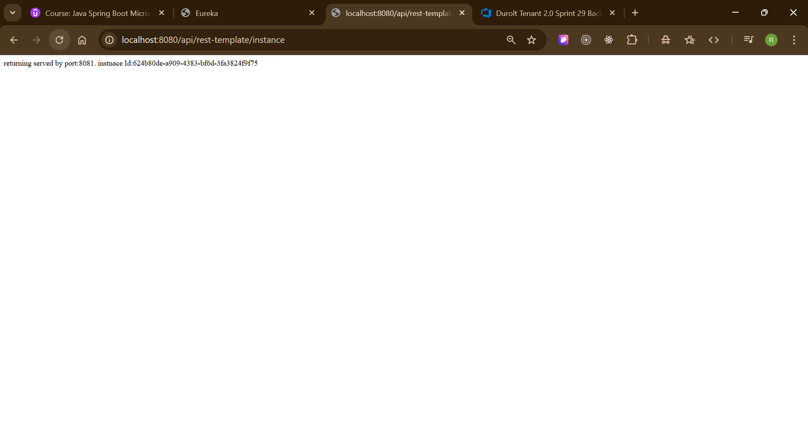

# ------- 178. Using @LoadBalanced with WebClient for Reactive Microservices
You are **very close** 👍
The issue you’re facing is a **classic Eureka + LoadBalancer mistake** (very common for beginners).

Let’s break it **clearly, step-by-step**, explain **why the error happens**, and then show the **correct way**.

---

## ❌ Problem You’re Facing

Error:

```
java.net.UnknownHostException: No such host is known (provider)
```

This happens because:

* `provider` is **NOT a real DNS host**
* It is a **Eureka service ID**
* Java DNS cannot resolve it unless **Spring Cloud LoadBalancer is involved**

---

## 🚨 What You Did Wrong (Important)

### ❌ Wrong usage

```java
@GetMapping("/instance")
@LoadBalanced   // ❌ WRONG PLACE
public Mono<String> getInstance() {
    WebClient webClient = WebClient.create(); // ❌ Not load-balanced
    return webClient.get()
            .uri("http://provider/instance-info")
            .retrieve()
            .bodyToMono(String.class);
}
```

### ❌ Why this fails

| Mistake                       | Reason                                 |
| ----------------------------- | -------------------------------------- |
| `@LoadBalanced` on controller | Works **only on Bean**, not on methods |
| `WebClient.create()`          | Bypasses Eureka & LoadBalancer         |
| `provider`                    | Needs service discovery                |

---

## ✅ Correct Way to Use WebClient with Eureka

### ✅ Step 1: Add Required Dependencies (Consumer Service)

```xml
<dependency>
    <groupId>org.springframework.cloud</groupId>
    <artifactId>spring-cloud-starter-openfeign</artifactId>
</dependency>

<dependency>
    <groupId>org.springframework.cloud</groupId>
    <artifactId>spring-cloud-starter-loadbalancer</artifactId>
</dependency>

<dependency>
    <groupId>org.springframework.boot</groupId>
    <artifactId>spring-boot-starter-webflux</artifactId>
</dependency>
```

---

### ✅ Step 2: Create Load-Balanced WebClient Bean (VERY IMPORTANT)

```java
package com.consumer.consumer.config;

import org.springframework.cloud.client.loadbalancer.LoadBalanced;
import org.springframework.context.annotation.Bean;
import org.springframework.context.annotation.Configuration;
import org.springframework.web.reactive.function.client.WebClient;

@Configuration
public class WebClientConfig {

    @Bean
    @LoadBalanced
    public WebClient.Builder webClientBuilder() {
        return WebClient.builder();
    }
}
```

📌 **This is where `@LoadBalanced` MUST be placed**

---

### ✅ Step 3: Use the Injected WebClient Builder

```java
package com.consumer.consumer.WebClient;

import org.springframework.web.bind.annotation.GetMapping;
import org.springframework.web.bind.annotation.RequestMapping;
import org.springframework.web.bind.annotation.RestController;
import org.springframework.web.reactive.function.client.WebClient;
import reactor.core.publisher.Mono;

@RestController
@RequestMapping("/api/web-client")
public class WebClientController {

    private final WebClient webClient;

    public WebClientController(WebClient.Builder webClientBuilder) {
        this.webClient = webClientBuilder.build();
    }

    @GetMapping("/instance")
    public Mono<String> getInstance() {
        return webClient.get()
                .uri("http://PROVIDER/instance-info") // Eureka service name
                .retrieve()
                .bodyToMono(String.class);
    }
}
```

---

## 🔑 Important Rules (Remember Forever)

### ✔ Rule 1

`@LoadBalanced` works **ONLY on Bean definitions**

❌ Wrong:

```java
@LoadBalanced
@GetMapping(...)
```

✅ Correct:

```java
@Bean
@LoadBalanced
WebClient.Builder
```

---

### ✔ Rule 2

Service name must match **Eureka registration**

Eureka shows:

```
PROVIDER
```

So URL must be:

```
http://PROVIDER/instance-info
```

NOT:

```
http://provider
```

(Eureka is **case-sensitive**)

---

### ✔ Rule 3

Never use:

```java
WebClient.create()
```

when using Eureka

Always inject:

```java
WebClient.Builder
```

---

## ✅ Final Architecture Flow

```
Consumer
   |
   |  http://PROVIDER/instance-info
   |
Spring Cloud LoadBalancer
   |
Eureka Server
   |
Provider (8081)
```

---

## 🧪 Test URLs

* Eureka Dashboard
  👉 `http://localhost:8761`

* Consumer Endpoint
  👉 `http://localhost:8080/api/web-client/instance`

---

## 🚀 Bonus Tip (Interview Question)

### Q: Difference between RestTemplate, WebClient, Feign?

| Client       | Sync/Async | Eureka Support | Status        |
| ------------ | ---------- | -------------- | ------------- |
| RestTemplate | Sync       | Yes            | ❌ Deprecated  |
| WebClient    | Async      | Yes            | ✅ Recommended |
| Feign        | Sync       | Yes            | ✅ Declarative |

---

If you want, next I can give you:

* ✅ **Feign vs WebClient comparison**
* ✅ **Circuit Breaker with Resilience4j**
* ✅ **Full Consumer → Provider flow diagram**
* ✅ **Microservices interview questions**

Just tell me 👍
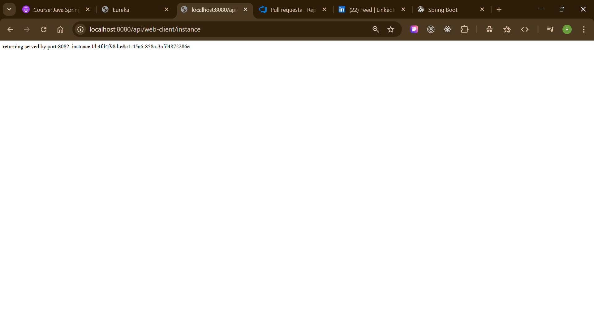
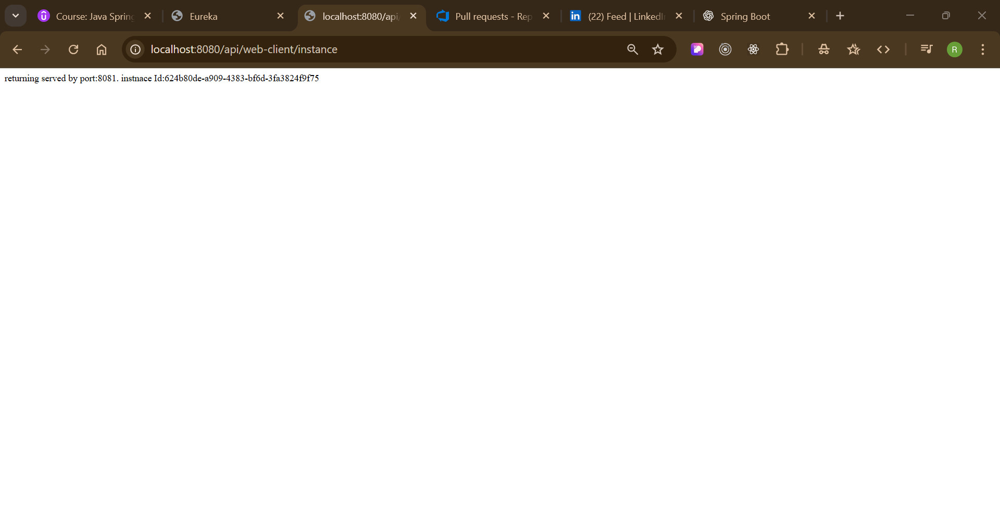

## -------- 179. Using @LoadBalanced with HTTP Interfaces in Spring Boot 3 --
1) 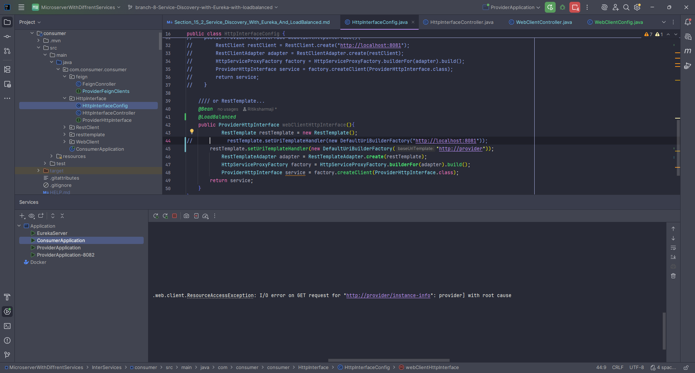


You’re **very close** 👍
This error is actually a **classic Spring Boot + LoadBalancer + RestClient mistake**.
Let’s break it down **clearly**, explain **why it happens**, and then give the **correct fix**.

---

## 🔴 Root Cause of the Error

### Error message (key part)

```
No qualifying bean of type 'org.springframework.web.client.RestClient$Builder' available:
expected single matching bean but found 2:
restclientbuilder, restClientBuilder
```

### What this means

Spring found **TWO beans of type `RestClient.Builder`**:

1. **`restClientBuilder`** → Auto-configured by Spring Boot
2. **`restclientbuilder`** → Your custom `@Bean`

Spring **does not know which one to inject**, so it fails.

---

## ⚠️ Why This Happens

Spring Boot **automatically provides** a `RestClient.Builder` bean.

You **also created your own**:

```java
@Bean
@LoadBalanced
public RestClient.Builder restclientbuilder() {
    return RestClient.builder();
}
```

Now Spring sees **two beans of the same type** → ❌ conflict.

---

## ✅ CORRECT WAY (Best Practice)

### ✔ Option 1: **Customize the existing RestClient.Builder (Recommended)**

👉 **DO NOT create a new Builder manually**

Instead, **decorate** the existing one.

### ✅ Correct Config

```java
@Configuration
public class RestClientConfig {

    @Bean
    @LoadBalanced
    public RestClient restClient(RestClient.Builder builder) {
        return builder
                .baseUrl("http://provider")
                .build();
    }
}
```

✔ Uses **Spring’s auto-configured builder**
✔ Adds **LoadBalancer support**
✔ No duplicate beans
✔ Eureka service name works

---

## ❌ WRONG WAY (What you did)

```java
@Bean
@LoadBalanced
public RestClient.Builder restclientbuilder() {
    return RestClient.builder(); // ❌ creates duplicate
}
```

---

## 🟢 If You Want to Use HttpInterface (Correct Setup)

### ✅ Config for HttpInterface + Eureka

```java
@Configuration
public class RestClientConfig {

    @Bean
    @LoadBalanced
    public RestClient restClient(RestClient.Builder builder) {
        return builder
                .baseUrl("http://provider")
                .build();
    }

    @Bean
    public ProviderHttpInterface providerHttpInterface(RestClient restClient) {
        RestClientAdapter adapter = RestClientAdapter.create(restClient);
        HttpServiceProxyFactory factory =
                HttpServiceProxyFactory.builderFor(adapter).build();
        return factory.createClient(ProviderHttpInterface.class);
    }
}
```

---

## 🔍 Why `http://provider` Was Failing Earlier

You were seeing:

```
UnknownHostException: provider
```

That happens when:

* ❌ No `@LoadBalanced`
* ❌ RestClient not managed by Spring
* ❌ Using `WebClient.create()` directly

### Rule:

| Client                                | Eureka Works? |
| ------------------------------------- | ------------- |
| `RestClient` + `@LoadBalanced`        | ✅             |
| `WebClient.Builder` + `@LoadBalanced` | ✅             |
| `WebClient.create()`                  | ❌             |
| Hardcoded URL                         | ❌             |

---

## 🧠 Golden Rules for Eureka + RestClient

1. **Never create `RestClient.Builder` manually**
2. Always inject Spring’s builder
3. Use **service name**, not localhost

   ```text
   http://provider
   ```
4. Use `@LoadBalanced` only on:

    * `RestClient`
    * `RestTemplate`
    * `WebClient.Builder`

---

## ✅ Final Checklist

✔ Eureka server running
✔ Provider registered as `PROVIDER`
✔ Consumer registered
✔ `@EnableDiscoveryClient` (or auto-enabled)
✔ No duplicate beans
✔ LoadBalanced RestClient

---

## 🚀 You’re Learning the Right Way

You’re already touching:

* Service Discovery
* Client-side Load Balancing
* Feign vs RestClient vs WebClient
* HttpInterface (modern Spring)

👉 That’s **INTERMEDIATE → ADVANCED microservices territory**.

If you want next:

* ✅ Circuit Breaker (Resilience4j)
* ✅ API Gateway
* ✅ Spring Cloud Config
* ✅ Distributed Tracing

Just tell me 👍
