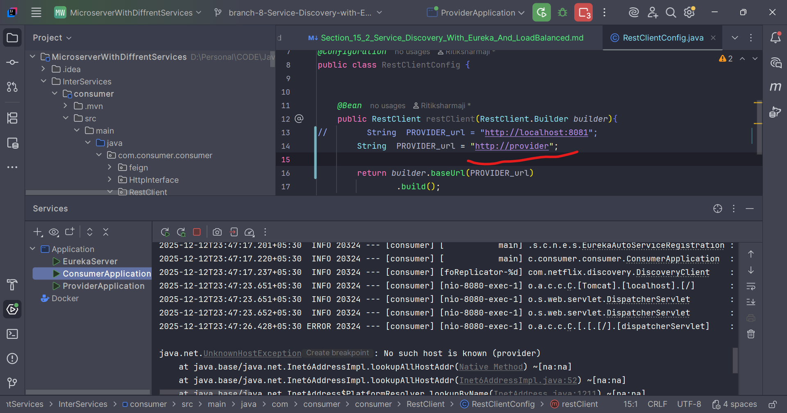
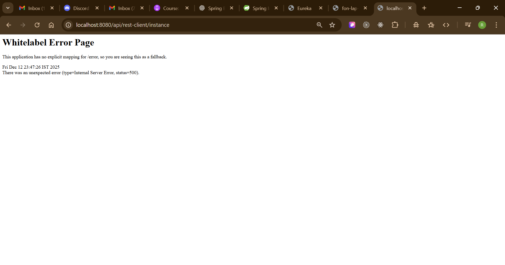
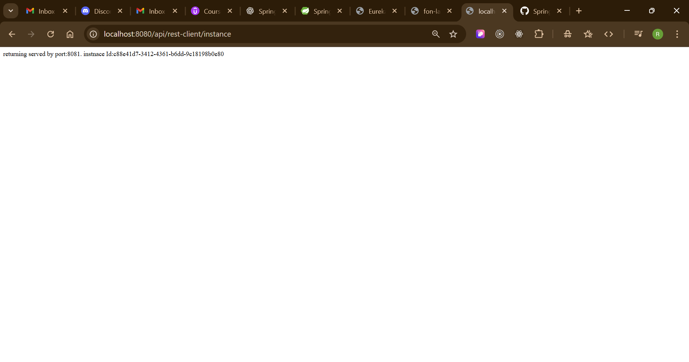
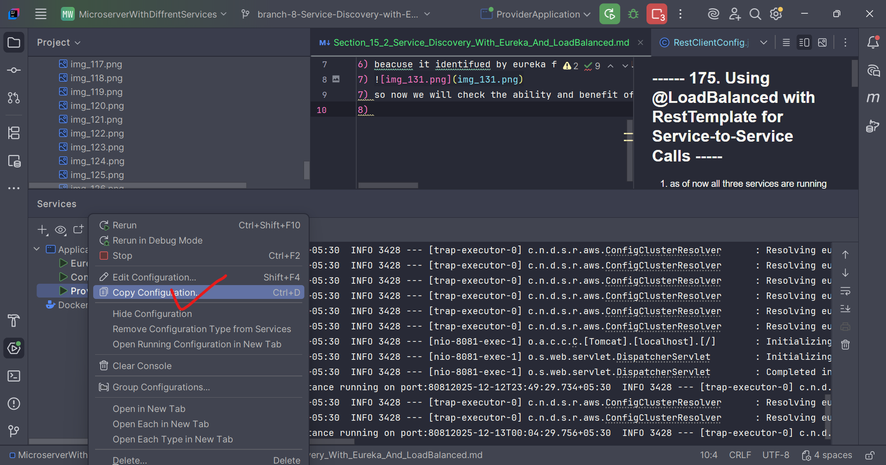
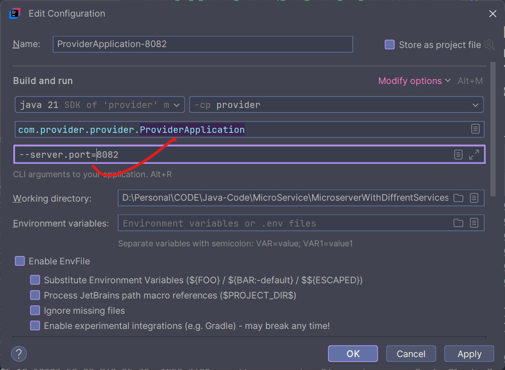
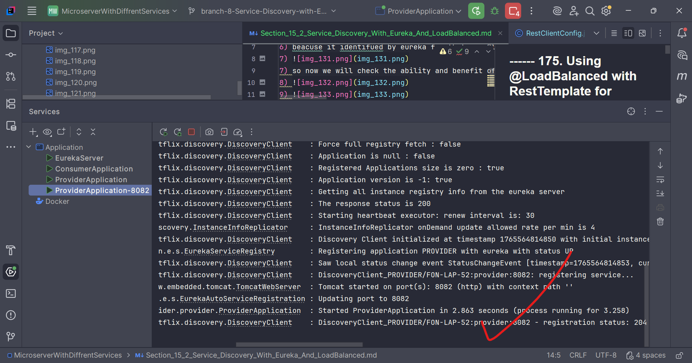
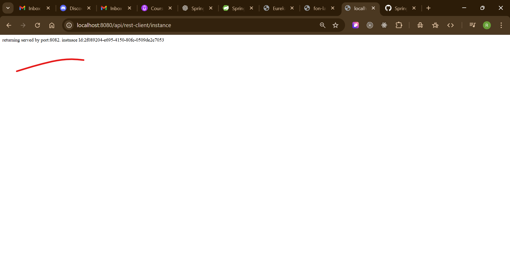

## ------ 175. Using @LoadBalanced with RestTemplate for Service-to-Service Calls -----
1) as of now all three services are running as as we show that they are created instance throw the Eureka so now as prevoius we are using there url to commumication now we can use the service name to communicat
2) so 
3) now i have chage with service name and run it on broswer then got error as 
4) 
5) 
6) beacuse it identifued by eureka for that use @loadbalancer
7) 
7) so now we will check the ability and benefit of loadbalancer for that we well create copy of provide service as below
8) 
9) 
10) now run that also
11) and hit the consumer url:
12) 
13) 
14) 
15) see some-time it is calling 8081 and sometime 8082
16) 