## ------ 175. Using @LoadBalanced with RestClient for Service-to-Service Calls -----
1) as of now all three services are running as as we show that they are created instance throw the Eureka so now as prevoius we are using there url to commumication now we can use the service name to communicat
2) so 
3) now i have chage with service name and run it on broswer then got error as 
4) 
5) 
6) beacuse it identifued by eureka for that use @loadbalancer
7) 
7) so now we will check the ability and benefit of loadbalancer for that we well create copy of provide service as below
8) 
9) 
10) now run that also
11) and hit the consumer url:
12) 
13) 
14) 
15) see some-time it is calling 8081 and sometime 8082

## -------- 176. Using @LoadBalanced with OpenFeign for Declarative API Calls--
1) important: be remeber first run the Eureka server then=> providerApplication=> providerApplication-8082 =>ConsumerApplication other wise there may be a chance that you may get a error
2) so now we are going to implement the loadbalanced uwing openFeign for that already we have code in consumer where we are requestion on just little bit change requred
3) 
4) remove the url as now we are using service name and change the name from 
```declarative
name = "provider-service" 
==to ====
name = "provider"
```
Because we are using service as provide as you can see 
5) 
6) after change hit the url of that as: http://localhost:8080/api/feign/instance
7) then see the output
8) 
9) 
10) 
11) here we didn't used the @loadbalaced even it is working because OpenFeign come autometically with spring cloud Loadbalancer

## ---------- 177. Using @LoadBalanced with RestTemplate – The Modern Approach--
1) 
2) 
3) 

# ------- 178. Using @LoadBalanced with WebClient for Reactive Microservices
You are **very close** 👍
The issue you’re facing is a **classic Eureka + LoadBalancer mistake** (very common for beginners).

Let’s break it **clearly, step-by-step**, explain **why the error happens**, and then show the **correct way**.

---

## ❌ Problem You’re Facing

Error:

```
java.net.UnknownHostException: No such host is known (provider)
```

This happens because:

* `provider` is **NOT a real DNS host**
* It is a **Eureka service ID**
* Java DNS cannot resolve it unless **Spring Cloud LoadBalancer is involved**

---

## 🚨 What You Did Wrong (Important)

### ❌ Wrong usage

```java
@GetMapping("/instance")
@LoadBalanced   // ❌ WRONG PLACE
public Mono<String> getInstance() {
    WebClient webClient = WebClient.create(); // ❌ Not load-balanced
    return webClient.get()
            .uri("http://provider/instance-info")
            .retrieve()
            .bodyToMono(String.class);
}
```

### ❌ Why this fails

| Mistake                       | Reason                                 |
| ----------------------------- | -------------------------------------- |
| `@LoadBalanced` on controller | Works **only on Bean**, not on methods |
| `WebClient.create()`          | Bypasses Eureka & LoadBalancer         |
| `provider`                    | Needs service discovery                |

---

## ✅ Correct Way to Use WebClient with Eureka

### ✅ Step 1: Add Required Dependencies (Consumer Service)

```xml
<dependency>
    <groupId>org.springframework.cloud</groupId>
    <artifactId>spring-cloud-starter-openfeign</artifactId>
</dependency>

<dependency>
    <groupId>org.springframework.cloud</groupId>
    <artifactId>spring-cloud-starter-loadbalancer</artifactId>
</dependency>

<dependency>
    <groupId>org.springframework.boot</groupId>
    <artifactId>spring-boot-starter-webflux</artifactId>
</dependency>
```

---

### ✅ Step 2: Create Load-Balanced WebClient Bean (VERY IMPORTANT)

```java
package com.consumer.consumer.config;

import org.springframework.cloud.client.loadbalancer.LoadBalanced;
import org.springframework.context.annotation.Bean;
import org.springframework.context.annotation.Configuration;
import org.springframework.web.reactive.function.client.WebClient;

@Configuration
public class WebClientConfig {

    @Bean
    @LoadBalanced
    public WebClient.Builder webClientBuilder() {
        return WebClient.builder();
    }
}
```

📌 **This is where `@LoadBalanced` MUST be placed**

---

### ✅ Step 3: Use the Injected WebClient Builder

```java
package com.consumer.consumer.WebClient;

import org.springframework.web.bind.annotation.GetMapping;
import org.springframework.web.bind.annotation.RequestMapping;
import org.springframework.web.bind.annotation.RestController;
import org.springframework.web.reactive.function.client.WebClient;
import reactor.core.publisher.Mono;

@RestController
@RequestMapping("/api/web-client")
public class WebClientController {

    private final WebClient webClient;

    public WebClientController(WebClient.Builder webClientBuilder) {
        this.webClient = webClientBuilder.build();
    }

    @GetMapping("/instance")
    public Mono<String> getInstance() {
        return webClient.get()
                .uri("http://PROVIDER/instance-info") // Eureka service name
                .retrieve()
                .bodyToMono(String.class);
    }
}
```

---

## 🔑 Important Rules (Remember Forever)

### ✔ Rule 1

`@LoadBalanced` works **ONLY on Bean definitions**

❌ Wrong:

```java
@LoadBalanced
@GetMapping(...)
```

✅ Correct:

```java
@Bean
@LoadBalanced
WebClient.Builder
```

---

### ✔ Rule 2

Service name must match **Eureka registration**

Eureka shows:

```
PROVIDER
```

So URL must be:

```
http://PROVIDER/instance-info
```

NOT:

```
http://provider
```

(Eureka is **case-sensitive**)

---

### ✔ Rule 3

Never use:

```java
WebClient.create()
```

when using Eureka

Always inject:

```java
WebClient.Builder
```

---

## ✅ Final Architecture Flow

```
Consumer
   |
   |  http://PROVIDER/instance-info
   |
Spring Cloud LoadBalancer
   |
Eureka Server
   |
Provider (8081)
```

---

## 🧪 Test URLs

* Eureka Dashboard
  👉 `http://localhost:8761`

* Consumer Endpoint
  👉 `http://localhost:8080/api/web-client/instance`

---

## 🚀 Bonus Tip (Interview Question)

### Q: Difference between RestTemplate, WebClient, Feign?

| Client       | Sync/Async | Eureka Support | Status        |
| ------------ | ---------- | -------------- | ------------- |
| RestTemplate | Sync       | Yes            | ❌ Deprecated  |
| WebClient    | Async      | Yes            | ✅ Recommended |
| Feign        | Sync       | Yes            | ✅ Declarative |

---

If you want, next I can give you:

* ✅ **Feign vs WebClient comparison**
* ✅ **Circuit Breaker with Resilience4j**
* ✅ **Full Consumer → Provider flow diagram**
* ✅ **Microservices interview questions**

Just tell me 👍


## -------- 179. Using @LoadBalanced with HTTP Interfaces in Spring Boot 3 --
1) 


You’re **very close** 👍
This error is actually a **classic Spring Boot + LoadBalancer + RestClient mistake**.
Let’s break it down **clearly**, explain **why it happens**, and then give the **correct fix**.

---

## 🔴 Root Cause of the Error

### Error message (key part)

```
No qualifying bean of type 'org.springframework.web.client.RestClient$Builder' available:
expected single matching bean but found 2:
restclientbuilder, restClientBuilder
```

### What this means

Spring found **TWO beans of type `RestClient.Builder`**:

1. **`restClientBuilder`** → Auto-configured by Spring Boot
2. **`restclientbuilder`** → Your custom `@Bean`

Spring **does not know which one to inject**, so it fails.

---

## ⚠️ Why This Happens

Spring Boot **automatically provides** a `RestClient.Builder` bean.

You **also created your own**:

```java
@Bean
@LoadBalanced
public RestClient.Builder restclientbuilder() {
    return RestClient.builder();
}
```

Now Spring sees **two beans of the same type** → ❌ conflict.

---

## ✅ CORRECT WAY (Best Practice)

### ✔ Option 1: **Customize the existing RestClient.Builder (Recommended)**

👉 **DO NOT create a new Builder manually**

Instead, **decorate** the existing one.

### ✅ Correct Config

```java
@Configuration
public class RestClientConfig {

    @Bean
    @LoadBalanced
    public RestClient restClient(RestClient.Builder builder) {
        return builder
                .baseUrl("http://provider")
                .build();
    }
}
```

✔ Uses **Spring’s auto-configured builder**
✔ Adds **LoadBalancer support**
✔ No duplicate beans
✔ Eureka service name works

---

## ❌ WRONG WAY (What you did)

```java
@Bean
@LoadBalanced
public RestClient.Builder restclientbuilder() {
    return RestClient.builder(); // ❌ creates duplicate
}
```

---

## 🟢 If You Want to Use HttpInterface (Correct Setup)

### ✅ Config for HttpInterface + Eureka

```java
@Configuration
public class RestClientConfig {

    @Bean
    @LoadBalanced
    public RestClient restClient(RestClient.Builder builder) {
        return builder
                .baseUrl("http://provider")
                .build();
    }

    @Bean
    public ProviderHttpInterface providerHttpInterface(RestClient restClient) {
        RestClientAdapter adapter = RestClientAdapter.create(restClient);
        HttpServiceProxyFactory factory =
                HttpServiceProxyFactory.builderFor(adapter).build();
        return factory.createClient(ProviderHttpInterface.class);
    }
}
```

---

## 🔍 Why `http://provider` Was Failing Earlier

You were seeing:

```
UnknownHostException: provider
```

That happens when:

* ❌ No `@LoadBalanced`
* ❌ RestClient not managed by Spring
* ❌ Using `WebClient.create()` directly

### Rule:

| Client                                | Eureka Works? |
| ------------------------------------- | ------------- |
| `RestClient` + `@LoadBalanced`        | ✅             |
| `WebClient.Builder` + `@LoadBalanced` | ✅             |
| `WebClient.create()`                  | ❌             |
| Hardcoded URL                         | ❌             |

---

## 🧠 Golden Rules for Eureka + RestClient

1. **Never create `RestClient.Builder` manually**
2. Always inject Spring’s builder
3. Use **service name**, not localhost

   ```text
   http://provider
   ```
4. Use `@LoadBalanced` only on:

    * `RestClient`
    * `RestTemplate`
    * `WebClient.Builder`

---

## ✅ Final Checklist

✔ Eureka server running
✔ Provider registered as `PROVIDER`
✔ Consumer registered
✔ `@EnableDiscoveryClient` (or auto-enabled)
✔ No duplicate beans
✔ LoadBalanced RestClient

---

## 🚀 You’re Learning the Right Way

You’re already touching:

* Service Discovery
* Client-side Load Balancing
* Feign vs RestClient vs WebClient
* HttpInterface (modern Spring)

👉 That’s **INTERMEDIATE → ADVANCED microservices territory**.

If you want next:

* ✅ Circuit Breaker (Resilience4j)
* ✅ API Gateway
* ✅ Spring Cloud Config
* ✅ Distributed Tracing

Just tell me 👍

You’re almost there 👍
Let’s clean this up **properly** and show **both correct ways** (with and without Eureka / LoadBalancer), and also explain **why your earlier errors happened**.

---

## 1️⃣ Problem in your current code

You wrote:

```java
//  WebClient...
public WebClient webClientnew(){

}
```

This method:

* has **no return**
* is **not a @Bean**
* does not configure load balancing

Also, when using **Eureka service name (`http://provider`)**, **plain `WebClient.create()` will NOT work** unless you use **Spring Cloud LoadBalancer**.

---

## 2️⃣ Correct Way (WITHOUT Eureka – hardcoded URL)

Use this if you are calling:

```
http://localhost:8081
```

### ✅ WebClient + HttpInterface (No LoadBalancer)

```java
@Configuration
public class WebClientConfig {

    @Bean
    public WebClient webClient() {
        return WebClient.builder()
                .baseUrl("http://localhost:8081")
                .build();
    }

    @Bean
    public ProviderHttpInterface webClientHttpInterface(WebClient webClient) {

        WebClientAdapter adapter = WebClientAdapter.create(webClient);

        HttpServiceProxyFactory factory =
                HttpServiceProxyFactory.builderFor(adapter).build();

        return factory.createClient(ProviderHttpInterface.class);
    }
}
```

✔ Works **without Eureka**
✔ Simple and clean

---

## 3️⃣ Correct Way (WITH Eureka – service name `provider`)

Since your Eureka dashboard shows:

```
PROVIDER  UP  provider:8081
```

You **must use LoadBalancer**.

---

### ✅ Dependencies (IMPORTANT)

```xml
<dependency>
    <groupId>org.springframework.cloud</groupId>
    <artifactId>spring-cloud-starter-loadbalancer</artifactId>
</dependency>

<dependency>
    <groupId>org.springframework.boot</groupId>
    <artifactId>spring-boot-starter-webflux</artifactId>
</dependency>
```

---

### ✅ LoadBalanced WebClient + HttpInterface

```java
@Configuration
public class WebClientConfig {

    @Bean
    @LoadBalanced
    public WebClient.Builder webClientBuilder() {
        return WebClient.builder();
    }

    @Bean
    public ProviderHttpInterface webClientHttpInterface(
            WebClient.Builder webClientBuilder) {

        WebClient webClient = webClientBuilder
                .baseUrl("http://provider") // Eureka service name
                .build();

        WebClientAdapter adapter = WebClientAdapter.create(webClient);

        HttpServiceProxyFactory factory =
                HttpServiceProxyFactory.builderFor(adapter).build();

        return factory.createClient(ProviderHttpInterface.class);
    }
}
```

✔ Uses **Eureka**
✔ Uses **LoadBalancer**
✔ No `UnknownHostException`

---

## 4️⃣ Provider Http Interface (Correct)

```java
@HttpExchange
public interface ProviderHttpInterface {

    @GetExchange("/instance-info")
    String getInstanceInfo();
}
```

---

## 5️⃣ Why you were getting `UnknownHostException`

```
No such host is known (provider)
```

Because:

❌ `WebClient.create("http://provider")`
❌ No LoadBalancer
❌ JVM tried DNS lookup instead of Eureka

✅ **Fix:** `@LoadBalanced WebClient.Builder`

---

## 6️⃣ Rule of Thumb (IMPORTANT)

| Client Type   | Eureka Required?  | Annotation                        |
| ------------- | ----------------- | --------------------------------- |
| RestTemplate  | Yes               | `@LoadBalanced`                   |
| WebClient     | Yes               | `@LoadBalanced WebClient.Builder` |
| Feign         | Yes               | Built-in                          |
| HttpInterface | Depends on client | LoadBalanced builder              |

---

## 7️⃣ Recommendation (BEST PRACTICE)

For **Spring Boot 3.x + Microservices**:

1️⃣ **Feign Client** → declarative & simplest
2️⃣ **Http Interface + WebClient** → modern & reactive
3️⃣ **RestTemplate** → ❌ deprecated

---

If you want next, I can give you:

* ✅ **One single project structure**
* ✅ **Which client to use when**
* ✅ **Complete Consumer → Provider flow**
* ✅ **Diagram of Eureka + LoadBalancer**

Just tell me 👍

## ----------181: Gracefully Shutting Down Registered Microservices in Eureka --------
1) when we register a service to eureka then to un-register it is not going to unregister(shutting down) the instance directry from eureka 
2) now we need to add the dependeies of actuater to consumer
3) 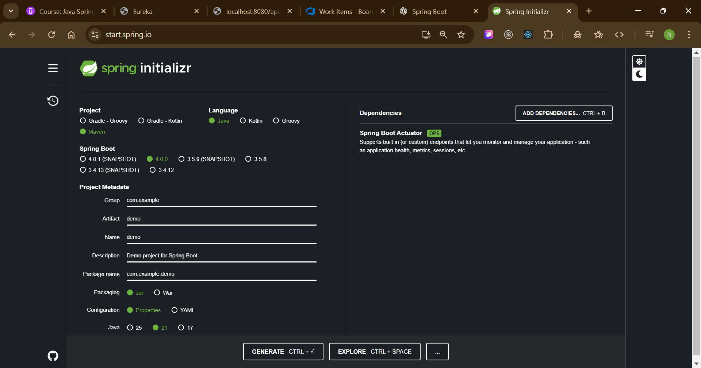
```declarative
    <dependency>
      <groupId>org.springframework.boot</groupId>
      <artifactId>spring-boot-starter-actuator</artifactId>
    </dependency>
```
4) then we need to expose the shutdowm end point throw the application.propertes
```declarative
management.endpoints.web.exposure.include=shutdown
management.endpoint.shutdown.enabled=true
```
5) 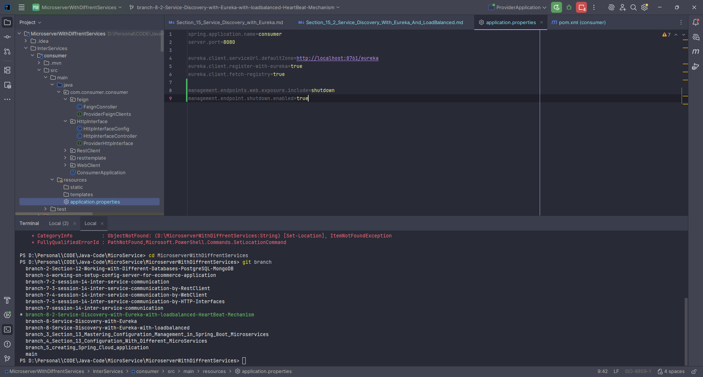
6) the request mus t be post requred to shutdown it
7) 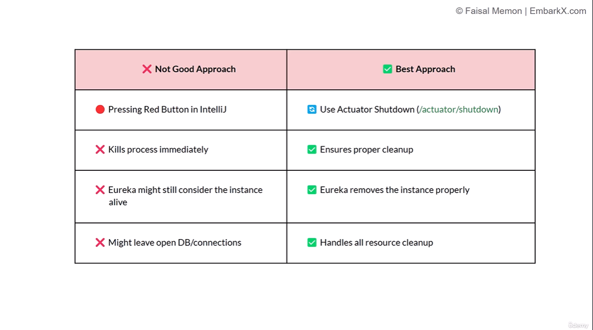
8) 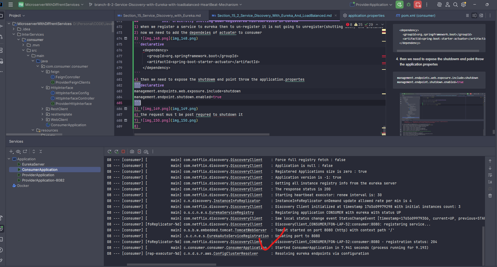
9) 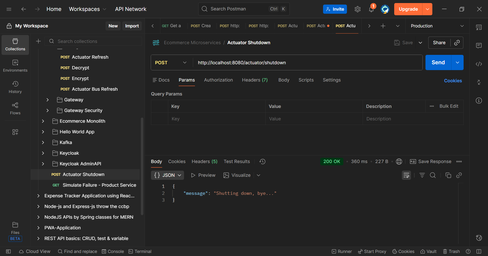
10) 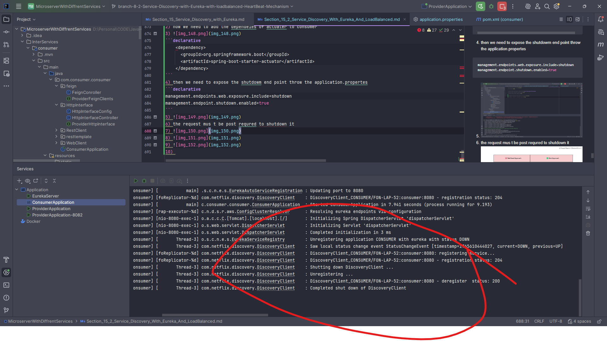
    Here’s a **clear, practical, and exam/interview-ready explanation** of **Gracefully Shutting Down Registered Microservices in Eureka**, explained step-by-step and aligned with **Spring Boot + Eureka** 👇

---

# Graceful Shutdown of Microservices in Eureka

## 1️⃣ What is Graceful Shutdown?

**Graceful shutdown** means:

> When a microservice is stopped, it:

* Stops accepting **new requests**
* Completes **in-flight requests**
* **De-registers itself from Eureka**
* Shuts down **cleanly without errors**

This prevents:

* Failed requests
* Load balancer sending traffic to dead instances
* 5xx errors in production

---

## 2️⃣ What Happens Without Graceful Shutdown?

❌ Service is killed abruptly
❌ Eureka still thinks service is **UP**
❌ Other services try calling it
❌ Results in `Connection refused` / `UnknownHost` / `5xx errors`

---

## 3️⃣ Eureka & Instance Lifecycle

### Normal Flow

```
START SERVICE
   ↓
REGISTER WITH EUREKA
   ↓
SERVE REQUESTS
   ↓
SHUTDOWN
   ↓
DEREGISTER FROM EUREKA
```

### Eureka has **lease-based registration**

* Instance sends **heartbeat** every 30s
* If no heartbeat → instance marked **DOWN** after timeout

Graceful shutdown **forces immediate deregistration**

---

## 4️⃣ Enable Graceful Shutdown in Spring Boot (IMPORTANT)

### ✅ application.yml

```yaml
server:
  shutdown: graceful

spring:
  lifecycle:
    timeout-per-shutdown-phase: 30s
```

This tells Spring:

* Stop accepting traffic
* Wait up to 30 seconds to finish requests

---

## 5️⃣ Tell Eureka to Deregister Immediately

### ✅ application.yml

```yaml
eureka:
  instance:
    lease-renewal-interval-in-seconds: 10
    lease-expiration-duration-in-seconds: 30
```

This ensures:

* Faster heartbeat
* Faster removal if service stops

---

## 6️⃣ Shutdown Hook (Very Important)

Spring Boot already supports shutdown hooks, but Eureka needs explicit handling.

### ✅ Use `@PreDestroy`

```java
@Component
public class EurekaShutdownHook {

    private final EurekaClient eurekaClient;

    public EurekaShutdownHook(EurekaClient eurekaClient) {
        this.eurekaClient = eurekaClient;
    }

    @PreDestroy
    public void onShutdown() {
        System.out.println("Deregistering from Eureka...");
        eurekaClient.shutdown();
    }
}
```

✔ This ensures **Eureka removes the instance immediately**

---

## 7️⃣ Using Actuator for Graceful Shutdown

### Add dependency

```xml
<dependency>
  <groupId>org.springframework.boot</groupId>
  <artifactId>spring-boot-starter-actuator</artifactId>
</dependency>
```

### Enable shutdown endpoint

```yaml
management:
  endpoints:
    web:
      exposure:
        include: shutdown
  endpoint:
    shutdown:
      enabled: true
```

### Trigger shutdown

```bash
POST http://localhost:8080/actuator/shutdown
```

✔ Graceful
✔ Deregisters from Eureka
✔ No broken requests

---

## 8️⃣ Load Balancer + Graceful Shutdown

Spring Cloud LoadBalancer respects:

* Instance status
* Eureka registry updates

So once deregistered:

```
LoadBalancer ❌ will NOT route traffic
```

---

## 9️⃣ Kubernetes / Docker Consideration (REAL WORLD)

### Kubernetes sends `SIGTERM`

Spring Boot:

* Catches signal
* Starts graceful shutdown
* Deregisters from Eureka
* Waits for timeout
* Then exits

### Docker

```dockerfile
STOPSIGNAL SIGTERM
```

---

## 🔟 Best Practices (Interview GOLD ⭐)

✅ Always enable graceful shutdown
✅ Always use actuator shutdown or SIGTERM
✅ Reduce Eureka lease expiration time
✅ Avoid `kill -9`
✅ Monitor shutdown with logs
✅ Use readiness/liveness probes (K8s)

---

## 11️⃣ Common Interview Questions

### Q: How does Eureka know a service is down?

**Answer:**
Via missed heartbeats or explicit deregistration during graceful shutdown.

---

### Q: What happens if service crashes?

**Answer:**
Eureka removes it after lease expiration.

---

### Q: Difference between graceful and force shutdown?

| Graceful           | Force          |
| ------------------ | -------------- |
| Completes requests | Drops requests |
| Deregisters        | Eureka waits   |
| Safe               | Risky          |

---

## 12️⃣ Summary

✔ Graceful shutdown avoids downtime
✔ Prevents failed inter-service calls
✔ Essential for production microservices
✔ Eureka + Spring Boot fully supports it

---

If you want next:
👉 **Graceful Shutdown in Kubernetes with Eureka**
👉 **Zero-downtime deployment strategy**
👉 **Rolling updates with Eureka**

Just tell me 👍

## -----------182. Behind the Scenes of Eureka Server Registration Process: HeartBeat Mechanism----
1) 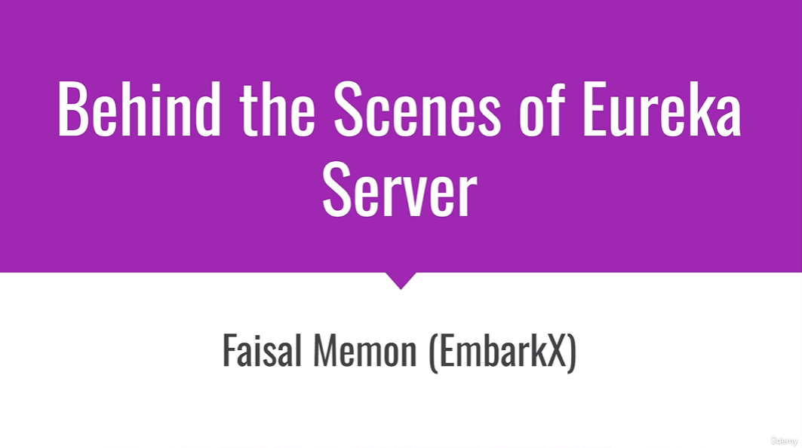
2) 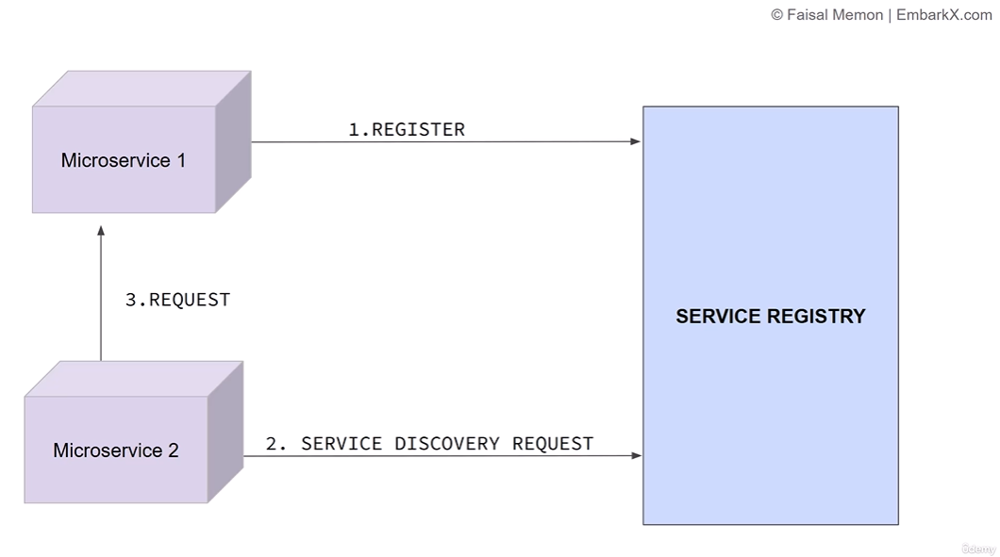
3) 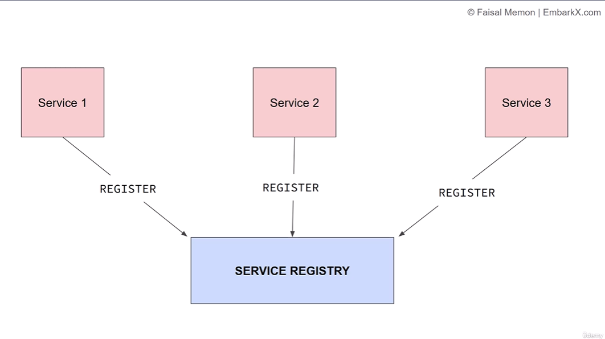
4) 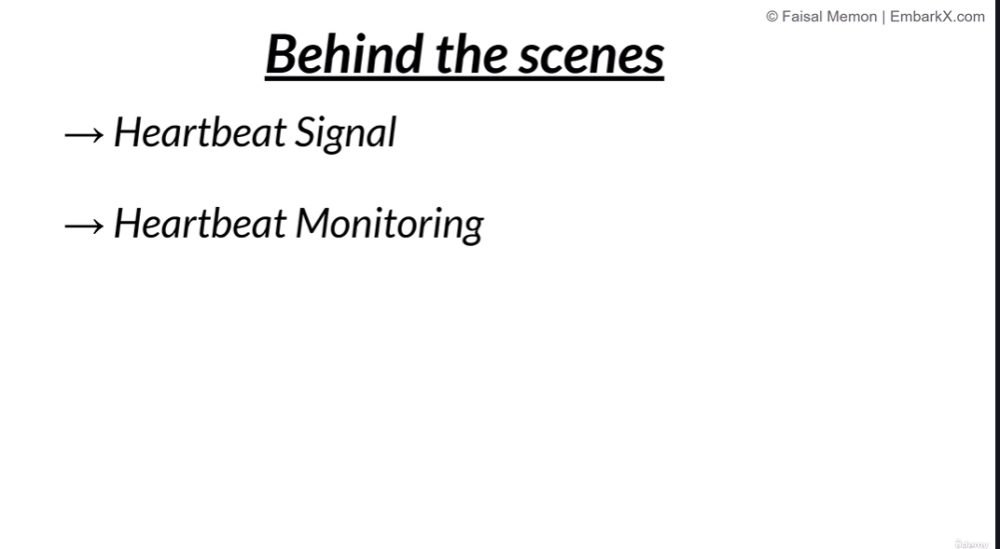
5) to check just stop the eureka and see the error from other services
6) 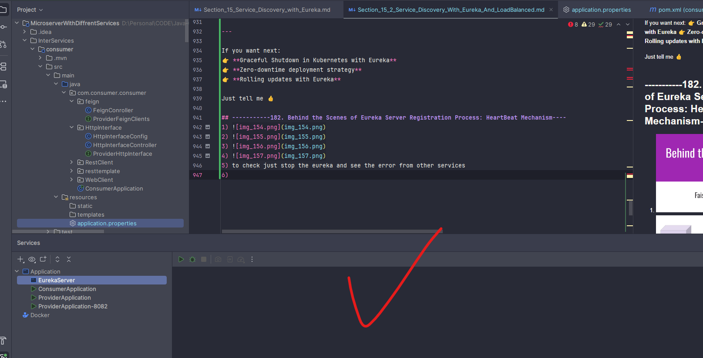
7) 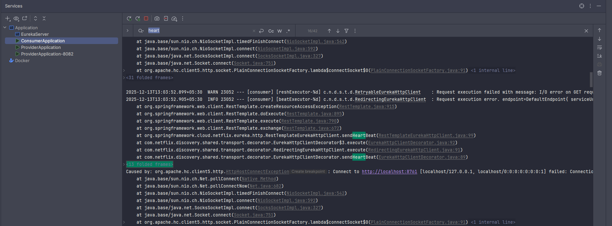
8) 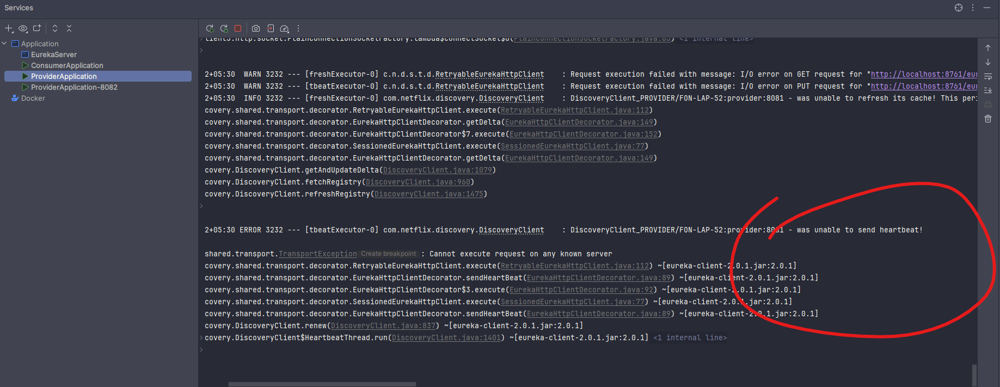
9) so now ones we start the eureka server then after every 30 second all the  instace will try to connect with it 
10) 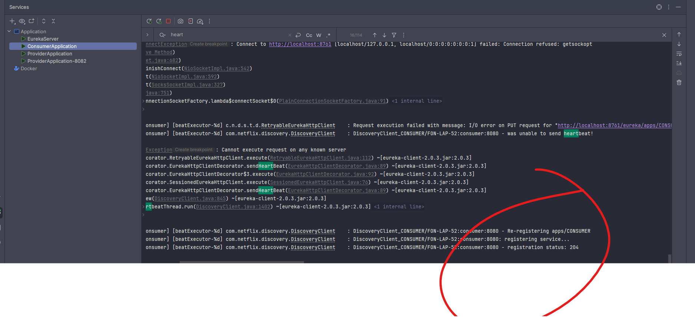

Great topic 👍
This is **core theory** every microservices developer must understand. I’ll explain it **step-by-step**, clearly, and **from inside the system**.

---

# Behind the Scenes of Eureka Server Registration

## 🔁 Heartbeat Mechanism Explained (Deep Dive)

---

## 1️⃣ What is Eureka?

**Eureka** is a **Service Registry** from Netflix (used by Spring Cloud).

It allows:

* Microservices to **register themselves**
* Other services to **discover** them dynamically

Without Eureka:

* Services must hardcode IP/ports ❌
* Scaling becomes painful ❌

---

## 2️⃣ What Happens When a Microservice Starts?

Let’s say **PROVIDER service** starts.

### Step 1: Startup

When the service starts:

* Spring Boot reads `application.yml`
* Sees Eureka configuration

```yaml
eureka:
  client:
    service-url:
      defaultZone: http://localhost:8761/eureka
```

### Step 2: Registration Request

The service sends a **REGISTER** request to Eureka Server:

```
POST /eureka/apps/PROVIDER
```

With details:

* service name
* IP address
* port
* health URL
* instance ID

### Step 3: Eureka Stores Metadata

Eureka stores the instance in its **in-memory registry**:

```
PROVIDER
 └── provider:8081 (UP)
```

Now the service is **discoverable** 🎉

---

## 3️⃣ Why Heartbeat Is Needed?

Imagine:

* Service crashes
* Network disconnects
* Pod dies in Kubernetes

❓ How will Eureka know?

👉 **Heartbeat mechanism**

---

## 4️⃣ What Is Heartbeat?

Heartbeat = **periodic "I am alive" signal** sent by the service to Eureka.

Also called:

* **Renewal**
* **Lease renewal**

---

## 5️⃣ Heartbeat Flow (Very Important)

### ⏱ Default Timings

| Property           | Default    |
| ------------------ | ---------- |
| Heartbeat interval | 30 seconds |
| Lease expiration   | 90 seconds |

---

### Step-by-Step Heartbeat Process

### 🔹 Step 1: Service Sends Heartbeat

Every **30 seconds**, the service sends:

```
PUT /eureka/apps/PROVIDER/{instanceId}
```

Meaning:

> "Hey Eureka, I’m still alive!"

---

### 🔹 Step 2: Eureka Updates Lease

Eureka:

* Resets the **lease timer**
* Keeps service marked as **UP**

---

### 🔹 Step 3: Continuous Renewal

As long as heartbeats arrive:

* Instance remains registered
* Other services can call it

---

## 6️⃣ What If Heartbeat Stops?

### Scenario: Service Crash ❌

* No heartbeat sent
* Eureka waits for **90 seconds**

If no renewal:
➡️ Instance marked **DOWN**
➡️ Eventually **removed from registry**

```
PROVIDER
 ❌ provider:8081 (REMOVED)
```

Now:

* Consumers won’t get this instance
* Load balancer skips it

---

## 7️⃣ Self-Preservation Mode (Critical Concept)

Eureka has a **safety mechanism**.

### What is Self-Preservation?

If Eureka detects **too many missed heartbeats**:

> “This might be a network issue, not service failures”

So Eureka:

* ❌ **Stops evicting instances**
* Keeps registry frozen

This prevents:

* Mass service removal
* Cascading failures

### Log Example:

```
EMERGENCY! EUREKA MAY BE INCORRECTLY CLAIMING INSTANCES ARE UP
```

---

## 8️⃣ Heartbeat Configuration (Spring Boot)

You can tune heartbeat settings:

```yaml
eureka:
  instance:
    lease-renewal-interval-in-seconds: 30
    lease-expiration-duration-in-seconds: 90
```

### For fast failover (dev/testing):

```yaml
lease-renewal-interval-in-seconds: 10
lease-expiration-duration-in-seconds: 30
```

⚠️ **Do NOT use aggressive values in production**

---

## 9️⃣ How Consumers Use Heartbeat Info

Consumers:

* Fetch registry from Eureka
* Cache instances locally
* Refresh periodically

If instance is removed:

* Consumer load balancer stops routing traffic

---

## 🔄 Full Lifecycle Summary

```
Service Starts
   ↓
Registers with Eureka
   ↓
Sends Heartbeat every 30s
   ↓
Eureka renews lease
   ↓
Service alive → traffic allowed
```

If heartbeat stops:

```
Missed heartbeats
   ↓
Lease expires (90s)
   ↓
Instance marked DOWN
   ↓
Removed from registry
```

---

## 10️⃣ Real-World Analogy 🧠

Think of Eureka as a **roll-call system**:

* Every student says “Present” every 30 seconds
* If a student stays silent for 90 seconds → marked absent
* If many students go silent → teacher pauses marking

---

## 11️⃣ Interview-Ready One-Line Answer

> **Eureka uses a heartbeat (lease renewal) mechanism where registered services periodically send renewal requests to indicate they are alive. If heartbeats stop beyond the lease expiration time, Eureka marks the instance as down and removes it from the registry, unless self-preservation mode is enabled.**

---

## 12️⃣ What Should You Learn Next?

Next logical topics:

1. Graceful shutdown vs crash
2. Eureka client cache & registry fetch
3. Load balancing with Eureka
4. Feign + Eureka internals
5. Eureka vs Consul vs Kubernetes DNS

If you want, I can:

* Draw **sequence diagram**
* Explain **graceful shutdown**
* Compare **Eureka vs Kubernetes**
* Explain **how LoadBalancer picks instance**

Just tell me 👍

## ------------ 183. Understanding Self-Preservation Mode in Eureka for High Availability -----
1) 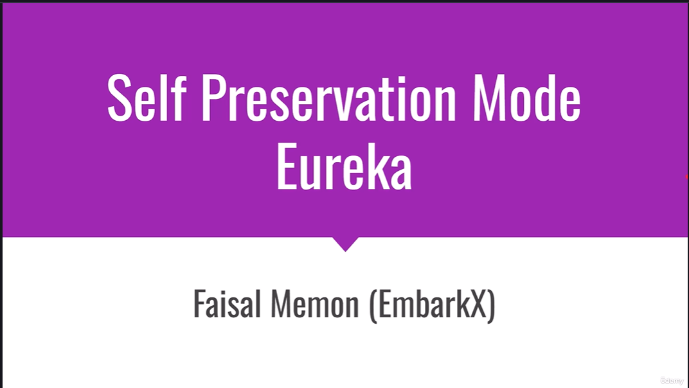
2) 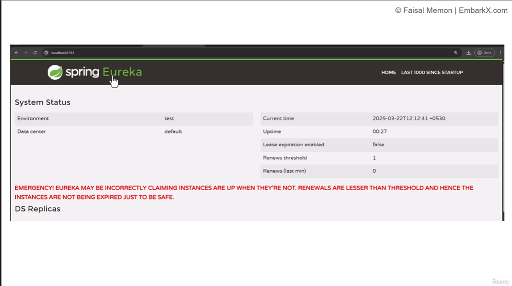
3) 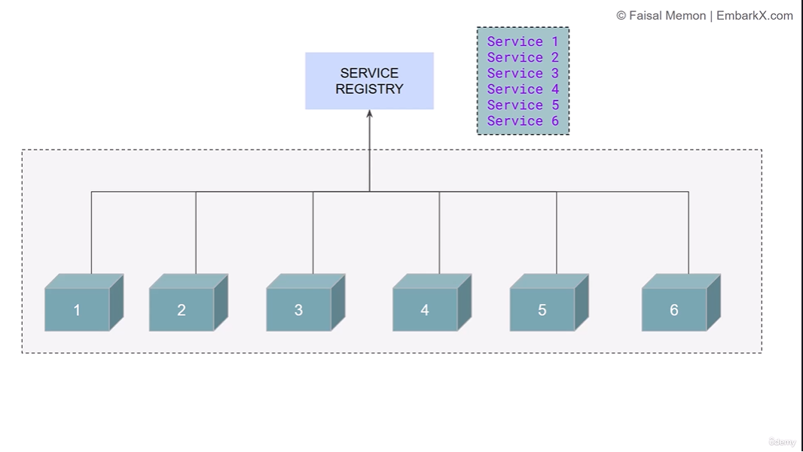
4) 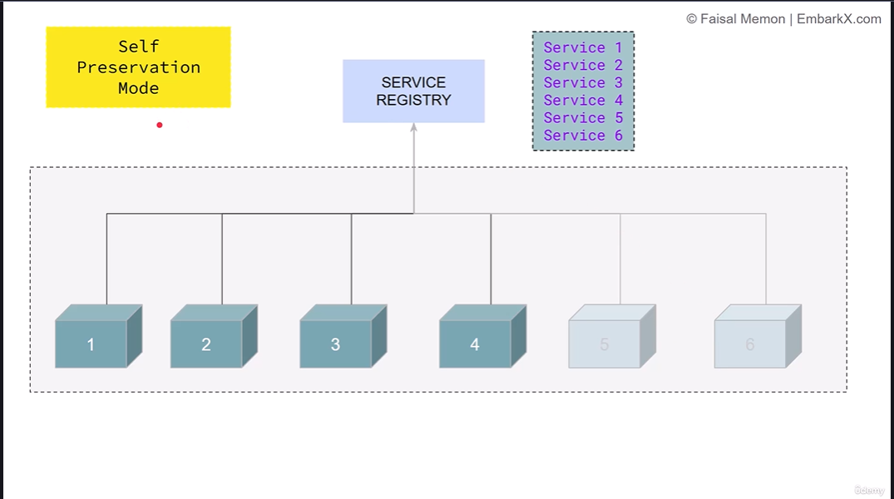
5) 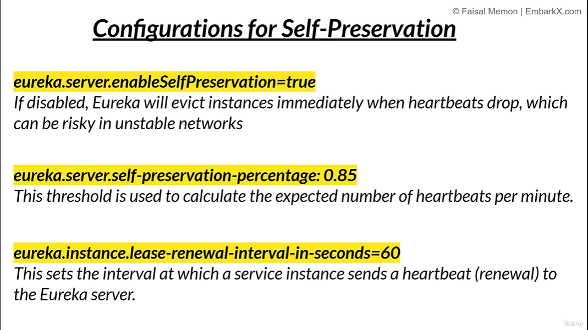
6) 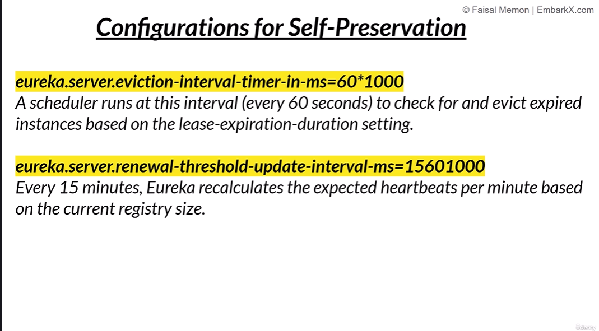

Below is a **clear, end-to-end explanation** of **Eureka Self-Preservation Mode**, written in **interview + production + exam** friendly notes.
This fits perfectly with your current **Spring Cloud + Eureka + Microservices** learning path.

---

# 🌐 Understanding Self-Preservation Mode in Eureka (High Availability)

---

## 1️⃣ What is Self-Preservation Mode in Eureka?

**Self-Preservation Mode** is a **safety mechanism** in **Eureka Server** that prevents **mass removal of service instances** when the network becomes unstable.

👉 **Goal:**

> Keep the registry stable even if heartbeats suddenly drop.

---

## 2️⃣ Why Self-Preservation is Needed?

### ❌ Problem Without Self-Preservation

If Eureka immediately removes instances when heartbeats stop:

* Temporary **network issues**
* **GC pauses**
* **High traffic**
* **Server overload**

➡️ Eureka may wrongly think instances are **DOWN**
➡️ It **removes them**
➡️ Clients fail to find services
➡️ **System-wide outage**

---

## 3️⃣ How Eureka Normally Works (Recap)

### Normal Flow:

1. Microservice registers with Eureka
2. Sends **heartbeat every 30 seconds**
3. Eureka expects heartbeats
4. If no heartbeat for **90 seconds**, instance is removed

---

## 4️⃣ What Happens in Self-Preservation Mode?

When **too many heartbeats are missing**, Eureka:

✔️ **Stops expiring instances**
✔️ Keeps all instances in registry
✔️ Continues serving registry data
✔️ Avoids cascading failures

📌 **Even if instances look unhealthy**

---

## 5️⃣ When Does Self-Preservation Activate?

Eureka calculates:

```
Expected Heartbeats = number_of_instances × heartbeat_rate
```

If **received heartbeats < threshold**, Eureka activates self-preservation.

### Default Threshold

```
85% of expected heartbeats
```

If less than **85%** → 🚨 Self-Preservation ON

---

## 6️⃣ Example Scenario

### Assume:

* 10 microservices
* Heartbeat every 30s
* Expected heartbeats = 20/min

### Suddenly network slows:

* Only 12 heartbeats received

➡️ 12 < 85% of 20
➡️ **Self-Preservation Mode ENABLED**

✔️ Eureka does **NOT remove services**
✔️ Registry stays intact

---

## 7️⃣ Log Message You’ll See

```
EMERGENCY! EUREKA MAY BE INCORRECTLY CLAIMING INSTANCES ARE UP
```

This indicates:

* Eureka detected abnormal heartbeat loss
* Self-preservation activated

---

## 8️⃣ Is Self-Preservation Good or Bad?

### ✅ Advantages

* Prevents **false service eviction**
* Improves **high availability**
* Avoids **cascading failures**
* Critical for **distributed systems**

### ❌ Disadvantages

* May keep **actually dead instances**
* Clients might call unavailable services
* Requires **client-side resilience**

---

## 9️⃣ How Clients Handle This Problem?

To handle stale instances:

✔️ **Client-side load balancing**
✔️ **Retry mechanisms**
✔️ **Timeouts**
✔️ **Circuit Breakers (Resilience4j)**
✔️ **Health checks**

👉 Eureka trusts **clients to handle failures**

---

## 🔟 Configuration Properties

### Disable Self-Preservation (NOT recommended in prod)

```yaml
eureka:
  server:
    enable-self-preservation: false
```

### Change Threshold

```yaml
eureka:
  server:
    renewal-percent-threshold: 0.90
```

---

## 1️⃣1️⃣ When Should You Disable It?

| Environment | Recommendation |
| ----------- | -------------- |
| Local Dev   | ✅ Can disable  |
| Testing     | ⚠️ Optional    |
| Production  | ❌ NEVER        |

---

## 1️⃣2️⃣ Real-World Analogy 🧠

Think of Eureka as an **Airport Control Tower**:

* If communication fails temporarily
* Tower assumes planes are still flying
* Doesn’t declare all planes crashed
* Waits until situation stabilizes

That’s **Self-Preservation**

---

## 1️⃣3️⃣ Interview Questions & Answers

### ❓ What is self-preservation in Eureka?

> A safety mechanism that prevents mass eviction of instances during network issues.

### ❓ Why is it important?

> It avoids cascading failures and keeps service discovery available.

### ❓ Does Eureka guarantee instance health?

> No. Eureka is **AP (Availability + Partition tolerance)**, not CP.

### ❓ How to handle stale services?

> Client-side retries, circuit breakers, timeouts.

---

## 1️⃣4️⃣ Eureka Design Philosophy (CAP Theorem)

| Aspect              | Choice |
| ------------------- | ------ |
| Consistency         | ❌      |
| Availability        | ✅      |
| Partition Tolerance | ✅      |

➡️ Eureka prefers **Availability over Consistency**

---

## 1️⃣5️⃣ Summary

✔️ Protects registry during network failures
✔️ Prevents mass service eviction
✔️ Critical for high availability
✔️ Must be paired with client resilience
✔️ Never disable in production

---

If you want next, I can explain:

* 🔁 **Heartbeat mechanism deep dive**
* 🔄 **Graceful shutdown & deregistration**
* 🔥 **Eureka vs Consul vs Kubernetes**
* 🛡 **Resilience4j with Eureka**
* 📊 **How Netflix uses Eureka internally**

Just tell me 👍

## ========= 184. Key Eureka Server Configuration Settings You Should Know===
1) 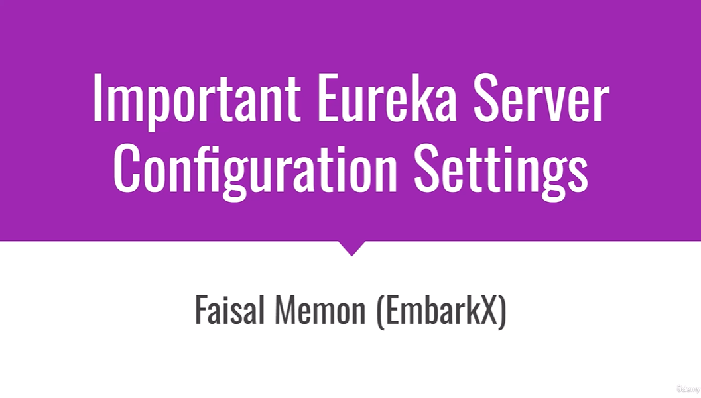
2) 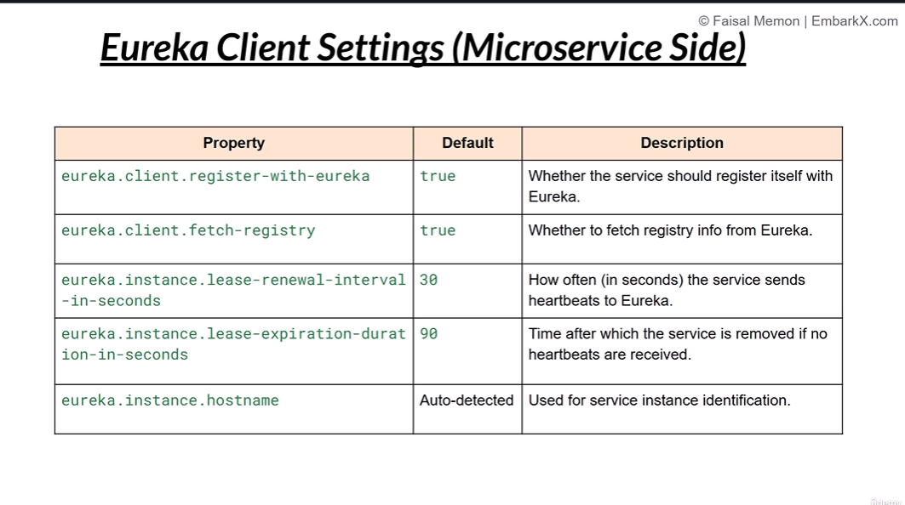
3) 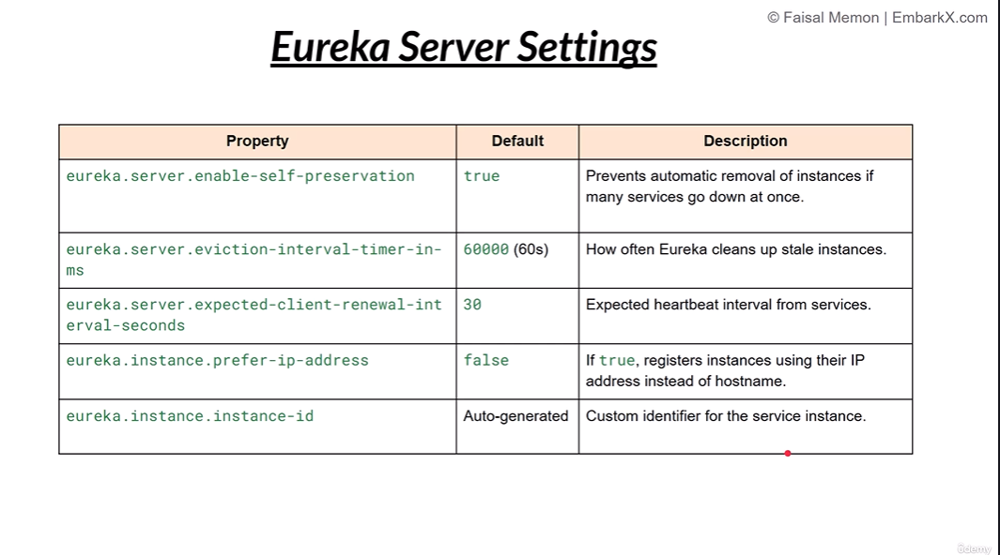
4) 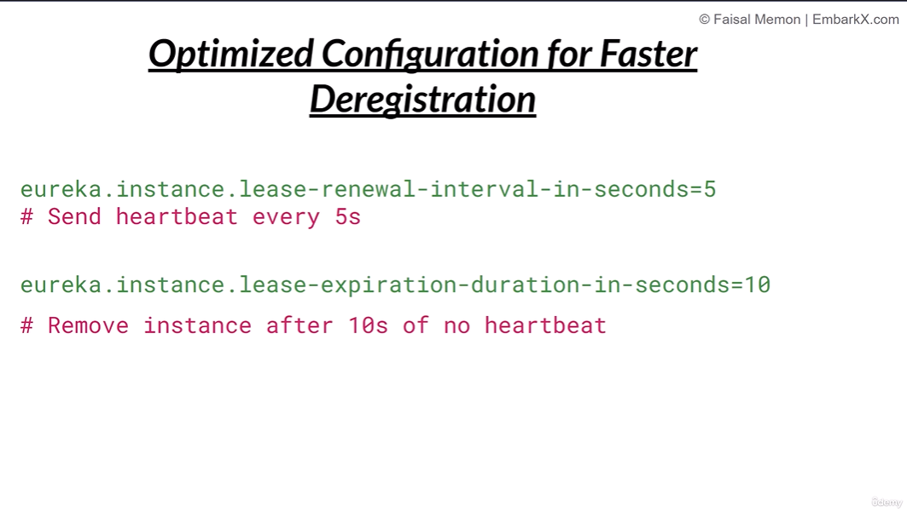
5) 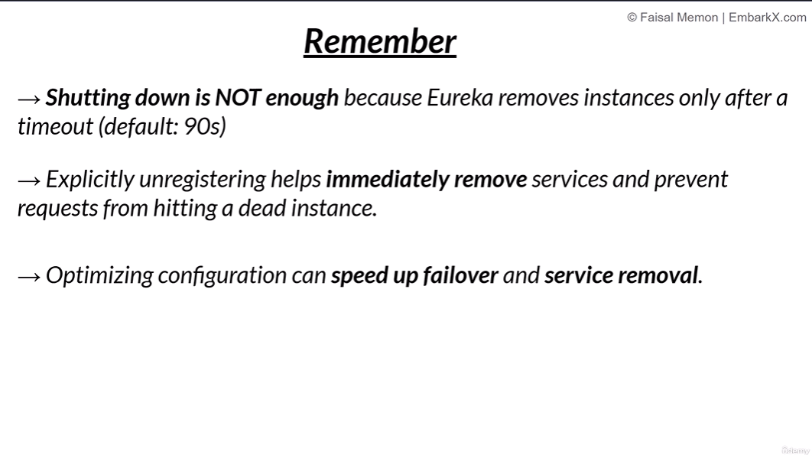

## ------ 185. Interesting Facts & Lesser-Known Features of Eureka Server---
1) 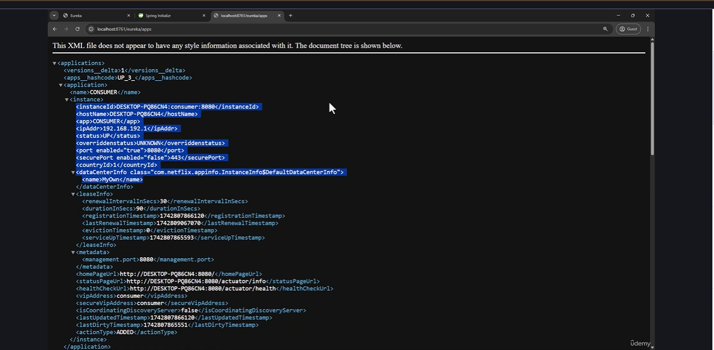
2) 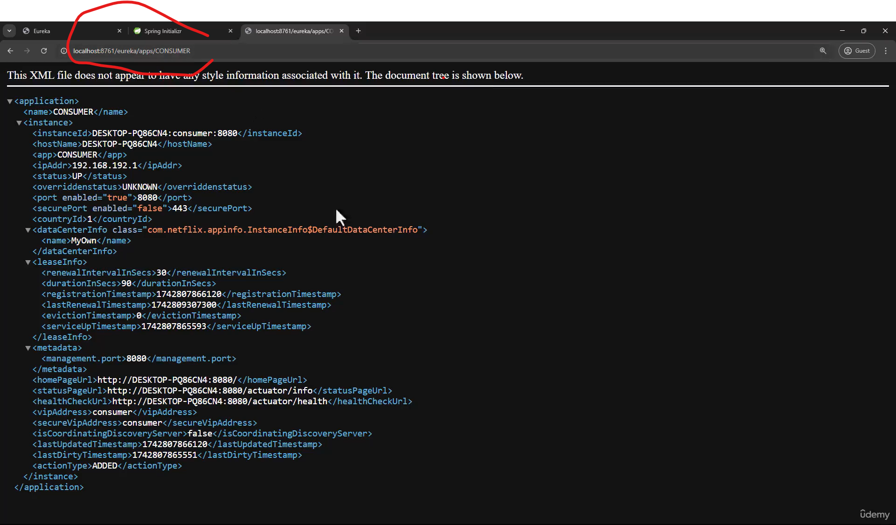
3) 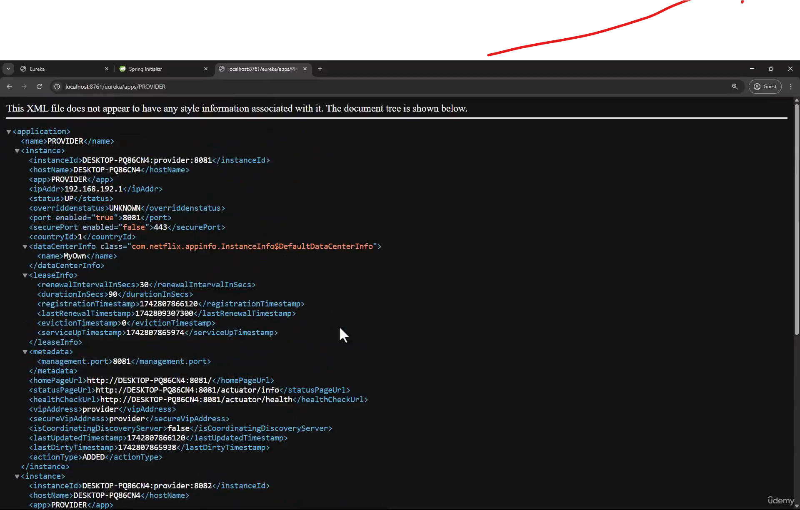
4) 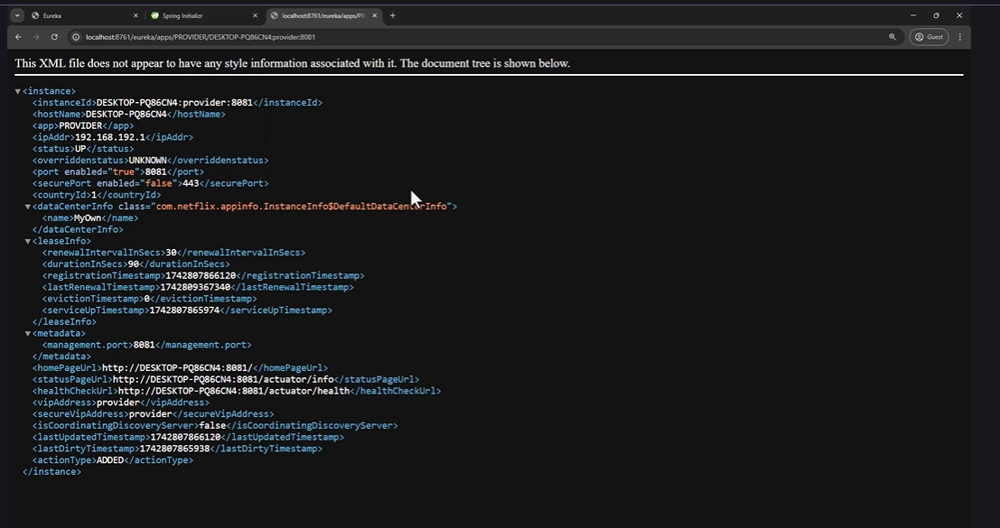

## ----Key Eureka Server Configuration Settings You Should Know--
Below are **clear, structured, exam-ready + interview-ready notes on Eureka Server**, focused exactly on what you asked.
I’ll explain **concepts + behind-the-scenes behavior + configs + production tips**.

---

# 🌐 Netflix Eureka – Complete Notes (Spring Cloud)

---

## 1️⃣ Gracefully Shutting Down Registered Microservices in Eureka

### 🔹 What is Graceful Shutdown?

Graceful shutdown means:

* A microservice **stops accepting new requests**
* **Completes ongoing requests**
* **Unregisters itself cleanly from Eureka**

This prevents:

* Client failures
* Routing traffic to dead instances

---

### 🔹 What Happens Without Graceful Shutdown?

If a service crashes:

* Eureka still thinks the instance is **UP**
* Other services try to call it → **timeouts / failures**
* Eureka waits until lease expiration

---

### 🔹 How Graceful Shutdown Works

#### Step-by-step:

1. Service receives **SIGTERM** (Kubernetes / Docker stop)
2. Spring Boot:

    * Stops accepting traffic
    * Sends **DEREGISTER** request to Eureka
3. Eureka removes the instance immediately

---

### 🔹 Enable Graceful Shutdown in Spring Boot

```yaml
server:
  shutdown: graceful

spring:
  lifecycle:
    timeout-per-shutdown-phase: 30s
```

---

### 🔹 Eureka Client Config for Fast Deregistration

```yaml
eureka:
  client:
    registry-fetch-interval-seconds: 5
  instance:
    lease-renewal-interval-in-seconds: 10
    lease-expiration-duration-in-seconds: 30
```

---

### 🔹 Production Best Practice

✔ Always enable graceful shutdown
✔ Short lease times for faster failover
✔ Combine with **readiness/liveness probes**

---

## 2️⃣ Behind the Scenes of Eureka Registration (Heartbeat Mechanism)

---

### 🔹 What is a Heartbeat?

A **heartbeat** is a periodic signal sent by a service to Eureka saying:

> “I am alive”

---

### 🔹 Registration Flow

```
Service Starts
   ↓
Registers with Eureka
   ↓
Sends Heartbeats every 30s
   ↓
Eureka keeps instance as UP
```

---

### 🔹 Heartbeat Details

| Property           | Default    |
| ------------------ | ---------- |
| Heartbeat Interval | 30 seconds |
| Expiry Time        | 90 seconds |
| Missed Heartbeats  | 3          |

---

### 🔹 Key Configs

```yaml
eureka:
  instance:
    lease-renewal-interval-in-seconds: 30
    lease-expiration-duration-in-seconds: 90
```

---

### 🔹 What if Heartbeats Stop?

* Eureka waits for expiration duration
* If expired → instance marked **DOWN**
* Removed from registry

---

### 🔹 Why Heartbeat is Critical

✔ Health detection
✔ Load balancer accuracy
✔ Fault tolerance

---

## 3️⃣ Self-Preservation Mode in Eureka (VERY IMPORTANT)

---

### 🔹 What is Self-Preservation Mode?

A **safety mechanism** in Eureka to prevent mass instance removal during:

* Network partition
* Temporary outage
* Data center issues

---

### 🔹 Problem Eureka Solves

If network fails:

* Many services miss heartbeats
* Eureka might delete all instances ❌
* Entire system breaks

---

### 🔹 How Self-Preservation Works

If:

```
Received renewals < expected threshold
```

Then:

```
Eureka stops expiring instances
```

---

### 🔹 Example Scenario

* 100 services registered
* Expected renewals: 100/min
* Actual renewals: 60/min

➡ Eureka **enters self-preservation mode**

---

### 🔹 Logs You’ll See

```
EMERGENCY! EUREKA MAY BE INCORRECTLY CLAIMING INSTANCES ARE UP
```

---

### 🔹 Should You Disable It?

❌ **Production** → NEVER
✔ **Local / Dev** → Can disable

```yaml
eureka:
  server:
    enable-self-preservation: false
```

---

### 🔹 Why NOT Disable in Production?

* Prevents cascading failures
* Improves availability
* Protects during network glitches

---

## 4️⃣ Key Eureka Server Configuration Settings (Must Know)

---

### 🔹 Core Server Settings

```yaml
eureka:
  server:
    enable-self-preservation: true
    eviction-interval-timer-in-ms: 60000
```

| Property                 | Purpose               |
| ------------------------ | --------------------- |
| enable-self-preservation | Prevent mass eviction |
| eviction-interval-timer  | Cleanup interval      |

---

### 🔹 Client Registration Settings

```yaml
eureka:
  client:
    register-with-eureka: true
    fetch-registry: true
```

| Property             | Meaning            |
| -------------------- | ------------------ |
| register-with-eureka | Registers service  |
| fetch-registry       | Fetch service list |

---

### 🔹 Instance Settings

```yaml
eureka:
  instance:
    prefer-ip-address: true
    instance-id: ${spring.application.name}:${server.port}
```

✔ Avoids hostname issues
✔ Prevents duplicate instance IDs

---

### 🔹 Health Check Integration

```yaml
eureka:
  client:
    healthcheck:
      enabled: true
```

✔ Eureka uses `/actuator/health`
✔ Better instance accuracy

---

## 5️⃣ Eureka in Production – Best Practices

✅ Use **multiple Eureka servers (cluster)**
✅ Never disable self-preservation
✅ Use **shorter lease times**
✅ Enable **graceful shutdown**
✅ Combine with **Spring Cloud LoadBalancer**
✅ Monitor `/actuator/metrics`

---

## 6️⃣ Interview One-Line Answers

**Q: What is Eureka?**
➡ Service registry for discovery

**Q: What is heartbeat?**
➡ Periodic signal proving service health

**Q: What is self-preservation mode?**
➡ Safety mode preventing mass eviction

**Q: Why graceful shutdown?**
➡ Prevent routing traffic to dead services

---

## 7️⃣ What Should You Learn Next?

Since you’re already working with:

* WebClient
* RestClient
* Feign
* Spring Cloud Config

👉 **Next topics**:

1. Circuit Breaker (Resilience4j)
2. API Gateway
3. Distributed Tracing (Zipkin)
4. Kubernetes Service Discovery
5. Event-driven communication (Kafka / RabbitMQ)

---

If you want, I can:
✔ Draw **Eureka internal flow diagram**
✔ Explain **Eureka vs Consul vs Kubernetes**
✔ Give **real-world production architecture**
✔ Convert this into **PDF notes**

Just tell me 👍

