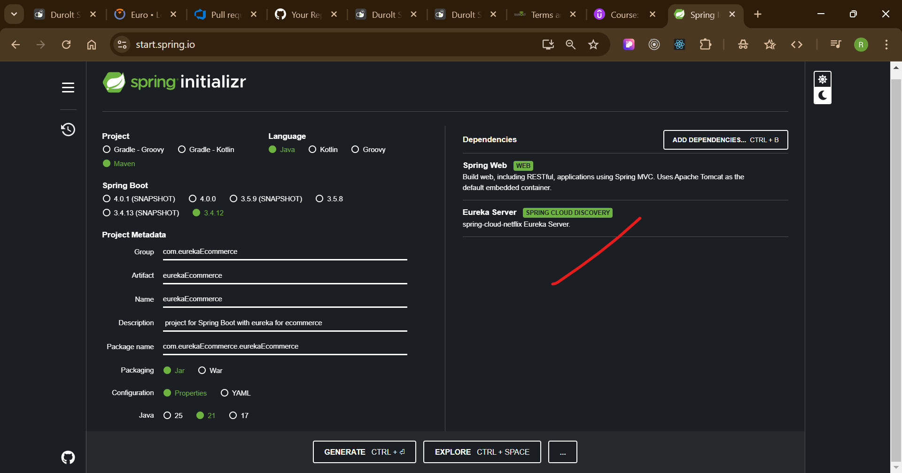
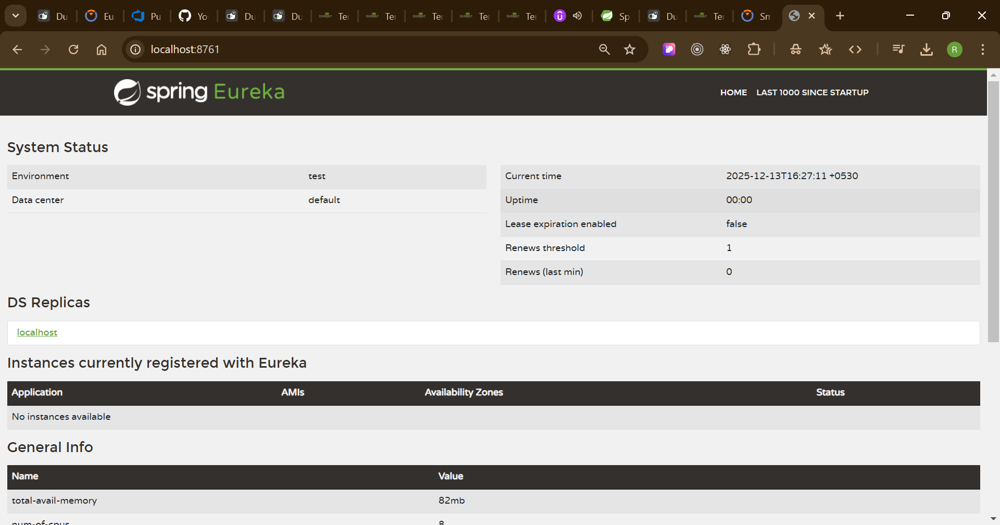

## ------------ Section 16: Inter-Service Communication in Spring Boot eCommerce Microservices Project
---
1) now we need to create a eureka server for our ecommerce application for that again create a spring boot application as below
2) 
3) 

