## ------------ Section 16: Inter-Service Communication in Spring Boot eCommerce Microservices Project
---
1) now we need to create a eureka server for our ecommerce application for that again create a spring boot application as below
2) 
3) 

## ------------ 
1) now we need to add the eureka client dependecy to all client
2) 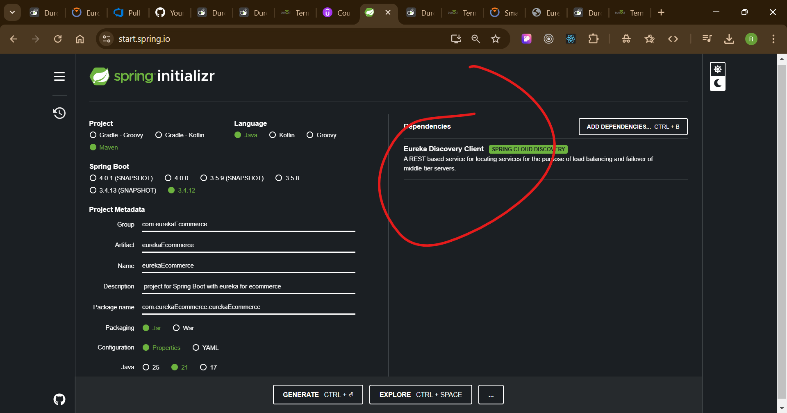
```declarative
<properties>
<java.version>21</java.version>
<spring-cloud.version>2024.0.2</spring-cloud.version>
</properties>

    <dependency>
      <groupId>org.springframework.cloud</groupId>
      <artifactId>spring-cloud-starter-netflix-eureka-client</artifactId>
    </dependency>


<dependencyManagement>
<dependencies>
<dependency>
<groupId>org.springframework.cloud</groupId>
<artifactId>spring-cloud-dependencies</artifactId>
<version>${spring-cloud.version}</version>
<type>pom</type>
<scope>import</scope>
</dependency>
</dependencies>
</dependencyManagement>

```
3) after given the dependecy add propery for eureka in application.yml 
4) 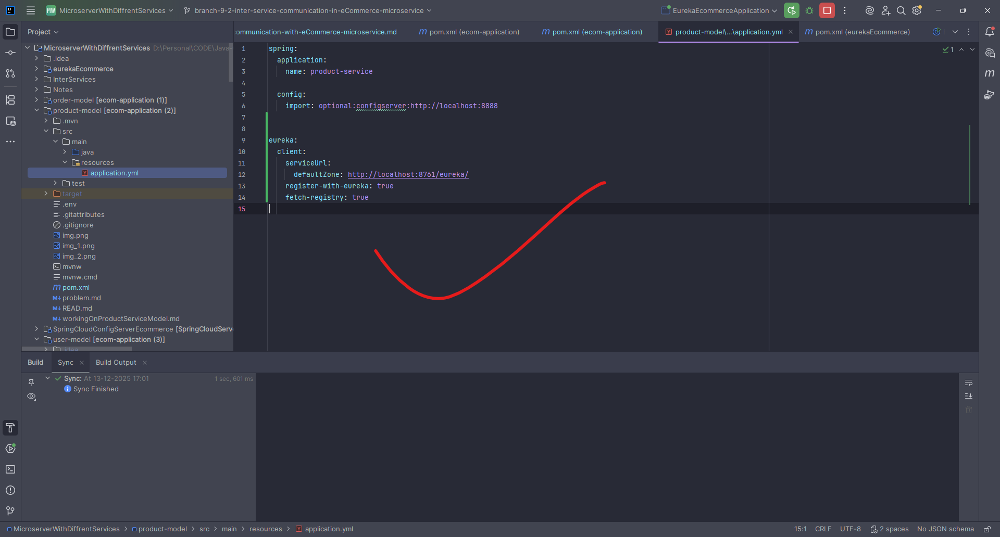
5) then start the docker application and run it throw the : docker compose up -d
6) 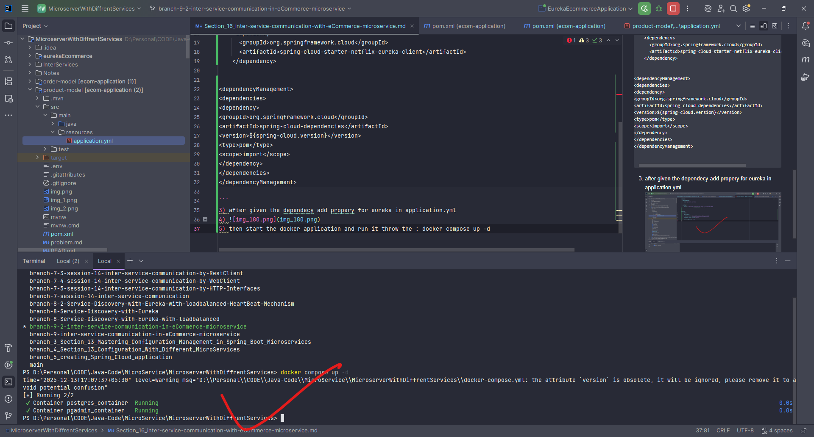
7) then first run the eureka server then configuration server then product service
8) 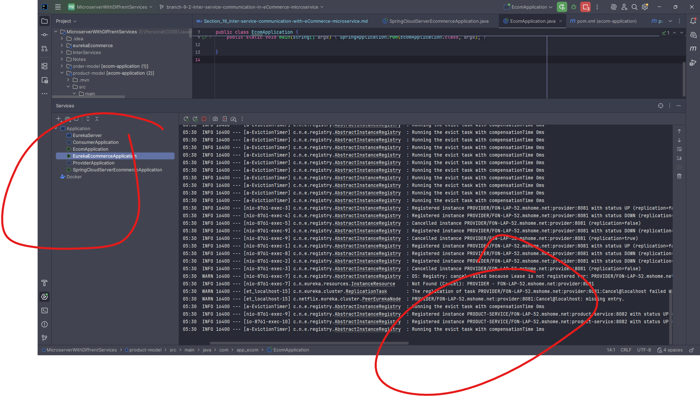
9) 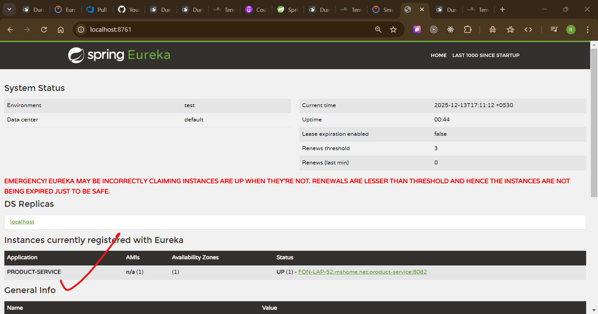
10) now product service has successfully connected to eureka server
11) now do same thing for user and order as well
12) then run those two servcies as well user and order after adding code
13) 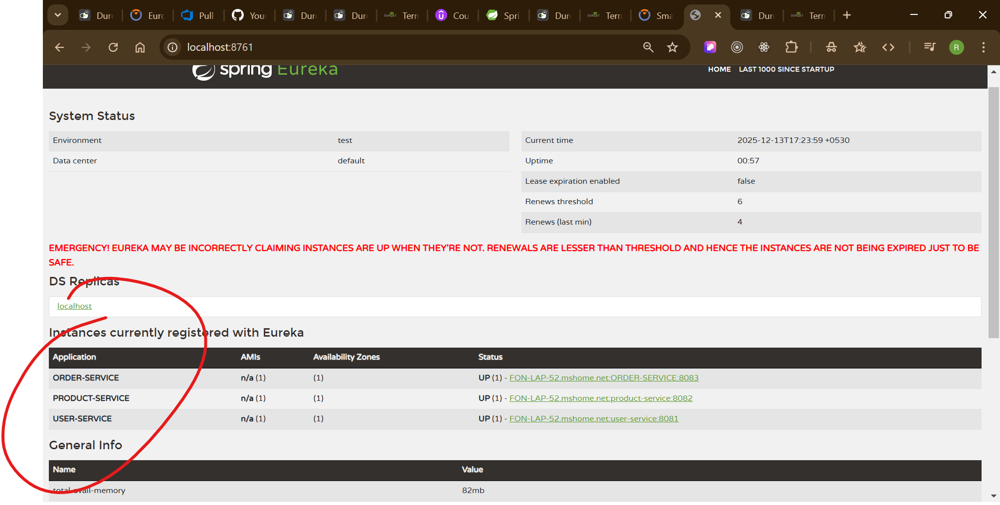
14) now all three services connected to eureka server
15) now we will move these all the services to configServer
16) now move configuration details of eureka from each services properties to configserver/config/service.yml file
17) 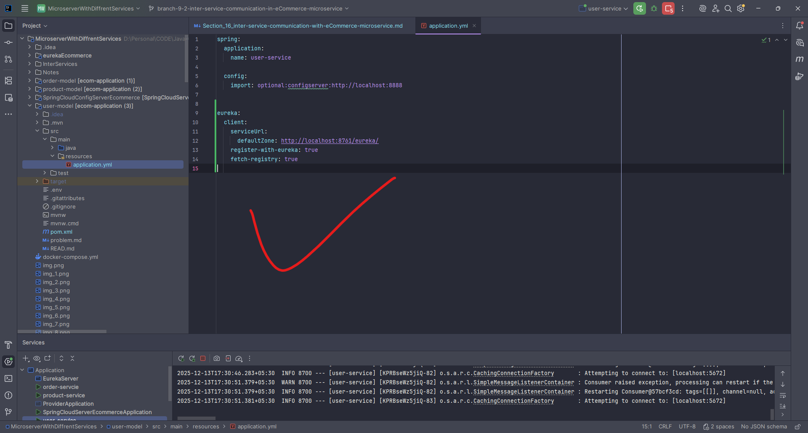
18) 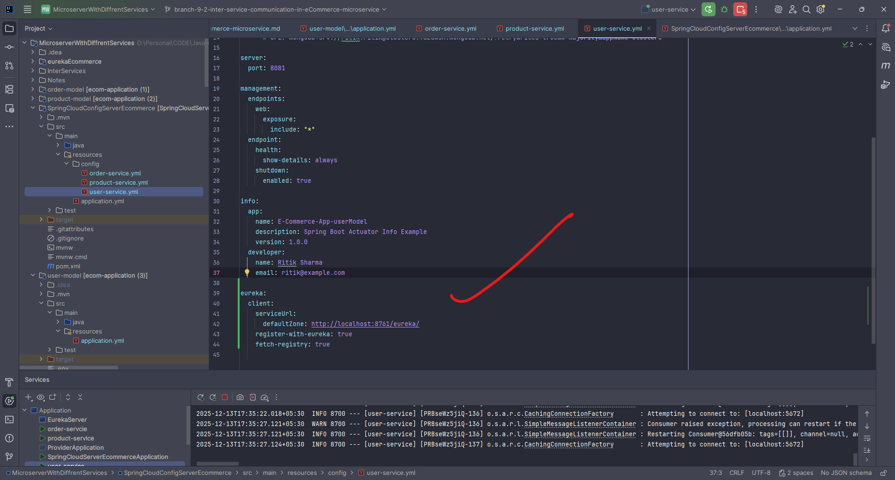
19) 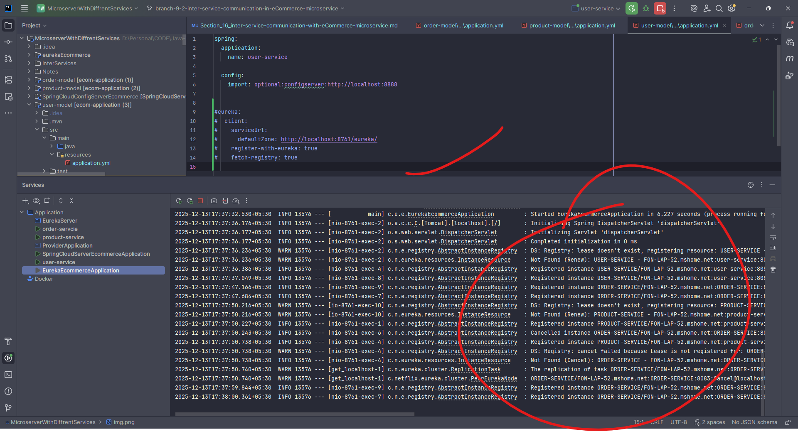
20) 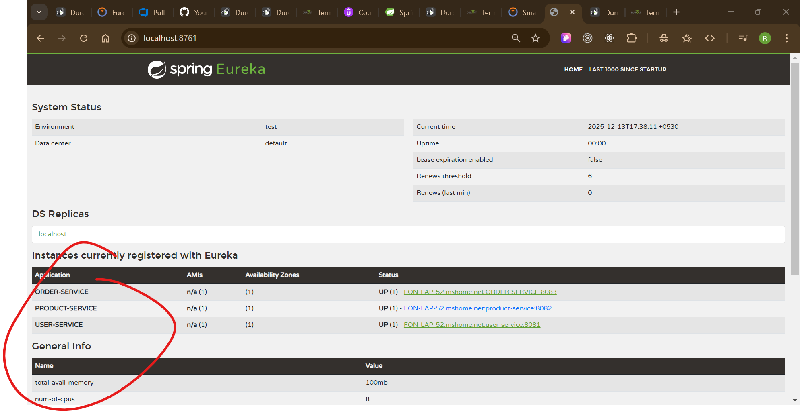

## ====  188. Challenge: Validate Product via Product Service===
1) 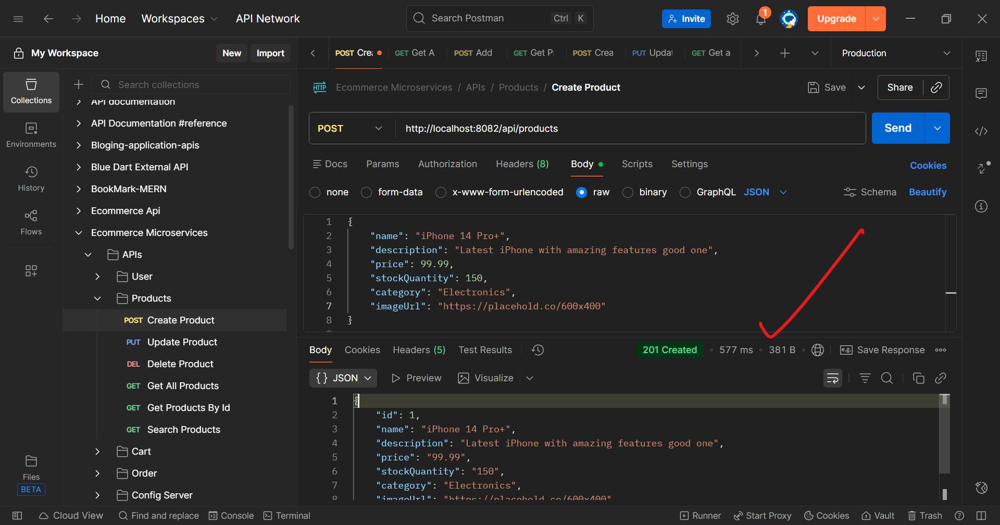
2) 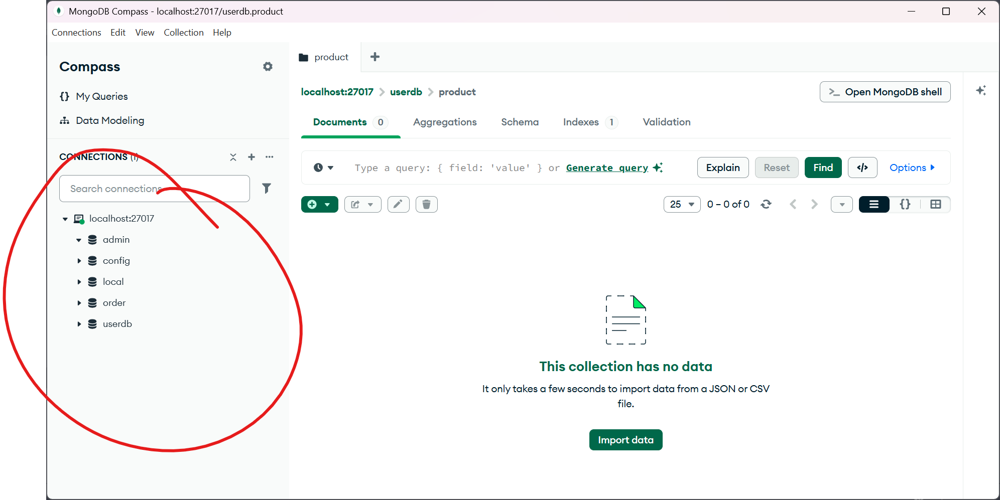
3) but no databse and all so the problem is with code we have writen the product code on based on hibernante and jpa not based on mongodb user servic is based on mongodb as you can see the models
4) 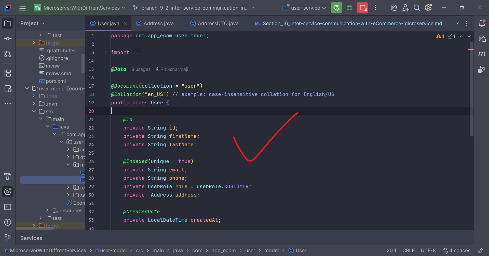
5) but for product
6) 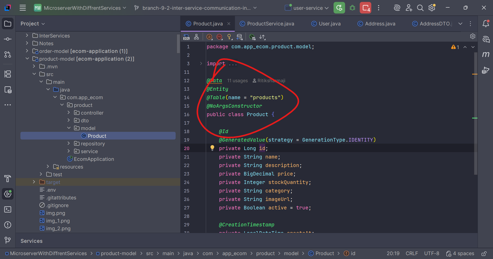 table which is for sql database not for non sql
7) so we need to change the databse configuration from mongodb to postgresql for product as well order
8) 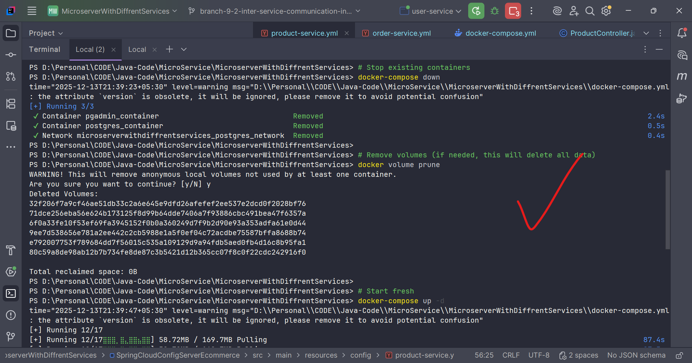
9) 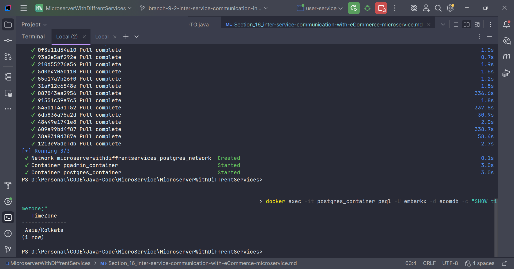
10) getting problem with time zone so changed the databse from postgress to mysql

You’re almost there 👍
Let’s **properly implement “find product by id” end-to-end** (Repository → Service → Controller) in a **clean Spring Boot way**.

---

## 1️⃣ Repository (Small Fix)

You **don’t need** this method 👇

```java
Product findProductById(Long id);
```

Because `JpaRepository` already provides:

```java
Optional<Product> findById(Long id);
```

✅ **Recommended Repository**

```java
@Repository
public interface ProductRepository extends JpaRepository<Product, Long> {

    List<Product> findByActiveTrue();

    @Query("""
        SELECT p FROM Product p
        WHERE p.active = true
        AND p.stockQuantity > 0
        AND LOWER(p.name) LIKE CONCAT('%', :keyword, '%')
    """)
    List<Product> searchProducts(@Param("keyword") String keyword);
}
```

---

## 2️⃣ Service Layer – Find Product By ID

### Method Signature (Best Practice)

Return `Optional<ProductResponse>` to handle **not found case safely**.

```java
public Optional<ProductResponse> getProductById(Long id) {
    return productRepository.findById(id)
            .filter(Product::getActive)   // ensure active product only
            .map(this::mapToProductResponse);
}
```

### Why this is good practice?

* ✔ No `null`
* ✔ Functional style
* ✔ Clean error handling
* ✔ Easy to convert to HTTP responses

---

## 3️⃣ Controller – Correct Mapping

### ❌ Your Issue

You used:

```java
@GetMapping("/{id}")
public ResponseEntity<ProductResponse> getProduct(@RequestParam Long id)
```

👉 `@RequestParam` is **wrong** for `/products/{id}`

---

### ✅ Correct Controller Implementation

```java
@RestController
@RequestMapping("/api/products")
@RequiredArgsConstructor
public class ProductController {

    private final ProductService productService;

    @GetMapping("/{id}")
    public ResponseEntity<ProductResponse> getProduct(@PathVariable Long id) {

        return productService.getProductById(id)
                .map(ResponseEntity::ok)
                .orElse(ResponseEntity.notFound().build());
    }
}
```

---

## 4️⃣ HTTP Responses Behavior

| Case              | Response                     |
| ----------------- | ---------------------------- |
| Product exists    | **200 OK** + ProductResponse |
| Product not found | **404 NOT FOUND**            |
| Product inactive  | **404 NOT FOUND**            |

---

## 5️⃣ Example API Call

```http
GET http://localhost:8080/api/products/5
```

### Sample JSON Response

```json
{
  "id": 5,
  "name": "iPhone 15",
  "price": "79999",
  "active": true,
  "imageUrl": "img.jpg",
  "category": "Mobiles",
  "description": "Latest Apple phone",
  "stockQuantity": "12"
}
```

---

## 6️⃣ Summary (Interview Ready 💡)

**Key points you can say in interviews:**

* Use `Optional` for safer null handling
* Use `@PathVariable` for RESTful URLs
* Filter inactive products at service layer
* Convert Entity → DTO in service layer only
* Return proper HTTP status codes

---

If you want next:

* 🔹 Custom Exception (`ProductNotFoundException`)
* 🔹 Global Exception Handler (`@ControllerAdvice`)
* 🔹 Unit test for this method (JUnit + Mockito)
* 🔹 Feign/WebClient calling this API from another microservice

Just tell me 👍
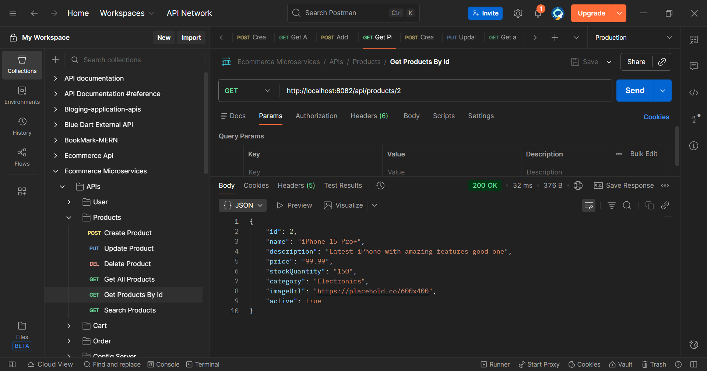


1) in order service to add the cart and delete a cart we need to communicate with product as well so for that we will create a client into order service for product to communicate with order to product
2) 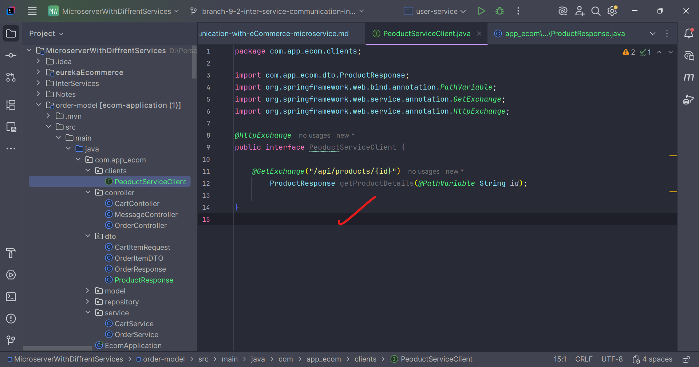 after define this client we need to implememt this client throw the rest client so
3) 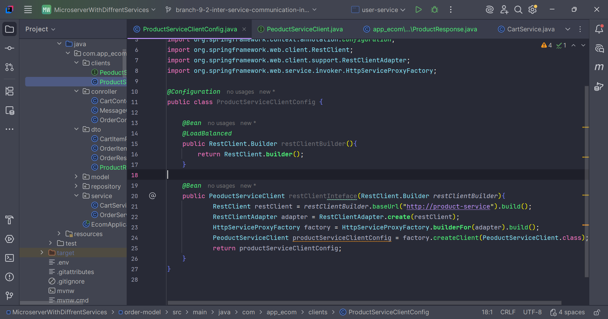
4) then change the cod for addToCart service method
5) 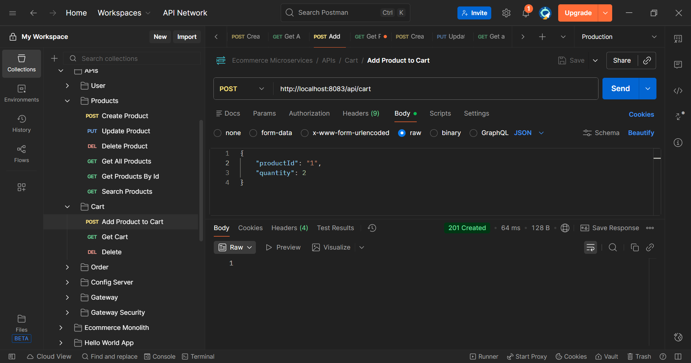