## -------- Section 22: Transition to Spring Cloud Functions and Spring Cloud Stream | eCommerce Project ---
## ----- 284. Section Overview --
## --------- video notes --
So now is the time that we talk about what to expect in this particular section.

So we have a order service which is the producer so far.

And we have a notification service which is the consumer right order service is producing messages and

publishing it to a message broker like RabbitMQ.

And Notification Service is consuming the message from service like RabbitMQ.

Right.

And it's a consumer.

Now what we are going to do is we are going to transition from this entire setup.

Right now in our code.

The RabbitMQ code is hard coded right.

So RabbitMQ related code classes we are using in.

It's hard coded.

If you have to transition to Kafka it's a bit tedious.

We have to manage and change all the code.

Right.

So we are going to transition to Spring Cloud Stream, which will help us reduce the boilerplate code

and it will act as an abstraction layer.

And in future you can switch to RabbitMQ Kafka depending on your requirements.

So right now we are going to switch to RabbitMQ first.

And then later on we'll switch to Kafka.

Right.

So first thing we will do is I'll show you how the order or the flow of this section will be.

First thing is we will transition to spring cloud stream using RabbitMQ.

Okay, right now we are using RabbitMQ.

But we are not making use of Spring Cloud stream.

So we will transition to Spring Cloud stream using RabbitMQ.

And for notification service we will transition to Spring Cloud function.

Okay.

And then I will transition from RabbitMQ to that of Kafka.

And I'll show you how easy that particular switch is.

Okay.

So in the end we'll be making use of Kafka.
1) 

## -------- 285. Transition From @RabbitListener to Spring Cloud Stream --
1) we begin transitioning our producer to make use of Spring Cloud Stream.
And right now, if you take a look over here at the order service, we have order.
That is a producer notification is a consumer.
2) first we need to set the dependencies 
3) 
4) after dependencies we need to set the update the configuration
5) 
6) after this we need to manage the ending part is
8) 
9) 
10) 
11) now run all the service accpet to notification  and make the order
12) 
13) 
14) 
15) 
16) 
17) 
18) 


## -------- 286. Transition Notification Service To Spring Cloud Stream --
1) now we need to change in the notifcation becasue that is consumer 
2) 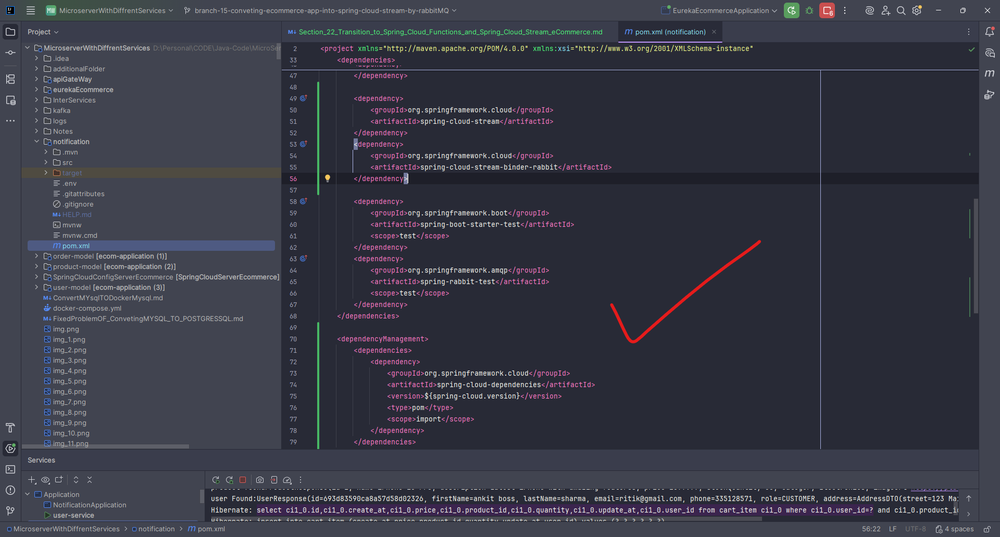
3) then update the configuration
4) 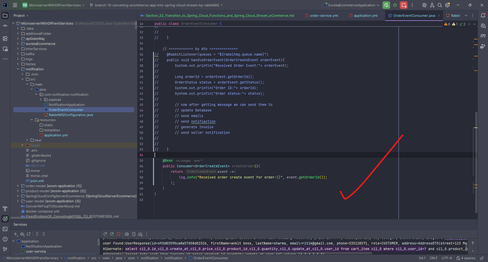
5) 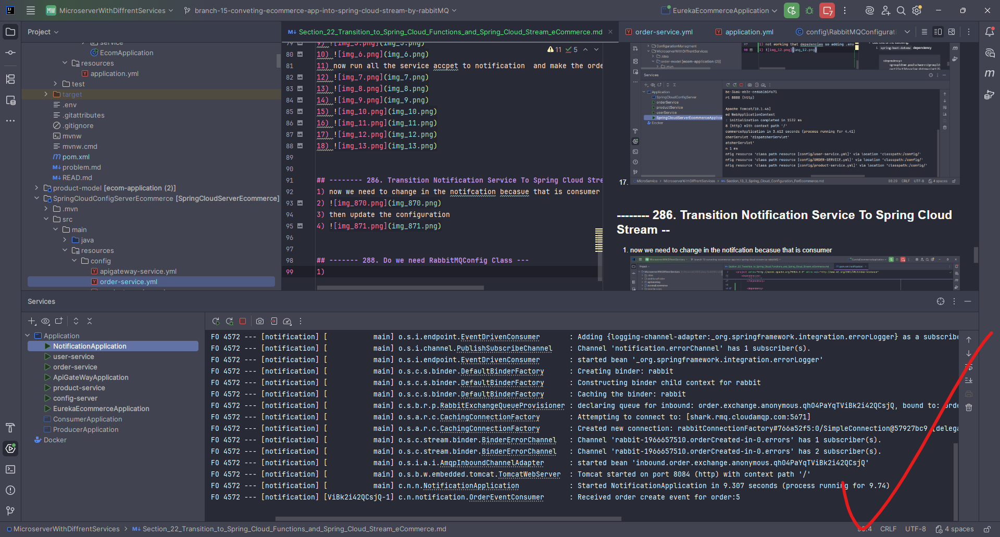

## ------- 288. Do we need RabbitMQConfig Class ---
1) now required  without it it must be work

## ---289. Different Messaging Models ---
1) 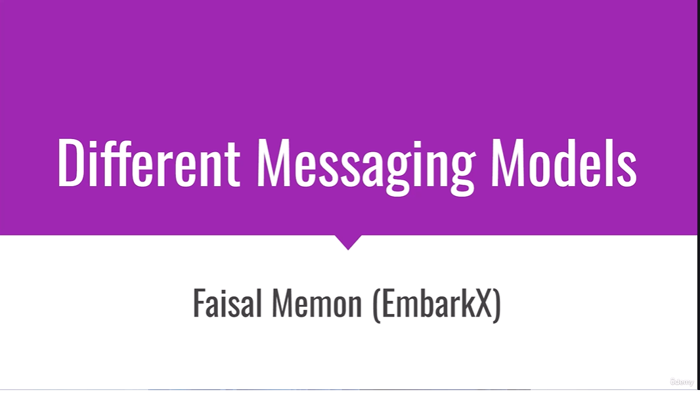
2) 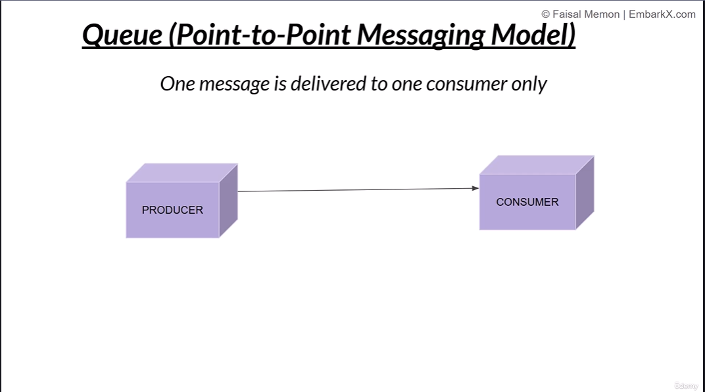
3) 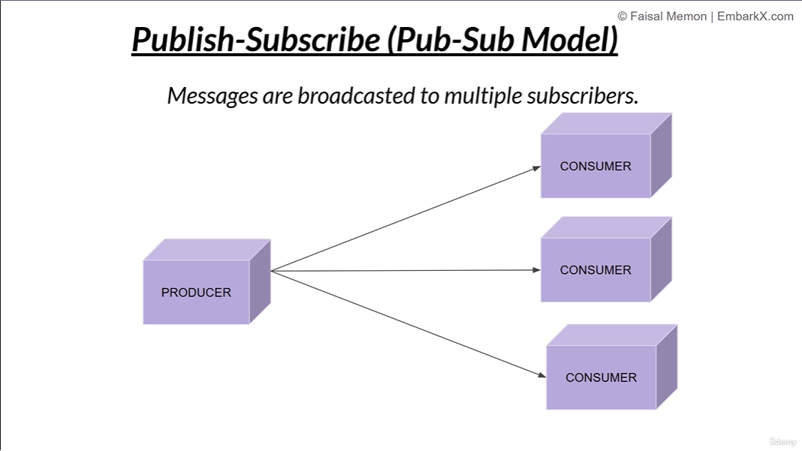
4) 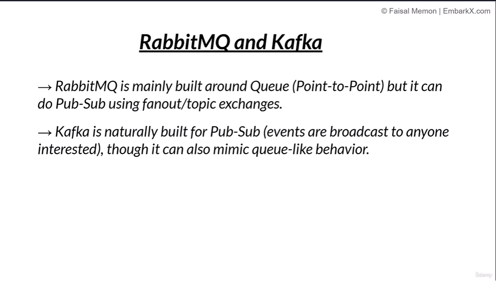

## ------- 290. Things to Remember About Kafka --
1) 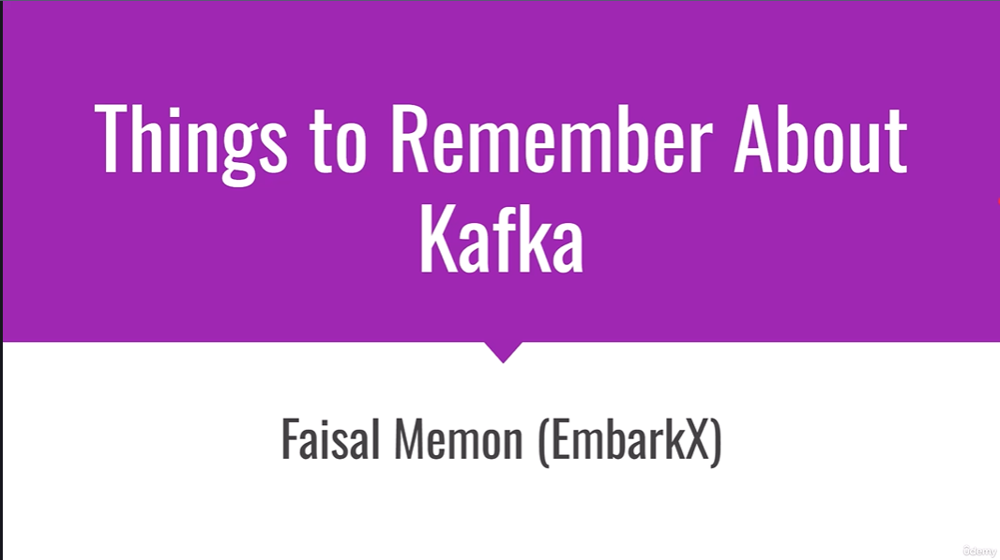
2) 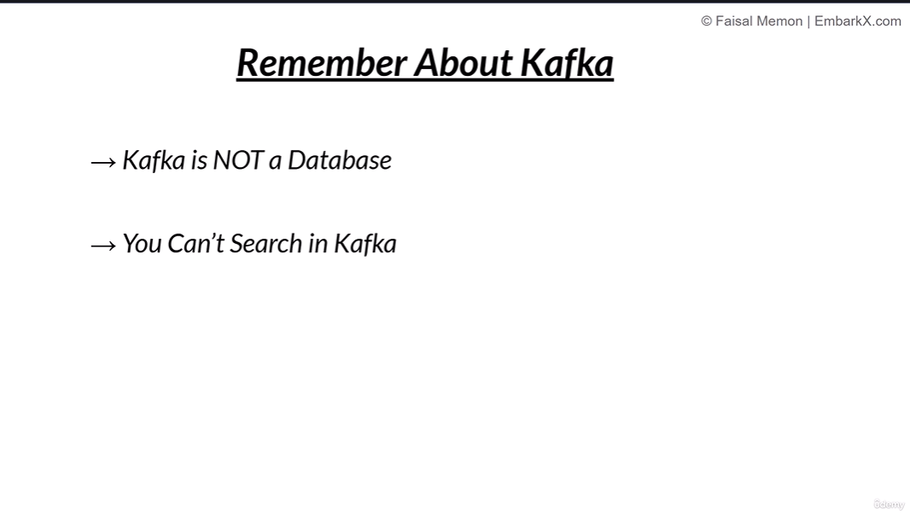

## ------- 291. RabbitMQ vs Kafka ---
1) 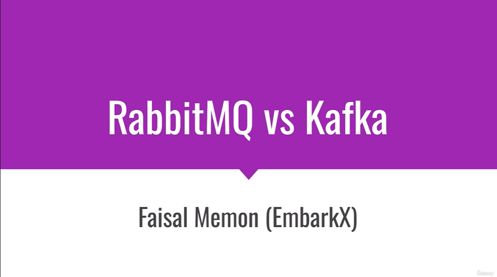
2) 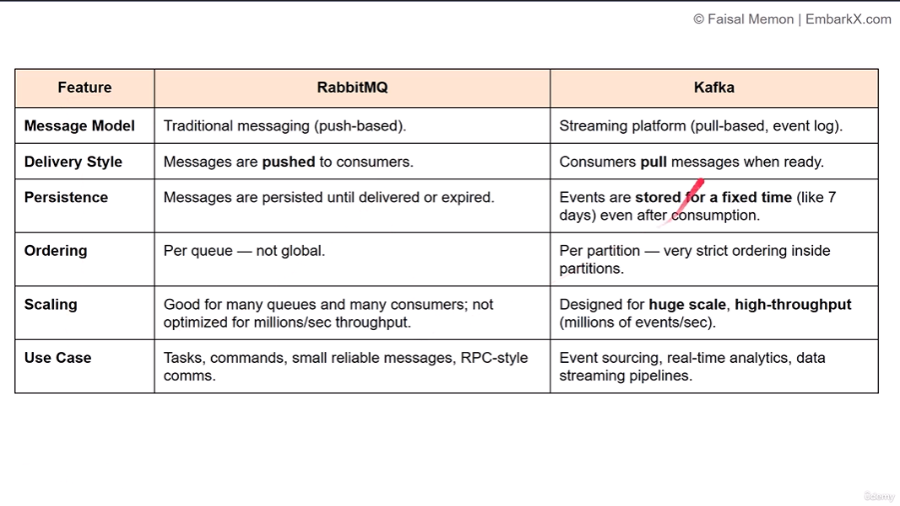
3) 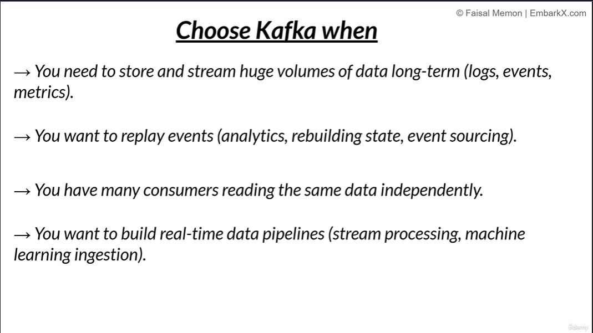

## ----- Different Messaging Models in spring boot in microservice --
Below are **complete, structured notes (0 → 100 level)** on **Different Messaging Models in Spring Boot Microservices**.
This is **interview-ready + architecture-level understanding**.

---

# 📩 Different Messaging Models in Spring Boot Microservices

## 1️⃣ What is Messaging in Microservices?

**Messaging** is a way for microservices to communicate by **sending messages through a broker** instead of calling each other directly.

✔ Loose coupling
✔ Asynchronous processing
✔ Better scalability
✔ Fault tolerance

In **Spring Boot**, messaging is implemented using:

* **RabbitMQ**
* **Kafka**
* **ActiveMQ**
* **AWS SQS / SNS**
* **Spring Cloud Stream**
* **Spring Integration**

---

## 2️⃣ Why Messaging Models Matter?

Different problems need different communication styles:

| Use Case                | Best Model    |
| ----------------------- | ------------- |
| Real-time response      | Request–Reply |
| Background processing   | Event-driven  |
| Broadcasting events     | Pub-Sub       |
| Guaranteed delivery     | Queue-based   |
| High-throughput streams | Kafka Streams |

---

## 3️⃣ Core Messaging Models (IMPORTANT)

### ✅ 1. Point-to-Point (Queue-Based Messaging)

📌 **Definition**
One producer → One consumer
Messages are stored in a **queue**.

📌 **Flow**

```
Producer → Queue → Consumer
```

📌 **Key Characteristics**

* Each message is consumed **only once**
* Multiple consumers → **competing consumers**
* Guaranteed delivery

📌 **Spring Boot Example**

* RabbitMQ Queue
* ActiveMQ Queue
* AWS SQS

📌 **Use Cases**

* Order processing
* Email sending
* Payment processing

📌 **Pros**
✔ Reliable
✔ Scalable
✔ Load-balanced

📌 **Cons**
❌ No broadcasting
❌ Tight delivery semantics

---

### ✅ 2. Publish–Subscribe (Topic-Based Messaging)

📌 **Definition**
One producer → Many consumers
Message is sent to a **topic**, all subscribers receive it.

📌 **Flow**

```
Producer → Topic → Consumer A
                  → Consumer B
                  → Consumer C
```

📌 **Technologies**

* Kafka Topics
* RabbitMQ Topic Exchange
* Redis Pub/Sub

📌 **Use Cases**

* Notifications
* Event propagation
* Analytics updates

📌 **Pros**
✔ Decoupled
✔ Broadcast support
✔ Scalable

📌 **Cons**
❌ Message duplication
❌ Ordering challenges

---

### ✅ 3. Event-Driven Messaging

📌 **Definition**
Services react to **events**, not direct commands.

📌 **Example Events**

* OrderCreated
* PaymentCompleted
* UserRegistered

📌 **Flow**

```
Service A → Event Broker → Service B / C / D
```

📌 **Spring Boot Tools**

* Spring Cloud Stream
* Kafka
* RabbitMQ

📌 **Key Principle**

> Services do NOT know who consumes the event

📌 **Use Cases**

* Microservice choreography
* Audit logging
* CQRS

📌 **Pros**
✔ Loose coupling
✔ Highly scalable
✔ Resilient

📌 **Cons**
❌ Hard debugging
❌ Event versioning complexity

---

### ✅ 4. Request–Reply Messaging (Synchronous Messaging)

📌 **Definition**
Producer sends request → waits for response.

📌 **Flow**

```
Client → Service A → Response
```

📌 **Technologies**

* REST (HTTP)
* gRPC
* WebClient
* Feign Client

📌 **Use Cases**

* Authentication
* User profile fetch
* Pricing calculation

📌 **Pros**
✔ Simple
✔ Immediate response

📌 **Cons**
❌ Tight coupling
❌ Latency issues
❌ Cascading failures

---

### ✅ 5. Asynchronous Messaging

📌 **Definition**
Producer sends message and **does not wait** for response.

📌 **Flow**

```
Producer → Broker → Consumer (later)
```

📌 **Technologies**

* Kafka
* RabbitMQ
* AWS SQS

📌 **Use Cases**

* Background jobs
* Notifications
* Data pipelines

📌 **Pros**
✔ High throughput
✔ Fault tolerance
✔ Better performance

📌 **Cons**
❌ Eventual consistency
❌ Complex error handling

---

## 4️⃣ Messaging Models in Spring Boot (Framework-Level)

### 🔹 Spring AMQP (RabbitMQ)

Supports:

* Queue-based
* Topic-based
* Fanout
* Direct exchanges

```java
@RabbitListener(queues = "order-queue")
public void consume(Order order) {}
```

---

### 🔹 Spring Kafka

Supports:

* Pub/Sub
* Event streaming
* Partitioned consumers

```java
@KafkaListener(topics = "order-events")
public void listen(String msg) {}
```

---

### 🔹 Spring Cloud Stream (IMPORTANT)

📌 Abstracts messaging middleware
📌 Write code once → change broker via config

Supports:

* Kafka
* RabbitMQ

```java
@Bean
public Consumer<Order> processOrder() {
    return order -> System.out.println(order);
}
```

---

## 5️⃣ Messaging Patterns (Advanced)

### 🔸 1. Competing Consumers

Multiple consumers consume from same queue.

✔ Load balancing
✔ High availability

---

### 🔸 2. Message Filtering

Consumers receive only relevant messages.

✔ Reduces noise
✔ Improves performance

---

### 🔸 3. Dead Letter Queue (DLQ)

Failed messages go to a **DLQ**.

✔ Prevents message loss
✔ Enables retries

---

### 🔸 4. Message Retry & Backoff

* Retry policies
* Exponential backoff

---

### 🔸 5. Idempotent Consumers

Ensures:

> Same message processed only once

---

## 6️⃣ Kafka vs RabbitMQ (Messaging Model Perspective)

| Feature    | Kafka              | RabbitMQ      |
| ---------- | ------------------ | ------------- |
| Model      | Event Streaming    | Message Queue |
| Retention  | Time-based         | Once consumed |
| Ordering   | Partition-based    | Queue-based   |
| Throughput | Very high          | Medium        |
| Use Case   | Analytics, streams | Task queues   |

---

## 7️⃣ Choosing the Right Messaging Model

| Requirement         | Recommended  |
| ------------------- | ------------ |
| Real-time sync      | REST / gRPC  |
| Event broadcasting  | Pub-Sub      |
| Guaranteed delivery | Queue        |
| Big data streaming  | Kafka        |
| Loose coupling      | Event-driven |

---

## 8️⃣ Real-World Architecture Example

```
API Gateway
   |
Order Service → Kafka Topic (order-created)
                     ↓
             Inventory Service
                     ↓
              Notification Service
```

✔ Event-driven
✔ Scalable
✔ Fault tolerant

---

## 9️⃣ Interview Questions (VERY IMPORTANT)

🔹 Difference between Queue and Topic?
🔹 When to use Kafka vs RabbitMQ?
🔹 What is DLQ?
🔹 What is idempotency?
🔹 How does Spring Cloud Stream work?

---

## 🔟 Summary (One-Line)

> **Messaging models define how microservices communicate — synchronously or asynchronously — using queues, topics, and event streams to achieve scalability, resilience, and loose coupling.**

---

If you want next:
✅ **Diagrams for each messaging model**
✅ **Complete RabbitMQ + Kafka Spring Boot projects**
✅ **PDF-style notes for download**

Just tell me 👍

## --- 292. Transitioning to Apache Kafka
1) now we are going to change only dependeies and configuration in .yml not requied to change anthing in code
2) 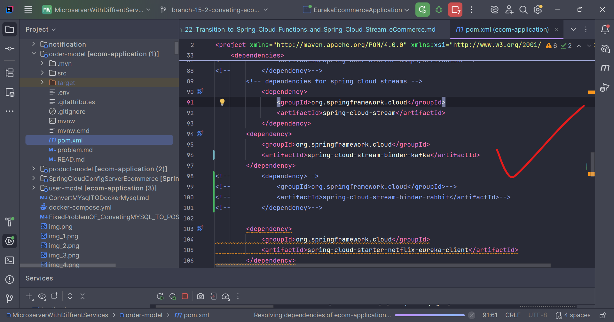
3) 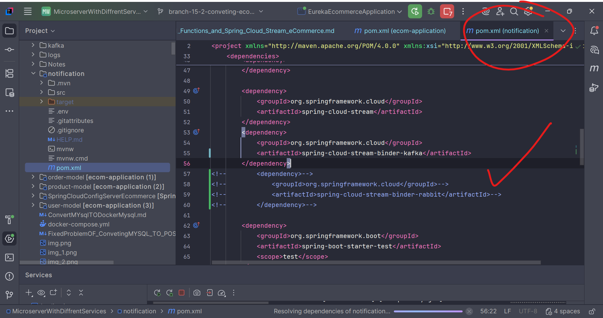
4) 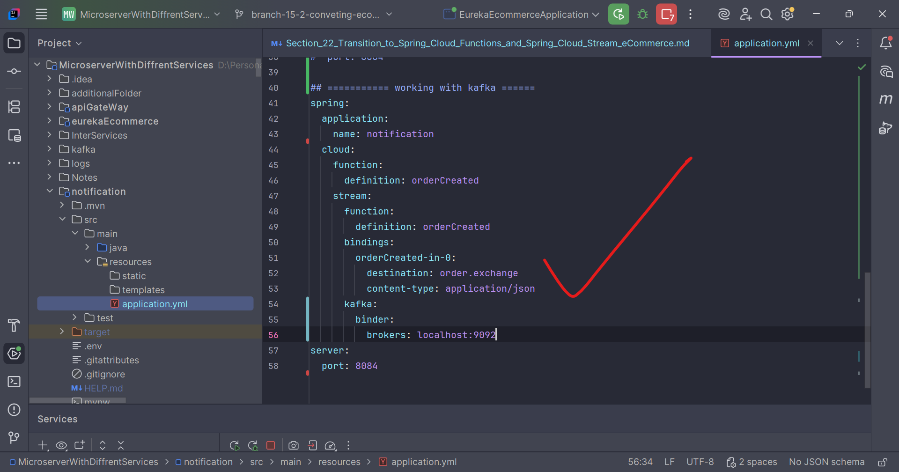
5) 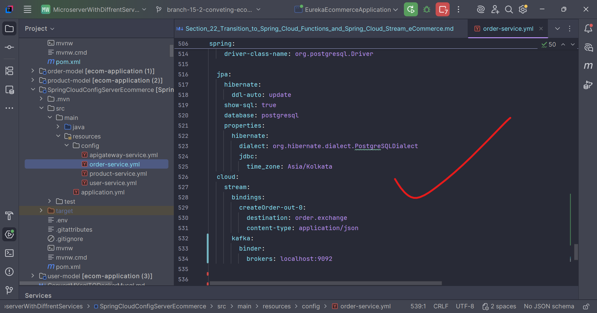
6) 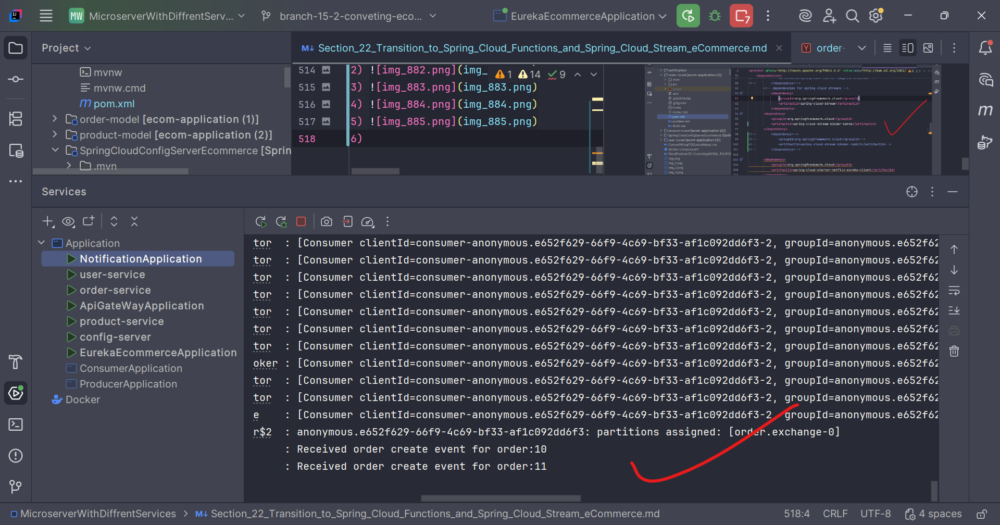
7) 