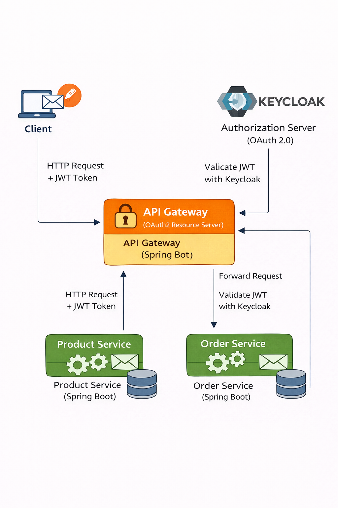

## ---------- Microservices_Security_with_OAuth2_and_Keycloak with full notes 0 to 100 ---
Below are **complete, structured, PDF-style notes (0 → 100 level)** on

# 🔐 **Microservices Security with OAuth2 & Keycloak**

These notes are **beginner → advanced**, **interview-ready**, and **real-world architecture focused**.

---

# 📘 Microservices Security with OAuth2 & Keycloak

**(From Zero to Production Level)**

---

## 1️⃣ Why Security Is Critical in Microservices

In microservices:

* Services are **distributed**
* Communication happens over **networks**
* Many entry points exist

❌ Traditional session-based security **fails**

### Challenges:

* Multiple services
* Stateless APIs
* Scalability
* Secure inter-service communication
* Centralized authentication

✅ **Solution** → OAuth2 + OpenID Connect + Keycloak

---

## 2️⃣ What Is OAuth 2.0?

### 📌 Definition

**OAuth 2.0** is an **authorization framework** that allows applications to access protected resources **without sharing passwords**.

> OAuth2 answers:
> **“What can you access?”**

---

## 3️⃣ OAuth2 Key Terms (MUST KNOW)

| Term                 | Meaning        |
| -------------------- | -------------- |
| Resource Owner       | User           |
| Client               | Frontend / App |
| Authorization Server | Keycloak       |
| Resource Server      | Microservice   |
| Access Token         | JWT token      |
| Scope                | Permission     |
| Refresh Token        | Token renewal  |

---

## 4️⃣ OAuth2 Roles in Microservices

```
User → Client → Authorization Server (Keycloak)
                     ↓
              Access Token (JWT)
                     ↓
              Resource Server (Microservice)
```

---

## 5️⃣ OAuth2 Grant Types (IMPORTANT)

### 🔹 1. Authorization Code (MOST USED)

* Web & SPA apps
* Secure
* Uses redirect + token exchange

### 🔹 2. Client Credentials

* Service-to-service communication
* No user involved

### 🔹 3. Password Grant ❌ (Deprecated)

* Username/password directly
* Not recommended

### 🔹 4. Refresh Token

* Used to get new access tokens

---

## 6️⃣ What Is OpenID Connect (OIDC)?

📌 **OIDC = Authentication layer on OAuth2**

> OAuth2 → Authorization
> OIDC → Authentication (Who you are)

### Adds:

* ID Token
* User profile
* Standard login flow

---

## 7️⃣ What Is Keycloak?

### 📌 Definition

**Keycloak** is an **open-source Identity & Access Management (IAM)** tool by Red Hat.

### Features:

✔ OAuth2
✔ OpenID Connect
✔ JWT
✔ SSO
✔ Role-based access
✔ LDAP / Active Directory
✔ Social login

---

## 8️⃣ Why Keycloak for Microservices?

| Problem          | Keycloak Solves |
| ---------------- | --------------- |
| Central login    | ✅               |
| Token management | ✅               |
| Role-based auth  | ✅               |
| SSO              | ✅               |
| Scalability      | ✅               |

---

## 9️⃣ Keycloak Core Concepts

### 🔹 Realm

* Security domain
* Example: `ecommerce-realm`

### 🔹 Client

* Application registered in Keycloak
* Example: `api-gateway`, `frontend`

### 🔹 User

* End user

### 🔹 Role

* Permission (ADMIN, USER)

### 🔹 Group

* Collection of users

---

## 🔟 Keycloak Architecture

```
Frontend / Client
      |
      | OAuth2 / OIDC
      ↓
Keycloak (Auth Server)
      |
      | JWT Token
      ↓
API Gateway / Microservices
```

---

## 11️⃣ JWT (JSON Web Token) Explained

### Structure:

```
HEADER.PAYLOAD.SIGNATURE
```

### Payload contains:

* sub (user id)
* roles
* scopes
* expiry

### Why JWT?

✔ Stateless
✔ Fast
✔ No DB lookup

---

## 12️⃣ Security Architecture in Microservices

### Recommended Architecture

```
Client
  ↓
API Gateway (OAuth2 Resource Server)
  ↓
Microservices (JWT validation)
```

✔ Centralized security
✔ No token duplication
✔ Reduced complexity

---

## 13️⃣ API Gateway Security (BEST PRACTICE)

### Responsibilities:

* Validate JWT
* Forward user context
* Route requests
* Rate limiting

❌ Do NOT authenticate in every service

---

## 14️⃣ Securing API Gateway with Keycloak

### Flow:

1. Client logs in via Keycloak
2. Gets JWT
3. Sends token to API Gateway
4. Gateway validates token
5. Gateway forwards request

---

## 15️⃣ Securing Microservices

### Two Approaches

### 🔹 Option 1: Gateway-Only Security

* Services trust gateway
* Faster
* Less secure

### 🔹 Option 2: Gateway + Service Security (BEST)

* Each service validates JWT
* Defense-in-depth

---

## 16️⃣ Role-Based Access Control (RBAC)

### Example:

```java
@PreAuthorize("hasRole('ADMIN')")
@GetMapping("/admin")
public String adminOnly() {}
```

### Roles come from:

* JWT token
* Keycloak realm roles

---

## 17️⃣ Method-Level Security

Enable:

```java
@EnableMethodSecurity
```

Use:

* `@PreAuthorize`
* `@PostAuthorize`
* `@Secured`

---

## 18️⃣ Client Credentials Flow (Service-to-Service)

### Use Case:

* Order → Inventory service

### Flow:

```
Service A → Keycloak → Token → Service B
```

✔ No user context
✔ Secure backend communication

---

## 19️⃣ Token Validation in Spring Boot

Spring Security automatically:

* Verifies signature
* Checks expiry
* Validates issuer

Using:

```yaml
spring:
  security:
    oauth2:
      resourceserver:
        jwt:
          issuer-uri: http://localhost:8080/realms/myrealm
```

---

## 20️⃣ Token Propagation Between Services

Gateway forwards token:

```http
Authorization: Bearer eyJhbGciOi...
```

Services extract:

```java
SecurityContextHolder.getContext()
```

---

## 21️⃣ Refresh Token Flow

✔ Long sessions
✔ Short-lived access tokens

Client uses refresh token to request new access token.

---

## 22️⃣ Securing Public vs Protected APIs

| API Type | Security   |
| -------- | ---------- |
| Login    | Public     |
| Register | Public     |
| Orders   | Protected  |
| Admin    | Role-based |

---

## 23️⃣ Multi-Tenant Security

* One realm per tenant OR
* One realm + tenant claim

Used in SaaS applications.

---

## 24️⃣ Token Customization in Keycloak

Add:

* Custom claims
* Roles
* Organization info

---

## 25️⃣ Common Security Threats & Mitigation

| Threat              | Solution      |
| ------------------- | ------------- |
| Token theft         | HTTPS         |
| Replay attack       | Short expiry  |
| CSRF                | Stateless JWT |
| Brute force         | Rate limiting |
| Unauthorized access | RBAC          |

---

## 26️⃣ Best Practices (VERY IMPORTANT)

✅ Use short-lived tokens
✅ Secure gateway first
✅ Use HTTPS everywhere
✅ Centralize authentication
✅ Use Client Credentials for services
✅ Enable method-level security
✅ Avoid storing tokens in DB

---

## 27️⃣ Common Mistakes

❌ Validating tokens manually
❌ Using password grant
❌ No gateway security
❌ Hardcoding secrets
❌ Long token expiry

---

## 28️⃣ Interview Questions (MUST PREPARE)

1. OAuth2 vs OpenID Connect?
2. JWT vs Session?
3. Why Keycloak?
4. How does API Gateway handle security?
5. How do services communicate securely?
6. What is client credentials flow?
7. How is token validated?

---

## 29️⃣ Real-World Example (E-Commerce)

```
User → Login → Keycloak
        ↓
     JWT Token
        ↓
API Gateway → Order Service → Inventory Service
```

✔ Secure
✔ Scalable
✔ Production-ready

---

## 🔟 30️⃣ One-Line Summary

> **OAuth2 + Keycloak provide centralized, scalable, and secure authentication and authorization for microservices using JWT-based stateless security.**

---

If you want next:
✅ **Spring Boot + Keycloak full code project**
✅ **API Gateway + Keycloak integration**
✅ **PDF download format**
✅ **Architecture & sequence diagrams**
✅ **Interview Q&A only**

Just tell me 👍

## ---------- Spring Boot + Keycloak full code project ----
Perfect 👍
Below is a **complete Spring Boot + Keycloak full code project (production-style)** with **API Gateway + Microservice security**, explained step-by-step.

I’ll cover:

1. **Architecture**
2. **Keycloak setup**
3. **API Gateway (secured)**
4. **Microservice (secured)**
5. **JWT role mapping**
6. **Testing with Postman**
7. **Common issues & fixes**

---

# 🔐 Spring Boot + Keycloak Full Code Project

## 🏗️ Architecture

```
Client (Postman / Frontend)
        |
        |  JWT Token
        ↓
API Gateway (Spring Cloud Gateway)
        |
        ↓
Product Service / Order Service
        |
        ↓
Database
```

✔ Keycloak = Authorization Server
✔ Gateway + Services = Resource Servers
✔ JWT-based security

---

## 1️⃣ Keycloak Setup (MANDATORY FIRST)

### 🔹 Step 1: Start Keycloak (Docker – Recommended)

```bash
docker run -p 8080:8080 \
-e KEYCLOAK_ADMIN=admin \
-e KEYCLOAK_ADMIN_PASSWORD=admin \
quay.io/keycloak/keycloak:24.0.1 start-dev
```

Access:

```
http://localhost:8080
```

---

### 🔹 Step 2: Create Realm

* Realm name: `ecommerce-realm`

---

### 🔹 Step 3: Create Client (API Gateway)

| Field            | Value          |
| ---------------- | -------------- |
| Client ID        | api-gateway    |
| Client Type      | OpenID Connect |
| Access Type      | Confidential   |
| Authorization    | ON             |
| Service Accounts | ON             |

---

### 🔹 Step 4: Create Roles

Realm Roles:

* `USER`
* `ADMIN`

---

### 🔹 Step 5: Create User

* Username: `ritik`
* Password: `1234`
* Assign roles: `USER`

---

## 2️⃣ API Gateway – Spring Boot Project

### 🔹 Dependencies (`pom.xml`)

```xml
<dependencies>

    <!-- Gateway -->
    <dependency>
        <groupId>org.springframework.cloud</groupId>
        <artifactId>spring-cloud-starter-gateway</artifactId>
    </dependency>

    <!-- OAuth2 Resource Server -->
    <dependency>
        <groupId>org.springframework.boot</groupId>
        <artifactId>spring-boot-starter-oauth2-resource-server</artifactId>
    </dependency>

    <!-- Eureka Client -->
    <dependency>
        <groupId>org.springframework.cloud</groupId>
        <artifactId>spring-cloud-starter-netflix-eureka-client</artifactId>
    </dependency>

    <!-- Actuator -->
    <dependency>
        <groupId>org.springframework.boot</groupId>
        <artifactId>spring-boot-starter-actuator</artifactId>
    </dependency>

</dependencies>
```

---

### 🔹 application.yml (API Gateway)

```yaml
server:
  port: 8081

spring:
  application:
    name: api-gateway

  cloud:
    gateway:
      routes:
        - id: product-service
          uri: lb://PRODUCT-SERVICE
          predicates:
            - Path=/products/**
          filters:
            - RewritePath=/products(?<segment>/?.*), /api/products${segment}

  security:
    oauth2:
      resourceserver:
        jwt:
          issuer-uri: http://localhost:8080/realms/ecommerce-realm

eureka:
  client:
    service-url:
      defaultZone: http://localhost:8761/eureka
```

---

### 🔹 Security Configuration (Gateway)

```java
@Configuration
@EnableWebFluxSecurity
public class SecurityConfig {

    @Bean
    public SecurityWebFilterChain filterChain(ServerHttpSecurity http) {

        http
            .csrf(ServerHttpSecurity.CsrfSpec::disable)
            .authorizeExchange(exchange -> exchange
                .pathMatchers("/actuator/**").permitAll()
                .pathMatchers("/products/**").hasAnyRole("USER", "ADMIN")
                .anyExchange().authenticated()
            )
            .oauth2ResourceServer(oauth2 ->
                oauth2.jwt(Customizer.withDefaults())
            );

        return http.build();
    }
}
```

✔ JWT validated at Gateway
✔ Role-based routing

---

## 3️⃣ Product Service (Microservice)

### 🔹 Dependencies

```xml
<dependency>
    <groupId>org.springframework.boot</groupId>
    <artifactId>spring-boot-starter-security</artifactId>
</dependency>

<dependency>
    <groupId>org.springframework.boot</groupId>
    <artifactId>spring-boot-starter-oauth2-resource-server</artifactId>
</dependency>
```

---

### 🔹 application.yml (Product Service)

```yaml
server:
  port: 8082

spring:
  application:
    name: product-service

  security:
    oauth2:
      resourceserver:
        jwt:
          issuer-uri: http://localhost:8080/realms/ecommerce-realm
```

---

### 🔹 Security Config (Product Service)

```java
@Configuration
@EnableMethodSecurity
public class SecurityConfig {

    @Bean
    SecurityFilterChain filterChain(HttpSecurity http) throws Exception {

        http
            .csrf(csrf -> csrf.disable())
            .authorizeHttpRequests(auth -> auth
                .requestMatchers("/api/products/public").permitAll()
                .requestMatchers("/api/products/admin").hasRole("ADMIN")
                .anyRequest().authenticated()
            )
            .oauth2ResourceServer(oauth2 ->
                oauth2.jwt(Customizer.withDefaults())
            );

        return http.build();
    }
}
```

---

### 🔹 Controller

```java
@RestController
@RequestMapping("/api/products")
public class ProductController {

    @GetMapping
    public String products() {
        return "Products for USER";
    }

    @GetMapping("/admin")
    public String adminProducts() {
        return "Admin Products";
    }
}
```

---

## 4️⃣ Role Mapping (IMPORTANT)

Keycloak sends roles like:

```
realm_access.roles = ["USER"]
```

Spring expects:

```
ROLE_USER
```

### 🔹 Add Converter

```java
@Bean
JwtAuthenticationConverter jwtAuthenticationConverter() {
    JwtGrantedAuthoritiesConverter converter =
        new JwtGrantedAuthoritiesConverter();
    converter.setAuthorityPrefix("ROLE_");
    converter.setAuthoritiesClaimName("realm_access.roles");

    JwtAuthenticationConverter jwtConverter =
        new JwtAuthenticationConverter();
    jwtConverter.setJwtGrantedAuthoritiesConverter(converter);

    return jwtConverter;
}
```

---

## 5️⃣ Test Flow (Postman)

### 🔹 Step 1: Get Token

```
POST http://localhost:8080/realms/ecommerce-realm/protocol/openid-connect/token
```

Body (x-www-form-urlencoded):

```
client_id=api-gateway
username=ritik
password=1234
grant_type=password
```

---

### 🔹 Step 2: Call API Gateway

```
GET http://localhost:8081/products
Authorization: Bearer <TOKEN>
```

✅ Works

```
GET http://localhost:8081/products/admin
```

❌ 403 (if USER)

---

## 6️⃣ Service-to-Service Security (Client Credentials)

* Create Keycloak client: `order-service`
* Enable **Service Accounts**
* Use `client_credentials` grant

Used when:

```
Order Service → Inventory Service
```

---

## 7️⃣ Common Errors & Fixes

| Error            | Fix                   |
| ---------------- | --------------------- |
| 401 Unauthorized | Wrong issuer-uri      |
| 403 Forbidden    | Role mapping issue    |
| No roles         | Missing JWT converter |
| Token invalid    | Realm mismatch        |

---

## 8️⃣ Best Practices (Production)

✅ Secure Gateway first
✅ Short token expiry
✅ HTTPS everywhere
✅ Client credentials for services
✅ Validate JWT at services
✅ Avoid password grant

---

## 🎯 Final Summary

> **Spring Boot + Keycloak provides centralized, scalable, and stateless security for microservices using OAuth2, JWT, and role-based access control.**

---

If you want next 👇
✔ **API Gateway + Keycloak diagram**
✔ **Docker Compose for full setup**
✔ **Refresh token flow**
✔ **PDF-ready notes**
✔ **Interview Q&A**

Just say 👍
## -------  **API Gateway + Keycloak diagram** ---


## --- Docker Compose for full setup --
Below is a **complete, production-style Docker Compose setup** for a **Microservices system with**:

✅ **Spring Cloud API Gateway**
✅ **Keycloak (OAuth2 / OpenID Connect)**
✅ **Microservices (User, Product)**
✅ **PostgreSQL for Keycloak**
✅ **Docker networking (single bridge)**

This is a **real-world reference architecture** you can directly run and extend.

---

## 🧱 Architecture (What this setup contains)

```
Client
  ↓
API Gateway (Spring Cloud Gateway)
  ↓
Keycloak (Auth Server)
  ↓
Microservices (User / Product)
```

---

# 1️⃣ Folder Structure

```
microservices-docker/
│
├── docker-compose.yml
│
├── gateway/
│   └── Dockerfile
│
├── user-service/
│   └── Dockerfile
│
├── product-service/
│   └── Dockerfile
│
└── keycloak/
    └── realm-export.json
```

---

# 2️⃣ docker-compose.yml (FULL SETUP)

```yaml
version: '3.9'

services:

  postgres:
    image: postgres:15
    container_name: keycloak-postgres
    restart: always
    environment:
      POSTGRES_DB: keycloak
      POSTGRES_USER: keycloak
      POSTGRES_PASSWORD: keycloak
    volumes:
      - postgres_data:/var/lib/postgresql/data
    networks:
      - microservices-net

  keycloak:
    image: quay.io/keycloak/keycloak:24.0.3
    container_name: keycloak
    command: start-dev --import-realm
    environment:
      KC_DB: postgres
      KC_DB_URL: jdbc:postgresql://postgres:5432/keycloak
      KC_DB_USERNAME: keycloak
      KC_DB_PASSWORD: keycloak
      KEYCLOAK_ADMIN: admin
      KEYCLOAK_ADMIN_PASSWORD: admin
    ports:
      - "8080:8080"
    depends_on:
      - postgres
    volumes:
      - ./keycloak/realm-export.json:/opt/keycloak/data/import/realm-export.json
    networks:
      - microservices-net

  gateway:
    build: ./gateway
    container_name: api-gateway
    ports:
      - "8081:8081"
    depends_on:
      - keycloak
    environment:
      SPRING_PROFILES_ACTIVE: docker
    networks:
      - microservices-net

  user-service:
    build: ./user-service
    container_name: user-service
    ports:
      - "8082:8082"
    environment:
      SPRING_PROFILES_ACTIVE: docker
    networks:
      - microservices-net

  product-service:
    build: ./product-service
    container_name: product-service
    ports:
      - "8083:8083"
    environment:
      SPRING_PROFILES_ACTIVE: docker
    networks:
      - microservices-net

volumes:
  postgres_data:

networks:
  microservices-net:
    driver: bridge
```

---

# 3️⃣ Dockerfile (Common for All Spring Boot Apps)

📌 Use **same Dockerfile** in `gateway`, `user-service`, `product-service`

```dockerfile
FROM eclipse-temurin:17-jdk-alpine

WORKDIR /app

ARG JAR_FILE=target/*.jar
COPY ${JAR_FILE} app.jar

EXPOSE 8080

ENTRYPOINT ["java","-jar","/app/app.jar"]
```

---

# 4️⃣ API Gateway Configuration (application.yml)

```yaml
server:
  port: 8081

spring:
  cloud:
    gateway:
      routes:
        - id: user-service
          uri: http://user-service:8082
          predicates:
            - Path=/api/users/**

        - id: product-service
          uri: http://product-service:8083
          predicates:
            - Path=/api/products/**

  security:
    oauth2:
      resourceserver:
        jwt:
          issuer-uri: http://keycloak:8080/realms/microservices
```

---

# 5️⃣ User/Product Service Security Config

```yaml
server:
  port: 8082

spring:
  security:
    oauth2:
      resourceserver:
        jwt:
          issuer-uri: http://keycloak:8080/realms/microservices
```

---

# 6️⃣ Spring Security Config (Microservices)

```java
@Configuration
@EnableWebSecurity
public class SecurityConfig {

    @Bean
    public SecurityFilterChain filterChain(HttpSecurity http) throws Exception {
        http
            .authorizeHttpRequests(auth -> auth
                .requestMatchers("/public/**").permitAll()
                .anyRequest().authenticated()
            )
            .oauth2ResourceServer(OAuth2ResourceServerConfigurer::jwt);

        return http.build();
    }
}
```

---

# 7️⃣ Keycloak Realm (realm-export.json – minimal)

```json
{
  "realm": "microservices",
  "enabled": true,
  "clients": [
    {
      "clientId": "gateway-client",
      "enabled": true,
      "protocol": "openid-connect",
      "publicClient": true,
      "redirectUris": ["*"]
    }
  ]
}
```

---

# 8️⃣ Run Everything 🚀

```bash
docker-compose up --build
```

---

# 9️⃣ Access URLs

| Service         | URL                                            |
| --------------- | ---------------------------------------------- |
| Keycloak Admin  | [http://localhost:8080](http://localhost:8080) |
| API Gateway     | [http://localhost:8081](http://localhost:8081) |
| User Service    | [http://localhost:8082](http://localhost:8082) |
| Product Service | [http://localhost:8083](http://localhost:8083) |

---

# 🔐 Authentication Flow

1️⃣ Login via **Keycloak**
2️⃣ Get **JWT Token**
3️⃣ Send token to **API Gateway**
4️⃣ Gateway forwards to Microservice
5️⃣ Microservice validates token

---

# 🧠 Industry Best Practices Used

✅ OAuth2 Resource Server
✅ Centralized API Gateway
✅ Stateless JWT
✅ Docker Network Isolation
✅ Externalized Config
✅ Realm Import Automation

---

If you want next 👇
✅ **Kafka/RabbitMQ added**
✅ **Eureka + Load Balancing**
✅ **Resilience4J + Circuit Breaker**
✅ **Kubernetes version**

Just tell me 👍

## ----------- Introduction to Client Credentials Flow from 0 to 100 --
Below is a **complete 0 → 100 guide** to **OAuth 2.0 Client Credentials Flow**, written in a **clean, practical, Spring Boot–friendly way**, aligned with **microservices & MNC expectations**.

---

# 🔐 OAuth 2.0 Client Credentials Flow

### **From Beginner to Production (0 → 100)**

---

## 0️⃣ What is OAuth 2.0 (Very Simple)

**OAuth 2.0** is a **secure authorization framework** that allows applications to access APIs **without sharing passwords**.

Think of it as:

> “Give this app permission to access my API, not my login details.”

---

## 1️⃣ What is Client Credentials Flow?

### 📌 Definition

**Client Credentials Flow** is an OAuth2 flow where:

* **Machine talks to Machine**
* ❌ No user involved
* ✅ Service authenticates using **client_id + client_secret**

### 🧠 Best For:

* Microservice → Microservice
* Backend jobs
* Cron services
* API-to-API communication

---

## 2️⃣ When to Use Client Credentials Flow

| Use Case           | Use This Flow        |
| ------------------ | -------------------- |
| Backend → Backend  | ✅ Client Credentials |
| User Login         | ❌ Authorization Code |
| Mobile App         | ❌ Password Flow      |
| System Integration | ✅ Client Credentials |

---

## 3️⃣ Real-Life Example

### 🏦 E-Commerce Microservices

```
Order Service  --->  Payment Service
              --->  Inventory Service
```

✔ No user
✔ Secure
✔ Token-based

---

## 4️⃣ Flow Diagram (High Level)

```
Client (Service A)
     |
     |  client_id + client_secret
     |
Auth Server (Keycloak)
     |
     |  access_token (JWT)
     |
Resource Server (Service B)
```

---

## 5️⃣ Step-by-Step Flow

### Step 1️⃣ Client Requests Token

```
POST /oauth2/token
```

With:

* client_id
* client_secret
* grant_type=client_credentials

---

### Step 2️⃣ Auth Server Validates Client

✔ Valid client
✔ Valid secret
✔ Valid scope

---

### Step 3️⃣ Auth Server Issues Token

```json
{
  "access_token": "eyJhbGciOiJIUzI1NiIsInR5cCI6IkpXVCJ9...",
  "token_type": "Bearer",
  "expires_in": 300
}
```

---

### Step 4️⃣ Client Calls API

```http
Authorization: Bearer <access_token>
```

---

### Step 5️⃣ Resource Server Validates Token

✔ Signature
✔ Expiry
✔ Scope

---

## 6️⃣ Key Concepts (Very Important)

### 🔑 Client ID

* Public identifier
* Like username

### 🔐 Client Secret

* Private key
* Like password
* **Never expose in frontend**

### 🎟 Access Token

* Short-lived
* Usually JWT

### 🧭 Scope

* What the client is allowed to do

---

## 7️⃣ Client Credentials vs Authorization Code

| Feature            | Client Credentials | Auth Code |
| ------------------ | ------------------ | --------- |
| User Login         | ❌ No               | ✅ Yes     |
| Browser Redirect   | ❌ No               | ✅ Yes     |
| Machine-to-Machine | ✅ Yes              | ❌ No      |
| Security Level     | High               | Very High |

---

## 8️⃣ Token Format (JWT)

A JWT has **3 parts**:

```
HEADER.PAYLOAD.SIGNATURE
```

### Example Payload:

```json
{
  "iss": "http://auth-server",
  "client_id": "payment-service",
  "scope": "payment.read",
  "exp": 1712345678
}
```

---

## 9️⃣ Why Client Credentials is Secure

✔ No user password
✔ Short-lived token
✔ Token scopes
✔ TLS encryption

---

## 🔟 Common Authorization Servers

| Server                      | Support |
| --------------------------- | ------- |
| Keycloak                    | ✅       |
| Auth0                       | ✅       |
| Okta                        | ✅       |
| Spring Authorization Server | ✅       |

---

## 1️⃣1️⃣ Setting Up in Keycloak (Conceptual)

1. Create **Realm**
2. Create **Client**
3. Set:

    * Access Type: `Confidential`
    * Enable **Service Accounts**
4. Generate Client Secret
5. Assign Roles / Scopes

---

## 1️⃣2️⃣ Spring Boot Client (Calling Another Service)

### Dependency

```xml
<dependency>
  <groupId>org.springframework.boot</groupId>
  <artifactId>spring-boot-starter-oauth2-client</artifactId>
</dependency>
```

---

### application.yml

```yaml
spring:
  security:
    oauth2:
      client:
        registration:
          payment-client:
            client-id: payment-service
            client-secret: secret123
            authorization-grant-type: client_credentials
            scope: payment.read
        provider:
          keycloak:
            token-uri: http://localhost:8483/realms/auth2/protocol/openid-connect/token
```

---

### WebClient with OAuth2

```java
@Bean
WebClient webClient(ClientRegistrationRepository repo,
                    OAuth2AuthorizedClientService service) {

    ServletOAuth2AuthorizedClientExchangeFilterFunction oauth =
            new ServletOAuth2AuthorizedClientExchangeFilterFunction(repo, service);

    oauth.setDefaultClientRegistrationId("payment-client");

    return WebClient.builder()
            .apply(oauth.oauth2Configuration())
            .build();
}
```

---

## 1️⃣3️⃣ Resource Server (API Protection)

### Dependency

```xml
<dependency>
  <groupId>org.springframework.boot</groupId>
  <artifactId>spring-boot-starter-oauth2-resource-server</artifactId>
</dependency>
```

---

### application.yml

```yaml
spring:
  security:
    oauth2:
      resourceserver:
        jwt:
          issuer-uri: http://localhost:8483/realms/auth2
```

---

### Security Config

```java
@Bean
SecurityFilterChain security(HttpSecurity http) throws Exception {
    http
      .authorizeHttpRequests(auth -> auth
        .anyRequest().authenticated()
      )
      .oauth2ResourceServer(oauth -> oauth.jwt());

    return http.build();
}
```

---

## 1️⃣4️⃣ Role & Scope Based Authorization

```java
@PreAuthorize("hasAuthority('SCOPE_payment.read')")
@GetMapping("/payments")
public List<Payment> getPayments() {
    return service.findAll();
}
```

---

## 1️⃣5️⃣ Common Mistakes (Interview Favorite)

❌ Using client secret in frontend
❌ Long token expiry
❌ No scopes
❌ No HTTPS
❌ Using password grant (deprecated)

---

## 1️⃣6️⃣ Client Credentials in Microservices

### Best Practice

✔ One client per service
✔ Least privilege scopes
✔ Rotate secrets
✔ Central auth server
✔ API Gateway validation

---

## 1️⃣7️⃣ Client Credentials with API Gateway

```
Client → API Gateway → Microservice
```

Gateway:

* Validates token
* Forwards request

---

## 1️⃣8️⃣ Production Checklist

✅ HTTPS only
✅ Short-lived tokens
✅ Rotate secrets
✅ Centralized logging
✅ Rate limiting

---

## 1️⃣9️⃣ Interview Questions

**Q: When do you use client credentials?**
A: Machine-to-machine communication without user context.

**Q: Can frontend use this flow?**
A: ❌ No, client secret must stay private.

---

## 2️⃣0️⃣ Final Summary

> Client Credentials Flow is the **backbone of secure microservices communication**.

If you know:
✔ OAuth2 basics
✔ JWT
✔ Scopes
✔ Spring Security

👉 You are **production-ready**.

---

## 🚀 Next Topics (Tell me what you want)

* Client Credentials with **Spring Authorization Server**
* OAuth2 + **API Gateway**
* Keycloak **roles vs scopes**
* Kafka + OAuth2
* OAuth2 interview preparation (MNC level)

Just say **“next”** 🔥

## ========== Introduction to PKCE Flow from 0 to 100 ===========
Perfect 👌 Let’s understand **PKCE (Proof Key for Code Exchange)** from absolute beginner level to advanced level — step by step.

I’ll explain it in a way that makes it crystal clear for interviews + real projects.

---

# 🔥 1️⃣ Why PKCE Even Exists?

Before PKCE, we had:

### OAuth2 Authorization Code Flow

```
Client → Authorization Server → Get Code
Client → Exchange Code → Get Token
```

This works fine for:

* Backend applications (confidential clients)
* Apps that can securely store client_secret

---

## ❌ The Problem

Public clients like:

* Mobile Apps
* React Apps
* SPA (Single Page Apps)
* Desktop apps

CANNOT safely store `client_secret`.

If attacker steals the authorization code,
they can exchange it for token.

🚨 This is called:
**Authorization Code Interception Attack**

---

# 💡 2️⃣ What PKCE Solves

PKCE prevents:

> Even if someone steals the authorization code,
> they cannot exchange it for a token.

Without knowing the secret proof.

---

# 🧠 3️⃣ PKCE in Simple Words

PKCE adds a **dynamic secret per request**.

Instead of:

```
Client Secret (static)
```

We generate:

```
Code Verifier (random secret)
Code Challenge (hashed version of verifier)
```

---

# 🔥 4️⃣ Full PKCE Flow (Step by Step)

Let’s go 0 → 100

---

## Step 1: Client Generates Code Verifier

Random high-entropy string:

```
code_verifier = random_128_char_string
```

Example:

```
dBjftJeZ4CVP-mB92K27uhbUJU1p1r_wW1gFWFOEjXk
```

---

## Step 2: Create Code Challenge

We hash it:

```
code_challenge = BASE64URL(SHA256(code_verifier))
```

Now we have:

* code_verifier (secret)
* code_challenge (public)

---

## Step 3: Authorization Request

Client redirects user:

```
GET /authorize?
  response_type=code
  &client_id=abc
  &code_challenge=XYZ
  &code_challenge_method=S256
```

Important:

We DO NOT send code_verifier here.

---

## Step 4: User Logs In

Authorization server:

* Authenticates user
* Stores:

    * authorization_code
    * code_challenge

---

## Step 5: Authorization Server Sends Code

```
Client receives:
?code=AUTH_CODE_123
```

---

## Step 6: Token Exchange

Now client sends:

```
POST /token
  grant_type=authorization_code
  code=AUTH_CODE_123
  code_verifier=original_secret
```

---

## Step 7: Server Verifies

Server:

1. Takes received `code_verifier`
2. Hashes it
3. Compares with stored `code_challenge`

If match → issue token
If not → reject

---

# 🔥 Why This Is Secure

Even if attacker steals:

```
authorization_code
```

They still need:

```
code_verifier
```

Which was never sent publicly.

So token exchange fails.

---

# 🧠 5️⃣ Visual Flow

```
Client:
  generate verifier
  create challenge
       ↓
Authorization Server:
  store challenge
       ↓
Client:
  send verifier
       ↓
Server:
  hash verifier
  compare with stored challenge
       ↓
If match → token
```

---

# 🔥 6️⃣ PKCE vs Client Secret

| Feature                 | Client Secret | PKCE |
| ----------------------- | ------------- | ---- |
| Static secret           | Yes           | No   |
| Safe for SPA            | ❌             | ✅    |
| Safe for mobile         | ❌             | ✅    |
| Required in modern apps | No            | YES  |

---

# 🚀 7️⃣ Where PKCE Is Mandatory Today

PKCE is REQUIRED for:

* Mobile apps
* React apps
* Public clients
* OAuth2 Authorization Code flow in modern systems

Even backend apps now often use PKCE.

---

# 🔥 8️⃣ In Keycloak

To enable PKCE:

Client → Settings:

* Access Type: Public
* Enable PKCE
* Method: S256

That’s it.

---

# 🏆 9️⃣ Interview Level Explanation

If interviewer asks:

> What is PKCE?

Answer:

"PKCE is a security extension to OAuth2 Authorization Code Flow that prevents authorization code interception attacks by introducing a dynamic per-request secret called code_verifier and its hashed form code_challenge. It ensures that the client exchanging the authorization code is the same client that initiated the request."

---

# 🎯 10️⃣ Real-World Architecture

Without PKCE (Bad for SPA):

```
React App → Backend → Keycloak
```

With PKCE (Modern Standard):

```
React App → Keycloak (PKCE) → Get Token
React App → Backend (Bearer token)
```

---

# 🔥 11️⃣ PKCE + Spring Boot

Spring Boot automatically supports PKCE when:

```
authorization-grant-type: authorization_code
```

and client is public.

---

# 💎 12️⃣ Common Misunderstandings

❌ PKCE is NOT encryption
❌ PKCE is NOT replacing JWT
❌ PKCE is NOT for client_credentials

✅ PKCE is only for Authorization Code flow

---

# 🏁 Final Summary

PKCE:

* Protects authorization code
* Removes need for client secret in public apps
* Uses:

    * code_verifier
    * code_challenge
* Required for SPA and mobile
* Modern OAuth standard

---

If you want next, I can explain:

* 🔥 PKCE vs Implicit Flow
* 🔥 PKCE vs Client Credentials
* 🔥 PKCE in Spring Boot + Keycloak full example
* 🔥 PKCE attack simulation explanation

Tell me which direction you want 😄

## ============ PKCE in Spring Boot + Keycloak full example ====
Perfect 🔥
Let’s build **PKCE in Spring Boot + Keycloak (Full Working Example)** step-by-step.

We’ll build this architecture:

```
Browser
   ↓
Spring Boot App (OAuth2 Client with PKCE)
   ↓
Keycloak (Authorization Server)
```

We’ll use:

* ✅ Authorization Code Flow
* ✅ PKCE (S256)
* ✅ No client secret (Public client)
* ✅ Spring Boot 3.x
* ✅ Keycloak 26.x

---

# 🚀 PART 1 — Configure Keycloak

## 1️⃣ Start Keycloak

```bash
docker run -d -p 8483:8080 \
-e KC_BOOTSTRAP_ADMIN_USERNAME=admin \
-e KC_BOOTSTRAP_ADMIN_PASSWORD=admin \
quay.io/keycloak/keycloak:26.5.0 \
start-dev --hostname=localhost
```

Open:

```
http://localhost:8483
```

Login:
admin / admin

---

## 2️⃣ Create Realm

Create realm:

```
auth2
```

---

## 3️⃣ Create Client

Go to → Clients → Create Client

### Settings:

| Setting               | Value          |
| --------------------- | -------------- |
| Client ID             | spring-pkce    |
| Client Type           | OpenID Connect |
| Access Type           | Public         |
| Standard Flow         | ✅ Enabled      |
| Client Authentication | ❌ Disabled     |

---

### 🔐 Enable PKCE

In client settings:

* Proof Key for Code Exchange: **Required**
* Code Challenge Method: **S256**

Save.

---

## 4️⃣ Create User

Users → Create User

Username: test
Password: test
Disable temporary password.

---

# 🚀 PART 2 — Spring Boot Application

## 1️⃣ Dependencies (pom.xml)

```xml
<dependencies>

    <dependency>
        <groupId>org.springframework.boot</groupId>
        <artifactId>spring-boot-starter-web</artifactId>
    </dependency>

    <dependency>
        <groupId>org.springframework.boot</groupId>
        <artifactId>spring-boot-starter-oauth2-client</artifactId>
    </dependency>

    <dependency>
        <groupId>org.springframework.boot</groupId>
        <artifactId>spring-boot-starter-security</artifactId>
    </dependency>

</dependencies>
```

---

## 2️⃣ application.yml

```yaml
server:
  port: 8080

spring:
  security:
    oauth2:
      client:
        registration:
          keycloak:
            provider: keycloak
            client-id: spring-pkce
            authorization-grant-type: authorization_code
            scope: openid, profile
            redirect-uri: "{baseUrl}/login/oauth2/code/{registrationId}"

        provider:
          keycloak:
            issuer-uri: http://localhost:8483/realms/auth2
```

⚠️ Notice:

* No client-secret
* Authorization Code Flow
* issuer-uri only (Spring auto fetches endpoints)

---

# 🚀 PART 3 — Security Configuration

```java
@Configuration
@EnableWebSecurity
public class SecurityConfig {

    @Bean
    public SecurityFilterChain filterChain(HttpSecurity http) throws Exception {

        http
            .authorizeHttpRequests(auth -> auth
                .requestMatchers("/").permitAll()
                .anyRequest().authenticated()
            )
            .oauth2Login(Customizer.withDefaults());

        return http.build();
    }
}
```

That’s it.

Spring automatically:

* Detects public client
* Enables PKCE
* Generates code_verifier
* Sends code_challenge
* Handles token exchange

You do NOT write PKCE code manually.

---

# 🚀 PART 4 — Controller

```java
@RestController
public class HomeController {

    @GetMapping("/")
    public String home() {
        return "Public Home";
    }

    @GetMapping("/secure")
    public String secure(Authentication authentication) {
        return "Hello " + authentication.getName();
    }
}
```

---

# 🚀 PART 5 — Run Application

Start Spring Boot:

```
http://localhost:8080/secure
```

You will be redirected to:

```
Keycloak login page
```

Login:

```
test / test
```

After login:

You’ll see:

```
Hello test
```

---

# 🔥 What Just Happened Internally

Spring did this automatically:

1️⃣ Generated random `code_verifier`
2️⃣ Created `code_challenge = SHA256(verifier)`
3️⃣ Sent `code_challenge` to Keycloak
4️⃣ After login received authorization code
5️⃣ Sent `code_verifier` to token endpoint
6️⃣ Keycloak verified
7️⃣ Issued access token

You didn’t write a single PKCE line.

---

# 🧠 How to Verify PKCE Is Working

Open browser DevTools → Network → Authorization request

You’ll see:

```
code_challenge=abcxyz
code_challenge_method=S256
```

That confirms PKCE.

---

# 🔥 Token Access (Optional)

If you want to get access token inside controller:

```java
@GetMapping("/token")
public String token(@AuthenticationPrincipal OAuth2User user,
                    OAuth2AuthorizedClient authorizedClient) {

    return authorizedClient.getAccessToken().getTokenValue();
}
```

---

# 🧠 Important Notes

### PKCE is used only with:

```
authorization_code flow
```

### PKCE is NOT used with:

```
client_credentials
```

---

# 🎯 Architecture Comparison

## Without PKCE (Old way)

```
SPA → Backend → Keycloak
```

## With PKCE (Modern)

```
SPA → Keycloak (PKCE)
SPA → Backend (Bearer token)
```

---

# 🏆 Interview Answer

If asked:

> How does Spring Boot support PKCE?

Answer:

Spring Boot automatically enables PKCE when using Authorization Code Flow with a public client. It generates a code_verifier and code_challenge internally and handles verification during token exchange.

---

# 🎁 If You Want Next

I can now explain:

* 🔥 PKCE + React + Spring Boot backend
* 🔥 PKCE + Microservices architecture
* 🔥 Deep dive into how Spring internally implements PKCE
* 🔥 Debugging PKCE failures
* 🔥 PKCE vs Client Credentials architecture

Tell me your next direction 😄

## =========== 310. Implementing PKCE Flow with React ===
## ========= PKCE + React + Spring Boot backend ====
Excellent 🔥
Now we’re moving into **real-world architecture**.

We’ll build this modern production flow:

```
React (PKCE)  →  Keycloak  →  Access Token (JWT)
React  →  Spring Boot Backend (Bearer token)
Spring Boot validates JWT
```

This is the **correct architecture for SPA + backend**.

---

# 🏗️ Architecture Overview

```
1️⃣ React App
   - Public client
   - Uses PKCE
   - Gets access token

2️⃣ Keycloak
   - Authorization Server
   - Validates PKCE
   - Issues JWT

3️⃣ Spring Boot Backend
   - Resource Server
   - Validates JWT
   - No login page
```

Important:

Backend does NOT redirect to login.
Frontend handles authentication.

---

# 🚀 PART 1 — Keycloak Setup

## 1️⃣ Create Realm

```
auth2
```

---

## 2️⃣ Create Client for React

Client ID: `react-pkce`

Settings:

| Setting               | Value          |
| --------------------- | -------------- |
| Client Type           | OpenID Connect |
| Access Type           | Public         |
| Standard Flow         | ✅ Enabled      |
| Client Authentication | ❌ Disabled     |
| PKCE                  | Required       |
| Code Challenge Method | S256           |

---

## 3️⃣ Configure Redirect URLs

In client settings:

```
Valid Redirect URIs:
http://localhost:3000/*

Web Origins:
http://localhost:3000
```

---

## 4️⃣ Create User

```
username: test
password: test
```

---

# 🚀 PART 2 — React App with PKCE

We’ll use official Keycloak JS adapter.

---

## 1️⃣ Install

```bash
npm install keycloak-js
```

---

## 2️⃣ Create keycloak.js

```javascript
import Keycloak from "keycloak-js";

const keycloak = new Keycloak({
  url: "http://localhost:8483",
  realm: "auth2",
  clientId: "react-pkce"
});

export default keycloak;
```

---

## 3️⃣ Update App.js

```javascript
import React, { useEffect, useState } from "react";
import keycloak from "./keycloak";

function App() {

  const [authenticated, setAuthenticated] = useState(false);

  useEffect(() => {
    keycloak.init({
      onLoad: "login-required",
      pkceMethod: "S256"
    }).then(auth => {
      setAuthenticated(auth);
    });
  }, []);

  const callBackend = async () => {
    const response = await fetch("http://localhost:8080/api/secure", {
      headers: {
        Authorization: "Bearer " + keycloak.token
      }
    });

    const data = await response.text();
    alert(data);
  };

  if (!authenticated) return <div>Loading...</div>;

  return (
    <div>
      <h1>Logged in as {keycloak.tokenParsed?.preferred_username}</h1>
      <button onClick={callBackend}>Call Backend</button>
    </div>
  );
}

export default App;
```

---

# 🔥 What Happens Here

When app loads:

```
React → Keycloak (PKCE)
```

PKCE automatically:

* Generates code_verifier
* Generates code_challenge
* Sends to Keycloak
* Exchanges code
* Gets access token

Token stored in memory.

---

# 🚀 PART 3 — Spring Boot Backend (Resource Server)

This backend ONLY validates token.

No oauth2Login here.

---

## 1️⃣ Dependencies

```xml
<dependency>
    <groupId>org.springframework.boot</groupId>
    <artifactId>spring-boot-starter-oauth2-resource-server</artifactId>
</dependency>

<dependency>
    <groupId>org.springframework.boot</groupId>
    <artifactId>spring-boot-starter-security</artifactId>
</dependency>
```

---

## 2️⃣ application.yml

```yaml
server:
  port: 8080

spring:
  security:
    oauth2:
      resourceserver:
        jwt:
          issuer-uri: http://localhost:8483/realms/auth2
```

---

## 3️⃣ SecurityConfig

```java
@Configuration
@EnableWebSecurity
public class SecurityConfig {

    @Bean
    public SecurityFilterChain securityFilterChain(HttpSecurity http) throws Exception {

        http
            .csrf(csrf -> csrf.disable())
            .authorizeHttpRequests(auth -> auth
                .requestMatchers("/api/public").permitAll()
                .anyRequest().authenticated()
            )
            .oauth2ResourceServer(oauth2 ->
                oauth2.jwt(Customizer.withDefaults())
            );

        return http.build();
    }
}
```

---

## 4️⃣ Controller

```java
@RestController
@RequestMapping("/api")
public class TestController {

    @GetMapping("/public")
    public String publicApi() {
        return "Public API";
    }

    @GetMapping("/secure")
    public String secure(Authentication authentication) {
        return "Hello " + authentication.getName();
    }
}
```

---

# 🧠 Full Flow Now

### Step 1

User opens:

```
http://localhost:3000
```

---

### Step 2

React redirects to:

```
Keycloak login
```

Using PKCE.

---

### Step 3

After login:

React gets JWT access token.

---

### Step 4

React calls backend:

```
Authorization: Bearer eyJhbGciOi...
```

---

### Step 5

Spring Boot:

* Fetches Keycloak public key
* Verifies signature
* Verifies issuer
* Validates token

If valid → returns response.

---

# 🔥 Why This Is Best Practice

* No client secret in frontend
* Secure PKCE flow
* Backend is stateless
* Scalable microservices friendly
* Industry standard architecture

---

# 🚨 Important Production Notes

1️⃣ Enable CORS in backend:

```java
http.cors(Customizer.withDefaults());
```

2️⃣ Enable refresh token handling in React:

```javascript
setInterval(() => {
  keycloak.updateToken(30);
}, 10000);
```

3️⃣ Always use HTTPS in production.

---

# 🏆 Interview Explanation

If interviewer asks:

> How do you implement PKCE with React and Spring Boot?

You answer:

"React acts as a public OAuth2 client using Authorization Code Flow with PKCE. It authenticates directly with Keycloak and obtains a JWT access token. The React app then sends the access token as a Bearer token to the Spring Boot backend, which acts as an OAuth2 Resource Server and validates the JWT using the issuer’s public key."

---

# 🔥 Next Level (Advanced)

If you want, I can now explain:

* 🔥 Role-based access with Keycloak + Spring
* 🔥 How to map Keycloak roles in Spring Boot
* 🔥 Multi-service microservice setup
* 🔥 Token refresh deep dive
* 🔥 Logout flow (frontend + backend)

Tell me your next step 😄
