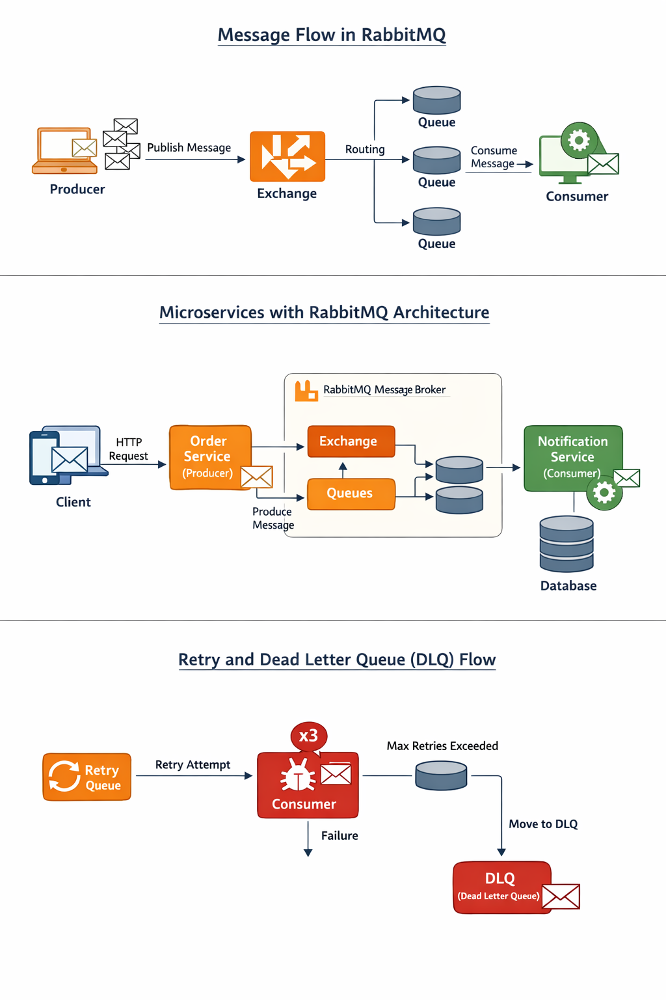

## ------- Asynchronous Communication in Microservices Using RabbitMQ from 0 to 100 every thing give me --
## -- different between Asynchronous Communication and synchronous Communication --
Here is a **clear, interview-ready + real-world explanation** of
**Synchronous vs Asynchronous Communication** in Microservices 👇
(0 → 100, no gaps)

---

# 🔁 Synchronous vs Asynchronous Communication

## 1️⃣ What is Communication in Microservices?

Communication means **how one service talks to another service** to exchange data or trigger actions.

There are **two main ways**:

1. **Synchronous**
2. **Asynchronous**

---

## 2️⃣ Synchronous Communication (Request–Response)

### 🔹 Definition

In **synchronous communication**,
the **client waits** until the **server responds**.

👉 Like a **phone call** 📞
You talk → wait → get an answer

---

### 🔹 How it Works

```
Client → Request → Service A → Response → Client
```

⏳ Client is **blocked** until response comes.

---

### 🔹 Common Technologies

* REST (HTTP)
* Feign Client
* gRPC (sync mode)
* WebClient (blocking usage)

---

### 🔹 Example (Real Life)

ATM withdrawal:

* You request money
* ATM must respond immediately
* You **cannot continue without response**

---

### 🔹 Spring Boot Example

```java
@GetMapping("/orders")
public Order getOrder() {
    return restTemplate.getForObject(
        "http://order-service/api/orders/1",
        Order.class
    );
}
```

---

### 🔹 Advantages ✅

* Simple to implement
* Easy to understand
* Immediate response
* Good for CRUD operations

---

### 🔹 Disadvantages ❌

* Tight coupling
* Blocking (wastes resources)
* Poor fault tolerance
* Cascading failures
* Not scalable under heavy load

---

### 🔹 Problems in Microservices

If Service B is down:

```
Service A ❌ → Service B ❌ → Client ❌
```

➡️ Entire system fails

---

## 3️⃣ Asynchronous Communication (Event / Message-Driven)

### 🔹 Definition

In **asynchronous communication**,
the **sender does NOT wait** for the receiver.

👉 Like **WhatsApp message** 💬
You send → continue your work

---

### 🔹 How it Works

```
Producer → Message Broker → Consumer
```

* Producer sends message
* Consumer processes later
* No direct dependency

---

### 🔹 Common Technologies

* RabbitMQ
* Kafka
* ActiveMQ
* AWS SQS / SNS
* Azure Service Bus

---

### 🔹 Example (Real Life)

Food delivery app:

* You place order
* Order is processed later
* Notifications come asynchronously

---

### 🔹 Spring Boot + RabbitMQ Example

**Producer**

```java
rabbitTemplate.convertAndSend(
    "order.exchange",
    "order.created",
    order
);
```

**Consumer**

```java
@RabbitListener(queues = "order.queue")
public void consume(Order order) {
    System.out.println("Order received: " + order);
}
```

---

### 🔹 Advantages ✅

* High scalability
* Loose coupling
* Non-blocking
* Better fault tolerance
* Handles traffic spikes
* Event-driven architecture

---

### 🔹 Disadvantages ❌

* More complex
* Eventual consistency
* Harder debugging
* Message duplication handling needed

---

## 4️⃣ Direct Comparison Table 🔥

| Feature            | Synchronous       | Asynchronous          |
| ------------------ | ----------------- | --------------------- |
| Communication Type | Request-Response  | Event / Message       |
| Blocking           | Yes ❌             | No ✅                  |
| Coupling           | Tight             | Loose                 |
| Scalability        | Low               | High                  |
| Performance        | Slower under load | Faster                |
| Fault Tolerance    | Poor              | Excellent             |
| Complexity         | Simple            | Medium-High           |
| Consistency        | Strong            | Eventual              |
| Use Case           | CRUD, Queries     | Events, Notifications |

---

## 5️⃣ When to Use Synchronous?

✔ Use **Synchronous** when:

* Immediate response is required
* Simple read/write operations
* Small system
* Low traffic

📌 Examples:

* Login
* Fetch user profile
* Validate data

---

## 6️⃣ When to Use Asynchronous?

✔ Use **Asynchronous** when:

* High traffic
* Background processing
* Loose coupling needed
* Long-running tasks

📌 Examples:

* Order processing
* Email notifications
* Payment events
* Logs & analytics

---

## 7️⃣ Hybrid Approach (Best Practice ⭐)

Modern systems use **both**:

```
Client → API Gateway → Sync Call
                     → Async Events (RabbitMQ)
```

Example:

* Order placed (sync)
* Email sent (async)
* Inventory updated (async)

---

## 8️⃣ Interview Answer (Short & Perfect 🎯)

> **Synchronous communication** is blocking request-response where the client waits for a reply, while **asynchronous communication** is non-blocking event-based where the sender continues without waiting. Synchronous is simpler but less scalable, whereas asynchronous is more resilient and scalable, making it ideal for microservices.

---

## 9️⃣ One-Line Memory Trick 🧠

* **Synchronous = Call & Wait**
* **Asynchronous = Send & Forget**

---

If you want next:
✅ Diagram explanation
✅ Real project architecture
✅ Interview Q&A
✅ Kafka vs RabbitMQ
✅ When to replace REST with Events

Just tell me 👍

# Asynchronous Communication in Microservices Using RabbitMQ (0 → 100)

---

## 1. Introduction

### What is Asynchronous Communication?

Asynchronous communication is a messaging pattern where the sender and receiver do not need to interact at the same time. The sender sends a message and continues its work without waiting for a response.

### Why Asynchronous Communication?

* Loose coupling between services
* Better scalability
* Higher fault tolerance
* Improved performance under load

### Synchronous vs Asynchronous

| Synchronous    | Asynchronous          |
| -------------- | --------------------- |
| Blocking       | Non-blocking          |
| Tight coupling | Loose coupling        |
| REST/HTTP      | Messaging/Event-based |

---

## 2. Messaging in Microservices

### Message-Based Architecture

* Services communicate via messages
* Message broker acts as intermediary

### Popular Message Brokers

* RabbitMQ
* Apache Kafka
* ActiveMQ
* Amazon SQS

---

## 3. What is RabbitMQ?

RabbitMQ is an open-source message broker that implements the **AMQP (Advanced Message Queuing Protocol)**.

### Key Features

* Reliable messaging
* Flexible routing
* Acknowledgements
* Message persistence
* Clustering & High Availability

---

## 4. Core RabbitMQ Concepts

### 4.1 Producer

* Application that sends messages

### 4.2 Consumer

* Application that receives messages

### 4.3 Message

* Data sent between services

### 4.4 Exchange

* Receives messages from producers
* Routes messages to queues

### 4.5 Queue

* Stores messages
* Consumed by consumers

### 4.6 Binding

* Link between exchange and queue

### 4.7 Routing Key

* Used by exchange to decide routing

---

## 5. Types of Exchanges

### 5.1 Direct Exchange

* Routes based on exact routing key match

### 5.2 Fanout Exchange

* Broadcasts message to all bound queues

### 5.3 Topic Exchange

* Pattern-based routing using wildcards

### 5.4 Headers Exchange

* Routes based on message headers

---

## 6. Message Flow in RabbitMQ

1. Producer sends message
2. Message goes to exchange
3. Exchange routes message to queue
4. Queue stores message
5. Consumer processes message
6. Acknowledgement sent

---

## 7. Message Acknowledgement

### Auto Acknowledgement

* Message removed immediately

### Manual Acknowledgement

* Consumer explicitly acknowledges
* Prevents message loss

---

## 8. Message Durability & Persistence

### Durable Queue

* Survives broker restart

### Persistent Message

* Stored on disk

> Best Practice: Durable queue + Persistent messages

---

## 9. Dead Letter Exchange (DLX)

### What is DLX?

Messages that cannot be processed are routed to a dead-letter exchange.

### Causes

* Message rejected
* TTL expired
* Queue length exceeded

---

## 10. Message TTL (Time-To-Live)

* Message expiration time
* Prevents stale messages

---

## 11. Retry Mechanism

### Why Retry?

* Temporary failures

### Retry Strategies

* Fixed retry
* Exponential backoff
* DLQ-based retry

---

## 12. Competing Consumers Pattern

* Multiple consumers read from same queue
* Load balancing achieved automatically

---

## 13. Event-Driven Architecture (EDA)

### Producer as Event Publisher

* Emits events

### Consumer as Event Subscriber

* Reacts to events

---

## 14. Asynchronous Patterns Using RabbitMQ

### 14.1 Fire-and-Forget

* No response expected

### 14.2 Publish-Subscribe

* One-to-many communication

### 14.3 Request-Reply (Async)

* Correlation ID
* Reply-to queue

---

## 15. RabbitMQ in Microservices

### Use Cases

* Order processing
* Notification service
* Payment events
* Inventory updates

---

## 16. Spring Boot + RabbitMQ Architecture

Components:

* Producer Service
* Consumer Service
* RabbitMQ Broker

---

## 17. Spring AMQP Components

* RabbitTemplate
* @RabbitListener
* Queue
* Exchange
* Binding

---

## 18. Message Serialization

### Common Formats

* JSON (most common)
* Avro
* Protobuf

---

## 19. Idempotency

### Why Needed?

* Message may be delivered more than once

### Solutions

* Unique message ID
* Database checks

---

## 20. Error Handling Strategies

* Retry
* DLQ
* Circuit Breaker
* Alerting

---

## 21. Monitoring RabbitMQ

### Tools

* RabbitMQ Management UI
* Prometheus + Grafana

Metrics:

* Queue depth
* Consumer lag
* Message rate

---

## 22. Security in RabbitMQ

* Authentication
* Authorization
* TLS
* Virtual Hosts

---

## 23. Scalability

* Horizontal scaling of consumers
* Clustering RabbitMQ
* Queue sharding

---

## 24. High Availability

* Mirrored queues
* Quorum queues
* Failover handling

---

## 25. RabbitMQ vs Kafka

| RabbitMQ        | Kafka           |
| --------------- | --------------- |
| Message queue   | Event log       |
| Low latency     | High throughput |
| Complex routing | Simple topics   |

---

## 26. Best Practices

* Use durable queues
* Manual acknowledgements
* Handle retries carefully
* Monitor queues
* Keep messages small

---

## 27. Common Pitfalls

* Not handling retries
* Large message payloads
* Missing DLQ
* Tight coupling

---

## 28. Real-World Example

Order Service → publishes OrderCreated event

Email Service → consumes event

Inventory Service → updates stock

---

## 29. When NOT to Use RabbitMQ

* Simple CRUD systems
* Extremely high-throughput logs (Kafka preferred)

---

## 30. Summary

RabbitMQ enables reliable, scalable, and fault-tolerant asynchronous communication in microservices by decoupling services and enabling event-driven architectures.

---

## 31. Interview Questions

1. Difference between queue and exchange?
2. How retry works in RabbitMQ?
3. What is DLQ?
4. RabbitMQ vs Kafka?

---

## 32. Final Takeaway

> Asynchronous communication using RabbitMQ is a backbone of scalable microservice systems.

---

📘 End of Notes

I’ve created **PDF-style, structured notes** on **“Asynchronous Communication in Microservices Using RabbitMQ (0 → 100)”** in the canvas.

### How you can use this

* ✅ Ready for **exam / interview preparation**
* ✅ Easy to **export as PDF**
* ✅ Good for **self-study + teaching**
* ✅ Covers **basics → advanced → real-world patterns**

### If you want next

I can:

1. Convert this into a **print-ready PDF layout**
2. Add **Spring Boot + RabbitMQ code examples**
3. Create **diagrams (flow + architecture)**
4. Prepare **RabbitMQ interview Q&A**
5. Continue with **Kafka async communication (0→100)**
6. Create **complete Microservices PDF Notes (500+ pages style)**

Just tell me 👍

## ---- Add Spring Boot + RabbitMQ code examples ----
# Asynchronous Communication in Microservices Using RabbitMQ (0 → 100)

---

## 1. Introduction

### What is Asynchronous Communication?

Asynchronous communication is a messaging pattern where the sender and receiver do not need to interact at the same time. The sender sends a message and continues its work without waiting for a response.

### Why Asynchronous Communication?

* Loose coupling between services
* Better scalability
* Higher fault tolerance
* Improved performance under load

### Synchronous vs Asynchronous

| Synchronous    | Asynchronous          |
| -------------- | --------------------- |
| Blocking       | Non-blocking          |
| Tight coupling | Loose coupling        |
| REST/HTTP      | Messaging/Event-based |

---

## 2. Messaging in Microservices

### Message-Based Architecture

* Services communicate via messages
* Message broker acts as intermediary

### Popular Message Brokers

* RabbitMQ
* Apache Kafka
* ActiveMQ
* Amazon SQS

---

## 3. What is RabbitMQ?

RabbitMQ is an open-source message broker that implements the **AMQP (Advanced Message Queuing Protocol)**.

### Key Features

* Reliable messaging
* Flexible routing
* Acknowledgements
* Message persistence
* Clustering & High Availability

---

## 4. Core RabbitMQ Concepts

### 4.1 Producer

* Application that sends messages

### 4.2 Consumer

* Application that receives messages

### 4.3 Message

* Data sent between services

### 4.4 Exchange

* Receives messages from producers
* Routes messages to queues

### 4.5 Queue

* Stores messages
* Consumed by consumers

### 4.6 Binding

* Link between exchange and queue

### 4.7 Routing Key

* Used by exchange to decide routing

---

## 5. Types of Exchanges

### 5.1 Direct Exchange

* Routes based on exact routing key match

### 5.2 Fanout Exchange

* Broadcasts message to all bound queues

### 5.3 Topic Exchange

* Pattern-based routing using wildcards

### 5.4 Headers Exchange

* Routes based on message headers

---

## 6. Message Flow in RabbitMQ

1. Producer sends message
2. Message goes to exchange
3. Exchange routes message to queue
4. Queue stores message
5. Consumer processes message
6. Acknowledgement sent

---

## 7. Message Acknowledgement

### Auto Acknowledgement

* Message removed immediately

### Manual Acknowledgement

* Consumer explicitly acknowledges
* Prevents message loss

---

## 8. Message Durability & Persistence

### Durable Queue

* Survives broker restart

### Persistent Message

* Stored on disk

> Best Practice: Durable queue + Persistent messages

---

## 9. Dead Letter Exchange (DLX)

### What is DLX?

Messages that cannot be processed are routed to a dead-letter exchange.

### Causes

* Message rejected
* TTL expired
* Queue length exceeded

---

## 10. Message TTL (Time-To-Live)

* Message expiration time
* Prevents stale messages

---

## 11. Retry Mechanism

### Why Retry?

* Temporary failures

### Retry Strategies

* Fixed retry
* Exponential backoff
* DLQ-based retry

---

## 12. Competing Consumers Pattern

* Multiple consumers read from same queue
* Load balancing achieved automatically

---

## 13. Event-Driven Architecture (EDA)

### Producer as Event Publisher

* Emits events

### Consumer as Event Subscriber

* Reacts to events

---

## 14. Asynchronous Patterns Using RabbitMQ

### 14.1 Fire-and-Forget

* No response expected

### 14.2 Publish-Subscribe

* One-to-many communication

### 14.3 Request-Reply (Async)

* Correlation ID
* Reply-to queue

---

## 15. RabbitMQ in Microservices

### Use Cases

* Order processing
* Notification service
* Payment events
* Inventory updates

---

## 16. Spring Boot + RabbitMQ Architecture

Components:

* Producer Service
* Consumer Service
* RabbitMQ Broker

---

## 17. Spring AMQP Components

* RabbitTemplate
* @RabbitListener
* Queue
* Exchange
* Binding

---

## 18. Message Serialization

### Common Formats

* JSON (most common)
* Avro
* Protobuf

---

## 19. Idempotency

### Why Needed?

* Message may be delivered more than once

### Solutions

* Unique message ID
* Database checks

---

## 20. Error Handling Strategies

* Retry
* DLQ
* Circuit Breaker
* Alerting

---

## 21. Monitoring RabbitMQ

### Tools

* RabbitMQ Management UI
* Prometheus + Grafana

Metrics:

* Queue depth
* Consumer lag
* Message rate

---

## 22. Security in RabbitMQ

* Authentication
* Authorization
* TLS
* Virtual Hosts

---

## 23. Scalability

* Horizontal scaling of consumers
* Clustering RabbitMQ
* Queue sharding

---

## 24. High Availability

* Mirrored queues
* Quorum queues
* Failover handling

---

## 25. RabbitMQ vs Kafka

| RabbitMQ        | Kafka           |
| --------------- | --------------- |
| Message queue   | Event log       |
| Low latency     | High throughput |
| Complex routing | Simple topics   |

---

## 26. Best Practices

* Use durable queues
* Manual acknowledgements
* Handle retries carefully
* Monitor queues
* Keep messages small

---

## 27. Common Pitfalls

* Not handling retries
* Large message payloads
* Missing DLQ
* Tight coupling

---

## 28. Real-World Example

Order Service → publishes OrderCreated event

Email Service → consumes event

Inventory Service → updates stock

---

## 29. When NOT to Use RabbitMQ

* Simple CRUD systems
* Extremely high-throughput logs (Kafka preferred)

---

## 30. Summary

RabbitMQ enables reliable, scalable, and fault-tolerant asynchronous communication in microservices by decoupling services and enabling event-driven architectures.

---

## 31. Interview Questions

1. Difference between queue and exchange?
2. How retry works in RabbitMQ?
3. What is DLQ?
4. RabbitMQ vs Kafka?

---

## 32. Final Takeaway

> Asynchronous communication using RabbitMQ is a backbone of scalable microservice systems.

---

---

## 33. Spring Boot + RabbitMQ Code Examples

### 33.1 Maven Dependencies

```xml
<dependency>
  <groupId>org.springframework.boot</groupId>
  <artifactId>spring-boot-starter-amqp</artifactId>
</dependency>
```

---

### 33.2 application.yml Configuration

```yml
spring:
  rabbitmq:
    host: localhost
    port: 5672
    username: guest
    password: guest
```

---

### 33.3 RabbitMQ Configuration (Exchange, Queue, Binding)

```java
@Configuration
public class RabbitMQConfig {

    public static final String QUEUE = "order.queue";
    public static final String EXCHANGE = "order.exchange";
    public static final String ROUTING_KEY = "order.created";

    @Bean
    public Queue queue() {
        return QueueBuilder.durable(QUEUE).build();
    }

    @Bean
    public TopicExchange exchange() {
        return new TopicExchange(EXCHANGE);
    }

    @Bean
    public Binding binding() {
        return BindingBuilder
                .bind(queue())
                .to(exchange())
                .with(ROUTING_KEY);
    }
}
```

---

### 33.4 Producer (Publisher Service)

```java
@Service
public class OrderProducer {

    @Autowired
    private RabbitTemplate rabbitTemplate;

    public void sendOrder(String order) {
        rabbitTemplate.convertAndSend(
                RabbitMQConfig.EXCHANGE,
                RabbitMQConfig.ROUTING_KEY,
                order
        );
    }
}
```

---

### 33.5 REST Controller (Trigger Message)

```java
@RestController
@RequestMapping("/orders")
public class OrderController {

    @Autowired
    private OrderProducer producer;

    @PostMapping
    public String createOrder(@RequestBody String order) {
        producer.sendOrder(order);
        return "Order message sent";
    }
}
```

---

### 33.6 Consumer (Listener Service)

```java
@Service
public class OrderConsumer {

    @RabbitListener(queues = RabbitMQConfig.QUEUE)
    public void consumeOrder(String message) {
        System.out.println("Received Order: " + message);
    }
}
```

---

## 34. Manual Acknowledgement Example

```java
@RabbitListener(queues = RabbitMQConfig.QUEUE, ackMode = "MANUAL")
public void consume(Message message, Channel channel) throws Exception {
    try {
        String body = new String(message.getBody());
        System.out.println(body);
        channel.basicAck(message.getMessageProperties().getDeliveryTag(), false);
    } catch (Exception e) {
        channel.basicNack(message.getMessageProperties().getDeliveryTag(), false, true);
    }
}
```

---

## 35. Retry + Dead Letter Queue Configuration

```java
@Bean
public Queue mainQueue() {
    return QueueBuilder.durable("main.queue")
            .withArgument("x-dead-letter-exchange", "dlx.exchange")
            .withArgument("x-dead-letter-routing-key", "dlx.key")
            .build();
}

@Bean
public Queue dlq() {
    return QueueBuilder.durable("dlq.queue").build();
}
```

---

## 36. Asynchronous Request-Reply Pattern

* Producer sets **correlationId**
* Consumer sends response to **replyTo queue**

Used for async RPC-like communication

---

## 37. Testing RabbitMQ Locally (Docker)

```bash
docker run -d --hostname rabbit --name rabbitmq \
-p 5672:5672 -p 15672:15672 rabbitmq:3-management
```

Access UI: [http://localhost:15672](http://localhost:15672)

---

## 38. Production Best Practices

* Use JSON message converters
* Handle duplicate messages
* Monitor DLQ
* Secure RabbitMQ with TLS
* Avoid large payloads

---

## 39. Final Architecture Diagram (Conceptual)

Client → Order Service → RabbitMQ → Email / Inventory / Payment Services

---

📘 End of Notes
I’ve added **complete Spring Boot + RabbitMQ code examples** to your existing **Asynchronous Communication in Microservices (0–100) notes** in the canvas.

### What I just added for you

✅ Maven dependency
✅ `application.yml` config
✅ Exchange, Queue, Binding configuration
✅ Producer (Publisher)
✅ REST controller trigger
✅ Consumer (`@RabbitListener`)
✅ Manual ACK example
✅ Retry + Dead Letter Queue (DLQ)
✅ Async request–reply pattern
✅ Docker command to run RabbitMQ
✅ Production best practices

This now makes your notes:

* 📘 **Theory + Architecture**
* ⚙️ **Hands-on code**
* 🚀 **Production-ready**

### How you should study this (important)

1. **Run RabbitMQ in Docker**
2. Create **2 Spring Boot apps**

    * Order Service → Producer
    * Notification/Email Service → Consumer
3. Send POST request → observe async flow
4. Break consumer → see DLQ behavior
5. Add retry & manual ack

If you want next:

* 📌 RabbitMQ vs Kafka (deep comparison)
* 📌 Event-driven microservices project
* 📌 Exactly-once & idempotency patterns
* 📌 Spring Cloud Stream with RabbitMQ
* 📌 Real ecommerce async architecture

Just tell me 👍

## -------- Create diagrams (flow + architecture) ---
1) 