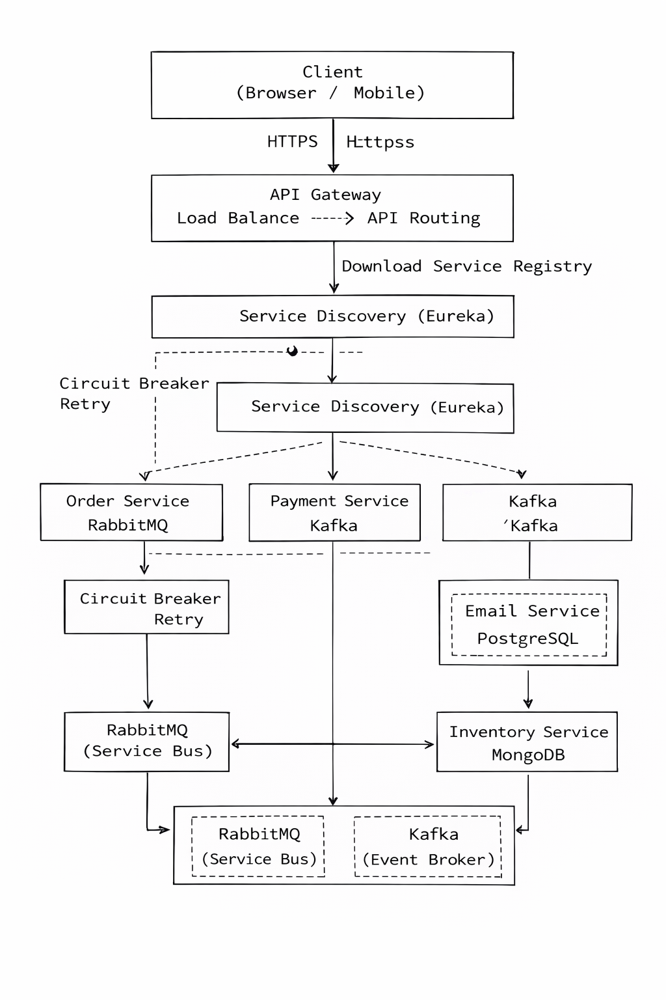

## -------- what is Apache Kafka ---
Great question 👍
Since you’re already working with **RabbitMQ + microservices**, understanding **Apache Kafka** will level you up fast.

---

## 🧠 What is Apache Kafka?

**Apache Kafka** is a **distributed event-streaming platform** used to:

* 🔁 Publish & subscribe to streams of events
* 📦 Store events durably
* ⚡ Process data in real time
* 🧩 Connect microservices using events

In simple words:

> **Kafka is like a real-time data pipeline + message system for huge scale.**

---

## 🔄 Simple Real-World Analogy

Think of **Kafka as a railway system** 🚆

* **Producers** → trains putting messages
* **Topics** → railway tracks
* **Partitions** → parallel tracks
* **Consumers** → stations reading messages
* **Offsets** → ticket number (position in stream)

Messages are **not deleted immediately** after reading.

---

## 🧩 Core Kafka Components

### 1️⃣ Producer

* Sends messages (events) to Kafka
* Example: `Order Service` sends **OrderCreated event**

---

### 2️⃣ Topic

* A **category** of messages
* Example:

  ```
  order-created
  payment-events
  inventory-events
  ```

---

### 3️⃣ Partition

* Topics are split into partitions
* Enables **parallel processing**
* Kafka guarantees **order inside a partition**

---

### 4️⃣ Consumer

* Reads messages from topics
* Keeps track of **offset**
* Can replay messages anytime

---

### 5️⃣ Consumer Group

* Multiple consumers share the load
* Each partition → one consumer per group

---

### 6️⃣ Broker

* Kafka server instance
* Kafka cluster = multiple brokers

---

## ⚡ Why Kafka Is Different from RabbitMQ

| Feature           | Kafka               | RabbitMQ            |
| ----------------- | ------------------- | ------------------- |
| Message model     | Event streaming     | Message queue       |
| Message retention | ⏱ Time-based        | ❌ Removed after ack |
| Replay events     | ✅ Yes               | ❌ No                |
| Ordering          | ✅ Per partition     | Limited             |
| Throughput        | 🔥 Very high        | Medium              |
| Use case          | Big data, analytics | Task processing     |
| Scaling           | Horizontal          | Moderate            |
| Storage           | Disk-based          | Memory-oriented     |

---

## 🏗 Kafka Architecture (Simple)

```
Producer
   ↓
Kafka Topic (Partitioned)
   ↓
Consumer Group
```

Kafka **stores messages on disk** → safe, durable, replayable.

---

## 🔥 Where Kafka Is Used (Real Companies)

* Netflix → user activity streams
* Uber → ride events
* LinkedIn → Kafka creator
* Amazon → order & payment pipelines
* Flipkart → real-time analytics

---

## 🧑‍💻 Example (Very Simple)

### Producer sends event

```json
{
  "orderId": 101,
  "status": "CREATED"
}
```

### Consumer reads later (or again!)

```text
Offset 0 → Offset 1 → Offset 2
```

You can **replay old events** 🔁

---

## 🆚 When to Use Kafka vs RabbitMQ

### ✅ Use RabbitMQ when:

* Background jobs
* Email sending
* Payment triggers
* Request–response workflows

### ✅ Use Kafka when:

* Event sourcing
* Audit logs
* Real-time dashboards
* Microservice communication at scale
* Analytics & data pipelines

---

## 🎯 In Your Case (Microservices)

You are building:

* Order Service
* Inventory Service
* Payment Service

👉 **Kafka is PERFECT for:**

* OrderCreated events
* PaymentCompleted events
* InventoryUpdated events

RabbitMQ → short-lived tasks
Kafka → long-term event history

---

## 🧠 One-Line Definition (Interview Ready)

> **Apache Kafka is a distributed, fault-tolerant event-streaming platform that enables high-throughput, real-time data pipelines and event-driven architectures.**

---

## 🚀 Next Step (If You Want)

I can help you with:

* Kafka vs RabbitMQ **diagram**
* Kafka setup using **Docker**
* Kafka with **Spring Boot**
* Convert your **Order Service** from RabbitMQ → Kafka
* Kafka interview questions (0 → advanced)

Just tell me what you want next 💪

## ------- is Apache Kafka is sysn communication type or other conecpts --
Excellent question 👌
This is a **very important concept** in microservices and interviews.

---

## ❓ Is Apache Kafka **Synchronous** or **Asynchronous**?

### ✅ **Apache Kafka is ASYNCHRONOUS communication**

👉 **NOT synchronous**

---

## 🧠 Why Kafka is Asynchronous?

In Kafka:

* **Producer sends an event**
* **Producer does NOT wait** for consumer response
* Consumer processes the event **later**
* Producer and Consumer are **decoupled**

✔ No blocking
✔ No tight coupling
✔ High scalability

---

## 🔄 Comparison with Synchronous Communication

### 🔴 Synchronous (REST / Feign)

```
Order Service ──HTTP──▶ Payment Service
       ⏳ waits
```

* Order Service **waits** for response
* Failure = cascade failure
* Tight coupling

---

### 🟢 Asynchronous (Kafka)

```
Order Service ──event──▶ Kafka Topic
                          ↓
                   Payment Service
```

* Order Service **does not wait**
* Services work independently
* Failure does NOT block producer

---

## 🧩 Kafka Communication Model

Kafka follows:

### 🔹 **Publish–Subscribe Model**

* Producer publishes events
* Multiple consumers subscribe
* One-to-many communication

---

## ⚠️ Important Clarification

Kafka is **NOT**:

* Request–Response
* RPC-based
* Blocking communication

Kafka **IS**:

* Event-driven
* Message streaming
* Eventually consistent

---

## 🧠 Kafka Communication Types (Concepts)

| Concept           | Kafka Support |
| ----------------- | ------------- |
| Asynchronous      | ✅ Yes         |
| Synchronous       | ❌ No          |
| Event-driven      | ✅ Yes         |
| Publish–Subscribe | ✅ Yes         |
| Streaming         | ✅ Yes         |
| Request–Response  | ❌ Not native  |

---

## 🧪 Example (Order Flow)

### Producer (Order Service)

```java
kafkaTemplate.send("order-created", orderEvent);
```

✔ returns immediately
✔ no waiting for payment

---

### Consumer (Payment Service)

```java
@KafkaListener(topics = "order-created")
public void processOrder(OrderEvent event) {
    // process payment
}
```

---

## 🧠 What If You Need Response?

Kafka uses **event chaining**, not direct response.

Example:

```
OrderCreated → PaymentProcessed → OrderUpdated
```

Each step emits a new event.

---

## 🆚 Kafka vs REST in One Line (Interview Gold)

> **REST is synchronous and tightly coupled, Kafka is asynchronous and loosely coupled.**

---

## 🎯 When Kafka is the BEST choice

* Event-driven microservices
* High throughput systems
* Decoupled architecture
* Real-time analytics
* Audit/event replay needed

---

## 🚀 Since You’re a Full-Stack / Microservices Developer

You should know:

* REST = Sync
* Kafka = Async
* RabbitMQ = Async (task-based)
* gRPC = Sync (fast)

---

## 🧠 Interview Answer (Short)

> **Apache Kafka supports asynchronous, event-driven communication using the publish–subscribe model.**

---

If you want next:

* Sync vs Async **diagram**
* Kafka vs RabbitMQ vs REST
* How to design **event-driven microservices**
* Real project architecture using Kafka

Just say 👍


## ------- Sync vs Async diagram ----
Here’s a **clear visual explanation** of **Synchronous vs Asynchronous communication**
(Interview-ready + practical for microservices) 👇

---

## 🔴 Synchronous Communication (REST / Feign / gRPC)

```
┌──────────────┐        HTTP Request        ┌──────────────┐
│  Order       │ ───────────────────────▶ │  Payment     │
│  Service     │                           │  Service     │
└──────────────┘ ◀─────────────────────── │              │
        ▲              HTTP Response       └──────────────┘
        │
        │  ⏳ Order Service WAITS
        │
   BLOCKED THREAD
```

### 🔎 Characteristics

* Caller **waits** for response
* Blocking
* Tight coupling
* Failure cascades
* Low resilience

### 📌 Example

```java
paymentClient.processPayment(orderId);
```

---

## 🟢 Asynchronous Communication (Kafka / RabbitMQ)

```
┌──────────────┐      Publish Event       ┌──────────────┐
│  Order       │ ─────────────────────▶  │   Kafka      │
│  Service     │                          │   Topic     │
└──────────────┘                          └──────────────┘
        │                                      │
        │      NO WAITING                     │
        │                                      ▼
        │                               ┌──────────────┐
        │                               │ Payment      │
        │                               │ Service      │
        │                               └──────────────┘
```

### 🔎 Characteristics

* Non-blocking
* Loosely coupled
* Highly scalable
* Fault tolerant
* Event-driven

### 📌 Example

```java
kafkaTemplate.send("order-created", event);
```

---

## 🔁 Event Chaining (Real-World Async Flow)

```
OrderCreated
     │
     ▼
Kafka Topic
     │
     ▼
PaymentProcessed
     │
     ▼
OrderUpdated
```

✔ No direct dependency
✔ Event-based workflow
✔ Eventual consistency

---

## ⚔️ Sync vs Async Comparison Table

| Feature        | Synchronous | Asynchronous         |
| -------------- | ----------- | -------------------- |
| Blocking       | ✅ Yes       | ❌ No                 |
| Coupling       | Tight       | Loose                |
| Scalability    | Low         | High                 |
| Failure impact | High        | Low                  |
| Performance    | Medium      | High                 |
| Use cases      | Simple APIs | Event-driven systems |

---

## 🧠 Interview One-Liner

> **Synchronous communication waits for a response, while asynchronous communication publishes events and continues execution without waiting.**

---

## 🎯 When to Use What?

### Use **SYNC** when:

* Immediate response required
* Simple CRUD APIs
* User-facing operations

### Use **ASYNC** when:

* Microservices communication
* Background processing
* High throughput
* Event-driven architecture

---

## 🚀 Want Next?

I can give you:

* Sync vs Async **with real project example**
* Kafka vs RabbitMQ diagram
* Microservices architecture diagram
* Interview questions with diagrams

Just tell me 👍

## ------- Kafka vs RabbitMQ vs REST ---
Perfect topic 👍
This is **core microservices knowledge** and very common in **interviews**.

---

# 🔥 Kafka vs RabbitMQ vs REST (Clear Comparison)

---

## 🧠 High-Level Idea

| Tool     | Communication Type            |
| -------- | ----------------------------- |
| Kafka    | Asynchronous, Event Streaming |
| RabbitMQ | Asynchronous, Message Queue   |
| REST     | Synchronous, Request–Response |

---

## 📊 Architecture Diagrams

### 🔴 REST (Synchronous)

```
Service A ──HTTP──▶ Service B
      ⏳ waits for response
```

---

### 🟢 RabbitMQ (Async – Queue-based)

```
Producer ──▶ Queue ──▶ Consumer
        (message removed after ack)
```

---

### 🔵 Kafka (Async – Event Streaming)

```
Producer ──▶ Topic (Partitioned)
                    ↓
             Consumer Groups
        (messages retained)
```

---

## ⚔️ Feature Comparison Table

| Feature           | REST      | RabbitMQ        | Kafka                |
| ----------------- | --------- | --------------- | -------------------- |
| Communication     | Sync      | Async           | Async                |
| Coupling          | Tight     | Medium          | Loose                |
| Blocking          | Yes       | No              | No                   |
| Message Retention | ❌ No      | ❌ No            | ✅ Yes                |
| Replay Messages   | ❌ No      | ❌ No            | ✅ Yes                |
| Ordering          | ❌ No      | Limited         | ✅ (per partition)    |
| Throughput        | Medium    | Medium          | 🔥 Very High         |
| Scalability       | Limited   | Moderate        | Excellent            |
| Fault Tolerance   | Low       | Medium          | High                 |
| Best For          | CRUD APIs | Background jobs | Event-driven systems |

---

## 🧩 Data Flow Behavior

### REST

* Request → Response
* Caller waits
* Failure propagates

### RabbitMQ

* Message processed once
* Removed after ACK
* Task-oriented

### Kafka

* Events stored on disk
* Multiple consumers
* Replay possible

---

## 🧪 Real-World Example (Order System)

### REST

```
Order → Payment → Inventory → Shipping
❌ slow, fragile
```

---

### RabbitMQ

```
Order → Queue → Email Service
✔ background processing
```

---

### Kafka

```
OrderCreated
   ↓
Kafka Topic
   ↓
Payment / Inventory / Analytics
✔ scalable & decoupled
```

---

## 🧠 When to Use WHAT?

### ✅ Use REST when:

* User needs immediate response
* CRUD operations
* Simple service calls

---

### ✅ Use RabbitMQ when:

* Background tasks
* Email, SMS, notifications
* Job queues
* Retry & DLQ needed

---

### ✅ Use Kafka when:

* Event sourcing
* Real-time analytics
* High-throughput systems
* Microservices event communication
* Audit logs

---

## 💡 Interview Gold Statements

### REST

> REST is synchronous and tightly coupled.

### RabbitMQ

> RabbitMQ is an asynchronous message broker optimized for task processing.

### Kafka

> Kafka is a distributed event-streaming platform designed for high throughput and durability.

---

## 🏆 Summary Table (One Look)

| Scenario                   | Best Choice |
| -------------------------- | ----------- |
| Simple API                 | REST        |
| Email / Jobs               | RabbitMQ    |
| Event-driven microservices | Kafka       |
| Analytics / Streaming      | Kafka       |
| Immediate response         | REST        |
| Decoupled communication    | Kafka       |

---

## 🚀 Since You’re Already Using RabbitMQ

Your **next natural step** is **Kafka** for:

* Order events
* Payment events
* Inventory updates
* Analytics service

---

If you want next:

* Kafka + Spring Boot example
* RabbitMQ vs Kafka migration strategy
* Architecture diagram for interview
* Real project design using all three

Just say 👍

🚀 Next Step (If You Want)

I can help you with:

Kafka vs RabbitMQ diagram

Kafka setup using Docker

Kafka with Spring Boot

Convert your Order Service from RabbitMQ → Kafka

Kafka interview questions (0 → advanced)

Just tell me what you want next 💪

## ------- Kafka vs RabbitMQ diagram ---
Here’s a **clean, interview-ready visual diagram** comparing **Kafka vs RabbitMQ** 👇
(Simple ASCII so you can remember & explain easily)

---

## 🟢 RabbitMQ Diagram (Queue-Based Messaging)

```
        Producer
            │
            ▼
      ┌──────────┐
      │  Queue   │
      └──────────┘
            │
        (ACK)
            │
            ▼
        Consumer
```

### 🔎 How RabbitMQ Works

* Message goes to **Queue**
* Consumer **processes & ACKs**
* Message is **deleted**
* One message → one consumer (normally)

### 🧠 Key Idea

> **RabbitMQ = Task / Job Processing**

---

## 🔵 Kafka Diagram (Event Streaming)

```
        Producer
            │
            ▼
    ┌──────────────────┐
    │   Kafka Topic    │
    │ ┌────┬────┬────┐│
    │ │ P0 │ P1 │ P2 ││   (Partitions)
    │ └────┴────┴────┘│
    └──────────────────┘
            │
     ┌───────────────┐
     │ Consumer Group│
     │ C1   C2   C3  │
     └───────────────┘
```

### 🔎 How Kafka Works

* Events written to **Topic**
* Stored on disk
* Consumers read using **offsets**
* Same message can be read by **many consumers**
* Messages **not deleted immediately**

### 🧠 Key Idea

> **Kafka = Event Stream / Event History**

---

## 🔁 Key Concept Difference (Visual)

### RabbitMQ (Once)

```
Message → Processed → Deleted ❌
```

### Kafka (Replayable)

```
Event → Stored → Replayed 🔁
```

---

## ⚔️ Kafka vs RabbitMQ (Side-by-Side)

| Feature          | RabbitMQ | Kafka        |
| ---------------- | -------- | ------------ |
| Model            | Queue    | Log / Stream |
| Message Lifetime | Short    | Long         |
| Replay           | ❌ No     | ✅ Yes        |
| Consumers        | One-time | Multiple     |
| Throughput       | Medium   | 🔥 Very High |
| Use Case         | Jobs     | Events       |

---

## 🧪 Real-World Example

### RabbitMQ

```
User Signup → Email Queue → Email Sent
```

### Kafka

```
OrderCreated →
   Payment Service
   Inventory Service
   Analytics Service
   Notification Service
```

---

## 🧠 Interview One-Liner

> **RabbitMQ is a message queue for task processing, while Kafka is a distributed event log for streaming and event-driven systems.**

---

## 🎯 Memory Trick 🧠

* 🐰 **RabbitMQ** → *Do it once*
* 🦍 **Kafka** → *Remember forever*

---

If you want next:

* Kafka vs RabbitMQ **with Spring Boot**
* Diagram for **event-driven microservices**
* When to use **both together**
* Interview questions with answers

Just say 👍

## ----- Kafka setup using Docker ---
Great 👍
Here’s a **clean, beginner → production-ready guide** for **Kafka setup using Docker**.

I’ll show you:

1. ✅ Simple setup (ZooKeeper-based – easy to understand)
2. ✅ Modern setup (KRaft – no ZooKeeper)
3. ✅ How to verify Kafka is running
4. ✅ Common mistakes

---

# 🔥 Option 1: Kafka with ZooKeeper (Easiest to Learn)

### 📁 Create a file: `docker-compose.yml`

```yaml
version: "3.8"

services:
  zookeeper:
    image: confluentinc/cp-zookeeper:7.6.0
    container_name: zookeeper
    ports:
      - "2181:2181"
    environment:
      ZOOKEEPER_CLIENT_PORT: 2181
      ZOOKEEPER_TICK_TIME: 2000

  kafka:
    image: confluentinc/cp-kafka:7.6.0
    container_name: kafka
    depends_on:
      - zookeeper
    ports:
      - "9092:9092"
    environment:
      KAFKA_BROKER_ID: 1
      KAFKA_ZOOKEEPER_CONNECT: zookeeper:2181

      KAFKA_LISTENERS: PLAINTEXT://0.0.0.0:9092
      KAFKA_ADVERTISED_LISTENERS: PLAINTEXT://localhost:9092

      KAFKA_OFFSETS_TOPIC_REPLICATION_FACTOR: 1
```

---

### ▶️ Start Kafka

```bash
docker-compose up -d
```

---

### ✅ Verify Containers

```bash
docker ps
```

You should see:

```
zookeeper
kafka
```

---

### 🧪 Test Kafka

#### Enter Kafka container

```bash
docker exec -it kafka bash
```

#### Create a topic

```bash
kafka-topics --create \
--topic order-created \
--bootstrap-server localhost:9092 \
--partitions 3 \
--replication-factor 1
```

#### List topics

```bash
kafka-topics --list --bootstrap-server localhost:9092
```

#### Produce message

```bash
kafka-console-producer \
--topic order-created \
--bootstrap-server localhost:9092
```

Type:

```text
Order 101 created
```

#### Consume message

```bash
kafka-console-consumer \
--topic order-created \
--from-beginning \
--bootstrap-server localhost:9092
```

🎉 Kafka is working!

---

# ⚡ Option 2: Kafka WITHOUT ZooKeeper (Modern – KRaft Mode)

> ⚠ Recommended for **new projects**

### 📁 `docker-compose.yml`

```yaml
version: "3.8"

services:
  kafka:
    image: bitnami/kafka:3.7
    container_name: kafka
    ports:
      - "9092:9092"
    environment:
      KAFKA_ENABLE_KRAFT: yes
      KAFKA_CFG_PROCESS_ROLES: broker,controller
      KAFKA_CFG_NODE_ID: 1
      KAFKA_CFG_CONTROLLER_QUORUM_VOTERS: 1@kafka:9093

      KAFKA_CFG_LISTENERS: PLAINTEXT://:9092,CONTROLLER://:9093
      KAFKA_CFG_ADVERTISED_LISTENERS: PLAINTEXT://localhost:9092
      KAFKA_CFG_LISTENER_SECURITY_PROTOCOL_MAP: CONTROLLER:PLAINTEXT,PLAINTEXT:PLAINTEXT
      KAFKA_CFG_CONTROLLER_LISTENER_NAMES: CONTROLLER

      KAFKA_CFG_AUTO_CREATE_TOPICS_ENABLE: true
```

---

### ▶️ Start

```bash
docker-compose up -d
```

---

## 🔎 Difference (ZooKeeper vs KRaft)

| Feature           | ZooKeeper    | KRaft         |
| ----------------- | ------------ | ------------- |
| Extra service     | Required     | ❌ No          |
| Setup complexity  | Easy         | Medium        |
| Production future | ❌ Deprecated | ✅ Recommended |
| Kafka version     | Older        | New           |

---

## 🧠 Common Mistakes (Very Important)

❌ **Wrong advertised listener**

```text
Connection refused
```

✔ Always use:

```yaml
KAFKA_ADVERTISED_LISTENERS=PLAINTEXT://localhost:9092
```

---

❌ **Port mismatch**

* Kafka: `9092`
* ZooKeeper: `2181`

---

## 🔥 How You’ll Use This in Your Project

You already have:

* Order Service
* Payment Service
* Inventory Service

Kafka topics:

```
order-created
payment-completed
inventory-updated
```

Each service:

* Produces events
* Consumes events asynchronously

---

## 🧠 Interview One-Liner

> **Kafka can be easily set up using Docker with either ZooKeeper-based or KRaft-based architecture. KRaft is the modern approach.**

---

## 🚀 Next (Tell Me What You Want)

I can help you with:

* Kafka + Spring Boot producer
* Kafka consumer with @KafkaListener
* Error handling + retries
* Kafka vs RabbitMQ in same project
* End-to-end Order workflow using Kafka

Just say 👍

## --- is kafka is required to learn in microservicce --
Short answer: **NO, Kafka is not mandatory — but YES, it is extremely valuable.**
Let me explain this clearly from a **real microservices + career + interview** point of view 👇

---

## 🔑 Is Kafka REQUIRED to learn Microservices?

### ❌ Not strictly required

You can build **real microservices** using:

* REST APIs
* Feign Client
* RabbitMQ
* Database events
* gRPC

👉 Many production systems **do NOT use Kafka**.

---

## ✅ When Kafka BECOMES IMPORTANT

Kafka is needed when your system requires:

### 1️⃣ Asynchronous Event-Driven Architecture

* Services communicate via **events**
* Loose coupling
* No direct service dependency

Example:

```
Order Service → OrderCreated Event → 
  Payment Service
  Email Service
  Inventory Service
```

---

### 2️⃣ High Throughput & Scalability

Kafka handles:

* Millions of events/sec
* Large distributed systems

Used by:

* Netflix
* Uber
* LinkedIn
* Amazon
* Swiggy / Zomato

---

### 3️⃣ Event Replay & Audit Logs

Kafka stores events for days/months.

Use cases:

* Reprocessing data
* Analytics
* Debugging
* Data pipelines

RabbitMQ ❌ cannot do this well.

---

### 4️⃣ Data Streaming & Analytics

Kafka integrates with:

* Spark
* Flink
* Elasticsearch
* Data warehouses

Perfect for:

* Real-time dashboards
* Fraud detection
* Monitoring

---

## 🆚 Kafka vs RabbitMQ in Microservices

| Use Case                   | Prefer   |
| -------------------------- | -------- |
| Simple async communication | RabbitMQ |
| Workflow-based processing  | RabbitMQ |
| Event streaming            | Kafka    |
| High-volume data           | Kafka    |
| Event replay               | Kafka    |
| Analytics pipelines        | Kafka    |

👉 **Both are tools, not competitors.**

---

## 🎯 Interview Reality (Very Important)

### For Freshers / Junior Dev

* Kafka: **Good to know**
* RabbitMQ / REST: **Enough**

### For Mid / Senior Roles

* Kafka: **Often expected**
* Event-driven architecture questions
* Exactly-once, offset, consumer groups

📌 Many interviews ask:

> *“Have you worked with Kafka?”*

---

## 🚀 Learning Recommendation (For YOU)

Based on your background:

* MERN + Java + Spring Boot
* Microservices
* RabbitMQ already used
* Goal: **Full Stack Developer / Trainer**

### ✅ My suggestion:

✔ Learn **Kafka basics + hands-on**
✔ Build **1 mini Kafka project**
✔ Understand **Kafka vs RabbitMQ**

You **don’t need expert level** now.

---

## 📚 Minimum Kafka You Should Learn

1. Kafka architecture
2. Topic, partition, offset
3. Producer & consumer
4. Consumer groups
5. Kafka with Spring Boot
6. Kafka vs RabbitMQ
7. At-least-once vs exactly-once

⏱️ Time required: **7–10 days**

---

## ✅ Final Verdict

**Kafka is NOT mandatory to learn microservices,
but it is mandatory to become a strong microservices engineer in 2025+.**

---

If you want, I can:

* 🔹 Give you a **7-day Kafka learning plan**
* 🔹 Build **Kafka + Spring Boot microservice**
* 🔹 Compare **Kafka vs RabbitMQ using real code**
* 🔹 Provide **Kafka interview questions**

Just say 👍
## -------- so what are the topic and tech is must request to say taht i know the microservice --
Excellent question 👍
This is **exactly** what interviewers and companies mean when they say

> *“Do you know Microservices?”*

I’ll give you a **clear MUST-KNOW checklist** — **no fluff**, industry-realistic.

---

# ✅ MUST-KNOW TOPICS to Say

## “YES, I KNOW MICROSERVICES”

---

## 🔥 1️⃣ Core Microservices Concepts (NON-NEGOTIABLE)

You **must** know these clearly (theory + explanation):

* Monolithic vs Microservices
* Service decomposition
* Single Responsibility Principle
* Loose coupling & high cohesion
* Stateless services
* Database per service
* Synchronous vs Asynchronous communication
* Event-Driven Architecture (EDA)

📌 If you fail here → interviewer stops.

---

## 🌐 2️⃣ Service Communication (VERY IMPORTANT)

### ✅ Synchronous Communication

* REST APIs
* Feign Client (Spring Cloud OpenFeign)
* HTTP status codes
* Timeout handling

### ✅ Asynchronous Communication (at least ONE)

* RabbitMQ **OR**
* Kafka (basic knowledge)

📌 Knowing **RabbitMQ + REST** is already enough.

---

## 🔐 3️⃣ Service Discovery & Registration

You **must** know:

* Eureka Server / Client
* Why service discovery is needed
* Client-side load balancing

Tech:

* Spring Cloud Netflix Eureka

---

## ⚖️ 4️⃣ Load Balancing

You must understand:

* Why load balancing is required
* Client-side vs Server-side LB

Tech:

* Spring Cloud LoadBalancer

---

## 🚪 5️⃣ API Gateway (MANDATORY)

If you don’t know this → **you don’t know microservices** ❌

You must know:

* Why API Gateway is needed
* Central routing
* Authentication entry point
* Rate limiting (concept)

Tech:

* Spring Cloud Gateway

---

## 🛡️ 6️⃣ Fault Tolerance & Resilience

Very commonly asked ❗

Concepts:

* Circuit Breaker
* Retry
* Timeout
* Fallback

Tech:

* Resilience4j

📌 You already touched this — good 👍

---

## 🔑 7️⃣ Security (BASIC but REQUIRED)

You must understand:

* Authentication vs Authorization
* JWT token
* API Gateway security
* Service-to-service security (concept)

Tech:

* Spring Security
* JWT

---

## 📊 8️⃣ Configuration Management

You must know:

* Centralized config
* Environment-based configs

Tech:

* Spring Cloud Config Server
* Git-based config

---

## 🧩 9️⃣ Database & Data Handling

Must know:

* Database per microservice
* No shared DB
* Data consistency problems
* Saga pattern (theory)

Tech:

* PostgreSQL / MySQL
* MongoDB (optional)

---

## 🧪 🔍 10️⃣ Observability (Basic but IMPRESSIVE)

At least theory:

* Logging
* Monitoring
* Distributed tracing

Tech:

* Sleuth / Micrometer
* Zipkin / Prometheus (conceptual knowledge enough)

---

## 🐳 1️⃣1️⃣ DevOps Basics (Huge Plus)

Not mandatory but **strong advantage**:

* Docker (must)
* Docker Compose
* CI/CD (concept)
* Kubernetes (basic idea)

📌 Docker is **almost mandatory now**.

---

# 🧠 MINIMUM TECH STACK

### To CONFIDENTLY say: *“I know Microservices”*

### ✅ REQUIRED

✔ Java
✔ Spring Boot
✔ REST APIs
✔ Eureka
✔ API Gateway
✔ Feign Client
✔ RabbitMQ **OR** Kafka
✔ Resilience4j
✔ JWT Security
✔ Docker

---

# 🚀 INTERVIEW-READY SENTENCE (USE THIS)

You can confidently say:

> *“I have built Spring Boot–based microservices using REST and asynchronous messaging (RabbitMQ/Kafka), implemented service discovery with Eureka, centralized routing with API Gateway, fault tolerance using Resilience4j, JWT-based security, and containerized services using Docker.”*

🔥 This line alone puts you **above 70% candidates**.

---

# 🎯 FOR YOU (Personal Advice)

Given your background:

* Spring Boot microservices
* RabbitMQ
* API Gateway
* Resilience4j
* Docker
* PostgreSQL

👉 You are **ALREADY 80% microservices-ready**.

Kafka = **bonus**, not blocker.

---

## Want next?

I can:

* 🔹 Create a **complete microservices project roadmap**
* 🔹 Give **interview questions by topic**
* 🔹 Share a **microservices architecture diagram**
* 🔹 Provide **resume points for microservices**

Just tell me 👍

## ----- Share a microservices architecture diagram --
1) 

## ---- Create a complete microservices project roadmap --
Perfect 👍
Here’s a **COMPLETE, PRACTICAL MICROservices PROJECT ROADMAP**
(from **Beginner → Job-Ready → Interview-Ready**)

I’ve designed this roadmap **exactly the way companies build microservices**, not just theory.

---

# 🚀 COMPLETE MICROSERVICES PROJECT ROADMAP

### (Spring Boot + Cloud + Docker)

---

## 🧱 PHASE 0: Strong Foundation (MANDATORY)

⏱️ 1–2 weeks

### 🔹 Backend Basics

* Java (OOP, Collections, Streams)
* REST API concepts
* HTTP methods & status codes
* JSON serialization/deserialization

### 🔹 Spring Boot

* Spring Boot project structure
* @RestController, @Service, @Repository
* Spring Data JPA
* Exception handling (@ControllerAdvice)
* Validation

📌 **Outcome:**
You can build a clean REST API.

---

## 🧩 PHASE 1: Convert Monolith → Microservices

⏱️ 1 week

### 🔹 Project Idea (E-Commerce Example)

Split into:

* User Service
* Product Service
* Order Service
* Payment Service

### 🔹 Rules

* Each service = separate Spring Boot project
* Each service = own database
* No direct DB sharing ❌

📌 **Outcome:**
Understand **service boundaries**.

---

## 🌐 PHASE 2: Service-to-Service Communication

⏱️ 1 week

### 🔹 Synchronous Communication

* REST API calls
* Spring Cloud OpenFeign
* Handle failures

### 🔹 Concepts

* Tight coupling problems
* Timeout issues

📌 **Outcome:**
Services talk to each other.

---

## 🔍 PHASE 3: Service Discovery (VERY IMPORTANT)

⏱️ 2–3 days

### 🔹 Implement:

* Eureka Server
* Eureka Client in all services

### 🔹 Learn:

* Dynamic service registration
* No hardcoded URLs

📌 **Outcome:**
Services discover each other automatically.

---

## 🚪 PHASE 4: API Gateway (CORE MICROSERVICE SKILL)

⏱️ 3–4 days

### 🔹 Implement:

* Spring Cloud Gateway

### 🔹 Responsibilities:

* Single entry point
* Routing
* Load balancing
* Security entry point

📌 **Outcome:**
Client talks only to **API Gateway**.

---

## 🛡️ PHASE 5: Fault Tolerance & Resilience

⏱️ 4–5 days

### 🔹 Concepts:

* Circuit Breaker
* Retry
* Timeout
* Fallback

### 🔹 Tech:

* Resilience4j

📌 **Outcome:**
Your system **does not crash** when one service fails.

---

## 📨 PHASE 6: Asynchronous Communication (EVENT-DRIVEN)

⏱️ 1 week

### 🔹 Choose ONE (Enough for interviews)

✔ RabbitMQ **OR**
✔ Kafka

### 🔹 Use Case:

* Order created → Inventory update
* Payment success → Email notification

### 🔹 Concepts:

* Producer / Consumer
* Queue / Topic
* Event-driven architecture

📌 **Outcome:**
Loose coupling + scalability.

---

## 🔐 PHASE 7: Security (BASIC BUT REQUIRED)

⏱️ 4–5 days

### 🔹 Implement:

* Spring Security
* JWT Authentication

### 🔹 Flow:

* Login → JWT Token
* Gateway validates token
* Services trust gateway

📌 **Outcome:**
Secure microservices system.

---

## ⚙️ PHASE 8: Centralized Configuration

⏱️ 2–3 days

### 🔹 Implement:

* Spring Cloud Config Server
* Git-based config

### 🔹 Benefits:

* No hardcoded configs
* Environment based configs

📌 **Outcome:**
Production-ready config management.

---

## 📊 PHASE 9: Observability (BONUS BUT IMPRESSIVE)

⏱️ 2–3 days

### 🔹 Learn:

* Logging
* Distributed tracing

### 🔹 Tools:

* Sleuth
* Zipkin / Micrometer (basic)

📌 **Outcome:**
You can debug production issues.

---

## 🐳 PHASE 10: Docker & Deployment (ALMOST MANDATORY)

⏱️ 1 week

### 🔹 Implement:

* Dockerfile for each service
* Docker Compose
* Run all services with one command

### 🔹 Learn:

* Containers vs VM
* Environment variables

📌 **Outcome:**
Production-style deployment.

---

## ☁️ PHASE 11 (OPTIONAL BUT POWERFUL): Kubernetes

⏱️ 1–2 weeks (optional)

### 🔹 Learn:

* Pods
* Services
* Deployments
* Scaling

📌 **Outcome:**
Enterprise-level knowledge.

---

# 🏗️ FINAL PROJECT STRUCTURE

```
microservices-project
│
├── api-gateway
├── eureka-server
├── config-server
├── user-service
├── product-service
├── order-service
├── payment-service
├── inventory-service
├── docker-compose.yml
```

---

# 🧠 INTERVIEW-READY STATEMENT

Use this confidently:

> “I designed and developed Spring Boot microservices using REST and asynchronous messaging, implemented service discovery with Eureka, centralized routing using API Gateway, fault tolerance with Resilience4j, JWT-based security, RabbitMQ/Kafka for event-driven communication, and containerized the system using Docker.”

🔥 This is **REAL MICROservices**, not tutorial-level.

---

## 🎯 Next Step (Tell Me)

I can:
1️⃣ Design **full ER diagram + flow**
2️⃣ Create **step-by-step coding order**
3️⃣ Provide **resume bullet points**
4️⃣ Share **microservices interview Q&A**

Just say **which one you want next** 👌

## ------ what is Sending Objects By Serializing and Deserializing --
Great question 👍
This is a **core concept** in Kafka, Microservices, REST, and distributed systems.

Let’s understand it **slowly, clearly, and practically**.

---

# 🔁 What is **Sending Objects by Serializing & Deserializing**?

When services communicate (Kafka / REST / RabbitMQ), they **cannot send Java objects directly**.

👉 They must convert objects into a **transferable format**.

That process is called:

```
Object → bytes/text  = Serialization
bytes/text → Object  = Deserialization
```

---

## 🧠 Simple Definition

| Term                | Meaning                                      |
| ------------------- | -------------------------------------------- |
| **Serialization**   | Converting an object into bytes or JSON      |
| **Deserialization** | Converting bytes or JSON back into an object |

---

# 📦 Why is This Needed?

Because:

* Microservices run on **different machines**
* Different languages (Java, Node, Python)
* Network only understands **bytes**

❌ You cannot send:

```java
Order order = new Order();
```

✅ You must send:

```json
{
  "orderId": 101,
  "status": "CREATED"
}
```

---

# 🔄 Real-Life Analogy

🎁 Sending a gift:

* Object = gift
* Serialization = packing the gift
* Network = courier
* Deserialization = unpacking the gift

---

# 🧪 Example WITHOUT Serialization (Impossible)

```java
kafkaTemplate.send("topic", orderObject); // ❌ not allowed
```

---

# ✅ Example WITH Serialization (Kafka)

### 1️⃣ Java Object

```java
public class OrderEvent {
    private Long orderId;
    private String status;
}
```

---

### 2️⃣ Serialize Object → JSON (Producer)

```java
kafkaTemplate.send("order-topic", orderEvent);
```

Kafka internally converts this to:

```json
{"orderId":1,"status":"CREATED"}
```

---

### 3️⃣ Deserialize JSON → Object (Consumer)

```java
@KafkaListener(topics = "order-topic")
public void consume(OrderEvent event) {
    System.out.println(event.getStatus());
}
```

---

# 🛠 How Serialization Works in Kafka

Kafka uses **Serializers & Deserializers (SerDes)**.

| Type         | Purpose         |
| ------------ | --------------- |
| Serializer   | Object → byte[] |
| Deserializer | byte[] → Object |

---

# 🔑 Common Serialization Formats

| Format    | Used in                      |
| --------- | ---------------------------- |
| JSON      | Most common (human readable) |
| Avro      | Kafka + Schema Registry      |
| Protobuf  | High performance             |
| String    | Simple messages              |
| ByteArray | Low-level                    |

---

# 🧾 Kafka JSON Configuration Example

### Producer

```yaml
spring:
  kafka:
    producer:
      value-serializer: org.springframework.kafka.support.serializer.JsonSerializer
```

### Consumer

```yaml
spring:
  kafka:
    consumer:
      value-deserializer: org.springframework.kafka.support.serializer.JsonDeserializer
      properties:
        spring.json.trusted.packages: "*"
```

---

# 🔥 What Happens Internally

```
Java Object
   ↓ Serialize
JSON / bytes
   ↓ Kafka Broker
JSON / bytes
   ↓ Deserialize
Java Object
```

---

# ⚠️ Common Mistakes

❌ Missing serializer
❌ Mismatch producer & consumer format
❌ Not trusting package in consumer
❌ Using Java serialization (bad practice)

---

# 🎯 Kafka Best Practice

✔ Use **JSON** for learning
✔ Use **Avro/Protobuf** for production
✔ Never use Java default serialization

---

# 🧠 Interview Answer (Use This)

> “Serialization is the process of converting objects into a transferable format like JSON or bytes before sending them over the network. Deserialization converts that data back into objects on the receiving side. Kafka uses serializers and deserializers to achieve this.”

🔥 Perfect answer.

---

If you want next, I can show:

* Kafka Object Producer + Consumer FULL CODE
* Avro vs JSON comparison
* Serialization errors & fixes
* How Schema Registry works

Just tell me 👍

## ------ Kafka Object Producer + Consumer FULL CODE --
Perfect 👍
Below is a **COMPLETE, WORKING Kafka Object Producer + Consumer example** using **Spring Boot + JSON serialization** (industry-standard learning setup).

I’ll explain **step by step** so you can run this confidently.

---

# 🧱 Project Structure

```
kafka-demo
 ├── producer-service
 └── consumer-service
```

---

# 📦 1️⃣ Shared DTO (Same in Producer & Consumer)

```java
package com.example.kafka.dto;

import lombok.AllArgsConstructor;
import lombok.Data;
import lombok.NoArgsConstructor;

@Data
@AllArgsConstructor
@NoArgsConstructor
public class OrderEvent {
    private Long orderId;
    private String status;
    private Double amount;
}
```

---

# 🚀 2️⃣ PRODUCER SERVICE

## ✅ pom.xml (Important Dependencies)

```xml
<dependencies>
    <dependency>
        <groupId>org.springframework.boot</groupId>
        <artifactId>spring-boot-starter-web</artifactId>
    </dependency>

    <dependency>
        <groupId>org.springframework.kafka</groupId>
        <artifactId>spring-kafka</artifactId>
    </dependency>

    <dependency>
        <groupId>org.projectlombok</groupId>
        <artifactId>lombok</artifactId>
    </dependency>
</dependencies>
```

---

## ✅ application.yml (Producer)

```yaml
spring:
  kafka:
    bootstrap-servers: localhost:9092
    producer:
      key-serializer: org.apache.kafka.common.serialization.StringSerializer
      value-serializer: org.springframework.kafka.support.serializer.JsonSerializer
```

---

## ✅ Producer REST Controller

```java
package com.example.kafka.producer;

import com.example.kafka.dto.OrderEvent;
import org.springframework.kafka.core.KafkaTemplate;
import org.springframework.web.bind.annotation.*;

@RestController
@RequestMapping("/api")
public class OrderProducer {

    private final KafkaTemplate<String, OrderEvent> kafkaTemplate;

    public OrderProducer(KafkaTemplate<String, OrderEvent> kafkaTemplate) {
        this.kafkaTemplate = kafkaTemplate;
    }

    @PostMapping("/send")
    public String sendOrder() {
        OrderEvent event = new OrderEvent(
                101L,
                "CREATED",
                2500.00
        );

        kafkaTemplate.send("order-topic", event);
        return "Order Event Sent";
    }
}
```

---

# 📥 3️⃣ CONSUMER SERVICE

## ✅ pom.xml

(Same Kafka + Lombok dependencies)

---

## ✅ application.yml (Consumer)

```yaml
spring:
  kafka:
    bootstrap-servers: localhost:9092
    consumer:
      group-id: order-group
      auto-offset-reset: earliest
      key-deserializer: org.apache.kafka.common.serialization.StringDeserializer
      value-deserializer: org.springframework.kafka.support.serializer.JsonDeserializer
      properties:
        spring.json.trusted.packages: "*"
```

---

## ✅ Kafka Consumer Listener

```java
package com.example.kafka.consumer;

import com.example.kafka.dto.OrderEvent;
import org.springframework.kafka.annotation.KafkaListener;
import org.springframework.stereotype.Component;

@Component
public class OrderConsumer {

    @KafkaListener(topics = "order-topic", groupId = "order-group")
    public void consume(OrderEvent event) {
        System.out.println("Received Order:");
        System.out.println("ID: " + event.getOrderId());
        System.out.println("Status: " + event.getStatus());
        System.out.println("Amount: " + event.getAmount());
    }
}
```

---

# ▶️ 4️⃣ Run Kafka (Docker – Recommended)

```bash
docker-compose up -d
```

(If you want, I can give you the Kafka Docker Compose file too.)

---

# 🧪 5️⃣ Test the Flow

1. Start **Kafka**
2. Start **Consumer Service**
3. Start **Producer Service**
4. Call:

```
POST http://localhost:8080/api/send
```

### Output in Consumer:

```
Received Order:
ID: 101
Status: CREATED
Amount: 2500.0
```

---

# 🔄 What Happens Internally

```
OrderEvent (Java Object)
   ↓ JsonSerializer
JSON bytes
   ↓ Kafka Broker
JSON bytes
   ↓ JsonDeserializer
OrderEvent (Java Object)
```

---

# ⚠️ Common Errors & Fixes

| Error                | Fix                              |
| -------------------- | -------------------------------- |
| ClassCastException   | Same DTO in both services        |
| Not trusted packages | `spring.json.trusted.packages=*` |
| Null values          | Add default constructor          |
| Serialization error  | Use JsonSerializer               |

---

# 🧠 Interview-Level Summary

> “Kafka object communication works by serializing Java objects into JSON using JsonSerializer on the producer side and deserializing them back into Java objects using JsonDeserializer on the consumer side.”

🔥 This is **exactly how real microservices communicate**.

---

## 🚀 Want Next?

I can show you:
1️⃣ Kafka with **multiple partitions**
2️⃣ Kafka **exactly-once** processing
3️⃣ Kafka with **Avro + Schema Registry**
4️⃣ Kafka **real microservice use case (Order → Payment → Inventory)**

Just tell me 👍

## --------- notes on  spring cloud function and Spring Cloud Streams what is use of them and all 0 to 100 --
Below are **complete, structured, PDF-style notes** on

# **Spring Cloud Function & Spring Cloud Stream (0 → 100)**

No topic skipped, explained **conceptually + practically + interview-ready**.

You can **directly convert this into PDF**.

---

# 📘 SPRING CLOUD FUNCTION & SPRING CLOUD STREAM

*(Complete Notes: Beginner → Advanced)*

---

## 1️⃣ Why These Frameworks Exist (Problem Statement)

### Traditional Microservice Problems

❌ Tight coupling with frameworks
❌ Business logic mixed with transport logic (HTTP, Kafka, RabbitMQ)
❌ Hard to switch message brokers
❌ Hard to run same logic as REST, Event, or Batch
❌ Vendor lock-in

👉 **Spring Cloud Function + Stream solve this**

---

# 2️⃣ Spring Cloud Function – Introduction

## 🔹 What is Spring Cloud Function?

> **A framework to write business logic as functions**
> independent of transport (HTTP, messaging, serverless).

### Key Idea

```
Business Logic ≠ Transport Layer
```

You write:

```
Function<Input, Output>
```

Spring decides:

* HTTP
* Kafka
* RabbitMQ
* AWS Lambda
* Azure Functions

---

## 3️⃣ Core Concepts of Spring Cloud Function

### 1️⃣ Function

```java
Function<T, R>
```

### 2️⃣ Consumer

```java
Consumer<T>
```

### 3️⃣ Supplier

```java
Supplier<T>
```

---

## 4️⃣ Why Spring Cloud Function?

| Feature                | Benefit                  |
| ---------------------- | ------------------------ |
| Functional programming | Clean logic              |
| Transport-agnostic     | Same code everywhere     |
| Serverless ready       | AWS Lambda support       |
| Testable               | Unit test without broker |
| Lightweight            | Minimal boilerplate      |

---

## 5️⃣ Spring Cloud Function Architecture

```
┌───────────────┐
│ HTTP / Kafka  │
│ RabbitMQ      │
│ AWS Lambda    │
└───────┬───────┘
        ↓
┌──────────────────┐
│ Spring Cloud     │
│ Function         │
└───────┬──────────┘
        ↓
┌──────────────────┐
│ Business Logic   │
│ (Function)       │
└──────────────────┘
```

---

## 6️⃣ Writing Your First Spring Cloud Function

### Dependency

```xml
<dependency>
  <groupId>org.springframework.cloud</groupId>
  <artifactId>spring-cloud-starter-function-web</artifactId>
</dependency>
```

### Function Bean

```java
@Bean
public Function<String, String> upperCase() {
    return input -> input.toUpperCase();
}
```

### Invoke via HTTP

```
POST /upperCase
Body: hello
Response: HELLO
```

---

## 7️⃣ Function Types Explained

### 🔹 Supplier (Source)

Produces data

```java
Supplier<String> supplier()
```

### 🔹 Consumer (Sink)

Consumes data

```java
Consumer<String> consumer()
```

### 🔹 Function (Processor)

Consumes & produces

```java
Function<String, String>
```

---

## 8️⃣ Function Composition

```java
@Bean
Function<String, String> trim() { }

@Bean
Function<String, String> upper() { }
```

### Compose

```
trim|upper
```

➡️ Used heavily in **Stream processing**

---

# 9️⃣ Spring Cloud Stream – Introduction

## 🔹 What is Spring Cloud Stream?

> A framework to build **event-driven microservices**
> using **Kafka / RabbitMQ** via **Spring Cloud Function**

---

## 1️⃣0️⃣ Why Spring Cloud Stream?

Without Stream:
❌ Kafka APIs everywhere
❌ Broker-specific code
❌ Hard migration

With Stream:
✅ Broker abstraction
✅ Pluggable binders
✅ Functional style
✅ Easy scaling

---

## 1️⃣1️⃣ Core Concepts of Spring Cloud Stream

| Concept        | Meaning                   |
| -------------- | ------------------------- |
| Binder         | Kafka / RabbitMQ adapter  |
| Binding        | Connection to topic/queue |
| Channel        | Input/output pipe         |
| Message        | Event payload             |
| Consumer Group | Load balancing            |

---

## 1️⃣2️⃣ Spring Cloud Stream Architecture

```
┌────────────┐
│ Producer   │
└────┬───────┘
     ↓
┌──────────────┐
│ Kafka / RMQ  │
└────┬─────────┘
     ↓
┌──────────────┐
│ Consumer     │
└──────────────┘
```

Spring Cloud Stream sits **between app & broker**.

---

## 1️⃣3️⃣ Spring Cloud Stream + Function Integration

👉 **Modern way (Functional Model)**

```
Supplier → Topic → Function → Topic → Consumer
```

---

## 1️⃣4️⃣ Dependencies

### Kafka

```xml
<dependency>
  <groupId>org.springframework.cloud</groupId>
  <artifactId>spring-cloud-starter-stream-kafka</artifactId>
</dependency>
```

### RabbitMQ

```xml
<dependency>
  <groupId>org.springframework.cloud</groupId>
  <artifactId>spring-cloud-starter-stream-rabbit</artifactId>
</dependency>
```

---

## 1️⃣5️⃣ Producer Example (Supplier)

```java
@Bean
public Supplier<OrderEvent> orderProducer() {
    return () -> new OrderEvent("ORDER_CREATED");
}
```

### application.yml

```yml
spring:
  cloud:
    function:
      definition: orderProducer
    stream:
      bindings:
        orderProducer-out-0:
          destination: order-topic
```

---

## 1️⃣6️⃣ Consumer Example

```java
@Bean
public Consumer<OrderEvent> orderConsumer() {
    return event -> {
        System.out.println(event);
    };
}
```

```yml
spring:
  cloud:
    function:
      definition: orderConsumer
    stream:
      bindings:
        orderConsumer-in-0:
          destination: order-topic
          group: order-group
```

---

## 1️⃣7️⃣ Processor (Function) Example

```java
@Bean
public Function<OrderEvent, PaymentEvent> processOrder() {
    return order -> new PaymentEvent(order.getId());
}
```

---

## 1️⃣8️⃣ Message Serialization

Default:

* JSON (Jackson)

Custom:

* Avro
* Protobuf

```yml
content-type: application/json
```

---

## 1️⃣9️⃣ Consumer Groups

### Why?

* Load balancing
* Fault tolerance

```
Same group → Competing consumers
Different group → Pub-Sub
```

---

## 2️⃣0️⃣ Error Handling in Stream

### Retry

```yml
max-attempts: 3
```

### Dead Letter Queue (DLQ)

```yml
enableDlq: true
```

---

## 2️⃣1️⃣ Backpressure Handling

Kafka:

* Offset management

RabbitMQ:

* Prefetch count

---

## 2️⃣2️⃣ Scaling Microservices

```
Instances ↑
Partitions ↑
Consumer Groups ↑
```

---

## 2️⃣3️⃣ Spring Cloud Stream vs Raw Kafka

| Feature        | Stream | Kafka API |
| -------------- | ------ | --------- |
| Abstraction    | Yes    | No        |
| Boilerplate    | Low    | High      |
| Portability    | High   | Low       |
| Learning curve | Easy   | Medium    |

---

## 2️⃣4️⃣ Spring Cloud Function vs Controller

| Controller     | Function         |
| -------------- | ---------------- |
| HTTP only      | Any transport    |
| Coupled        | Decoupled        |
| Not serverless | Serverless ready |

---

## 2️⃣5️⃣ Real-World Use Cases

✅ Order Processing
✅ Event-Driven Architecture
✅ Data Streaming
✅ Saga Orchestration
✅ Serverless Microservices
✅ Kafka/RabbitMQ migration

---

## 2️⃣6️⃣ When NOT to Use

❌ Simple CRUD apps
❌ Heavy synchronous REST only apps
❌ Very low traffic systems

---

## 2️⃣7️⃣ Interview Questions (Very Important)

**Q1:** Why Spring Cloud Function?
👉 Transport-agnostic business logic

**Q2:** Difference between Stream & Function?
👉 Function = logic
👉 Stream = messaging infrastructure

**Q3:** Kafka vs RabbitMQ support?
👉 Binder based abstraction

**Q4:** Supplier vs Consumer?
👉 Producer vs Consumer

---

## 2️⃣8️⃣ Best Practices

✔ Use functional model (no @EnableBinding)
✔ One function per responsibility
✔ Use DLQ
✔ Avoid business logic in consumers
✔ Version events
✔ Idempotent consumers

---

## 2️⃣9️⃣ Production Architecture

```
API Gateway
     ↓
Command Service
     ↓ (Event)
Kafka / RabbitMQ
     ↓
Processing Services
     ↓
Notification / Analytics
```

---

## 3️⃣0️⃣ Final Summary

| Component             | Role               |
| --------------------- | ------------------ |
| Spring Cloud Function | Business logic     |
| Spring Cloud Stream   | Event transport    |
| Kafka / RabbitMQ      | Messaging          |
| Functional Model      | Clean architecture |

---

If you want, next I can provide:
✅ **PDF formatted version**
✅ **Diagrams (flow + architecture)**
✅ **Complete Kafka + RabbitMQ project**
✅ **Interview Q&A (50+ questions)**

Just tell me 👍

## ------ Diagrams (flow + architecture) ---
