## -------- Section 22: Transition to Spring Cloud Functions and Spring Cloud Stream | eCommerce Project ---
## ----- 284. Section Overview --
## --------- video notes --
So now is the time that we talk about what to expect in this particular section.

So we have a order service which is the producer so far.

And we have a notification service which is the consumer right order service is producing messages and

publishing it to a message broker like RabbitMQ.

And Notification Service is consuming the message from service like RabbitMQ.

Right.

And it's a consumer.

Now what we are going to do is we are going to transition from this entire setup.

Right now in our code.

The RabbitMQ code is hard coded right.

So RabbitMQ related code classes we are using in.

It's hard coded.

If you have to transition to Kafka it's a bit tedious.

We have to manage and change all the code.

Right.

So we are going to transition to Spring Cloud Stream, which will help us reduce the boilerplate code

and it will act as an abstraction layer.

And in future you can switch to RabbitMQ Kafka depending on your requirements.

So right now we are going to switch to RabbitMQ first.

And then later on we'll switch to Kafka.

Right.

So first thing we will do is I'll show you how the order or the flow of this section will be.

First thing is we will transition to spring cloud stream using RabbitMQ.

Okay, right now we are using RabbitMQ.

But we are not making use of Spring Cloud stream.

So we will transition to Spring Cloud stream using RabbitMQ.

And for notification service we will transition to Spring Cloud function.

Okay.

And then I will transition from RabbitMQ to that of Kafka.

And I'll show you how easy that particular switch is.

Okay.

So in the end we'll be making use of Kafka.
1) 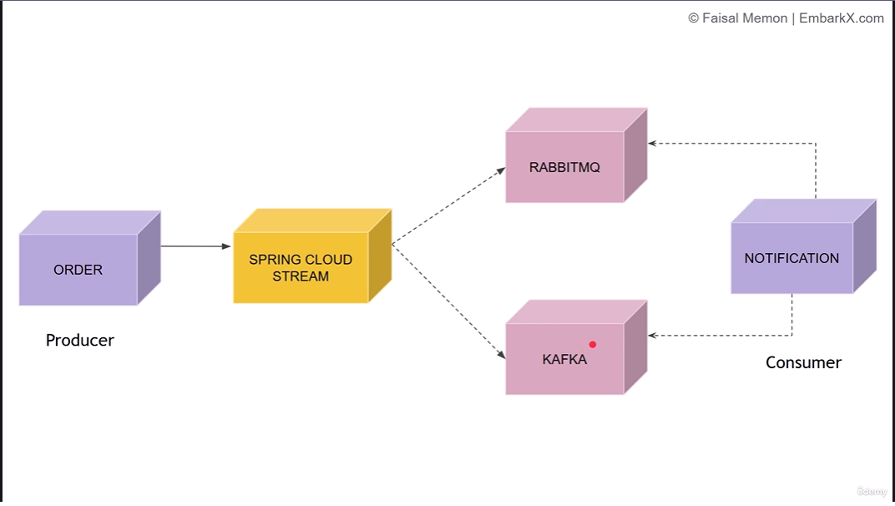

## -------- 285. Transition From @RabbitListener to Spring Cloud Stream --
1) we begin transitioning our producer to make use of Spring Cloud Stream.
And right now, if you take a look over here at the order service, we have order.
That is a producer notification is a consumer.
2) first we need to set the dependencies 
3) 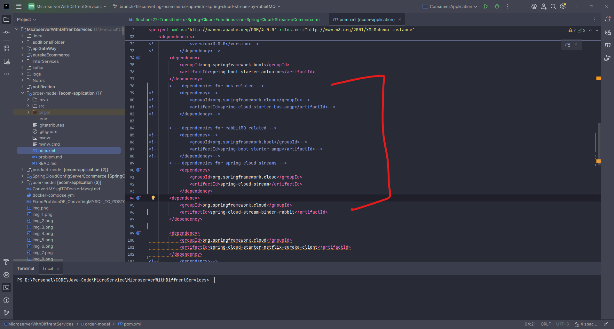
4) after dependencies we need to set the update the configuration
5) 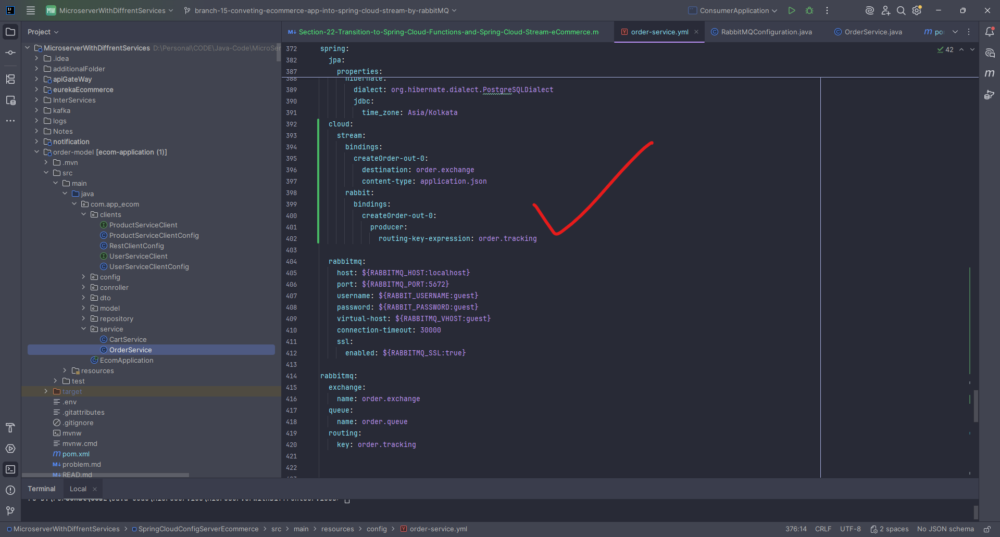
6) after this we need to manage the ending part is
8) 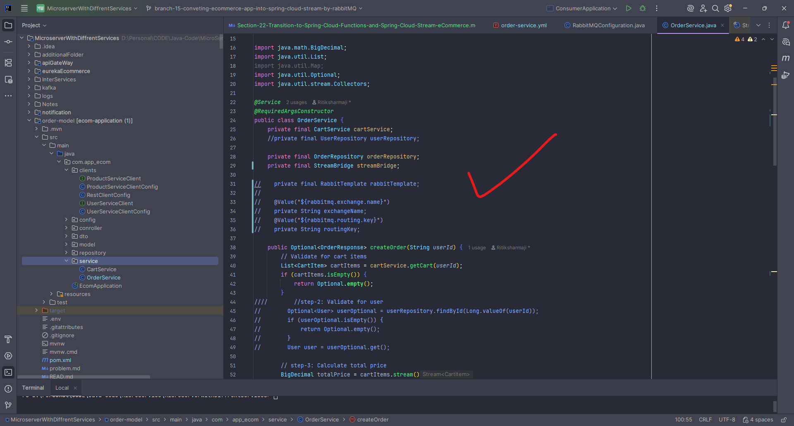
9) 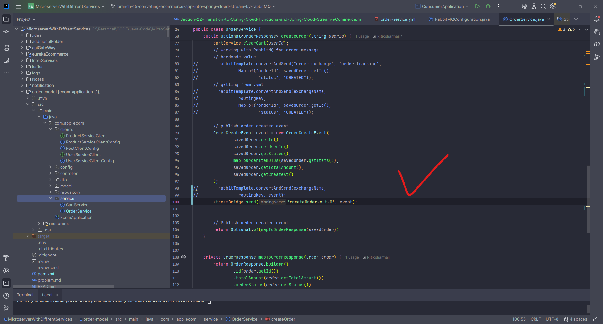
10) 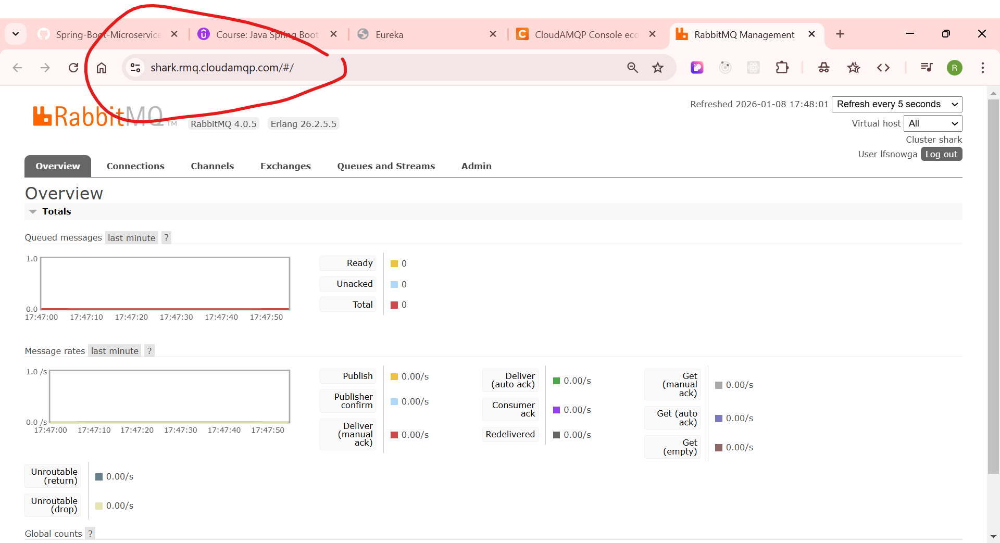
11) now run all the service accpet to notification  and make the order
12) 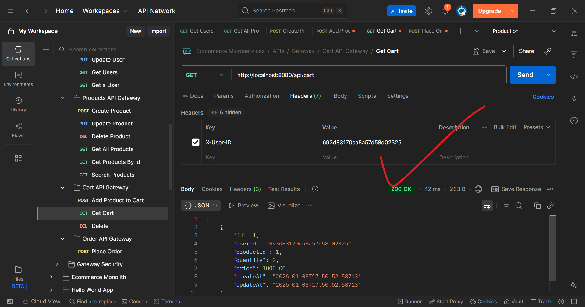
13) 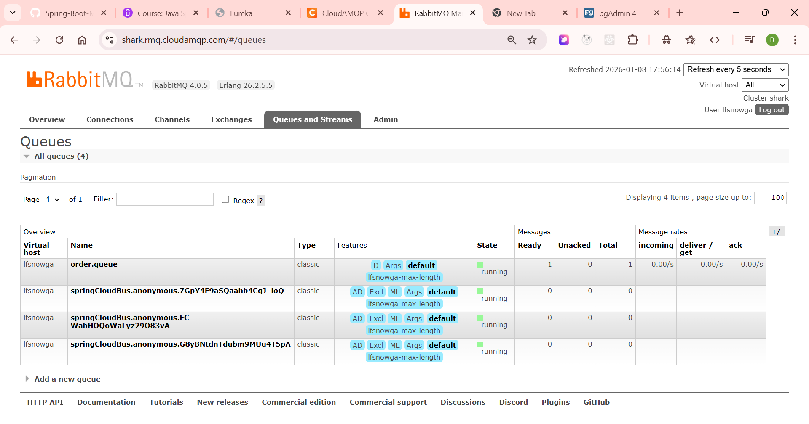
14) 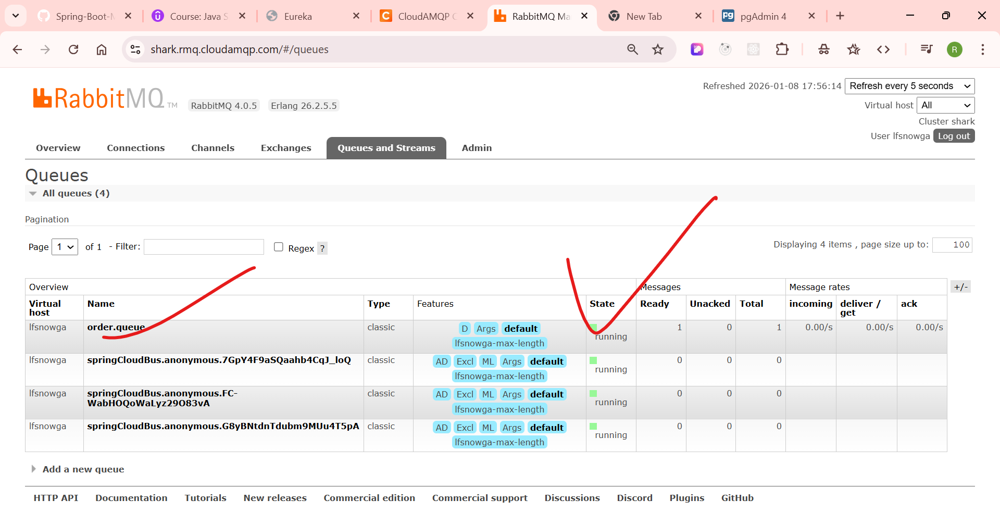
15) 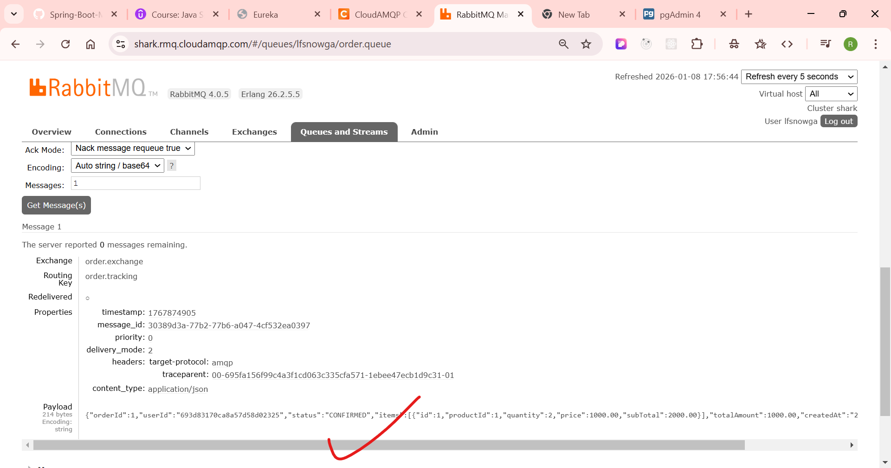
16) 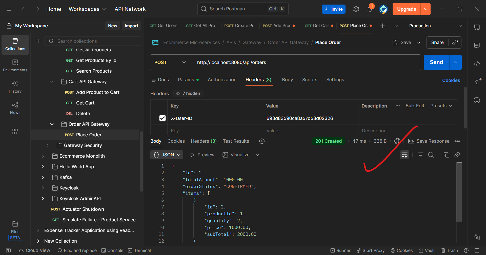
17) 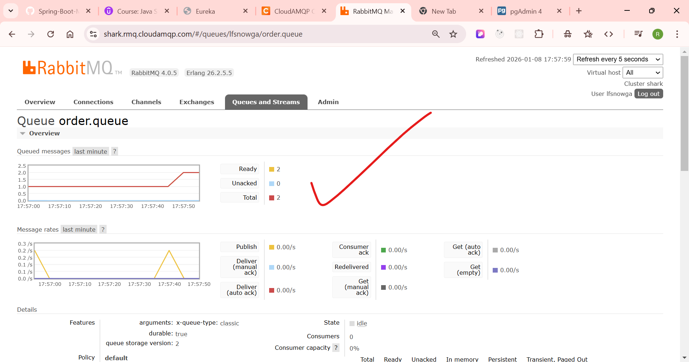
18) 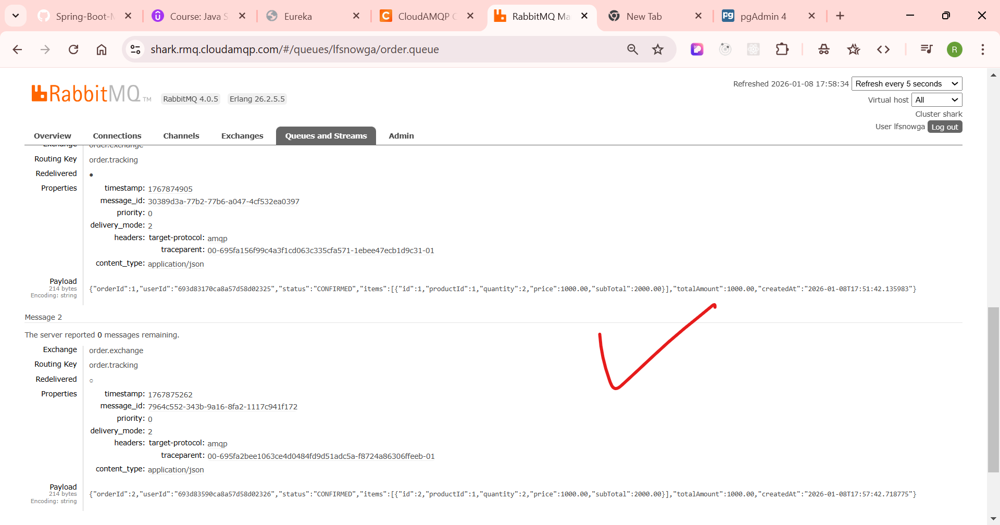

## -------- 286. Transition Notification Service To Spring Cloud Stream --
1) now we need to change in the notifcation becasue that is consumer 
2) 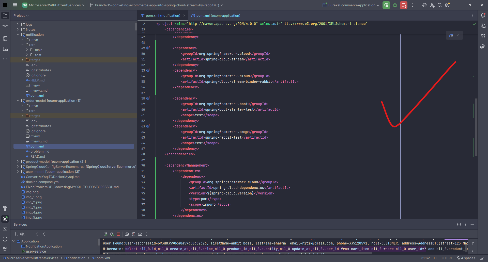
3) 