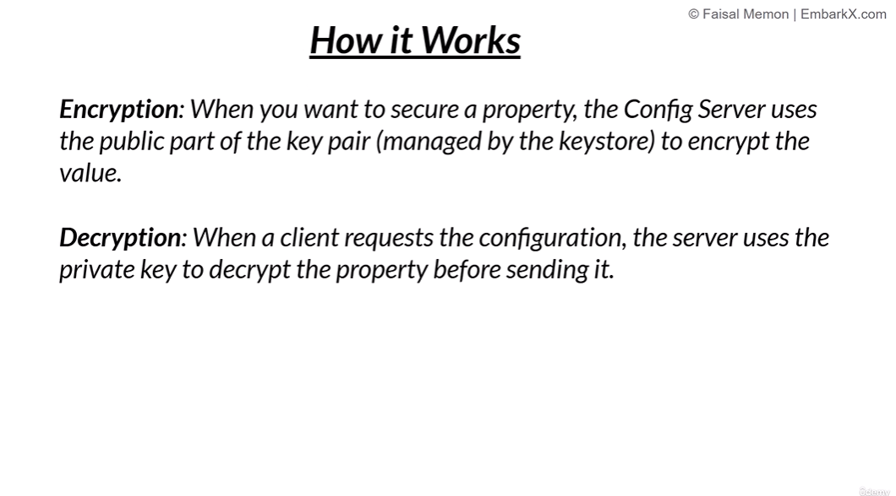
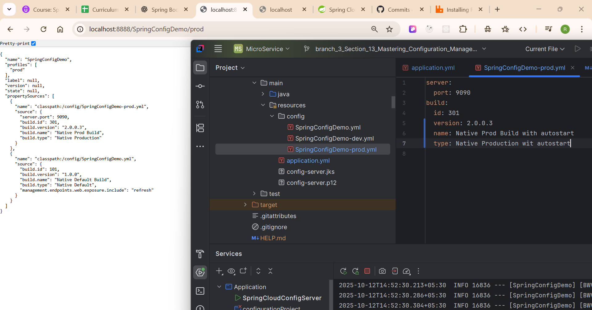
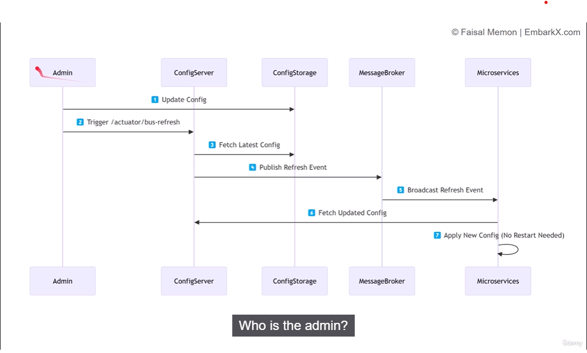

## ---------- spring cloud ------
1) 
2) 
3) 
4) 
5) 
6) 
7) 

## ------- setting up spring cloud config server for microservice---
1) you can read the content: https://docs.spring.io/spring-cloud-config/docs/current/reference/html/
2) 
3) 

## --- why we are using spring cloud --------
Excellent question, Ritik 👠—
this is one of the **most important concepts** when you move from normal Spring Boot apps to **Microservices architecture**.

Let’s break it down clearly 👇

---

## ğŸŒ¥ï¸ **What is Spring Cloud?**

**Spring Cloud** is a collection of tools built on top of **Spring Boot** that helps you **develop, deploy, and manage distributed (microservice-based) systems** easily.

Spring Boot makes it easy to build **a single service**,
but **Spring Cloud** makes it easy to make **many services work together**.

---

## 🧩 **Why We Need Spring Cloud**

When you move to **microservices**, you face new challenges that don’t exist in monolithic applications:

| Problem in Microservices                                                                                    | How Spring Cloud Helps                                      |
| ----------------------------------------------------------------------------------------------------------- | ----------------------------------------------------------- |
| 1ï¸âƒ£ **Service Discovery** – How do services find each other when IPs keep changing?                         | 🧭 **Spring Cloud Netflix Eureka** (Service Registry)       |
| 2ï¸âƒ£ **Configuration Management** – How do we keep environment configs (DB URL, API keys, etc.) centralized? | âš™ï¸ **Spring Cloud Config Server**                           |
| 3ï¸âƒ£ **Load Balancing** – How do we distribute requests among service instances?                             | âš–ï¸ **Spring Cloud LoadBalancer / Ribbon**                   |
| 4ï¸âƒ£ **API Gateway** – How to expose one entry point for all microservices?                                  | 🚪 **Spring Cloud Gateway / Zuul**                          |
| 5ï¸âƒ£ **Fault Tolerance** – What if one service fails?                                                        | 💪 **Spring Cloud Circuit Breaker (Resilience4J, Hystrix)** |
| 6ï¸âƒ£ **Distributed Tracing** – How to trace a request across multiple microservices?                         | 🔠**Spring Cloud Sleuth + Zipkin**                         |
| 7ï¸âƒ£ **Messaging / Event Streaming** – How to make services communicate asynchronously?                      | 📨 **Spring Cloud Stream (Kafka, RabbitMQ)**                |
| 8ï¸âƒ£ **Centralized Security** – How to secure microservices easily?                                          | 🔠**Spring Cloud Security + OAuth2**                       |

---

## 🧱 Example: Without vs With Spring Cloud

### ⌠Without Spring Cloud

You’d have to manually:

* Store configs inside each service.
* Manually update URLs when IPs change.
* Handle failures and retries by yourself.
* Write gateway logic manually.

It becomes **complex and error-prone** as the number of services grows.

---

### ✅ With Spring Cloud

You get:

* Central **Config Server** to update configs dynamically.
* **Eureka** service registry for auto service discovery.
* **Gateway** for routing and load balancing.
* **Resilience4J** for retries, circuit breakers, and fallbacks.
* **Sleuth + Zipkin** for tracing all service calls.

â¡ï¸ This makes your microservice system **robust, scalable, and easy to maintain**.

---

## âš™ï¸ Example Setup

Imagine a microservices system:

* **user-service**
* **order-service**
* **config-server**
* **eureka-server**
* **api-gateway**

Each service is a Spring Boot app.
Spring Cloud connects them all like this:

```
        +-------------------+
        |  Config Server    |
        +-------------------+
                 |
   +-------------+-------------+
   |                           |
+------+      +------+      +------+
|User  |<---->|Eureka|<---->|Order |
|Service|     |Server|     |Service|
+------+      +------+      +------+
                 |
         +---------------+
         | API Gateway    |
         +---------------+
```

Everything is automatically discoverable, configurable, and scalable 🔥

---

## 🚀 Common Spring Cloud Components

| Component                        | Purpose                                 |
| -------------------------------- | --------------------------------------- |
| **Spring Cloud Config Server**   | Centralized configuration management    |
| **Eureka Server**                | Service registry (discovery)            |
| **Spring Cloud Gateway**         | Routing + API Gateway                   |
| **Resilience4J / Hystrix**       | Fault tolerance, circuit breaker        |
| **Spring Cloud Sleuth + Zipkin** | Distributed tracing                     |
| **Spring Cloud Stream**          | Event-driven messaging (Kafka/RabbitMQ) |

---

## 💡 In Short

| Spring Boot                                   | Spring Cloud                                                    |
| --------------------------------------------- | --------------------------------------------------------------- |
| Helps you build a **single service** quickly. | Helps you make **multiple services work together** effectively. |
| Focus: app-level development.                 | Focus: system-level coordination.                               |

---

Would you like me to give you a **small example architecture** showing how Spring Cloud Config + Eureka + Gateway work together in one mini project?

yes:
Perfect 🔥
Let’s build a **mini microservices architecture** using **Spring Boot + Spring Cloud**, step by step — this will make everything click for you clearly, Ritik 👇

---

## 🌠**Overview: Our Mini Architecture**

We’ll create **3 microservices** + **2 Spring Cloud services**

```
+-------------------+
| Config Server     |  ↠Centralized configs
+-------------------+

+-------------------+
| Eureka Server     |  ↠Service discovery
+-------------------+

       ↓ Registered here ↓

+-------------------+      +-------------------+
| User Service      |<---->| Order Service     |
+-------------------+      +-------------------+
       ↑                          ↑
       |                          |
       +----------+---------------+
                  |
         +-------------------+
         | API Gateway       |  ↠Single entry point for clients
         +-------------------+
```

---

## 🧱 **Step-by-Step Setup**

---

### 🧩 **1ï¸âƒ£ Config Server (central config management)**

#### 📠`pom.xml`

```xml
<dependencies>
    <dependency>
        <groupId>org.springframework.cloud</groupId>
        <artifactId>spring-cloud-config-server</artifactId>
    </dependency>
</dependencies>
```

#### ğŸ—ï¸ `application.yml`

```yaml
server:
  port: 8888

spring:
  application:
    name: config-server
  cloud:
    config:
      server:
        git:
          uri: https://github.com/ritiksharma/config-repo  # or local folder
```

#### 🚀 `ConfigServerApplication.java`

```java
@SpringBootApplication
@EnableConfigServer
public class ConfigServerApplication {
    public static void main(String[] args) {
        SpringApplication.run(ConfigServerApplication.class, args);
    }
}
```

This server fetches config for all microservices from one repo (Git/local).

---

### 🧩 **2ï¸âƒ£ Eureka Server (service registry)**

#### 📠`pom.xml`

```xml
<dependencies>
    <dependency>
        <groupId>org.springframework.cloud</groupId>
        <artifactId>spring-cloud-starter-netflix-eureka-server</artifactId>
    </dependency>
</dependencies>
```

#### âš™ï¸ `application.yml`

```yaml
server:
  port: 8761

spring:
  application:
    name: eureka-server

eureka:
  client:
    register-with-eureka: false
    fetch-registry: false
```

#### 🚀 `EurekaServerApplication.java`

```java
@SpringBootApplication
@EnableEurekaServer
public class EurekaServerApplication {
    public static void main(String[] args) {
        SpringApplication.run(EurekaServerApplication.class, args);
    }
}
```

Now you can see all registered services at:
👉 `http://localhost:8761`

---

### 🧩 **3ï¸âƒ£ User Service**

#### âš™ï¸ `application.yml`

```yaml
server:
  port: 8081
spring:
  application:
    name: user-service
  config:
    import: "optional:configserver:http://localhost:8888"

eureka:
  client:
    service-url:
      defaultZone: http://localhost:8761/eureka
```

#### 🧠 `UserController.java`

```java
@RestController
@RequestMapping("/users")
public class UserController {
    @GetMapping("/info")
    public String userInfo() {
        return "User Service running!";
    }
}
```

---

### 🧩 **4ï¸âƒ£ Order Service**

#### âš™ï¸ `application.yml`

```yaml
server:
  port: 8082
spring:
  application:
    name: order-service
  config:
    import: "optional:configserver:http://localhost:8888"

eureka:
  client:
    service-url:
      defaultZone: http://localhost:8761/eureka
```

#### 🧠 `OrderController.java`

```java
@RestController
@RequestMapping("/orders")
public class OrderController {
    @GetMapping("/info")
    public String orderInfo() {
        return "Order Service running!";
    }
}
```

---

### 🧩 **5ï¸âƒ£ API Gateway (single entry point)**

#### 📠`pom.xml`

```xml
<dependencies>
    <dependency>
        <groupId>org.springframework.cloud</groupId>
        <artifactId>spring-cloud-starter-gateway</artifactId>
    </dependency>
    <dependency>
        <groupId>org.springframework.cloud</groupId>
        <artifactId>spring-cloud-starter-netflix-eureka-client</artifactId>
    </dependency>
</dependencies>
```

#### âš™ï¸ `application.yml`

```yaml
server:
  port: 8080

spring:
  application:
    name: api-gateway

eureka:
  client:
    service-url:
      defaultZone: http://localhost:8761/eureka

spring:
  cloud:
    gateway:
      routes:
        - id: user-service
          uri: lb://user-service
          predicates:
            - Path=/users/**
        - id: order-service
          uri: lb://order-service
          predicates:
            - Path=/orders/**
```

Now your gateway acts as a **router** to backend microservices through Eureka.

---

## âš¡ **Final Flow**

1. Config Server loads environment configs for all services.
2. Each service registers itself to **Eureka Server**.
3. The **API Gateway** routes all incoming requests to the right service.
4. You can now call:

    * `http://localhost:8080/users/info`
    * `http://localhost:8080/orders/info`

All through one entry point ğŸ¯

---

## 🌟 **Benefits You Gain**

✅ Centralized config (no duplicate config in every service)
✅ Service discovery (dynamic IPs, no hardcoded URLs)
✅ Unified gateway (security, rate limit, auth, logging)
✅ Load balancing (via Eureka + Gateway)
✅ Scalability and resilience

---

Perfect 👠— let’s go deeper.

---

### ğŸŒ©ï¸ **Spring Cloud — In-Depth Overview**

Spring Cloud is a **powerful framework built on top of Spring Boot** that provides **tools for building distributed, cloud-native microservices**.
It simplifies the **complex challenges** that arise when you move from a monolithic application to a **microservice architecture**.

---

## 🚀 1. Why We Need Spring Cloud

When you have **multiple microservices**, each running independently, you face challenges such as:

| Problem                      | Example                                                              | Spring Cloud Solution                           |
| ---------------------------- | -------------------------------------------------------------------- | ----------------------------------------------- |
| **Configuration Management** | Each service needs its own properties (DB URLs, credentials, ports). | ✅ *Spring Cloud Config Server*                  |
| **Service Discovery**        | Services need to find and talk to each other dynamically.            | ✅ *Eureka (Netflix Service Registry)*           |
| **Load Balancing**           | Multiple instances of the same service.                              | ✅ *Spring Cloud LoadBalancer / Ribbon*          |
| **API Gateway / Routing**    | One entry point for all microservices.                               | ✅ *Spring Cloud Gateway / Zuul*                 |
| **Fault Tolerance**          | One service failing should not crash others.                         | ✅ *Resilience4j / Hystrix*                      |
| **Distributed Tracing**      | Track a request across many services.                                | ✅ *Spring Cloud Sleuth + Zipkin*                |
| **Centralized Logging**      | Collect logs from all microservices.                                 | ✅ *ELK Stack (ElasticSearch, Logstash, Kibana)* |
| **Messaging & Events**       | Communicate asynchronously between services.                         | ✅ *Spring Cloud Stream (Kafka/RabbitMQ)*        |

---

## 🧠 2. Core Components of Spring Cloud

| Component                                       | Description                                                                    |
| ----------------------------------------------- | ------------------------------------------------------------------------------ |
| **Spring Cloud Config**                         | Centralized configuration management (application settings in Git or Vault).   |
| **Spring Cloud Netflix Eureka**                 | Service registry and discovery (register and locate microservices).            |
| **Spring Cloud Gateway**                        | API Gateway — routes client requests to services.                              |
| **Spring Cloud LoadBalancer**                   | Client-side load balancing (distributes requests evenly).                      |
| **Spring Cloud Sleuth**                         | Adds unique trace IDs to logs for distributed tracing.                         |
| **Spring Cloud Bus**                            | Propagates config changes across services dynamically using Kafka or RabbitMQ. |
| **Spring Cloud Circuit Breaker (Resilience4j)** | Prevents cascading failures using fallback methods.                            |
| **Spring Cloud Stream**                         | Event-driven communication (Kafka / RabbitMQ integration).                     |

---

## ğŸ—ï¸ 3. Example — Simple Spring Cloud Architecture

```
           ┌──────────────────────â”
           │   Spring Cloud API   │
           │       Gateway        │
           └──────────┬───────────┘
                      │
    ┌─────────────────┴──────────────────â”
    │                                    │
┌───────────────┠                ┌───────────────â”
│  User Service │◄───Eureka──────►│  Product Svc  │
└───────────────┘                 └───────────────┘
          â–²                               â–²
          │                               │
  ┌─────────────┠                ┌─────────────â”
  │ Config Svr  │                 │ MongoDB/Postgres │
  └─────────────┘                 └─────────────┘
```

✅ **Flow Example:**

1. Client sends request → **Gateway**
2. Gateway checks Eureka for available service instance.
3. Gateway routes to **User Service**.
4. User Service fetches config from **Config Server**.
5. Config Server fetches from Git or local `.yml` file.

---

## âš™ï¸ 4. Example: Config Server Setup

### `pom.xml`

```xml
<dependency>
    <groupId>org.springframework.cloud</groupId>
    <artifactId>spring-cloud-config-server</artifactId>
</dependency>
```

### `application.yml`

```yaml
server:
  port: 8888
spring:
  cloud:
    config:
      server:
        git:
          uri: https://github.com/ritiksharma/config-repo
```

### `@SpringBootApplication`

```java
@EnableConfigServer
@SpringBootApplication
public class ConfigServerApplication {
    public static void main(String[] args) {
        SpringApplication.run(ConfigServerApplication.class, args);
    }
}
```

---

## 🌠5. Benefits of Spring Cloud

✅ Centralized and dynamic configuration
✅ Fault tolerance and resilience
✅ Easier scalability of microservices
✅ Simplified inter-service communication
✅ Monitoring and distributed tracing support
✅ Works seamlessly with Docker and Kubernetes

---

Would you like me to show a **real microservice example** using:
👉 Config Server,
👉 Eureka Discovery, and
👉 Gateway (API Gateway setup)?

That will help you understand Spring Cloud end-to-end.

Would you like me to show how to **add Spring Cloud Config repo setup** (with Git) — so you can see how config updates automatically propagate to services?
---
yes: but latter

## ---------- 141. Configuring a Git Repository for Spring Cloud config server ----
1) create a repo in the git and after created create a file as well
2) 
3) so we will create a git repos of configDemo project and then we will map that to SpringCLoudConfigServer
4) 
5) name must be same 
6) 
## --- now mapping config server to git Repository for version controllerd configuration
1) now we have to map the SpringCloudConfigServer so add the details as below 
2) 
3) start the server
4) 
-- to fix
   Perfect 👀 this is a **common Spring Cloud Config Server startup error** — your error means:

> ⌠The Config Server started, but it **could not find or access your Git repository** that contains the configuration files.

---

### 🧠 Let’s break it down

Error summary:

```
Invalid config server configuration.
If you are using the git profile, you need to set a Git URI in your configuration.
```

This means your application’s `application.yml` (or `application.properties`) for the **Spring Cloud Config Server** is either **misconfigured**, or **the Git repo URL is not accessible**.

---

### ✅ Correct Configuration Example

Here’s how your `application.yml` should look inside the **Config Server** project:

```yaml
server:
  port: 8888

spring:
  application:
    name: SpringCloudConfigServer
  cloud:
    config:
      server:
        git:
          uri: https://github.com/Ritiksharmaji/SpringBoot-Cloud-Config-Server
          clone-on-start: true
          default-label: main
```

---

### 🧩 Common Issues & Fixes

1. **⌠Wrong key name**

    * You used `url:` but it should be `uri:` under `spring.cloud.config.server.git`.
    * ✅ **Fix:** change

      ```yaml
      url: https://github.com/...
      ```

      to

      ```yaml
      uri: https://github.com/...
      ```

---

2. **⌠Missing or incorrect folder structure in Git repo**

    * Your Git repo must contain configuration files like:

      ```
      application.yml
      microservice-name.yml
      ```
    * Example:

      ```
      ├── application.yml
      ├── user-service.yml
      └── order-service.yml
      ```

---

3. **⌠Private Git repo without credentials**

    * If your repo is private, you must provide credentials:

      ```yaml
      spring:
        cloud:
          config:
            server:
              git:
                uri: https://github.com/Ritiksharmaji/SpringBoot-Cloud-Config-Server
                username: YOUR_GITHUB_USERNAME
                password: YOUR_PERSONAL_ACCESS_TOKEN
      ```
    * To generate a token: [GitHub → Settings → Developer Settings → Personal Access Tokens → Fine-grained Tokens].

---

4. **✅ Add `@EnableConfigServer`**

    * In your main class (e.g., `SpringCloudConfigServerApplication.java`), add:

      ```java
      @EnableConfigServer
      @SpringBootApplication
      public class SpringCloudConfigServerApplication {
          public static void main(String[] args) {
              SpringApplication.run(SpringCloudConfigServerApplication.class, args);
          }
      }
      ```

---

5. **🔠Enable debug for detailed log**

    * Run the app with:

      ```
      mvn spring-boot:run -Dspring-boot.run.arguments="--debug"
      ```
    * or add `debug: true` to your `application.yml` temporarily.

---

6. **✅ Check Git branch**

    * Ensure your repo’s default branch is `main`.
    * If not, update the config:

      ```yaml
      default-label: master
      ```

---

### ✅ Example Final `application.yml`

```yaml
server:
  port: 8888

spring:
  application:
    name: SpringCloudConfigServer
  cloud:
    config:
      server:
        git:
          uri: https://github.com/Ritiksharmaji/SpringBoot-Cloud-Config-Server
          clone-on-start: true
          default-label: main
```

---

If you share your **GitHub repo link structure** (like what files are inside it), I can check whether the repo setup is correct for Spring Cloud Config use.

Would you like me to verify your repo’s structure now?

1) 
2) 
3) 

## --------- Accessing Different profile Configuration from the config server --
1) create a new other file in that git as: SpringConfigDemo-Dev.yml
2) 
3) 
4) now restart the application and see the URL and hit it based on the profile and see the result
5) 
6) 
7) 


## -------- Setting Up a spring CLoud config client for Microservices ------
1) so first we need to encloud the spring cloud based maven configuration as below
   ```
   	<properties>
		<java.version>21</java.version>
        <spring-cloud.version>2025.0.0</spring-cloud.version>
	</properties>
     <dependency>
            <groupId>org.springframework.cloud</groupId>
            <artifactId>spring-cloud-starter-config</artifactId>
        </dependency>
   <dependencyManagement>
        <dependencies>
            <dependency>
                <groupId>org.springframework.cloud</groupId>
                <artifactId>spring-cloud-dependencies</artifactId>
                <version>${spring-cloud.version}</version>
                <type>pom</type>
                <scope>import</scope>
            </dependency>
        </dependencies>
    </dependencyManagement>

2) then  we need to add the spring cloud config details into applocation.yml of clientConfig project
3) 

```declarative
22:19:01.554 [main] ERROR org.springframework.boot.diagnostics.LoggingFailureAnalysisReporter -- 

***************************
APPLICATION FAILED TO START
***************************

Description:

Failed to bind properties under 'spring.config' to org.springframework.boot.context.config.ConfigDataProperties:

    Reason: org.springframework.core.convert.ConverterNotFoundException: No converter found capable of converting from type [java.lang.String] to type [org.springframework.boot.context.config.ConfigDataProperties]

Action:

Update your application's configuration


Process finished with exit code 1  while making the 
spring:
  application:
    name:SpringConfigDemo
  config:
    import:SpringCloudConfigServer:http://localhost:8888

#  profiles:
#    active: prod

server:
  port: ${SERVER_PORT:8080}
build:
  id: ${BUILD_ID:000}
  version: ${BUILD_VERSION:1.0.0}
  name: ${BUILD_NAME:default}
  

Excellent — you’re **very close**, but this error:

> `No converter found capable of converting from type [java.lang.String] to type [org.springframework.boot.context.config.ConfigDataProperties]`

means that the syntax in your YAML is **slightly wrong** for importing a config server.
Let’s fix it properly 👇

---

## ⌠Your Current YAML (has syntax issues)

```yaml
spring:
  application:
    name:SpringConfigDemo
  config:
    import:SpringCloudConfigServer:http://localhost:8888
```

### Issues:

1. Missing **space after colons** (`name: SpringConfigDemo`).
2. The value of `spring.config.import` is **missing quotes**.
3. The correct import key should include `optional:` if you don’t want startup to fail when server is down.
4. You used **SpringCloudConfigServer:** — but it should be **configserver:** (lowercase, no space).

---

## ✅ Corrected `application.yml`

```yaml
spring:
  application:
    name: SpringConfigDemo

  config:
    import: "optional:configserver:http://localhost:8888"

server:
  port: ${SERVER_PORT:8080}

build:
  id: ${BUILD_ID:000}
  version: ${BUILD_VERSION:1.0.0}
  name: ${BUILD_NAME:default}
```

---

### 🧠 Why This Works

* `spring.config.import` tells your Spring Boot app to **fetch configuration** from the Config Server.
* The syntax must be:

  ```
  spring.config.import: "optional:configserver:<url>"
  ```
* The `optional:` prefix makes startup succeed even if config server is temporarily unreachable.
* `configserver:` is the fixed keyword — not your project name.

---

### ✅ Extra Checks

* Ensure your **Config Server** is already running on port `8888`.
  Test in browser:

  ```
  http://localhost:8888/SpringConfigDemo/default
  ```

  It should return a JSON with configuration data.

* In your **Config Server repo**, make sure you have a file:

  ```
  SpringConfigDemo.yml
  ```

  or

  ```
  SpringConfigDemo.properties
  ```

---

### âš™ Example `SpringConfigDemo.yml` (in your Git repo)

```yaml
server:
  port: 9090

message:
  text: "Hello from Config Server!"
```

---

Once everything is correct:

1. Start your **Config Server** first.
2. Then start your **SpringConfigDemo** app.

It should fetch configs automatically ğŸ¯

---
1) 
2) 
3) 
4) 

Got it ✅ — you want your **Spring Cloud Config Client** setup fixed so that:

* It properly fetches data from the **Spring Cloud Config Server** at `http://localhost:8888`.
* It correctly uses fallback values if the config server or environment variables are not available.

Here’s the **fixed, working version** 👇

---

### ✅ 1ï¸âƒ£ `BuildInfoController.java`

```java
package config_info.ConfifurationDemo;

import org.springframework.beans.factory.annotation.Value;
import org.springframework.web.bind.annotation.GetMapping;
import org.springframework.web.bind.annotation.RestController;

@RestController
public class BuildInfoController {

    // These values will come from Config Server if available, otherwise default values will be used
    @Value("${build.id:1001}")
    private String buildId;

    @Value("${build.version:1.0.0}")
    private String buildVersion;

    @Value("${build.name:Default-Build}")
    private String buildName;

    @GetMapping("/build-info")
    public String getBuildInfo() {
        return "BuildId: " + buildId + ", version: " + buildVersion + ", build name: " + buildName;
    }
}
```

---

### ✅ 2ï¸âƒ£ `bootstrap.yml` (place in `src/main/resources/`)

```yaml
spring:
  application:
    name: SpringConfigDemo   # must match the file name in Git repo (SpringConfigDemo.yml)
  config:
    import: "optional:configserver:http://localhost:8888"

server:
  port: 8080

# Optional fallback values (only used if config server not reachable)
build:
  id: 1001
  version: 1.0.0
  name: Default-Build
```

---

### ✅ 3ï¸âƒ£ Ensure your Config Server is running

Start your **Spring Cloud Config Server** (port 8888) first.
Then check in your browser:

```
http://localhost:8888/SpringConfigDemo/default
```

You should see something like:

```json
{
  "propertySources": [
    {
      "source": {
        "build.id": 500,
        "build.version": "1.0.0",
        "build.name": "Dev Build git"
      }
    }
  ]
}
```

---

### ✅ 4ï¸âƒ£ Then start your Client project

Run your **Config Client** (`ConfifurationDemoApplication`).
Now visit:

```
http://localhost:8080/build-info
```

If config server is connected →
👉 `BuildId: 500, version: 1.0.0, build name: Dev Build git`

If not →
👉 `BuildId: 1001, version: 1.0.0, build name: Default-Build`

---

Would you like me to also show how to print **which source** (Git vs local fallback) the properties came from in your response?
1) 
2) 
3) 
4) if you want to change the profile then
5) 
6) 
7) 
8) there will be a possibility the config server is down then your application will cresh to ovide that we use "optional:configserver:http://localhost:8888" option where Optional fallback values (only used if config server not reachable)
9) 
10) see on above image config server is stoped now we are going to start the config client
11) 
12) 
13) 
14) 


## ------- using refresh Scope and spring boot actuator for live updates ----
Excellent question 🌱 — the concept of **`@RefreshScope`** in Spring Boot (especially with **Spring Cloud**) is super useful when working with **dynamic configuration**.

Let’s break it down clearly 👇

---

## 🧩 What is `@RefreshScope`?

In **Spring Cloud**, `@RefreshScope` is used to **reload beans dynamically** when configuration properties change — **without restarting** your Spring Boot application.

---

## 💡 Why we need it

By default, Spring Boot loads all configurations **once at startup**.
If you change a value in your **Spring Cloud Config Server** (like updating a YAML in GitHub), the client app **won’t reflect the new value** until you **restart it**.

✅ Using `@RefreshScope` solves this problem — it allows specific beans to be **reloaded** when you call the refresh endpoint.

---

## âš™ï¸ How it works

1. You annotate a bean or controller with `@RefreshScope`.
2. When configuration changes (for example, in GitHub), you call:

   ```
   POST http://localhost:8080/actuator/refresh
   ```
3. Spring re-creates (`refreshes`) only the beans under `@RefreshScope` with the new configuration values.

---

## 🧠 Example

### 1ï¸âƒ£ In your Config Client:

```java
package config_info.ConfifurationDemo;

import org.springframework.beans.factory.annotation.Value;
import org.springframework.cloud.context.config.annotation.RefreshScope;
import org.springframework.web.bind.annotation.GetMapping;
import org.springframework.web.bind.annotation.RestController;

@RefreshScope // 👈 this makes the bean refreshable
@RestController
public class BuildInfoController {

    @Value("${build.id:1001}")
    private String buildId;

    @Value("${build.version:1.0.0}")
    private String buildVersion;

    @Value("${build.name:Default-Build}")
    private String buildName;

    @GetMapping("/build-info")
    public String getBuildInfo() {
        return "BuildId: " + buildId + ", Version: " + buildVersion + ", Name: " + buildName;
    }
}
```

---

### 2ï¸âƒ£ In your `pom.xml`, make sure you have:

```xml
<dependency>
    <groupId>org.springframework.boot</groupId>
    <artifactId>spring-boot-starter-actuator</artifactId>
</dependency>
```

---

### 3ï¸âƒ£ In your `application.yml` or `bootstrap.yml`:

```yaml
management:
  endpoints:
    web:
      exposure:
        include: refresh,health,info
```

---

### 4ï¸âƒ£ How to refresh the config without restart:

After updating your configuration in GitHub and pushing it,
run this command:

```bash
curl -X POST http://localhost:8080/actuator/refresh
```

✅ Now your `/build-info` endpoint will automatically show the new values
without restarting your app.

---

## 🧾 Summary

| Feature        | Description                                                    |
| -------------- | -------------------------------------------------------------- |
| **Annotation** | `@RefreshScope`                                                |
| **Purpose**    | Reload bean values dynamically when config changes             |
| **Trigger**    | POST `/actuator/refresh`                                       |
| **Scope**      | Only beans annotated with `@RefreshScope`                      |
| **Dependency** | `spring-boot-starter-actuator` + `spring-cloud-starter-config` |
| **Usage**      | Common in Spring Cloud Config clients                          |

---
1) so now first we need to add the actuator dependencies to pom.xml of client one 
2) 
3) then adding properties to application.yml file
4) then adding @RefreshScope to controller file 
5) 
6) 
7) now first start the configServer then ConfigClient
8) 
9) 
10) 
11) now we will update the value from git as:
12) 
13) then see the result that won't reflect because we need to make post request not get
14) 
15) so, 
16) 
17) then go that link and see 
18) 
19) 
20) 
21) 
22) so we are able to the updates without restart the application
23) 


## -------- Would you like me to show a short complete working setup (Config Server + Client) so you can test config updates live and see /refresh in action? ---
Perfect 💪 Let’s set up a **complete working example** of **Spring Cloud Config Server + Config Client** — fully runnable on your system.

You’ll be able to:
✅ Fetch configuration from GitHub
✅ Auto-refresh using `/actuator/refresh`
✅ Later, extend to full auto-refresh with RabbitMQ

---

## 🌳 Project Structure

```
SpringCloudDemo/
│
├── config-server/
│   └── src/main/java/.../ConfigServerApplication.java
│
├── config-client/
│   └── src/main/java/.../ConfigClientApplication.java
│
└── SpringConfigRepo/ (Git repo with configs)
    └── SpringConfigDemo.yml
```

---

## 🧩 Step 1: Create a Git Repo (or Local Folder)

Create a folder or a GitHub repo named `SpringConfigRepo`.

Inside it, create `SpringConfigDemo.yml`:

```yaml
build:
  id: 900
  version: 1.0.0
  name: Git-Config-Demo
server:
  port: 8081
```

Commit & push this file to GitHub (or use a local path).

Example Git URL:

```
https://github.com/ritiksharmaji/SpringBoot-Cloud-Config-Server
```

---

## âš™ï¸ Step 2: Config Server Setup

### `pom.xml`

```xml
<dependencies>
    <dependency>
        <groupId>org.springframework.cloud</groupId>
        <artifactId>spring-cloud-config-server</artifactId>
    </dependency>
    <dependency>
        <groupId>org.springframework.boot</groupId>
        <artifactId>spring-boot-starter-web</artifactId>
    </dependency>
</dependencies>

<dependencyManagement>
    <dependencies>
        <dependency>
            <groupId>org.springframework.cloud</groupId>
            <artifactId>spring-cloud-dependencies</artifactId>
            <version>2023.0.3</version>
            <type>pom</type>
            <scope>import</scope>
        </dependency>
    </dependencies>
</dependencyManagement>
```

### `ConfigServerApplication.java`

```java
package com.example.configserver;

import org.springframework.boot.SpringApplication;
import org.springframework.boot.autoconfigure.SpringBootApplication;
import org.springframework.cloud.config.server.EnableConfigServer;

@SpringBootApplication
@EnableConfigServer
public class ConfigServerApplication {
    public static void main(String[] args) {
        SpringApplication.run(ConfigServerApplication.class, args);
    }
}
```

### `application.yml`

```yaml
server:
  port: 8888

spring:
  application:
    name: config-server
  cloud:
    config:
      server:
        git:
          uri: https://github.com/ritiksharmaji/SpringBoot-Cloud-Config-Server
          default-label: main
```

---

## âš™ï¸ Step 3: Config Client Setup

### `pom.xml`

```xml
<dependencies>
    <dependency>
        <groupId>org.springframework.cloud</groupId>
        <artifactId>spring-cloud-starter-config</artifactId>
    </dependency>
    <dependency>
        <groupId>org.springframework.boot</groupId>
        <artifactId>spring-boot-starter-web</artifactId>
    </dependency>
    <dependency>
        <groupId>org.springframework.boot</groupId>
        <artifactId>spring-boot-starter-actuator</artifactId>
    </dependency>
</dependencies>

<dependencyManagement>
    <dependencies>
        <dependency>
            <groupId>org.springframework.cloud</groupId>
            <artifactId>spring-cloud-dependencies</artifactId>
            <version>2023.0.3</version>
            <type>pom</type>
            <scope>import</scope>
        </dependency>
    </dependencies>
</dependencyManagement>
```

### `ConfigClientApplication.java`

```java
package com.example.configclient;

import org.springframework.boot.SpringApplication;
import org.springframework.boot.autoconfigure.SpringBootApplication;

@SpringBootApplication
public class ConfigClientApplication {
    public static void main(String[] args) {
        SpringApplication.run(ConfigClientApplication.class, args);
    }
}
```

### `BuildInfoController.java`

```java
package com.example.configclient;

import org.springframework.beans.factory.annotation.Value;
import org.springframework.cloud.context.config.annotation.RefreshScope;
import org.springframework.web.bind.annotation.GetMapping;
import org.springframework.web.bind.annotation.RestController;

@RefreshScope
@RestController
public class BuildInfoController {

    @Value("${build.id:100}")
    private String buildId;

    @Value("${build.version:1.0}")
    private String buildVersion;

    @Value("${build.name:Default-Build}")
    private String buildName;

    @GetMapping("/build-info")
    public String getBuildInfo() {
        return "BuildId: " + buildId + ", Version: " + buildVersion + ", Name: " + buildName;
    }
}
```

### `application.yml`

```yaml
spring:
  application:
    name: SpringConfigDemo
  config:
    import: "optional:configserver:http://localhost:8888"

management:
  endpoints:
    web:
      exposure:
        include: refresh,health,info
```

---

## â–¶ï¸ Step 4: Run Everything

1. **Start Config Server**

   ```bash
   mvn spring-boot:run
   ```

   Visit:

   ```
   http://localhost:8888/SpringConfigDemo/default
   ```

   You should see JSON config data.

2. **Start Config Client**

   ```bash
   mvn spring-boot:run
   ```

   Visit:

   ```
   http://localhost:8081/build-info
   ```

   Output:

   ```
   BuildId: 900, Version: 1.0.0, Name: Git-Config-Demo
   ```

---

## 🧠 Step 5: Test `/refresh`

1. Update your Git config:

   ```yaml
   build:
     id: 901
     version: 2.0.0
     name: Updated-From-Git
   ```
2. Commit and push.
3. Then, in Postman or terminal:

   ```bash
   POST http://localhost:8081/actuator/refresh
   ```
4. Check:

   ```bash
   GET http://localhost:8081/build-info
   ```

   Output now updates automatically ✅

---

Would you like me to extend this same setup to **auto-refresh without even calling `/refresh`** (using **Spring Cloud Bus + RabbitMQ**) next?

Would you like me to show how to **auto-refresh** configurations (no manual `/refresh` call) using **Spring Cloud Bus + RabbitMQ**?

Excellent choice 💡 — enabling **auto-refresh** with **Spring Cloud Bus + RabbitMQ** is the *real power move* of Spring Cloud Config.
You’ll never have to call `/actuator/refresh` manually again — config changes will propagate to all clients **automatically** 🔄

Let’s go step-by-step 👇

---

## âš™ï¸ Goal

Whenever you **update and commit** configuration in your Git repo, all connected clients **automatically reload** the new properties without restarting or manually hitting `/actuator/refresh`.

---

## 🧩 Step 1: Add Dependencies

### ✅ In **Config Server** `pom.xml`

Make sure you have these:

```xml
<dependency>
    <groupId>org.springframework.cloud</groupId>
    <artifactId>spring-cloud-config-server</artifactId>
</dependency>

<dependency>
    <groupId>org.springframework.cloud</groupId>
    <artifactId>spring-cloud-starter-bus-amqp</artifactId>
</dependency>
```

---

### ✅ In **Config Client** `pom.xml`

Add:

```xml
<dependency>
    <groupId>org.springframework.cloud</groupId>
    <artifactId>spring-cloud-starter-config</artifactId>
</dependency>

<dependency>
    <groupId>org.springframework.cloud</groupId>
    <artifactId>spring-cloud-starter-bus-amqp</artifactId>
</dependency>

<dependency>
    <groupId>org.springframework.cloud</groupId>
    <artifactId>spring-cloud-starter-actuator</artifactId>
</dependency>
```

These give your app the ability to:

* Listen for config change events over RabbitMQ.
* Refresh configuration automatically.

---

## 🇠Step 2: Setup RabbitMQ

### Option 1: Install Locally

If you don’t have RabbitMQ yet, you can install it quickly using Docker:

```bash
docker run -d --hostname rabbitmq --name rabbitmq -p 5672:5672 -p 15672:15672 rabbitmq:3-management
```

* Access management UI at:
  🔗 [http://localhost:15672](http://localhost:15672)
  Username: `guest`
  Password: `guest`

---

## âš™ï¸ Step 3: Config Server `application.yml`

```yaml
server:
  port: 8888

spring:
  application:
    name: config-server
  cloud:
    config:
      server:
        git:
          uri: https://github.com/your-username/your-config-repo
          default-label: main
    bus:
      enabled: true
  rabbitmq:
    host: localhost
    port: 5672
    username: guest
    password: guest

management:
  endpoints:
    web:
      exposure:
        include: busrefresh,health,info
```

---

## âš™ï¸ Step 4: Config Client `application.yml`

```yaml
spring:
  application:
    name: SpringConfigDemo
  config:
    import: "optional:configserver:http://localhost:8888"
  rabbitmq:
    host: localhost
    port: 5672
    username: guest
    password: guest

management:
  endpoints:
    web:
      exposure:
        include: refresh,health,info,busrefresh
```

---

## 🧠 Step 5: Flow of Auto-Refresh

Here’s what happens automatically:

1. You **update your Git config** (for example, change `build.version`).
2. You **push the change** to GitHub.
3. In your **Config Server**, trigger a refresh event:

   ```bash
   POST http://localhost:8888/actuator/busrefresh
   ```
4. Spring Cloud Bus uses **RabbitMQ** to broadcast the refresh event.
5. All config clients automatically refresh their environment values 🚀

---

## ✅ Step 6: Test It

1. Run RabbitMQ
2. Start your **Config Server**
3. Start your **Config Client(s)**
4. Change something in your Git config repo and push
5. Run:

   ```bash
   POST http://localhost:8888/actuator/busrefresh
   ```
6. Now, check:

   ```bash
   GET http://localhost:8081/build-info
   ```

   You’ll see the new updated values — **auto-refreshed** ✅

---

## 🧩 Optional (Selective Refresh)

You can refresh only one client instead of all:

```bash
POST http://localhost:8888/actuator/busrefresh/springconfigdemo:8081
```

---

Would you like me to show you how to **automate the Git webhook trigger** so that even step 3 (`/busrefresh`) happens automatically whenever you push a commit? That makes it 100% automatic end-to-end.


## ------ Accessing Configurations from Private GitHube Repository ---
1) first convert the public repo to private and then the server project 
2) 
3) so see when you start your server then it will throw the error as below
4) 
5) now we will add the username and password to server yml file as below
6)  
7) now we need to define actually value for this username and password for that
8)  in the password we will generate the token and that we will put here.
9) 
10) after setup the token then run the applications
11) 
12) 
13) 
14) now start the springCLoudconfigClient as well
15) 
16) 

Excellent 💪 — you’ve got everything working with a **public GitHub repo**, so now let’s upgrade it to use a **private GitHub repository** for your Spring Cloud Config Server.

This is a **very common production setup** — companies often store configuration in **private GitHub repos** for security reasons.

---

## 🧩 1ï¸âƒ£ Why Authentication Is Needed

When your config server connects to a **private** GitHub repo, GitHub will **block anonymous access**.
You need to provide credentials — typically a **Personal Access Token (PAT)** — to allow your Spring Cloud Config Server to fetch configuration files.

---

## 🔑 2ï¸âƒ£ Generate a Personal Access Token (PAT)

1. Go to **GitHub → Settings → Developer Settings → Personal access tokens → Tokens (classic)**
2. Click **“Generate new token (classic)â€**
3. Give a name like `spring-config-access`
4. **Select scopes:**

    * ✅ `repo` (full control of private repositories)
    * ✅ `read:packages` *(optional)*
5. Generate it and **copy the token** — you won’t see it again!

---

## âš™ï¸ 3ï¸âƒ£ Configure Your `application.yml` (Config Server)

In your **Config Server** project:

```yaml
server:
  port: 8888

spring:
  application:
    name: config-server
  cloud:
    config:
      server:
        git:
          uri: https://github.com/ritiksharmaji/PrivateConfigRepo
          default-label: main
          username: ritiksharmaji
          password: ghp_xxxxxxxxxxxxxxxxxxxxxxxx   # your token here
```

### âš ï¸ Important:

* Use the **token** in the `password` field.
* The `username` can be your GitHub username.
* GitHub PAT tokens work like a password for HTTPS-based authentication.

---

## 🧠 4ï¸âƒ£ Securely Store Credentials (Best Practice)

Instead of hardcoding tokens in YAML files, use **environment variables** or **Spring Boot placeholders**:

### `application.yml`

```yaml
spring:
  cloud:
    config:
      server:
        git:
          uri: https://github.com/ritiksharmaji/PrivateConfigRepo
          default-label: main
          username: ${GIT_USERNAME}
          password: ${GIT_PASSWORD}
```

### Set the environment variables:

#### 🪟 Windows (PowerShell)

```bash
$env:GIT_USERNAME="ritiksharmaji"
$env:GIT_PASSWORD="ghp_xxxxxxxxxxxxxxxxxxxxxxxx"
```

#### 🧠Linux / macOS

```bash
export GIT_USERNAME=ritiksharmaji
export GIT_PASSWORD=ghp_xxxxxxxxxxxxxxxxxxxxxxxx
```

---

## 🧩 5ï¸âƒ£ Verify Access

Start the **Config Server**, then open in browser:

```
http://localhost:8888/SpringConfigDemo/default
```

If authentication works, you’ll see your configuration JSON loaded from your **private repo** ğŸ‰
If not, you’ll get a 401 Unauthorized or connection error.

---

## 🧰 6ï¸âƒ£ (Optional) Use `.env` with Spring Dotenv

If you prefer storing secrets in a `.env` file (and not in your system environment), you can use your existing `spring-dotenv` dependency:

### `.env`

```
GIT_USERNAME=ritiksharmaji
GIT_PASSWORD=ghp_xxxxxxxxxxxxxxxxxxxxxxxx
```

Then your YAML stays the same:

```yaml
username: ${GIT_USERNAME}
password: ${GIT_PASSWORD}
```

✅ When the server starts, Spring Dotenv automatically loads `.env` variables.

---

## 🧪 7ï¸âƒ£ Test It All

1. Start Config Server:

   ```bash
   mvn spring-boot:run
   ```
2. Visit:

   ```
   http://localhost:8888/SpringConfigDemo/default
   ```
3. Start your **Config Client** again, and it’ll now fetch from your private repo via the Config Server.

---

Would you like me to show how to **refresh the Config Server automatically** when you push changes to your private GitHub repo (using **webhooks** or **Spring Cloud Bus**) next?

## -------- Storing Configurations in a database for Dynamic updates ----
Perfect question, Ritik 👠— this is a **major leap forward** from storing configurations in **GitHub or files** to storing them in a **database**, which is what large-scale microservice systems eventually do.

Let’s go **step-by-step from basic → advanced (100-level complete guide)** to help you understand **why, when, and how** we store configuration in a **database with Spring Cloud Config Server**.

---

## 🧩 1ï¸âƒ£ What Are Configurations?

**Configuration** = Data your app depends on that can change between environments or deployments, for example:

* Database URL, username, password
* API keys
* Server ports
* Logging levels
* Feature toggles (like “enable-new-dashboard=trueâ€)
* Service URLs (like “payment-service.urlâ€)

---

## âš™ï¸ 2ï¸âƒ£ Where Configurations Are Usually Stored

| Storage           | Type                  | Example                                  |
| ----------------- | --------------------- | ---------------------------------------- |
| `application.yml` | Local                 | Simple Spring Boot app                   |
| GitHub Repo       | Centralized           | Spring Cloud Config Server (Git backend) |
| Database          | Dynamic + Centralized | Enterprise-grade dynamic config          |

---

## 🚀 3ï¸âƒ£ Why Store Configurations in a **Database**?

Git works well for versioned, static config files, but **databases** are used when you need **dynamic, runtime, and centralized** configuration control.

### ✅ Advantages of Database Config Storage:

1. **Dynamic Updates:** You can change config in DB without redeploying or committing to Git.
2. **UI Admin Panel:** Easily create a web dashboard (CRUD UI) for DevOps teams to manage configs.
3. **Security:** Database configs can be encrypted and access-controlled.
4. **Environment Segregation:** You can store separate configs for `dev`, `test`, `prod` easily.
5. **Versioning (optional):** You can track change history if you design the schema properly.
6. **Scalability:** Works with large distributed microservice systems needing fast lookups.

---

## 🧱 4ï¸âƒ£ How It Works in Spring Cloud Config

Spring Cloud Config allows **multiple backends** for config:

* Git (default)
* File system
* Vault
* JDBC / Database ✅

When using **JDBC**, your Config Server fetches properties from a **database table** instead of Git.

---

## âš™ï¸ 5ï¸âƒ£ Setup — Step-by-Step

Let’s set up a **Spring Cloud Config Server** with a **JDBC (Database)** backend.

---

### 🧩 Step 1 — Add Dependencies (Config Server + JDBC)

**`pom.xml`**

```xml
<dependencies>
    <!-- Spring Cloud Config Server -->
    <dependency>
        <groupId>org.springframework.cloud</groupId>
        <artifactId>spring-cloud-config-server</artifactId>
    </dependency>

    <!-- Spring Boot JDBC + DB Driver -->
    <dependency>
        <groupId>org.springframework.boot</groupId>
        <artifactId>spring-boot-starter-jdbc</artifactId>
    </dependency>

    <!-- H2 Database (for testing) -->
    <dependency>
        <groupId>com.h2database</groupId>
        <artifactId>h2</artifactId>
        <scope>runtime</scope>
    </dependency>
</dependencies>
```

---

### 🧩 Step 2 — Enable Config Server

**`ConfigServerApplication.java`**

```java
package com.example.configserver;

import org.springframework.boot.SpringApplication;
import org.springframework.boot.autoconfigure.SpringBootApplication;
import org.springframework.cloud.config.server.EnableConfigServer;

@SpringBootApplication
@EnableConfigServer
public class ConfigServerApplication {
    public static void main(String[] args) {
        SpringApplication.run(ConfigServerApplication.class, args);
    }
}
```

---

### 🧩 Step 3 — Database Schema (Table Design)

**Config Table Example:**

| ID | APPLICATION      | PROFILE | LABEL | PROPERTY_KEY | PROPERTY_VALUE   |
| -- | ---------------- | ------- | ----- | ------------ | ---------------- |
| 1  | SpringConfigDemo | default | main  | build.id     | 501              |
| 2  | SpringConfigDemo | default | main  | build.name   | DB Build         |
| 3  | SpringConfigDemo | prod    | main  | build.id     | 900              |
| 4  | SpringConfigDemo | prod    | main  | build.name   | Production Build |

---

### 🧩 Step 4 — Create SQL Schema

**`schema.sql`**

```sql
CREATE TABLE PROPERTIES (
  ID INT AUTO_INCREMENT PRIMARY KEY,
  APPLICATION VARCHAR(128),
  PROFILE VARCHAR(128),
  LABEL VARCHAR(128),
  PROPERTY_KEY VARCHAR(256),
  PROPERTY_VALUE VARCHAR(256)
);
```

**`data.sql`**

```sql
INSERT INTO PROPERTIES (APPLICATION, PROFILE, LABEL, PROPERTY_KEY, PROPERTY_VALUE)
VALUES
('SpringConfigDemo', 'default', 'main', 'build.id', '501'),
('SpringConfigDemo', 'default', 'main', 'build.version', '1.2.3'),
('SpringConfigDemo', 'default', 'main', 'build.name', 'DB Build');
```

---

### 🧩 Step 5 — Configure Config Server to Use JDBC

**`application.yml`**

```yaml
server:
  port: 8888

spring:
  application:
    name: config-server
  datasource:
    url: jdbc:h2:mem:configdb
    driver-class-name: org.h2.Driver
    username: sa
    password:
  cloud:
    config:
      server:
        jdbc:
          sql: SELECT PROPERTY_KEY, PROPERTY_VALUE
               FROM PROPERTIES
               WHERE APPLICATION=? AND PROFILE=? AND LABEL=?
```

---

### 🧩 Step 6 — Access Configuration via URL

Now, start the Config Server and access:

```
http://localhost:8888/SpringConfigDemo/default/main
```

✅ Output example:

```json
{
  "name": "SpringConfigDemo",
  "profiles": ["default"],
  "propertySources": [
    {
      "name": "database:configdb",
      "source": {
        "build.id": "501",
        "build.version": "1.2.3",
        "build.name": "DB Build"
      }
    }
  ]
}
```

---

## 🧩 6ï¸âƒ£ Spring Cloud Config Client (to read from DB)

Your **client app** setup remains the same!

**`application.yml`**

```yaml
spring:
  application:
    name: SpringConfigDemo
  config:
    import: "optional:configserver:http://localhost:8888"
```

The client automatically fetches configuration from the **Config Server**, which now serves data from **the database** instead of Git.

---

## 🧩 7ï¸âƒ£ Adding Refresh Scope (Optional)

To dynamically reload configs when you update DB values:

```java
@RestController
@RefreshScope
public class BuildInfoController {

    @Value("${build.id}")
    private String buildId;

    @Value("${build.name}")
    private String buildName;

    @GetMapping("/build-info")
    public String getBuildInfo() {
        return "Build Id: " + buildId + ", Name: " + buildName;
    }
}
```

Then call:

```
POST http://localhost:8080/actuator/refresh
```

to reload updated DB configs.

---

## 🧩 8ï¸âƒ£ Advanced Enhancements

| Feature                  | Purpose                                                                 |
| ------------------------ | ----------------------------------------------------------------------- |
| **UI Dashboard**         | Build a small CRUD interface for managing configurations.               |
| **Encrypt values**       | Use `spring-cloud-starter-config` + Jasypt or Vault for sensitive keys. |
| **Spring Cloud Bus**     | Auto-refresh clients when config DB changes.                            |
| **Environment-based DB** | Separate tables or schemas for `dev`, `test`, `prod`.                   |
| **Audit logging**        | Record who changed what and when.                                       |
| **Caching**              | Use Redis cache for performance boost in config lookups.                |

---

## 🧩 9ï¸âƒ£ Summary

| Topic            | Explanation                                      |
| ---------------- | ------------------------------------------------ |
| **Goal**         | Centralize and dynamically update configurations |
| **Why DB?**      | Real-time control, security, UI management       |
| **Tech Used**    | Spring Cloud Config (JDBC backend)               |
| **Client Setup** | Same as Git-based Config Client                  |
| **Bonus**        | Add Spring Cloud Bus for auto-refresh            |

---

Would you like me to show you **how to build the UI dashboard (Admin panel)** to manage configurations (Add/Edit/Delete) in the database — similar to a “Git-free†config management portal?

1) now we are going to store the configuration details into database
2) so now we are going to download the mysql because we currently we are not using docker so we have to download it from Google
3) after installed the mysql create a database as serverconfig then create table 
4) 
5) 
6) now we need to create connection from database to application for that we need to add dependeise of jdbc api and mysql Driver
7) then run the application and test  it
8) 
9) then 
10) 
11) 
12) 
13) 
14) 
15) 
16) 
17) 

## ------------- Securing Sensitive Configuration Using AES algorithm with config server ---
1) 
2) 
3) 
4) 

Nice — I’ll give you a practical, hands-by-step guide to **secure sensitive configuration with AES** when using a Spring Cloud Config Server. I’ll cover two safe, commonly used approaches (built-in Config Server encrypt/decrypt and a Jasypt-based approach), show exact configuration and commands you can run, and finish with **best practices** (key storage, rotation, TLS, auditing).

---

# Option A — Use Spring Cloud Config Server’s built-in encrypt/decrypt endpoints (symmetric AES)

**Overview:** Spring Cloud Config Server can act as an encryptor: you provide a symmetric secret (password/key) to the server, use its `/encrypt` endpoint to encrypt plaintext, and then commit the resulting `{cipher}…` value to your repository. Clients get decrypted values automatically when fetching from the server.

## 1) Enable dependencies (Config Server)

Add these dependencies to the Config Server `pom.xml` (or Gradle):

```xml
<!-- spring-cloud-config-server + actuator -->
<dependency>
  <groupId>org.springframework.cloud</groupId>
  <artifactId>spring-cloud-starter-config</artifactId>
</dependency>
<dependency>
  <groupId>org.springframework.boot</groupId>
  <artifactId>spring-boot-starter-actuator</artifactId>
</dependency>
```

## 2) Configure the Config Server

`application.yml` for the config server (example):

```yaml
server:
  port: 8888

spring:
  application:
    name: SpringCloudConfigServer

# enable the encrypt/decrypt actuator endpoints
management:
  endpoints:
    web:
      exposure:
        include: health,info,refresh,encrypt,decrypt

# DO NOT put your encrypt key in the git config repository!
# Set it as an environment variable or VM arg on the server process.
# The common environment variable name is: ENCRYPT_KEY (or spring.cloud.config.server.encrypt.key)
```

**Set the symmetric key on the Config Server host** (example; run on the machine where Config Server runs):

Windows PowerShell:

```powershell
$env:ENCRYPT_KEY = "my-very-strong-secret-phrase"
# or pass as JVM arg when launching:
# -DENCRYPT_KEY=my-very-strong-secret-phrase
```

Linux:

```bash
export ENCRYPT_KEY="my-very-strong-secret-phrase"
# or java -DENCRYPT_KEY=my-very-strong-secret-phrase -jar config-server.jar
```

> The server will use that key to encrypt/decrypt using a JCE cipher (AES under the hood). Keep the key out of the repository!

## 3) Encrypt a secret (use the server’s `/encrypt` endpoint)

Encrypt plaintext using the Config Server:

```bash
# plaintext "s3cr3tpassword"
curl -X POST -H "Content-Type: text/plain" --data 's3cr3tpassword' http://localhost:8888/encrypt
```

Response will be something like:

```
{cipher}AQB8...base64...
```

Commit the `{cipher}...` value in your config repo:

```yaml
# application-dev.yml in your git repo
spring:
  datasource:
    password: '{cipher}AQB8...'
```

## 4) Client configuration

Client `bootstrap` or `application.yml` should import the config server (and must include the client starter):

```yaml
spring:
  application:
    name: my-app
  config:
    import: "optional:configserver:http://localhost:8888"

# nothing else required — the config server will decrypt the {cipher} value before returning to client
```

When the client requests config, the server will decrypt the stored ciphertext using the ENCRYPT_KEY and return plaintext to the client.

## 5) Use `/decrypt` (for debugging only)

You can also test by sending ciphertext to `/decrypt`:

```bash
curl -X POST -H "Content-Type:text/plain" --data '{cipher}AQB8...' http://localhost:8888/decrypt
# returns the plaintext
```

---

# Option B — Encrypt values offline using Jasypt (AES) and decrypt in client at runtime

**Overview:** Instead of relying on a server endpoint, encrypt properties locally before committing (so no `/encrypt` endpoint exposure). Use **Jasypt** (well-known library) to AES-encrypt values, commit `{cipher}...` in config, and configure each client to decrypt using a secret that is set as an environment variable on the client host.

## 1) Add Jasypt to client (and/or server)

Client `pom.xml`:

```xml
<dependency>
  <groupId>com.github.ulisesbocchio</groupId>
  <artifactId>jasypt-spring-boot-starter</artifactId>
  <version>3.0.5</version>
</dependency>
```

## 2) Encrypt offline (Java code or jasypt CLI)

Example using Java snippet or jasypt CLI to produce AES encrypted string. Using the `jasypt` CLI (if installed) or a small Java util:

Java (one-off tool):

```java
import org.jasypt.util.text.AES256TextEncryptor;
AES256TextEncryptor enc = new AES256TextEncryptor();
enc.setPassword("my-jasypt-secret");
String cipher = enc.encrypt("s3cr3tpassword");
System.out.println(cipher);
```

Result: `Zq3...` — store as `ENC(Zq3...)` or `{cipher}Zq3...` per your convention.

## 3) Client config to decrypt

Set environment variable on each client host:

```bash
export JASYPT_ENCRYPTOR_PASSWORD="my-jasypt-secret"
```

Then in `application.yml` store:

```yaml
spring:
  datasource:
    password: ENC(Zq3...encrypted...)
```

`jasypt-spring-boot` will automatically decrypt fields beginning with `ENC(...)`.

**Advantage:** you never run an encrypt endpoint on a running server; secrets are decrypted only on the client and the key is never in git.

---

# Security & operational best practices (do these!)

1. **Never store encryption keys/passwords in Git** — store them as environment variables, cloud KMS secrets manager, HashiCorp Vault, AWS Secrets Manager, or an HSM.
2. **Use TLS** for all traffic between clients and Config Server (HTTPS) so config (even decrypted) isn’t sniffed.
3. **Limit the `/encrypt` and `/decrypt` endpoints** — do not expose them publicly. Restrict via network/firewall and require authentication (actuator endpoints protected).
4. **Use RSA for public encryption** (optional) — if you want clients to be able to decrypt without sharing symmetric key, use the RSA flow: server holds private key; you encrypt in git with public key; server decrypts with private key. That avoids storing symmetric key on server processes.
5. **Key rotation** — implement a key-rotation plan. For symmetric keys: re-encrypt secrets with new key and roll out. For RSA: rotate keys and deploy new public keys to encryptors.
6. **Audit & logging** — log access and changes to config; audit decrypt usage.
7. **Least privilege** — only allow specific services to fetch certain application configs; use finer-grained access control in your config repo or the environment that stores keys.
8. **Prefer a secrets manager for highly sensitive data** — Config Server is convenient for config, but for extremely sensitive secrets (payment, PII keys) prefer a vault/KMS.

---

# Example: full quick recipe (Config Server + AES encrypt endpoint + client)

1. Start Config Server with `ENCRYPT_KEY` exported:

   ```bash
   export ENCRYPT_KEY="super-strong-passphrase"
   mvn spring-boot:run -Dspring-boot.run.profiles=jdbc
   ```
2. Use `/encrypt` to encrypt `s3cr3t`:

   ```bash
   curl -X POST -H "Content-Type:text/plain" --data 's3cr3t' http://localhost:8888/encrypt
   # -> {cipher}A...Base64...
   ```
3. Put the returned `{cipher}...` into your git config `application-dev.yml`:

   ```yaml
   secret.api.key: "{cipher}A...Base64..."
   ```
4. Run client (which imports configserver). Client will get plaintext `secret.api.key`.

---

# Which approach to choose?

* **Want quick built-in support and centralized encryption?** Use **Config Server encrypt/decrypt** endpoints (Option A) but secure ENCRYPT_KEY and endpoints.
* **Want encryption done offline, and not exposing encrypt endpoints?** Use **Jasypt** (Option B). Good for teams that encrypt secrets before committing.
* **Very sensitive secrets / enterprise-grade:** Use a **secrets store** (Vault, AWS KMS, Azure Key Vault) and reference secrets from config instead of storing encrypted values in git.

---

If you want, I can now:

* Provide a **copy-pasteable Config Server app** that exposes `/encrypt`/`/decrypt` and shows how to set `ENCRYPT_KEY`, or
* Provide a **Jasypt CLI/Java tool** to encrypt values, and sample client wiring to decrypt, or
* Show how to use **RSA** with the Config Server (generate keypair, encrypt with public key, server decrypts with private key).

Which would you like me to generate next?
## ---------- RSA -------
1) 
2) 
3) 
4) 
5) 
6) now we will open the command in that same directory to generate and store the key (generates a public/private key pair inside a Java KeyStore (.jks) file)
``` 
keytool -genkeypair -alias config-server-key -keyalg RSA -dname "CN=Config Server,OU=Spring Cloud,O=Company" -keypass mypass -keystore D://config-server.jks -storepass mypass

```
7) 
8) 
9) now we need to move it to project folder of resources folder
10) 
11) then start servers
12) then getting error as : java.io.IOException: Invalid keystore format

Ah! That exception is clear:

```
java.io.IOException: Invalid keystore format
```

This means **Spring Boot cannot read your JKS file**. Most likely causes:

---

## **1ï¸âƒ£ Problem: Keytool generated JKS is **JKS** but Spring Boot expects **PKCS12** by default**

* Newer Spring Boot versions (3.x / 4.x Cloud) **prefer PKCS12** format.
* `.jks` from your command is in **JKS format**, which may cause `Invalid keystore format` if not explicitly specified.

---

## **2ï¸âƒ£ Fix: Convert or generate a PKCS12 keystore**

### Option A: Generate PKCS12 directly

```bash
keytool -genkeypair \
  -alias config-server-key \
  -keyalg RSA \
  -dname "CN=Config Server,OU=Spring Cloud,O=Company" \
  -keystore config-server.p12 \
  -storetype PKCS12 \
  -storepass mypass \
  -keypass mypass
```

> Note: `-storetype PKCS12` is the key change.

---

### Option B: Convert existing JKS to PKCS12

```bash
keytool -importkeystore \
  -srckeystore config-server.jks \
  -destkeystore config-server.p12 \
  -deststoretype PKCS12 \
  -srcstorepass mypass \
  -deststorepass mypass \
  -srcalias config-server-key \
  -destalias config-server-key \
  -srckeypass mypass \
  -destkeypass mypass
```
or use this for window as window not support multiline
```declarative
keytool -genkeypair -alias config-server-key -keyalg RSA -dname "CN=Config Server,OU=Spring Cloud,O=Company" -keystore config-server.p12 -storetype PKCS12 -storepass mypass -keypass mypass

```
---

## **3ï¸âƒ£ Update `application.yml`**

```yaml
encrypt:
  key-store:
    location: classpath:config-server.p12   # updated filename
    alias: config-server-key
    password: mypass
    key-password: mypass
    type: PKCS12
```

> Always make sure the keystore is in **resources folder** or in the classpath.

---

## **4ï¸âƒ£ Verify**

1. Put the keystore in `src/main/resources/`
2. Run Config Server
3. It should **start without "Invalid keystore format"**
4. You can now use `{cipher}` encrypted properties in Git repo.

---

### ✅ Key Points

* Spring Boot 3+ prefers **PKCS12**, not JKS.
* Use `type: PKCS12` explicitly.
* Passwords for **keystore** (`password`) and **key** (`key-password`) must match the ones used in keytool.

---

If you want, I can provide a **ready-to-use Spring Cloud Config Server `application.yml` with RSA encryption using PKCS12**, so you can just drop the keystore in `resources` and run it successfully.

Do you want me to do that?

Perfect! Let’s create a **ready-to-run Spring Cloud Config Server setup with RSA encryption using PKCS12**. I’ll provide the full structure, `application.yml`, and instructions so you can run it locally without errors.

---

## **1ï¸âƒ£ Generate PKCS12 Keystore**

Run this command to generate a keystore with RSA keypair:

```bash
keytool -genkeypair \
  -alias config-server-key \
  -keyalg RSA \
  -dname "CN=Config Server,OU=Spring Cloud,O=Company" \
  -keystore config-server.p12 \
  -storetype PKCS12 \
  -storepass mypass \
  -keypass mypass
```

* `config-server.p12` → place this in `src/main/resources/` of your **Config Server** project.
* Passwords (`storepass` and `keypass`) are `mypass`.

---

## **2ï¸âƒ£ Project Structure**

```
spring-cloud-config-server/
 ├─ src/main/java/com/example/configserver/
 │    └─ ConfigServerApplication.java
 ├─ src/main/resources/
 │    ├─ application.yml
 │    └─ config-server.p12
 └─ pom.xml
```

---

## **3ï¸âƒ£ pom.xml**

```xml
<dependencies>
    <dependency>
        <groupId>org.springframework.cloud</groupId>
        <artifactId>spring-cloud-config-server</artifactId>
    </dependency>
    <dependency>
        <groupId>org.springframework.boot</groupId>
        <artifactId>spring-boot-starter</artifactId>
    </dependency>
</dependencies>

<dependencyManagement>
    <dependencies>
        <dependency>
            <groupId>org.springframework.cloud</groupId>
            <artifactId>spring-cloud-dependencies</artifactId>
            <version>2023.0.3</version>
            <type>pom</type>
            <scope>import</scope>
        </dependency>
    </dependencies>
</dependencyManagement>
```

---

## **4ï¸âƒ£ ConfigServerApplication.java**

```java
package com.example.configserver;

import org.springframework.boot.SpringApplication;
import org.springframework.boot.autoconfigure.SpringBootApplication;
import org.springframework.cloud.config.server.EnableConfigServer;

@EnableConfigServer
@SpringBootApplication
public class ConfigServerApplication {
    public static void main(String[] args) {
        SpringApplication.run(ConfigServerApplication.class, args);
    }
}
```

---

## **5ï¸âƒ£ application.yml**

```yaml
server:
  port: 8888

spring:
  application:
    name: SpringCloudConfigServer

  cloud:
    config:
      server:
        git:
          uri: https://github.com/Ritiksharmaji/SpringBoot-Cloud-Config-Server
          default-label: main
          clone-on-start: true

encrypt:
  key-store:
    location: classpath:config-server.p12
    alias: config-server-key
    password: mypass
    key-password: mypass
    type: PKCS12
```

> ✅ Important: `location: classpath:config-server.p12` points to the keystore inside `resources`.
> `type: PKCS12` is critical for Spring Boot 3+.

---

## **6ï¸âƒ£ Git Repo Configuration Example**

In your Git repo (e.g., `SpringBoot-Cloud-Config-Server`):

`SpringConfigDemo.yml`

```yaml
db:
  username: admin
  password: "{cipher}AQB2...encrypted_data...=="
```

* Encrypt values using **public key** (extracted from PKCS12) or via Config Server `/encrypt` endpoint.
* Always prefix with `{cipher}` for Spring to detect encrypted values.

---

## **7ï¸âƒ£ Run Config Server**

```bash
mvn spring-boot:run
```

* Server will start on port **8888**.
* Test endpoint in browser:

```
http://localhost:8888/SpringConfigDemo/default
```

You should see decrypted properties in JSON format.

---

## ✅ **Summary**

* PKCS12 keystore (`config-server.p12`) with RSA keypair
* `application.yml` configured for encryption
* Git repo stores encrypted values prefixed with `{cipher}`
* Config Server decrypts automatically using private key

---

If you want, I can also provide a **Config Client project** that connects to this Config Server and prints the decrypted password using `@Value("${db.password}")`.

Do you want me to create the client as well?


## -- file based configuration management -------
1) we are going to store all the configuratuion file into one directory
2) so now we need to copy the all configuration file from config client and paste that to create directoty of config server and delete the dev and prod config from client
3) 
4) 
5) then we need to change the code of application.yml of server to tell the config sever that you need to make the localfile systme to load the configuration files
6) and then run the server and then clint 
7) 
8) 
9) 

Excellent question, Ritik 👠— this is something **every Spring Boot / Spring Cloud developer must understand deeply** before deciding how to manage configurations across environments.

Let’s go step-by-step — I’ll explain:

1. What **file-based configuration** means
2. Why it’s sometimes used
3. Its **advantages and disadvantages**
4. What are **better, modern best practices** for configuration management in Spring Boot
5. How you can move toward a secure, scalable setup (with examples)

---

## 🧩 1. What is File-Based Configuration?

In **Spring Boot**, a *file-based configuration* means you store application settings in **property or YAML files** such as:

* `application.properties`
* `application.yml`
* `application-dev.yml`
* `application-prod.yml`
* or even external `.properties` files mounted on the file system.

### Example:

```yaml
# src/main/resources/application.yml
server:
  port: 8080

spring:
  datasource:
    url: jdbc:mysql://localhost:3306/devdb
    username: root
    password: password123
```

You can also have different files for different environments:

```
application-dev.yml
application-prod.yml
```

and activate them using:

```yaml
spring.profiles.active=dev
```

---

## âš™ï¸ 2. Why Do Teams Use File-Based Configuration?

✅ Simplicity — easy for local development
✅ Works out-of-the-box with Spring Boot
✅ Great for small or single-service projects
✅ Fast for initial setup

But as your system grows (multiple microservices, multiple environments), file-based configs **become hard to maintain**.

---

## 🚫 3. Limitations of File-Based Configuration

| Problem                      | Description                                                                               |
| ---------------------------- | ----------------------------------------------------------------------------------------- |
| 🔠Security Risk             | Sensitive values (passwords, API keys) are stored in plaintext in files.                  |
| 🧩 Duplication               | Each service/environment has its own copy — updating one value requires multiple commits. |
| 🚀 No Centralized Management | Hard to propagate updates across multiple services.                                       |
| â™»ï¸ No Live Refresh           | If you update configs, you must restart the service.                                      |
| 🧱 Limited Scalability       | Not suitable for microservice architectures.                                              |

---

## ✅ 4. Modern Best Practices for Configuration Management

Here are **4 main approaches**, ranked from basic to advanced 👇

---

### ğŸ A. **File-Based (Local) Configuration**

**Use for:** Simple apps, local development, or learning projects.
**Example:** `application-dev.yml` under `/resources`.

â¡ï¸ **Pros:** Simple, no external dependencies
â¡ï¸ **Cons:** Not secure or scalable

---

### ğŸŒ©ï¸ B. **Spring Cloud Config Server (Centralized)**

**Use for:** Microservices / distributed systems.
All configurations live in a **central repo** (Git, Database, etc.), and clients fetch them dynamically.

📠Example Git structure:

```
config-repo/
 ├── SpringConfigDemo-dev.yml
 ├── SpringConfigDemo-prod.yml
 ├── common.yml
```

📡 Clients connect to Config Server:

```yaml
spring:
  config:
    import: "optional:configserver:http://localhost:8888"
```

â¡ï¸ **Pros:**

* Centralized management
* Supports live refresh with `/actuator/refresh`
* Can secure secrets with AES/RSA
* Environment-specific files

â¡ï¸ **Cons:**

* Requires additional server setup
* Slight complexity for small apps

🟢 **Best for:** mid–large systems, microservices.

---

### 🦠C. **Database-Backed Configuration (Config Server + JDBC)**

Instead of Git, configurations are stored in a **database table**:

```sql
CREATE TABLE PROPERTIES (
  APPLICATION VARCHAR(50),
  PROFILE VARCHAR(50),
  LABEL VARCHAR(50),
  PROPERTY_KEY VARCHAR(100),
  PROPERTY_VALUE VARCHAR(500)
);
```

â¡ï¸ **Pros:**

* Can update configs dynamically via UI or admin tool
* Centralized and versioned
* Works well with `/refresh` or Spring Cloud Bus

â¡ï¸ **Cons:**

* Slightly slower to read than file-based Git configs
* Must secure database access carefully

🟢 **Best for:** large enterprises where non-developers (DevOps/Config Managers) maintain configurations.

---

### 🔠D. **External Secret Managers (Recommended for Sensitive Values)**

Use **cloud or vault-based secret management systems** like:

* 🔒 **HashiCorp Vault**
* â˜ï¸ **AWS Secrets Manager**
* â˜ï¸ **Azure Key Vault**
* â˜ï¸ **Google Secret Manager**

In this case, Spring Boot **fetches secrets dynamically** using Spring Cloud Vault or Spring Cloud AWS.

â¡ï¸ **Pros:**

* Secrets never stored in code or Git
* Supports key rotation & auditing
* Very secure for production

â¡ï¸ **Cons:**

* More complex initial setup
* Cost (cloud services)

🟢 **Best for:** production-grade and security-sensitive systems.

---

## 🧠 5. Summary – Which One Is Best?

| Approach                       | Best For           | Security                 | Scalability | Recommended      |
| ------------------------------ | ------------------ | ------------------------ | ----------- | ---------------- |
| File-based (`application.yml`) | Small apps, dev    | 🚫 Weak                  | 🚫 Low      | ⌠Not for prod   |
| Config Server (Git)            | Microservices      | ✅ Moderate (if AES used) | ✅ High      | 👠Good          |
| Config Server (DB)             | Enterprises        | ✅ High                   | ✅ High      | ✅✅ Excellent     |
| Secret Managers (Vault, AWS)   | Highly secure apps | 🟢 Best                  | 🟢 Best     | 🆠Best Practice |

---

## 💡 Recommended Setup for You (Ritik):

Since you’re working with **Spring Cloud Config Server**, here’s a **professional architecture** to aim for:

```
+---------------------------+
|  Git / MySQL Config Repo  |
|  (Central Config Store)   |
+-------------+-------------+
              |
              ↓
+---------------------------+
|  Spring Cloud Config      |
|  Server (8888)            |
|  - AES Encryption          |
|  - /refresh /busrefresh    |
+-------------+-------------+
              |
              ↓
+---------------------------+
|  Spring Boot Clients      |
|  (import from configserver)
|  Auto-refresh properties  |
+---------------------------+
```

Add AES encryption or Vault integration to handle secrets safely.

---

## 🚀 Bonus: File-Based + Externalized Environment Variables

For local simplicity + some security, you can externalize sensitive values via OS env vars:

```yaml
spring:
  datasource:
    username: ${DB_USER:default}
    password: ${DB_PASS:default}
```

Set in your terminal:

```bash
export DB_USER=root
export DB_PASS=secret123
```

This is a **hybrid** between file-based and secure configuration.

---

## ✅ Final Recommendation

For production-grade applications:

> 🆠Use **Spring Cloud Config Server** (backed by Git or Database)
>
> * 🔒 Encrypt secrets using AES or Vault
> * âš™ï¸ Auto-refresh configs using `/actuator/refresh` or Spring Cloud Bus

---

Would you like me to show a **complete working setup** of
🔹 Config Server (with AES encryption)
🔹 Client (fetching from it)
🔹 Configuration stored in MySQL
so you can see a secure, production-style config management system end-to-end?


## ----------- Dynamic Refresh Configuration with spring Cloud Bus ----
1) to ovide the calling actuator/refresh

Excellent question 👠— this is one of the most **important and practical Spring Cloud Config concepts** for real-world microservices.
Let’s go step-by-step so you clearly understand **what Dynamic Refresh with Spring Cloud Bus is, why we use it, and how to implement it properly**.

---

## 🧩 1. What Is Dynamic Refresh with Spring Cloud Bus?

In a **Spring Cloud Config** setup, when configuration values change (for example, in Git, Database, or Vault), clients don’t automatically get updated.
You have to **manually call** the `/actuator/refresh` endpoint for each microservice.

That’s inconvenient when you have **many services (10, 50, or 100+)**.
Here’s where **Spring Cloud Bus** comes in.

> **Spring Cloud Bus** connects distributed systems with a lightweight message broker (like **RabbitMQ** or **Kafka**) and broadcasts configuration change events to all clients automatically.

### âš™ï¸ Without Cloud Bus

You must do:

```
POST http://service1:8080/actuator/refresh
POST http://service2:8081/actuator/refresh
POST http://service3:8082/actuator/refresh
```

### âš™ï¸ With Cloud Bus

You just do:

```
POST http://config-server:8888/actuator/busrefresh
```

â¡ï¸ This **automatically refreshes all connected clients** via the message broker.

---

## 🯠2. Why Do We Use It?

| Problem                                                    | Spring Cloud Bus Solution                                |
| ---------------------------------------------------------- | -------------------------------------------------------- |
| You have multiple client apps depending on the same config | Bus refresh notifies all clients automatically           |
| You update a Git property or database property             | Bus propagates a refresh event immediately               |
| Manual `/refresh` calls are tedious and error-prone        | Single `/busrefresh` event refreshes all clients         |
| Configuration consistency                                  | Ensures all services have the same configuration version |

So — **it enables dynamic, centralized, event-driven configuration updates**.

---

## 🧠 3. How It Works (Conceptually)

1. You change config (e.g., update property in Git, database, or Vault).
2. You commit or save it.
3. You call one endpoint:

   ```
   POST http://localhost:8888/actuator/busrefresh
   ```
4. Spring Cloud Bus publishes a **“RefreshRemoteApplicationEventâ€** on RabbitMQ (or Kafka).
5. All microservices listening to the same bus **receive that event**.
6. Each client **automatically calls its `/refresh` internally**.
7. Beans annotated with `@RefreshScope` reload their configuration.

---

## âš™ï¸ 4. Implementation Steps (RabbitMQ Example)

### 🪶 Dependencies (in both Config Server + Clients)

```xml
<dependency>
  <groupId>org.springframework.cloud</groupId>
  <artifactId>spring-cloud-starter-bus-amqp</artifactId>
</dependency>

<dependency>
  <groupId>org.springframework.boot</groupId>
  <artifactId>spring-boot-starter-actuator</artifactId>
</dependency>
```

### 🧩 Config Server `application.yml`

```yaml
server:
  port: 8888

spring:
  application:
    name: SpringCloudConfigServer
  cloud:
    config:
      server:
        jdbc:
          sql: SELECT PROPERTY_KEY, PROPERTY_VALUE FROM PROPERTIES WHERE APPLICATION=? AND PROFILE=?
  rabbitmq:
    host: localhost
    port: 5672
    username: guest
    password: guest

management:
  endpoints:
    web:
      exposure:
        include: busrefresh, refresh, health, info
```

### 🧩 Client `application.yml`

```yaml
spring:
  application:
    name: SpringConfigDemo
  config:
    import: "optional:configserver:http://localhost:8888"
  rabbitmq:
    host: localhost
    port: 5672
    username: guest
    password: guest

management:
  endpoints:
    web:
      exposure:
        include: refresh, busrefresh, health, info
```

---

## 🧪 5. How to Test It

1. Start **RabbitMQ** locally (via Docker or local install).

   ```bash
   docker run -d --hostname my-rabbit --name some-rabbit -p 5672:5672 rabbitmq:3-management
   ```

2. Start the **Config Server** and **Client** apps.

3. Update configuration in DB (or Git).

4. Call from **Config Server**:

   ```
   POST http://localhost:8888/actuator/busrefresh
   ```

5. ✅ Observe in logs of all client apps — you’ll see:

   ```
   Refreshed keys: [build.id, build.version, build.name]
   ```

6. Visit client endpoint again (e.g., `/build-info`) to confirm updated values are live.

---

## 🌟 6. Best Practices

✅ **Use message broker (RabbitMQ or Kafka)** for large systems to propagate config updates.
✅ **Enable actuator security** to protect `/busrefresh` (use `Spring Security`).
✅ **Avoid constant refreshes**; use it for real config changes only.
✅ **Group apps logically** using `spring.cloud.bus.id` if you want selective refresh.
✅ **Keep `@RefreshScope` only where dynamic config is truly needed** (e.g., feature flags, thresholds).
✅ Combine with **Spring Cloud Config + Vault** for secure dynamic secrets.

---

## 🧾 7. Summary

| Feature              | Description                                            |
| -------------------- | ------------------------------------------------------ |
| **Spring Cloud Bus** | Broadcasts events across microservices                 |
| **Dynamic Refresh**  | Auto-updates configuration in running apps             |
| **Why Use It?**      | Centralized, event-driven, scalable config management  |
| **Best For**         | Large distributed systems with frequent config changes |
| **Works With**       | RabbitMQ or Kafka                                      |

---

Would you like me to show you a **working minimal setup** (Config Server + Client + RabbitMQ + Dynamic Refresh demo)?
I can provide exact folder structure, config, and test flow.
# -----
1) first we need to install the RabbitMQ where is several way to do but we will install it throw the docker 
2) 
3)write the command in terminal: docker run -it --rm --name rabbitmq -p 5672:5672 -p 15672:15672 rabbitmq:4-management
4) 
5) 
6) now we need to add the dependencies
7) then start the server 
8) 
9) now change the data and the postman
10) 
11) then see the result there will not change because when we woking with file based then we need to give proper location not classpath so 
12) 
13) 
14) to 
15) 
16) then start both project 
17) 
18) 
19) but for Client 
20) 
21) so we need to make postman 
22) 
23) 
24) 

## ---------- with database and git of configuation with autostart --------
Perfect! Let me lay out a clear **architecture diagram** for a production-ready Spring Cloud Config setup using **Git + Database + RabbitMQ**. I’ll also explain the workflow.

---

## **Architecture Diagram**

```
                       +----------------+
                       |   Git Repo     |   <-- Primary source of config
                       |  (YAML/Properties)
                       +----------------+
                               |
                               v
+----------------------+    Spring Cloud Config Server     +-------------------+
|                      |  (fetches configs from Git & DB) |                   |
|  Admin Dashboard     |  +-----------------------------+ |   RabbitMQ Broker  |
|  (Optional)          |  | JDBC / Database             | |   (Spring Cloud    |
|  Dynamic Config UI   |  | (Optional overrides)        | |    Bus messages)  |
+----------------------+  +-----------------------------+ +-------------------+
                               |
                               v
             +------------------------------------+
             |            Microservices           |
             |  Service 1, Service 2, Service 3  |
             |  Auto-refresh configs via RabbitMQ |
             +------------------------------------+
```

---

## **Workflow**

1. **Git as source of truth:**

    * Primary configs stored in Git repo (YAML or properties).
    * Each microservice has its environment-specific configs (`dev`, `prod`, `qa`).

2. **Optional Database for dynamic overrides:**

    * Admins can override certain properties without touching Git.
    * Database entries are merged with Git configs at runtime.

3. **Spring Cloud Config Server:**

    * Fetches configs from **Git** and **Database**.
    * Exposes `/config` endpoints to microservices.

4. **RabbitMQ + Spring Cloud Bus:**

    * Config Server publishes a **refresh event** to RabbitMQ.
    * All microservices listening on the bus automatically refresh their configs.

5. **Microservices:**

    * Fetch configs on startup from Config Server.
    * Refresh automatically when a change occurs (triggered via RabbitMQ).

---

### **Advantages of this Setup**

* **Versioned and auditable** via Git.
* **Dynamic updates** possible via Database.
* **Automatic propagation** using RabbitMQ / Spring Cloud Bus.
* **Supports multiple environments** (profiles).
* **Production-ready** architecture used by real-world enterprises.

---

If you want, I can also **give you a step-by-step setup with sample SQL table, Git repo structure, and YAML configs** for this complete setup so you can run it locally and see it working.

Do you want me to do that next?


Perfect! Let’s create a **full working setup** for a Spring Cloud Config Server with **Git + Database + RabbitMQ** and a client microservice. I’ll guide you step by step with Git repo structure, DB table, YAMLs, and sample microservice code.

---

# **Step 1: Git Repository Structure**

Create a Git repo (e.g., `spring-config-repo`) with environment-specific config files:

```
spring-config-repo/
├── SpringConfigDemo.yml         # default/global configs
├── SpringConfigDemo-prod.yml    # production configs
├── SpringConfigDemo-dev.yml     # development configs
```

**Example: `SpringConfigDemo-prod.yml`**

```yaml
server:
  port: 9090

build:
  id: 301
  version: 2.0.1
  name: Database Build
  type: JDBC Production
```

---

# **Step 2: Database Table**

Create a database `serverconfig2` in MySQL:

```sql
CREATE DATABASE serverconfig2;

USE serverconfig2;

CREATE TABLE PROPERTIES (
    APPLICATION VARCHAR(100),
    PROFILE VARCHAR(50),
    LABEL VARCHAR(50),
    PROPERTY_KEY VARCHAR(100),
    PROPERTY_VALUE VARCHAR(255),
    PRIMARY KEY (APPLICATION, PROFILE, LABEL, PROPERTY_KEY)
);
```

**Insert sample overrides:**

```sql
INSERT INTO PROPERTIES (APPLICATION, PROFILE, LABEL, PROPERTY_KEY, PROPERTY_VALUE) VALUES
('SpringConfigDemo', 'prod', 'main', 'server.port', '8085'),
('SpringConfigDemo', 'prod', 'main', 'build.name', 'DB Override Build');
```

> ✅ Here, DB overrides the Git configs when both exist.

---

# **Step 3: Config Server Application (`application.yml`)**

```yaml
server:
  port: 8888

spring:
  application:
    name: SpringCloudConfigServer
  profiles:
    active: jdbc    # use database backend
  datasource:
    url: jdbc:mysql://localhost:3306/serverconfig2
    username: root
    password: root
    driver-class-name: com.mysql.cj.jdbc.Driver
  cloud:
    config:
      server:
        jdbc:
          sql: SELECT PROPERTY_KEY, PROPERTY_VALUE
               FROM PROPERTIES
               WHERE APPLICATION=? AND PROFILE=? AND LABEL=?

  rabbitmq:
    host: localhost
    port: 5672
    username: guest
    password: guest

management:
  endpoints:
    web:
      exposure:
        include: busrefresh, refresh, health, info
```

**Enable Config Server:**

```java
@SpringBootApplication
@EnableConfigServer
public class SpringCloudConfigServerApplication {
    public static void main(String[] args) {
        SpringApplication.run(SpringCloudConfigServerApplication.class, args);
    }
}
```

---

# **Step 4: Client Microservice (`bootstrap.yml`)**

```yaml
spring:
  application:
    name: SpringConfigDemo
  config:
    import: "optional:configserver:http://localhost:8888"

server:
  port: 0   # will get port from config server

management:
  endpoints:
    web:
      exposure:
        include: refresh, health
```

**Example Client Service:**

```java
@RestController
public class DemoController {

    @Value("${server.port}")
    private String serverPort;

    @Value("${build.name}")
    private String buildName;

    @GetMapping("/info")
    public String info() {
        return "Port: " + serverPort + ", Build: " + buildName;
    }
}
```

---

# **Step 5: Using Spring Cloud Bus with RabbitMQ**

1. Add dependencies:

```xml
<dependency>
    <groupId>org.springframework.cloud</groupId>
    <artifactId>spring-cloud-starter-bus-amqp</artifactId>
</dependency>
<dependency>
    <groupId>org.springframework.boot</groupId>
    <artifactId>spring-boot-starter-amqp</artifactId>
</dependency>
```

2. Start **RabbitMQ** locally (default guest/guest).

3. When you update config in **Git or DB**, you can refresh all clients by calling:

```bash
POST http://localhost:8888/actuator/busrefresh
```

* All microservices listening on the bus automatically reload the new config.

---

# **Step 6: Summary of Workflow**

1. **Git = main source**, DB = optional dynamic overrides.
2. **Config Server** merges both sources.
3. **Clients** fetch configs on startup and auto-refresh via RabbitMQ.
4. **Actuator endpoints** allow manual refresh if needed.

---

I can also provide a **ready-to-run SQL + Git repo + Maven project zip** so you can test everything on your PC **with one command**, including bus refresh propagation.

Do you want me to prepare that?

## ------- with git -----------------
Perfect ⚡ — let’s build a **production-grade, auto-refresh Spring Cloud Config setup** — using **Git + RabbitMQ + Spring Cloud Bus** — exactly how it’s done in real companies.

---

## 🧱 1ï¸âƒ£ Project Structure (3 Parts)

You’ll have **3 projects** working together:

```
spring-config/
├── config-server/          # Central config server (fetches configs from Git)
├── config-client/          # Your microservice (Spring Boot app)
└── config-repo/            # Separate Git repo for configuration files
```

---

## ğŸ—‚ï¸ 2ï¸âƒ£ config-repo (the Git repository)

> This is your configuration source.
> It can be a **separate GitHub repo** or a **local folder** when testing.

**Folder structure:**

```
config-repo/
├── application.yml                  # shared defaults
├── SpringConfigDemo-dev.yml         # dev profile configs
└── SpringConfigDemo-prod.yml        # prod profile configs
```

### 🧾 Example Files

**application.yml**

```yaml
management:
  endpoints:
    web:
      exposure:
        include: refresh
```

**SpringConfigDemo-dev.yml**

```yaml
server:
  port: 8081

build:
  id: 101
  version: 1.0.1
  name: Dev Build
  type: Development
```

**SpringConfigDemo-prod.yml**

```yaml
server:
  port: 9090

build:
  id: 501
  version: 2.1.0
  name: Production Build
  type: Production
```

---

## â˜ï¸ 3ï¸âƒ£ Config Server Setup

**Project:** `config-server`

**Dependencies:**

* `Spring Boot Web`
* `Spring Cloud Config Server`
* `Spring Boot Actuator`
* `Spring Cloud Bus`
* `Spring AMQP` (RabbitMQ)

### `application.yml`

```yaml
server:
  port: 8888

spring:
  application:
    name: SpringCloudConfigServer
  cloud:
    config:
      server:
        git:
          uri: https://github.com/<your-username>/config-repo
          default-label: main
          clone-on-start: true
  rabbitmq:
    host: localhost
    port: 5672
    username: guest
    password: guest

management:
  endpoints:
    web:
      exposure:
        include: busrefresh, health, info
```

### `Main Class`

```java
@SpringBootApplication
@EnableConfigServer
public class ConfigServerApplication {
    public static void main(String[] args) {
        SpringApplication.run(ConfigServerApplication.class, args);
    }
}
```

---

## 🧩 4ï¸âƒ£ Config Client Setup

**Project:** `config-client`

**Dependencies:**

* `Spring Boot Web`
* `Spring Boot Actuator`
* `Spring Cloud Starter Config`
* `Spring Cloud Bus`
* `Spring AMQP`

### `application.yml`

```yaml
server:
  port: 8080

spring:
  application:
    name: SpringConfigDemo
  config:
    import: "optional:configserver:http://localhost:8888"
  profiles:
    active: prod   # change to dev when testing dev configs
  rabbitmq:
    host: localhost
    port: 5672
    username: guest
    password: guest

management:
  endpoints:
    web:
      exposure:
        include: refresh, busrefresh, health, info
```

---

## 💻 5ï¸âƒ£ Client Controller

```java
@RestController
@RefreshScope
public class BuildInfoController {

    @Value("${build.id:100}")
    private String buildId;

    @Value("${build.version:1.0.0}")
    private String buildVersion;

    @Value("${build.name:Default-Build}")
    private String buildName;

    @Value("${build.type:Default}")
    private String buildType;

    @GetMapping("/build-info")
    public String getBuildInfo() {
        return String.format("BuildId: %s | Version: %s | Name: %s | Type: %s",
                buildId, buildVersion, buildName, buildType);
    }
}
```

---

## 🚀 6ï¸âƒ£ Run Order

1. ✅ Start **RabbitMQ** (default port 5672)

   ```bash
   rabbitmq-server
   ```

2. ✅ Start **Config Server**

   ```bash
   mvn spring-boot:run
   ```

3. ✅ Start **Config Client**

   ```bash
   mvn spring-boot:run
   ```

4. ✅ Test Config Fetching
   Open in browser:

   ```
   http://localhost:8888/SpringConfigDemo/prod
   ```

   You’ll see config data from your Git repo.

5. ✅ Test Client Endpoint

   ```
   http://localhost:8080/build-info
   ```

---

## 🔠7ï¸âƒ£ Dynamic Auto Refresh (with Bus)

1. Go to your **config-repo** (Git repo).
2. Change a property (for example `build.version: 2.2.0` in `SpringConfigDemo-prod.yml`).
3. **Commit & push** the change to Git.
4. Trigger a refresh event from the Config Server:

   ```bash
   POST http://localhost:8888/actuator/busrefresh
   ```
5. The client automatically reloads new values!
   Test again:

   ```
   http://localhost:8080/build-info
   ```

   → You’ll see updated configuration instantly (no restart, no manual refresh).

---

## 🧠 8ï¸âƒ£ Why This Is Best Practice

| Feature                         | Reason                                       |
| ------------------------------- | -------------------------------------------- |
| **Git-based config**            | Versioned, auditable, rollback-ready         |
| **Spring Cloud Bus + RabbitMQ** | Auto-refresh across all services             |
| **Profiles per env**            | Easy environment isolation (dev, test, prod) |
| **Actuator endpoints**          | Health, info, and refresh monitoring         |
| **@RefreshScope beans**         | Live reload without downtime                 |

---
1) 
2) 
3) 
4) after applying the change
5) 
6) 
7) 
8) 
9) 
Would you like me to show how to **add AES encryption for sensitive properties (like DB passwords)** on top of this exact setup next?
